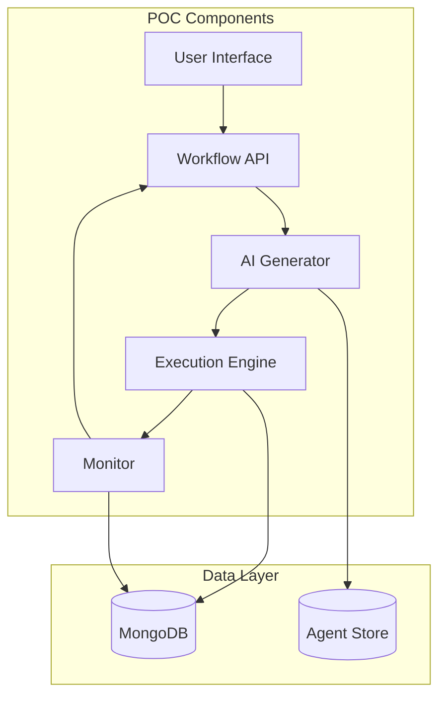

# Simple AI Workflow POC Architecture

## Overview

This document outlines a simplified architecture for an AI-powered workflow generation POC. The focus is on core functionality: generating workflows with agentic blocks, executing them, monitoring completion, and handling errors.

## Current System Analysis

Based on the existing codebase analysis, the current system already has:

- **Workflow Generation**: [`/generate`](apps/workflow/src/controllers/v1/workflow.controller.ts:85) endpoint using OpenAI GPT-4o
- **Workflow Execution**: Complete DAG execution engine with topological sorting
- **Agent Integration**: Support for agentic blocks via [`agentDetails`](apps/workflow/src/service/workflow.ts:45) fetching
- **Error Handling**: HITL (Human-in-the-Loop) interruption support
- **State Management**: Execution logging and resume capabilities

## POC Architecture



## Core POC Features

### 1. Simple Workflow Generation

**Enhancement to existing [`generateWorkflowFromLLM`](apps/workflow/src/service/workflow.ts:45) method:**

```typescript
interface SimplePOCRequest {
  problemStatement: string;
  // Only agentic blocks for POC
  agentIds: string[];
}

interface SimplePOCResponse {
  workflowId: string;
  graph: Graph;
  estimatedDuration: number;
  agentCount: number;
}

class SimplePOCGenerator {
  async generateAgenticWorkflow(request: SimplePOCRequest): Promise<SimplePOCResponse> {
    // 1. Fetch available agents (existing functionality)
    const agents = await this.getAgentDetails(request.agentIds);
    
    // 2. Generate workflow using existing LLM integration
    const prompt = this.buildAgenticPrompt(request.problemStatement, agents);
    const workflow = await this.callLLM(prompt);
    
    // 3. Validate only agentic blocks
    const validated = await this.validateAgenticWorkflow(workflow);
    
    // 4. Store and return
    const saved = await this.workflowService.createWorkflow(validated);
    
    return {
      workflowId: saved.id,
      graph: validated,
      estimatedDuration: this.estimateDuration(validated),
      agentCount: this.countAgents(validated)
    };
  }

  private buildAgenticPrompt(problem: string, agents: any[]): string {
    return `
Create a workflow to solve: ${problem}

Available AI Agents:
${agents.map(a => `- ${a.name}: ${a.description}`).join('\n')}

Requirements:
- Use ONLY agentic blocks (AI agents)
- Create a logical sequence of agent interactions
- Each block should have clear inputs/outputs
- Ensure proper data flow between agents

Return a valid workflow graph with only agentic blocks.
    `;
  }
}
```

### 2. Simple Execution with Monitoring

**Enhancement to existing execution engine:**

```typescript
interface ExecutionStatus {
  workflowId: string;
  runId: string;
  status: 'running' | 'completed' | 'failed' | 'paused';
  currentBlock?: string;
  progress: number; // 0-100
  errors?: ExecutionError[];
  startTime: Date;
  endTime?: Date;
}

class SimplePOCExecutor {
  async executeAndMonitor(workflowId: string): Promise<ExecutionStatus> {
    // 1. Start execution using existing engine
    const runId = await this.workflowService.executeWorkflow(workflowId);
    
    // 2. Monitor execution
    return await this.monitorExecution(workflowId, runId);
  }

  async monitorExecution(workflowId: string, runId: string): Promise<ExecutionStatus> {
    const status = await this.workflowService.getExecutionStatus(workflowId, runId);
    
    return {
      workflowId,
      runId,
      status: this.mapStatus(status.state),
      currentBlock: status.currentBlockId,
      progress: this.calculateProgress(status),
      errors: status.errors,
      startTime: status.startTime,
      endTime: status.endTime
    };
  }

  private calculateProgress(status: any): number {
    const totalBlocks = status.totalBlocks || 1;
    const completedBlocks = status.completedBlocks || 0;
    return Math.round((completedBlocks / totalBlocks) * 100);
  }
}
```

### 3. Error Handling and Updates

**Simple error handling for POC:**

```typescript
interface ErrorUpdate {
  workflowId: string;
  runId: string;
  blockId: string;
  errorType: 'agent_failure' | 'timeout' | 'invalid_output' | 'connection_error';
  errorMessage: string;
  suggestedFix?: string;
  canRetry: boolean;
}

class SimplePOCErrorHandler {
  async handleExecutionError(error: ErrorUpdate): Promise<void> {
    // 1. Log error
    await this.logError(error);
    
    // 2. Determine if auto-retry is possible
    if (error.canRetry && this.shouldAutoRetry(error)) {
      await this.retryBlock(error.workflowId, error.runId, error.blockId);
      return;
    }
    
    // 3. Pause execution for manual intervention
    await this.pauseExecution(error.workflowId, error.runId);
    
    // 4. Notify user
    await this.notifyUser(error);
  }

  async updateAndResume(workflowId: string, runId: string, fixes: any[]): Promise<void> {
    // 1. Apply fixes
    for (const fix of fixes) {
      await this.applyFix(workflowId, runId, fix);
    }
    
    // 2. Resume execution
    await this.workflowService.resumeWorkflow(workflowId, runId);
  }
}
```

## POC API Endpoints

### Core Endpoints for POC

```typescript
// POST /api/v1/workflows/generate/poc
interface POCGenerateAPI {
  request: SimplePOCRequest;
  response: SimplePOCResponse;
}

// POST /api/v1/workflows/{workflowId}/execute
interface POCExecuteAPI {
  response: {
    runId: string;
    status: ExecutionStatus;
  };
}

// GET /api/v1/workflows/{workflowId}/runs/{runId}/status
interface POCStatusAPI {
  response: ExecutionStatus;
}

// POST /api/v1/workflows/{workflowId}/runs/{runId}/fix
interface POCFixAPI {
  request: {
    fixes: ErrorFix[];
  };
  response: {
    applied: boolean;
    resuming: boolean;
  };
}
```

## POC Implementation Plan

### Phase 1: Core Generation (Week 1)
- [ ] Enhance existing [`generateWorkflowFromLLM`](apps/workflow/src/service/workflow.ts:45) for agentic-only workflows
- [ ] Add validation to ensure only agentic blocks
- [ ] Test with simple agent combinations

### Phase 2: Execution Monitoring (Week 2)
- [ ] Enhance existing execution engine with real-time status
- [ ] Add progress calculation for agentic workflows
- [ ] Implement simple error detection

### Phase 3: Error Handling (Week 3)
- [ ] Add error classification for agentic blocks
- [ ] Implement retry logic for common failures
- [ ] Add manual intervention capabilities

### Phase 4: POC Integration (Week 4)
- [ ] Create simple UI for POC demonstration
- [ ] Add end-to-end testing
- [ ] Performance optimization for POC scenarios

## POC Success Criteria

1. **Generation**: Create workflows with 3-5 agentic blocks in < 30 seconds
2. **Execution**: Successfully execute agentic workflows with real-time monitoring
3. **Completion**: Detect workflow completion and provide final status
4. **Error Handling**: Handle agent failures and allow manual fixes
5. **Simplicity**: Demonstrate core functionality without complex features

## Technology Stack (Minimal)

- **Backend**: Existing Node.js/TypeScript with Express
- **Database**: Existing MongoDB setup
- **AI**: Existing OpenAI GPT-4o integration
- **Frontend**: Simple React/HTML interface for demonstration
- **Monitoring**: Basic logging and status tracking

## Next Steps

1. **Review POC Requirements**: Confirm this simplified approach meets POC goals
2. **Prioritize Features**: Focus on core workflow generation and execution
3. **Implementation**: Start with Phase 1 enhancements to existing system
4. **Testing**: Create test scenarios with real agentic workflows
5. **Demo Preparation**: Build simple interface for POC demonstration

This simplified architecture leverages the existing robust foundation while focusing specifically on the POC requirements for agentic workflow generation, execution, and monitoring.
