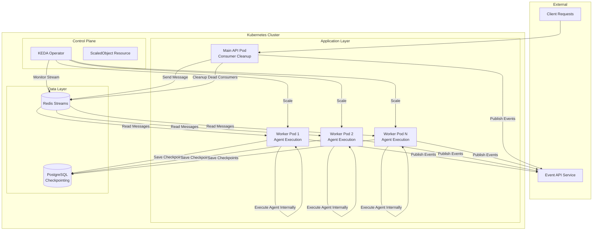
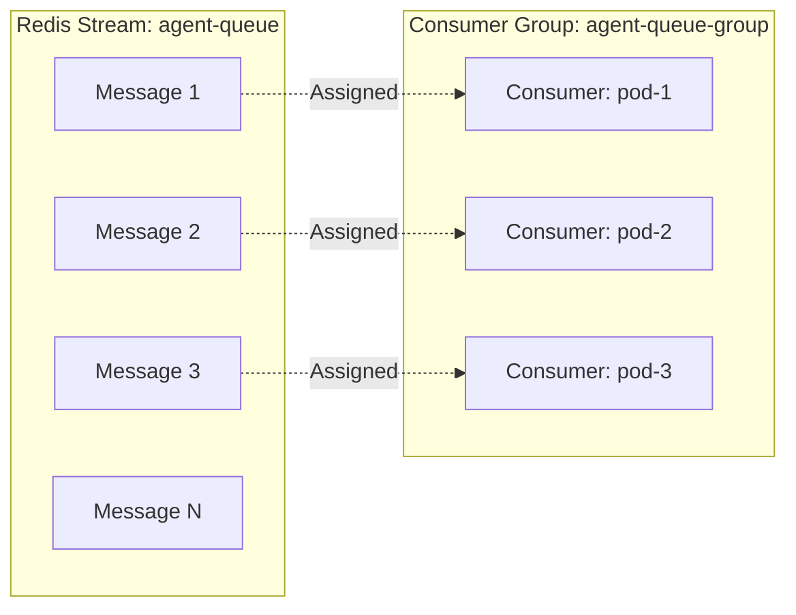
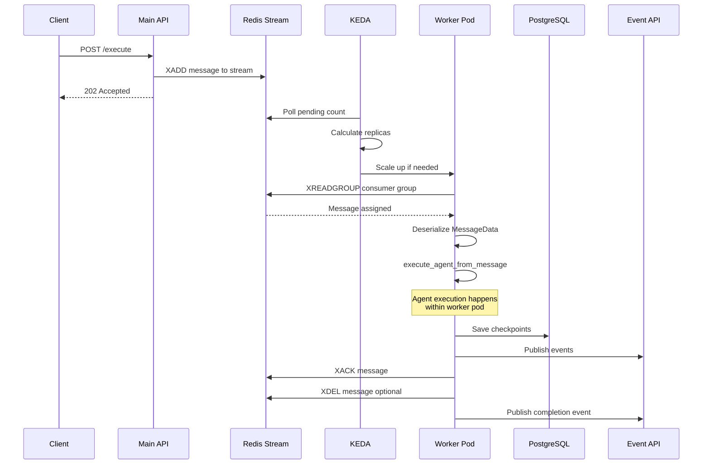
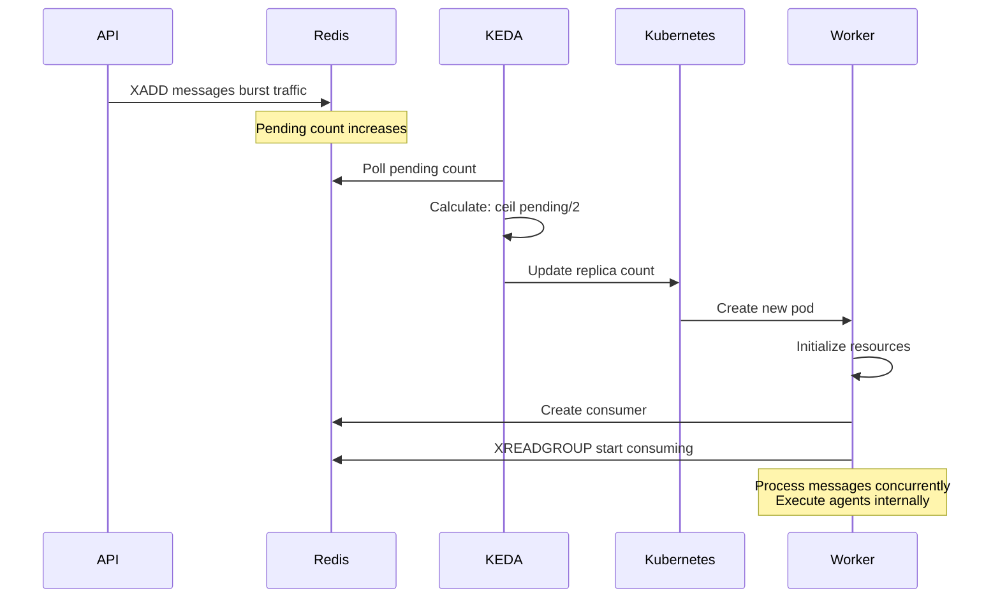
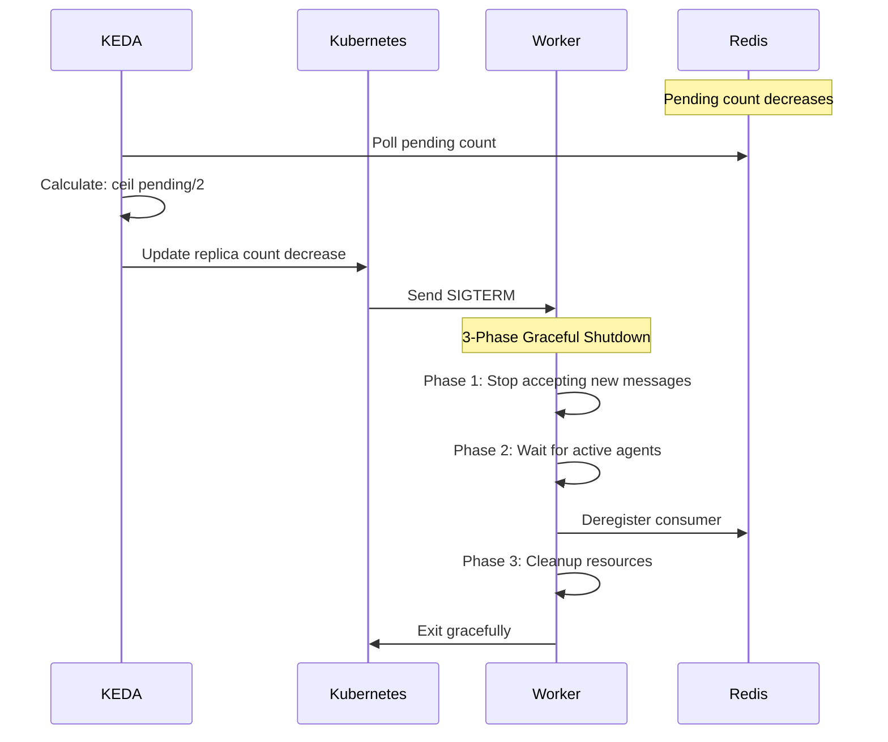
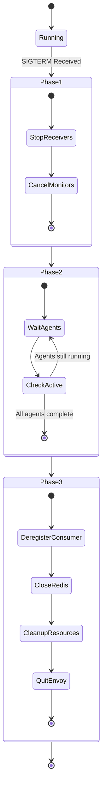
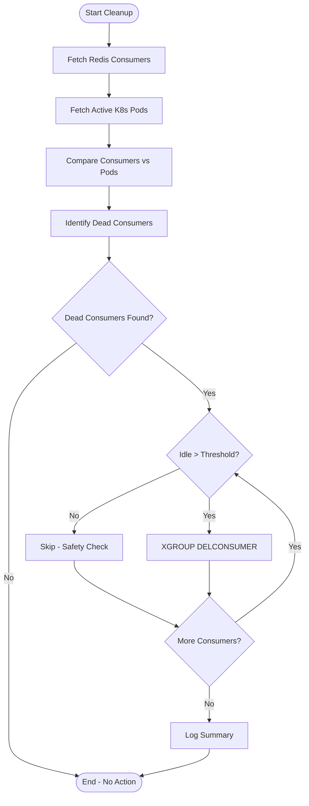
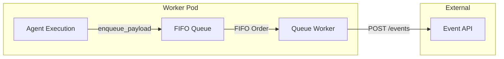

# KEDA Scaling + Redis Streams - Workflow and Logical Architecture

## Executive Summary

This document describes the complete workflow and logical architecture for the KEDA-based autoscaling system integrated with Redis Streams for agent execution message processing. The system enables dynamic horizontal pod autoscaling based on Redis Stream pending message count, with graceful shutdown handling and consumer cleanup mechanisms.

---

## Table of Contents

1. [System Overview](#system-overview)
2. [Architecture Components](#architecture-components)
3. [KEDA Configuration](#keda-configuration)
4. [Redis Streams Architecture](#redis-streams-architecture)
5. [Message Flow Workflow](#message-flow-workflow)
6. [Scaling Workflow](#scaling-workflow)
7. [Graceful Shutdown Process](#graceful-shutdown-process)
8. [Consumer Cleanup Mechanisms](#consumer-cleanup-mechanisms)
9. [Event Publishing System](#event-publishing-system)
10. [Key Design Patterns](#key-design-patterns)
11. [Configuration Reference](#configuration-reference)

---

## System Overview

The system implements an event-driven architecture for agent execution using:
- **KEDA (Kubernetes Event-Driven Autoscaling)**: Scales worker pods based on Redis Stream metrics
- **Redis Streams**: Message queue with consumer groups for reliable message delivery
- **Worker Pods**: Process agent execution messages with concurrent task handling (agent execution happens within worker pods)
- **PostgreSQL**: Checkpointing for agent state persistence
- **Event API**: External service for publishing agent execution events
- **Graceful Shutdown**: 3-phase shutdown process for KEDA scale-down events

### High-Level Architecture



---

## Architecture Components

### 1. KEDA ScaledObject

**Purpose**: Monitors Redis Stream and scales worker deployment based on pending message count.

**Key Responsibilities**:
- Poll Redis Stream at configured intervals
- Calculate desired replica count based on pending messages
- Trigger scale-up/scale-down events
- Respect cooldown periods to prevent flapping

**Configuration Location**: [`api-graph.yaml`](api-graph.yaml:1-15)

### 2. Redis Streams Handler

**Purpose**: Manages message production, consumption, and lifecycle.

**Key Responsibilities**:
- Send messages to Redis Stream using XADD
- Consume messages using XREADGROUP with consumer groups
- Track active agent executions
- Handle message acknowledgment and deletion
- Monitor and cleanup long-pending messages
- Deregister consumers on shutdown

**Implementation**: [`utils/messaging/redis_streams_trigger_handler.py`](utils/messaging/redis_streams_trigger_handler.py:51-1344)

### 3. Worker Main Process

**Purpose**: Orchestrates worker pod lifecycle and message processing.

**Key Responsibilities**:
- Initialize PostgreSQL checkpointer
- Start message processor
- Execute agent logic within worker pod
- Handle SIGTERM/SIGINT signals
- Execute 3-phase graceful shutdown
- Cleanup resources on exit

**Implementation**: [`src/worker_main.py`](src/worker_main.py:176-338)

**Note**: Agent execution happens directly within the worker pod via [`kube_execute/main.py:execute_agent_from_message()`](kube_execute/main.py:233-370)

### 4. Consumer Cleanup Service

**Purpose**: Remove ghost consumers from Redis consumer groups.

**Key Responsibilities**:
- Identify consumers without active pods
- Apply safety checks (idle time threshold)
- Delete dead consumers and release pending messages
- Run periodically as background task in Main API Pod

**Implementation**: 
- Core cleanup logic: [`utils/cleanup_dead_consumers.py`](utils/cleanup_dead_consumers.py:32-372)
- Periodic service: [`services/periodic_consumer_cleanup.py`](services/periodic_consumer_cleanup.py:59-89)

### 5. Event Publishing System

**Purpose**: Publish agent execution events to external Event API service.

**Key Responsibilities**:
- Queue events in FIFO order
- Publish events to Event API
- Handle A2A notifications
- Maintain event ordering

**Implementation**:
- Queue handler: [`utils/fifo_queue_handler.py`](utils/fifo_queue_handler.py:9-57)
- Event publisher: [`utils/events.py`](utils/events.py:53-130)

---

## KEDA Configuration

### ScaledObject Specification

```yaml
keda:
  ScaledObject:
    trigger:
      type: redis-streams
      metadata:
        stream: agent-queue                    # Stream name
        address: 'redis-host:6380'            # Redis connection
        enableTLS: true                        # TLS enabled
        consumerGroup: agent-queue-group       # Consumer group
        passwordFromEnv: REDIS_PASSWORD        # Auth
        pendingEntriesCount: 3                 # Threshold per pod
    cooldownPeriod: 180                        # 3 min cooldown
    maxReplicaCount: 100                       # Max pods
    minReplicaCount: 50                        # Min pods
    pollingInterval: 5                         # Poll every 5s
```

### Scaling Logic

**Formula**: `desired_replicas = ceil(pending_messages / pendingEntriesCount)`

**Example**:
- Pending messages: 150
- `pendingEntriesCount`: 3
- Desired replicas: `ceil(150/3) = 50`

**Constraints**:
- Minimum: 50 replicas (always running)
- Maximum: 100 replicas (upper limit)
- Cooldown: 180 seconds between scale-down events

---

## Redis Streams Architecture

### Stream Structure



### Message Format

Messages are serialized using pickle and base64 encoding:

```python
{
    "message_data": "<base64-encoded-pickle-MessageData>",
    "agent_id": "agent-123",
    "task_id": "correlation-456",
    "timestamp": "1234567890.123",
    "correlation_id": "correlation-456"
}
```

### Consumer Group Mechanics

**Consumer Registration**:
- Each worker pod registers as a unique consumer
- Consumer name: `WORKER_POD_NAME` environment variable
- Fallback: `consumer-{uuid}`

**Message Assignment**:
- XREADGROUP assigns messages to consumers
- Each message delivered to exactly one consumer
- Pending Entry List (PEL) tracks unacknowledged messages

**Acknowledgment Flow**:
1. Consumer receives message via XREADGROUP
2. Processes agent execution within worker pod
3. Acknowledges with XACK
4. Optionally deletes with XDEL (if `REDIS_STREAM_DELETE_AFTER_ACK=true`)

---

## Message Flow Workflow

### End-to-End Message Processing



### Detailed Processing Steps

#### 1. Message Production (Main API)

**Location**: [`utils/messaging/redis_streams_trigger_handler.py:send_message()`](utils/messaging/redis_streams_trigger_handler.py:238-349)

```python
async def send_message(message_data: MessageData):
    # Serialize MessageData
    serialized = base64.b64encode(pickle.dumps(message_data))
    
    # Add to stream with retry logic
    message_id = await redis.xadd(
        name=stream_name,
        fields={
            "message_data": serialized,
            "agent_id": agent_id,
            "task_id": correlation_id,
            "timestamp": time.time(),
            "correlation_id": correlation_id
        }
    )
    
    return {"status": "queued", "message_id": message_id}
```

**Retry Mechanism**:
- Max retries: 3 (configurable via `REDIS_SEND_MESSAGE_MAX_RETRIES`)
- Initial delay: 0.5s (configurable via `REDIS_SEND_MESSAGE_RETRY_DELAY`)
- Backoff multiplier: 2.0 (configurable via `REDIS_SEND_MESSAGE_RETRY_BACKOFF`)
- Dedicated sender client for isolation

#### 2. Message Consumption (Worker Pod)

**Location**: [`utils/messaging/redis_streams_trigger_handler.py:_message_receiver_loop()`](utils/messaging/redis_streams_trigger_handler.py:955-1074)

```python
async def _message_receiver_loop():
    while running:
        # Calculate available slots
        available_slots = batch_size - active_task_count
        
        if available_slots > 0:
            # Read new messages
            messages = await redis.xreadgroup(
                groupname=consumer_group,
                consumername=consumer_name,
                streams={stream_name: ">"},
                count=available_slots,
                block=5000  # 5 second timeout
            )
            
            # Process each message
            for message_id, fields in messages:
                message_data = deserialize(fields["message_data"])
                task = asyncio.create_task(
                    _process_message(message_id, message_data)
                )
                message_processing_tasks.add(task)
```

**Concurrency Control**:
- Batch size: 3 (configurable via `WORKER_POD_MESSAGES_BATCH_SIZE`)
- Dynamic slot calculation based on active tasks
- Prevents overloading individual pods

#### 3. Agent Execution (Within Worker Pod)

**Location**: [`kube_execute/main.py:execute_agent_from_message()`](kube_execute/main.py:233-370)

```python
async def execute_agent_from_message(message_data: MessageData):
    # Set logger context
    set_logger_context(message_data.logger_context)
    
    # Publish initial event to Event API
    await enqueue_payload(initial_event, client_id, project_id)
    
    # Execute based on action type (within worker pod)
    if action == ActionType.START:
        result = await execute_agent(...)
    elif action == ActionType.RESUME:
        result = await resume_agent(...)
    
    # Handle streaming results
    if callable(result):
        async for chunk in result.generator():
            await redis.publish(channel, chunk)
    
    # Cleanup execution lock
    await redis.delete(f"{correlation_id}_lock")
```

**Timeout Handling**:
- Execution timeout: `MESSAGE_LOCK_DURATION` (1800 seconds / 30 minutes)
- Timeout error published as event to Event API
- Message acknowledged even on timeout

#### 4. Message Acknowledgment

**Location**: [`utils/messaging/redis_streams_trigger_handler.py:_ack_and_delete_message()`](utils/messaging/redis_streams_trigger_handler.py:425-472)

```python
async def _ack_and_delete_message(message_id: str):
    # Acknowledge message
    await redis.xack(stream_name, consumer_group, message_id)
    
    # Instant delete if enabled
    if REDIS_STREAM_DELETE_AFTER_ACK:
        try:
            await redis.xdel(stream_name, message_id)
        except Exception as e:
            # Save to MongoDB for retry
            await db.failed_redis_deletions.insert_one({
                "message_id": message_id,
                "stream": stream_name,
                "timestamp": datetime.utcnow(),
                "error": str(e)
            })
```

---

## Scaling Workflow

### Scale-Up Scenario



**Trigger Conditions**:
- Pending messages exceed threshold
- Current replicas < desired replicas
- Cooldown period elapsed

**Scale-Up Process**:
1. KEDA detects high pending count
2. Calculates desired replicas
3. Updates Deployment replica count
4. Kubernetes creates new pods
5. New pods initialize and register consumers
6. Begin processing messages immediately

### Scale-Down Scenario



**Trigger Conditions**:
- Pending messages below threshold
- Current replicas > desired replicas
- Cooldown period elapsed (180 seconds)

**Scale-Down Process**:
1. KEDA detects low pending count
2. Waits for cooldown period
3. Selects pod for termination
4. Sends SIGTERM to pod
5. Pod executes graceful shutdown
6. Kubernetes removes pod

---

## Graceful Shutdown Process

### 3-Phase Shutdown Architecture

**Location**: [`src/worker_main.py:worker_main()`](src/worker_main.py:176-307)



### Phase 1: Stop Accepting New Work

**Duration**: Typically < 1 second

**Actions**:
1. Set `_running = False` flag
2. Cancel receiver tasks (stop XREADGROUP loop)
3. Cancel monitor tasks (pending monitor, cleanup monitor)
4. Wait for receiver tasks to complete

**Code**: [`utils/messaging/redis_streams_trigger_handler.py:stop_processor(graceful=True)`](utils/messaging/redis_streams_trigger_handler.py:1195-1310)

```python
async def stop_processor(graceful=True):
    # Stop accepting new messages
    self._running = False
    
    # Cancel receiver tasks
    for task in self._receiver_tasks:
        if not task.done():
            task.cancel()
    
    # Cancel monitor tasks
    if self._pending_monitor_task:
        self._pending_monitor_task.cancel()
    if self._cleanup_task:
        self._cleanup_task.cancel()
    
    # Wait for cancellation
    await asyncio.gather(*tasks, return_exceptions=True)
    
    # Keep Redis connections alive for active agents
    logger.info("Phase 1 complete - receivers stopped")
```

### Phase 2: Wait for Active Agent Executions

**Duration**: Variable (depends on agent execution time)

**Actions**:
1. Monitor `_active_agent_executions` set
2. Log progress every 30 seconds
3. Wait indefinitely (Kubernetes terminationGracePeriodSeconds enforces timeout)
4. Track completion count

**Code**: [`utils/messaging/redis_streams_trigger_handler.py:wait_for_active_agents()`](utils/messaging/redis_streams_trigger_handler.py:1144-1193)

```python
async def wait_for_active_agents(check_interval=30):
    initial_count = len(self._active_agent_executions)
    shutdown_start_time = time.time()
    
    while self._active_agent_executions:
        active_count = len(self._active_agent_executions)
        elapsed_time = time.time() - shutdown_start_time
        
        logger.info(
            "Waiting for agents to complete",
            {
                "active_count": active_count,
                "completed": initial_count - active_count,
                "elapsed_seconds": elapsed_time
            }
        )
        
        await asyncio.sleep(check_interval)
    
    logger.info("All agents completed")
```

**Agent Tracking**:
- Agents added to set when execution starts
- Agents removed from set when execution completes (success or failure)
- Set operations are thread-safe

### Phase 3: Cleanup and Exit

**Duration**: Typically < 5 seconds

**Actions**:
1. Deregister consumer from Redis consumer group
2. Close Redis connections (main and sender clients)
3. Cleanup PostgreSQL connections
4. Send quitquitquit to Envoy sidecar
5. Exit process with code 0

**Code**: [`utils/messaging/redis_streams_trigger_handler.py:graceful_shutdown_cleanup()`](utils/messaging/redis_streams_trigger_handler.py:186-218)

```python
async def graceful_shutdown_cleanup():
    # Deregister consumer
    await self.deregister_consumer()
    
    # Close Redis connections
    if self._redis_client:
        await self._redis_client.close()
    if self._sender_redis_client:
        await self._sender_redis_client.close()
    
    logger.info("Cleanup complete")
```

**Consumer Deregistration**:
- Calls `XGROUP DELCONSUMER`
- Releases pending messages back to stream
- Makes messages available for other consumers
- Returns count of released messages

---

## Consumer Cleanup Mechanisms

### Problem: Ghost Consumers

**Scenario**: Worker pods terminated forcefully (OOMKilled, node failure, etc.) cannot deregister consumers.

**Impact**:
- Dead consumers remain in consumer group
- Pending messages stuck with dead consumers
- KEDA sees inflated pending count
- Unnecessary scale-up events

### Solution: Periodic Cleanup in Main API Pod

**Location**: [`services/periodic_consumer_cleanup.py`](services/periodic_consumer_cleanup.py:59-89)

**Mechanism**:
- Runs as background task in Main API Pod
- Executes every hour (configurable via `CONSUMER_CLEANUP_INTERVAL_SECONDS`)
- No leader election needed (single Main API pod)

```python
async def periodic_consumer_cleanup():
    while True:
        try:
            await cleanup_dead_consumers()
        except Exception as e:
            logger.error(f"Cleanup error: {e}")
        
        await asyncio.sleep(CONSUMER_CLEANUP_INTERVAL_SECONDS)
```

**Cleanup Algorithm**:



**Safety Checks**:
1. **Idle Time Threshold**: Only delete consumers idle > `MESSAGE_LOCK_DURATION + 300s`
2. **Pod Correlation**: Only delete consumers without matching active pods
3. **Dry Run Mode**: Test without actual deletion (via `DRY_RUN=true`)

**Implementation**:

```python
class DeadConsumerCleaner:
    async def cleanup(self):
        # Fetch data
        consumers = await self.get_redis_consumers()
        active_pods = self.get_active_pods()
        
        # Identify dead consumers
        dead_consumers = self.identify_dead_consumers(consumers, active_pods)
        
        for consumer in dead_consumers:
            # Safety check
            if not self.should_delete_consumer(consumer):
                continue
            
            # Delete consumer
            pending_count = await self.delete_consumer(consumer["name"])
            logger.info(f"Released {pending_count} pending messages")
```

---

## Event Publishing System

### Architecture



### Event Flow

**Location**: [`utils/fifo_queue_handler.py`](utils/fifo_queue_handler.py:9-57)

```python
async def enqueue_payload(
    payload: dict,
    client_id: str,
    project_id: str,
    is_a2a_executor: bool = False,
    is_streaming_output: bool = False,
):
    # Capture logger context
    logger_context = get_logger_context()
    
    # Add to FIFO queue
    await payload_queue.put((
        payload,
        client_id,
        project_id,
        is_a2a_executor,
        is_streaming_output,
        logger_context,
    ))
```

**Queue Worker**: [`utils/fifo_queue_handler.py:queue_worker()`](utils/fifo_queue_handler.py:32-57)

```python
async def queue_worker():
    while True:
        # Get next payload (FIFO order)
        (payload, client_id, project_id, 
         is_a2a_executor, is_streaming_output, 
         logger_context) = await payload_queue.get()
        
        # Restore logger context
        set_logger_context(logger_context)
        
        # Publish to Event API
        await process_and_notify_event(
            payload, client_id, project_id,
            is_a2a_executor, is_streaming_output
        )
        
        payload_queue.task_done()
```

### Event Publishing

**Location**: [`utils/events.py:process_and_notify_event()`](utils/events.py:53-130)

```python
async def process_and_notify_event(
    payload: dict,
    client_id: str,
    project_id: str,
    is_a2a_executor: bool = False,
    is_streaming_output: bool = False,
):
    # Publish to Event API
    asyncio.gather(
        publish_event(payload, client_id, project_id),
        stream_event(payload, client_id)
    )
    
    # Send A2A notification if needed
    if is_a2a_executor:
        await send_notification(payload, is_streaming_output)
```

**Event API Integration**: [`utils/events.py:stream_event()`](utils/events.py:67-100)

```python
async def stream_event(payload, client_id):
    response = await client.post(
        url,  # EVENT_API_URL
        json=payload,
        headers={
            "x-enterprise-api-internal": interservice_secret,
            "x-client-id": client_id,
        },
    )
    
    response.raise_for_status()
    logger.info("Event published successfully", {"payload": payload})
```

---

## Key Design Patterns

### 1. Consumer Group Pattern

**Benefits**:
- Load balancing across consumers
- Message durability (PEL tracking)
- Exactly-once delivery semantics
- Automatic failover

**Implementation**:
- Stream: `agent-queue`
- Consumer Group: `agent-queue-group`
- Consumer Name: Pod name (unique per pod)

### 2. Graceful Shutdown Pattern

**Benefits**:
- No message loss during scale-down
- Clean resource cleanup
- Proper consumer deregistration
- Istio sidecar coordination

**Implementation**:
- Signal handling (SIGTERM/SIGINT)
- 3-phase shutdown process
- Agent execution tracking
- Envoy quitquitquit signal

### 3. Retry and Backoff Pattern

**Benefits**:
- Resilience to transient failures
- Reduced load during outages
- Automatic recovery

**Implementation**:
- Message send retry (3 attempts, exponential backoff)
- Dedicated sender client
- Connection reset on failure

### 4. In-Pod Agent Execution Pattern

**Benefits**:
- Simplified architecture (no separate job pods)
- Faster execution (no pod creation overhead)
- Better resource utilization
- Direct checkpointing to PostgreSQL

**Implementation**:
- Agent execution within worker pod process
- Concurrent execution tracking
- Timeout enforcement per agent

### 5. FIFO Event Queue Pattern

**Benefits**:
- Guaranteed event ordering
- Decoupled event publishing
- Resilient to Event API outages
- Logger context preservation

**Implementation**:
- AsyncIO queue for FIFO ordering
- Background worker for processing
- Context capture and restoration

---

## Configuration Reference

### KEDA Configuration

| Parameter | Value | Description |
|-----------|-------|-------------|
| `trigger.type` | `redis-streams` | KEDA scaler type |
| `stream` | `agent-queue` | Redis stream name |
| `consumerGroup` | `agent-queue-group` | Consumer group name |
| `pendingEntriesCount` | `3` | Messages per pod threshold |
| `pollingInterval` | `5` | Polling frequency (seconds) |
| `cooldownPeriod` | `180` | Scale-down cooldown (seconds) |
| `minReplicaCount` | `50` | Minimum pods |
| `maxReplicaCount` | `100` | Maximum pods |

### Redis Streams Configuration

| Environment Variable | Default | Description |
|---------------------|---------|-------------|
| `MESSAGING_PLATFORM` | `redis-streams` | Messaging platform type |
| `MESSAGING_QUEUE_NAME` | `agent-queue` | Stream name |
| `WORKER_POD_MESSAGES_BATCH_SIZE` | `3` | Concurrent messages per pod |
| `MESSAGE_LOCK_DURATION` | `1800` | Message timeout (seconds) |
| `REDIS_STREAM_DELETE_AFTER_ACK` | `true` | Instant delete after ACK |
| `REDIS_STREAM_CLEANUP_ENABLED` | `true` | Enable cleanup monitor |

### Retry Configuration

| Environment Variable | Default | Description |
|---------------------|---------|-------------|
| `REDIS_SEND_MESSAGE_MAX_RETRIES` | `3` | Max send retries |
| `REDIS_SEND_MESSAGE_RETRY_DELAY` | `0.5` | Initial retry delay (seconds) |
| `REDIS_SEND_MESSAGE_RETRY_BACKOFF` | `2.0` | Backoff multiplier |

### Cleanup Configuration

| Environment Variable | Default | Description |
|---------------------|---------|-------------|
| `CONSUMER_CLEANUP_INTERVAL_SECONDS` | `3600` | Cleanup interval (1 hour) |
| `STREAM_CLEANUP_INTERVAL_MINUTES` | `60` | Stream cleanup interval |
| `STREAM_CLEANUP_LOCK_TTL_SECONDS` | `300` | Cleanup lock TTL |
| `IDLE_THRESHOLD_SECONDS` | `MESSAGE_LOCK_DURATION + 300` | Consumer idle threshold |

### Event API Configuration

| Environment Variable | Description |
|---------------------|-------------|
| `EVENT_API_URL` | Event API endpoint URL |
| `INTERSERVICES_SHARED_SECRET` | Shared secret for inter-service auth |

---

## Monitoring and Observability

### Key Metrics to Monitor

1. **KEDA Metrics**:
   - Current replica count
   - Desired replica count
   - Scaling events (up/down)
   - Cooldown status

2. **Redis Metrics**:
   - Stream length
   - Pending message count
   - Consumer count
   - Consumer idle time
   - Message throughput

3. **Worker Metrics**:
   - Active agent executions
   - Message processing rate
   - Graceful shutdown duration
   - Phase completion times

4. **Cleanup Metrics**:
   - Dead consumers detected
   - Consumers deleted
   - Pending messages released
   - Cleanup errors

5. **Event API Metrics**:
   - Event queue depth
   - Event publish rate
   - Event API latency
   - Failed event publishes

### Logging Strategy

**Structured Logging** with context:
```python
logger.info(
    "Message processed successfully",
    {
        "agent_id": agent_id,
        "correlation_id": correlation_id,
        "message_id": message_id,
        "duration_seconds": duration,
        "platform": "redis-streams"
    }
)
```

**Key Log Events**:
- Message sent/received
- Agent execution start/complete (within worker pod)
- Scaling events
- Graceful shutdown phases
- Consumer cleanup operations
- Event publishing
- Error conditions

---

## Troubleshooting Guide

### Issue: Pods Not Scaling Up

**Symptoms**: High pending count but no new pods created

**Possible Causes**:
1. KEDA not monitoring stream correctly
2. Cooldown period active
3. Max replica count reached
4. KEDA operator issues

**Resolution**:
```bash
# Check KEDA ScaledObject status
kubectl describe scaledobject <name> -n <namespace>

# Check KEDA operator logs
kubectl logs -n keda deployment/keda-operator

# Verify Redis connection
kubectl exec <worker-pod> -- redis-cli -h <redis-host> XINFO STREAM agent-queue
```

### Issue: Ghost Consumers

**Symptoms**: Consumer count higher than pod count

**Possible Causes**:
1. Pods terminated forcefully
2. Cleanup service not running in Main API pod
3. Cleanup safety checks preventing deletion

**Resolution**:
```bash
# Check consumer count
redis-cli XINFO CONSUMERS agent-queue agent-queue-group

# Check active pods
kubectl get pods -l app=<deployment-name>

# Check Main API pod cleanup logs
kubectl logs <main-api-pod> | grep "cleanup"

# Verify cleanup service is running
kubectl logs <main-api-pod> | grep "periodic_consumer_cleanup"
```

### Issue: Messages Stuck in Pending

**Symptoms**: Messages in PEL not being processed

**Possible Causes**:
1. Consumer crashed during processing
2. Message timeout exceeded
3. Dead consumer holding messages

**Resolution**:
```bash
# Check pending messages
redis-cli XPENDING agent-queue agent-queue-group

# Check message details
redis-cli XPENDING agent-queue agent-queue-group - + 10

# Claim stuck messages (if needed)
redis-cli XCLAIM agent-queue agent-queue-group <consumer> <min-idle-time> <message-id>
```

### Issue: Graceful Shutdown Timeout

**Symptoms**: Pods terminated before agents complete

**Possible Causes**:
1. `terminationGracePeriodSeconds` too short
2. Agent execution exceeds timeout
3. Phase 2 waiting indefinitely

**Resolution**:
```yaml
# Increase termination grace period in deployment
spec:
  template:
    spec:
      terminationGracePeriodSeconds: 3600  # 1 hour
```

### Issue: Events Not Publishing

**Symptoms**: Events not appearing in Event API

**Possible Causes**:
1. Event API unavailable
2. Queue worker not running
3. Authentication issues

**Resolution**:
```bash
# Check Event API connectivity
kubectl exec <worker-pod> -- curl -v $EVENT_API_URL

# Check queue worker logs
kubectl logs <worker-pod> | grep "queue_worker"

# Verify environment variables
kubectl exec <worker-pod> -- env | grep EVENT_API_URL
kubectl exec <worker-pod> -- env | grep INTERSERVICES_SHARED_SECRET
```

---

## Best Practices

### 1. Resource Configuration

- Set appropriate `MESSAGE_LOCK_DURATION` based on agent execution time
- Configure `WORKER_POD_MESSAGES_BATCH_SIZE` based on pod resources
- Set `terminationGracePeriodSeconds` > `MESSAGE_LOCK_DURATION`

### 2. Scaling Configuration

- Set `pendingEntriesCount` based on desired throughput per pod
- Use adequate `cooldownPeriod` to prevent flapping (recommended: 180s)
- Set `minReplicaCount` to handle baseline load

### 3. Cleanup Strategy

- Ensure periodic cleanup runs in Main API pod
- Monitor cleanup metrics and logs
- Set appropriate idle threshold with safety buffer

### 4. Event Publishing

- Monitor event queue depth
- Alert on Event API failures
- Ensure FIFO queue worker is running

### 5. Monitoring

- Alert on high pending message count
- Alert on ghost consumer detection
- Monitor graceful shutdown duration
- Track message processing latency
- Monitor Event API integration health

### 6. Testing

- Test graceful shutdown with active agents
- Verify consumer cleanup with forced pod termination
- Load test scaling behavior
- Test failure scenarios (Redis outage, Event API outage, pod crashes)
- Verify event ordering and delivery

---

## Conclusion

This architecture provides a robust, scalable, and resilient system for agent execution using KEDA and Redis Streams. Key strengths include:

- **Dynamic Scaling**: Automatic horizontal scaling based on workload
- **In-Pod Execution**: Simplified architecture with agent execution within worker pods
- **Graceful Shutdown**: Zero message loss during scale-down
- **Consumer Cleanup**: Automatic removal of ghost consumers via Main API pod
- **Fault Tolerance**: Retry mechanisms and idempotent processing
- **Event Publishing**: Reliable event delivery to Event API with FIFO ordering
- **Observability**: Comprehensive logging and monitoring
- **PostgreSQL Checkpointing**: Efficient state persistence

The 3-phase graceful shutdown process ensures that in-flight agent executions complete successfully, while the consumer cleanup mechanism in the Main API pod maintains system health by removing dead consumers and releasing stuck messages.
