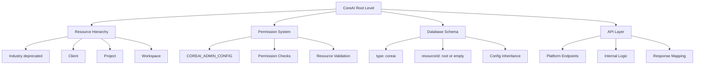

# CoreAI References Analysis & Removal Strategy

**Document Version:** 1.0  
**Created:** 2026-01-05  
**Project:** api-config (Config Service v2)  
**Purpose:** Comprehensive analysis of CoreAI references and strategic removal plan

---

## Table of Contents

1. [Executive Summary](#executive-summary)
2. [Detailed Reference Catalog](#detailed-reference-catalog)
3. [Architectural Analysis](#architectural-analysis)
4. [Removal Strategy](#removal-strategy)
5. [Breaking Change Analysis](#breaking-change-analysis)
6. [Implementation Roadmap](#implementation-roadmap)
7. [Rollback Plan](#rollback-plan)
8. [Appendices](#appendices)

---

## Executive Summary

### Overview

This document provides a comprehensive analysis of all CoreAI references within the api-config project and outlines a strategic plan for their removal without causing breaking changes. The analysis identified **400+ CoreAI references across 60+ files** spanning source code, database scripts, configuration files, package dependencies, documentation, and tests.

### Total Reference Count

| Category | File Count | Reference Count | Priority |
|----------|-----------|-----------------|----------|
| **Core Source Code** | 25+ files | 200+ references | **CRITICAL** |
| **Database Scripts** | 2 files | 15+ references | **HIGH** |
| **Configuration Files** | 4 files | 10+ references | **HIGH** |
| **Package Dependencies** | 6 packages | 6 references | **MEDIUM** |
| **Documentation** | 3 files | 100+ references | **LOW** |
| **Test Files** | 20+ files | 100+ references | **LOW** |

### Impact Assessment

#### Critical Impact (Requires Careful Migration)
- **Resource Hierarchy**: CoreAI is the root level in the hierarchy (coreai → industry → client → project → workspace)
- **Permission System**: `COREAI_ADMIN_CONFIG` used for all admin operations
- **Validation Logic**: Resource type "coreai" with resourceId "root" validation
- **Database Schema**: CoreAI type stored in configs collection
- **API Contracts**: Public-facing endpoints reference "platform" but internal logic uses "coreai"

#### High Impact (Requires Coordination)
- **NPM Package Dependencies**: 6 `@coreai-api/*` packages
- **Database Migration**: Existing data with type="coreai" needs migration
- **Configuration Inheritance**: All child resources inherit from CoreAI level

#### Medium Impact (Manageable Changes)
- **Environment Variables**: `.npmrc` registry configuration
- **Test Mocks**: Extensive test data using CoreAI references

#### Low Impact (Documentation Only)
- **README and Documentation**: User-facing documentation
- **Comments and Logs**: Code comments and log messages

### Key Findings

1. **Dual Naming Convention**: The codebase uses "CoreAI" internally but exposes "platform" in public APIs
2. **Deep Integration**: CoreAI is fundamental to the resource hierarchy and permission system
3. **Package Ecosystem**: Heavy dependency on `@coreai-api/*` npm packages
4. **Database Coupling**: Database records use "coreai" as the type field value
5. **Test Coverage**: Extensive test coverage means all tests need updating

---

## Detailed Reference Catalog

### 1. Core Source Code (CRITICAL PRIORITY)

#### 1.1 Constants & Enums

**File:** [`apps/configservice/src/utils/constants.ts`](apps/configservice/src/utils/constants.ts)

**Lines 19-25:** LEVELS enum definition
```typescript
export enum LEVELS {
  CORE_AI = 'coreai',  // ← PRIMARY REFERENCE
  INDUSTRY = 'industry',
  CLIENT = 'client',
  PROJECT = 'project',
  WORKSPACE = 'workspace',
}
```

**Lines 33-40:** RESOURCE_ORDER enum
```typescript
export enum RESOURCE_ORDER {
  NONE,
  CORE_AI,  // ← ENUM VALUE
  INDUSTRY,
  CLIENT,
  PROJECT,
  WORKSPACE,
}
```

**Lines 52-68:** Permission configuration
```typescript
const COREAI_ADMIN_CONFIG = [{ 
  resourceType: 'coreai',  // ← STRING LITERAL
  resourceId: 'coreai',    // ← STRING LITERAL
  permissions: ['coreai.create']  // ← PERMISSION STRING
}];

export const PERMISSIONS_CONFIG = {
  MANIFEST_DELETE: () => COREAI_ADMIN_CONFIG,
  MANIFEST_CREATE: () => COREAI_ADMIN_CONFIG,
  // ... 15+ more references to COREAI_ADMIN_CONFIG
  PUT_COREAI: () => COREAI_ADMIN_CONFIG,
  PATCH_COREAI: () => COREAI_ADMIN_CONFIG,
}
```

**Impact:** CRITICAL - Used throughout entire application for type checking and permissions

---

#### 1.2 Controllers

**File:** [`apps/configservice/src/controllers/config.controller.ts`](apps/configservice/src/controllers/config.controller.ts)

**Line 1:** Import statement
```typescript
import { /* ... */ } from '@coreai-api/express-app-base';
```

**Line 11:** Import statement
```typescript
import { logger } from '@coreai-api/logger';
```

**Line 49:** Constants import
```typescript
import { PERMISSIONS_CONFIG, LEVELS, DEFAULT_BULK_OP_LIMIT, ENV_KEYS } from '@/utils/constants';
```

**Line 179:** Platform config update - uses LEVELS.CORE_AI
```typescript
const data = await this.updateConfig(requestBody, { id: '', type: LEVELS.CORE_AI });
```

**Line 406:** Platform config fetch - uses LEVELS.CORE_AI
```typescript
const data = await this.fetchConfig({ id: '', type: LEVELS.CORE_AI }, queries);
```

**Impact:** HIGH - All platform-level operations use CORE_AI enum value

---

**File:** [`apps/configservice/src/controllers/manifest.controller.ts`](apps/configservice/src/controllers/manifest.controller.ts)

**Lines 1-2:** Import statements
```typescript
import { /* ... */ } from '@coreai-api/express-app-base';
import { logger } from '@coreai-api/logger';
```

**Impact:** MEDIUM - Dependency on CoreAI packages

---

**File:** [`apps/configservice/src/controllers/request.controller.ts`](apps/configservice/src/controllers/request.controller.ts)

**Lines 1-2:** Import statements
```typescript
import { /* ... */ } from '@coreai-api/express-app-base';
import { logger } from '@coreai-api/logger';
```

**Impact:** MEDIUM - Dependency on CoreAI packages

---

**File:** [`apps/configservice/src/controllers/index.controller.ts`](apps/configservice/src/controllers/index.controller.ts)

**Line 1:** Import statement
```typescript
import { logger } from '@coreai-api/logger';
```

**Impact:** LOW - Logging only

---

#### 1.3 Services

**File:** [`apps/configservice/src/service/config.service.ts`](apps/configservice/src/service/config.service.ts)

**Line 1:** Import statement
```typescript
import { BadRequestError } from '@coreai-api/express-app-base';
```

**Line 2:** Import statement
```typescript
import { logger } from '@coreai-api/logger';
```

**Line 169:** Type checking for CORE_AI
```typescript
if (type === LEVELS.CORE_AI) {
  ancestorConfigs = [await ManifestService.getManifestConfigObject()];
  managedKeys = ancestorConfigs[0].getManifestKeys();
}
```

**Line 233:** Type checking for CORE_AI
```typescript
if (type !== LEVELS.CORE_AI) proposedConfig.consolidateWithAncestors(ancestorConfigs);
```

**Impact:** CRITICAL - Business logic depends on CORE_AI type

---

**File:** [`apps/configservice/src/service/request.service.ts`](apps/configservice/src/service/request.service.ts)

**Lines 1-2:** Import statements
```typescript
import { BadRequestError, NotFoundError } from '@coreai-api/express-app-base';
import { logger } from '@coreai-api/logger';
```

**Impact:** MEDIUM - Dependency on CoreAI packages

---

**File:** [`apps/configservice/src/service/helper.ts`](apps/configservice/src/service/helper.ts)

**Lines 1-2:** Import statements
```typescript
import { NotFoundError } from '@coreai-api/express-app-base';
import { logger } from '@coreai-api/logger';
```

**Impact:** MEDIUM - Dependency on CoreAI packages

---

#### 1.4 DTOs (Data Transfer Objects)

**File:** [`apps/configservice/src/dtos/config.ts`](apps/configservice/src/dtos/config.ts)

**Line 1:** Import statement
```typescript
import { logger } from '@coreai-api/logger';
```

**Line 332:** Validation for coreai resource type
```typescript
@ValidateIf((o) => o.resourceType === LEVELS.CORE_AI)
@IsIn(['root'], { message: 'resourceId must be "root" when resourceType is "coreai"' })
```

**Line 335:** Validation for non-coreai resource types
```typescript
@ValidateIf((o) => o.resourceType !== LEVELS.CORE_AI)
@IsUUID('4', { message: 'resourceId must be a valid UUID v4 when resourceType is not "coreai"' })
```

**Impact:** CRITICAL - Validation logic tied to "coreai" string literal

---

**File:** [`apps/configservice/src/dtos/utils.ts`](apps/configservice/src/dtos/utils.ts)

**Lines referencing RESOURCE_ORDER.CORE_AI:**
```typescript
// ResourceOrderMapper maps LEVELS to RESOURCE_ORDER
// Uses RESOURCE_ORDER.CORE_AI for priority ordering
```

**Impact:** HIGH - Used for inheritance hierarchy ordering

---

#### 1.5 Domain Layer

**File:** [`apps/configservice/src/domains/entities/config.entity.ts`](apps/configservice/src/domains/entities/config.entity.ts)

**Lines 1-2:** Import statements
```typescript
import { BadRequestError, InternalServerError, runValidation } from '@coreai-api/express-app-base';
import { logger } from '@coreai-api/logger';
```

**Line 164:** Type checking for CORE_AI
```typescript
if (this._type === LEVELS.CORE_AI) {
  for (const childConfig of childrenConfigs) {
    keysToDelete.forEach((key) => {
      if (childConfig.config[key]) {
        throw new BadRequestError(`key "${key}" cannot be deleted , used in ${childConfig.type}:${childConfig.id}`);
      }
    });
  }
}
```

**Impact:** CRITICAL - Business logic for deletion validation

---

**File:** [`apps/configservice/src/domains/bridge/manifestTarget.bridge.ts`](apps/configservice/src/domains/bridge/manifestTarget.bridge.ts)

**Import statements:** Uses `@coreai-api/logger`

**Impact:** LOW - Logging only

---

#### 1.6 Middleware

**File:** [`apps/configservice/src/middleware/ancestralPath.middleware.ts`](apps/configservice/src/middleware/ancestralPath.middleware.ts)

**Import statements:** Uses `@coreai-api/express-app-base`

**Impact:** MEDIUM - Dependency on CoreAI packages

---

**File:** [`apps/configservice/src/middleware/checkAdmin.middleware.ts`](apps/configservice/src/middleware/checkAdmin.middleware.ts)

**Line 1:** Import statement
```typescript
import { checkResourcePermissions, RequestWithUser } from '@coreai-api/express-app-base';
```

**Lines 15-17:** Comment referencing coreai admin
```typescript
// If action is 'close',  don't check coreai admin , check service at service layer
```

**Impact:** MEDIUM - Permission checking logic

---

#### 1.7 Utilities

**File:** [`apps/configservice/src/utils/openapi.ts`](apps/configservice/src/utils/openapi.ts)

**Multiple references to LEVELS.CORE_AI in sample data:**
```typescript
// Sample configurations use CORE_AI for platform examples
```

**Impact:** LOW - Documentation/examples only

---

### 2. Database Scripts (HIGH PRIORITY)

#### 2.1 Migration Script

**File:** [`db_scripts/migrations/20251105060423-resetCoreaiId.js`](db_scripts/migrations/20251105060423-resetCoreaiId.js)

**Purpose:** Migration specifically for CoreAI ID reset

**Line 16:** Query for coreai type
```javascript
const coreaiConfigs = await configs.find({ type: 'coreai' }).toArray();
```

**Lines 18-23:** Processing coreai documents
```javascript
for (const doc of coreaiConfigs) {
  const newDoc = { ...doc, oldId: doc._id, _id: '' };
  await configs.deleteOne({ _id: doc._id });
  await configs.insertOne(newDoc);
  console.log(`✅ Replaced _id for coreai config ${doc._id}`);
}
```

**Impact:** CRITICAL - Database migration for CoreAI records

---

#### 2.2 Migration Runner

**File:** [`db_scripts/migrate.js`](db_scripts/migrate.js)

**References:** Likely contains CoreAI-related configuration or comments

**Impact:** MEDIUM - Migration infrastructure

---

### 3. Configuration Files (HIGH PRIORITY)

#### 3.1 NPM Registry Configuration

**File:** [`.npmrc`](.npmrc)

**Lines 1-3:** CoreAI npm registry
```
@coreai-api:registry=https://pscode.lioncloud.net/api/v4/projects/27575/packages/npm/
//pscode.lioncloud.net/api/v4/projects/27575/packages/npm/:_authToken=${COREAI_API_NPM_TOKEN}
always-auth=true
```

**Impact:** HIGH - Package resolution depends on this registry

---

#### 3.2 Environment Configuration

**File:** [`apps/configservice/.env.test`](apps/configservice/.env.test)

**Expected references:** Environment variables for CoreAI packages/services

**Impact:** MEDIUM - Test environment configuration

---

#### 3.3 Service Configuration

**File:** [`apps/configservice/configmap/configmap.json`](apps/configservice/configmap/configmap.json)

**Expected references:** Service configuration mentioning CoreAI

**Impact:** MEDIUM - Runtime configuration

---

#### 3.4 ESLint Configuration

**File:** [`.eslintrc.json`](.eslintrc.json)

**Expected references:** Possible CoreAI-specific linting rules

**Impact:** LOW - Development tooling

---

### 4. Package Dependencies (MEDIUM PRIORITY)

#### 4.1 NPM Packages

**File:** [`package.json`](package.json)

**Lines 26-31:** CoreAI npm packages
```json
{
  "dependencies": {
    "@coreai-api/audit-logger": "^1.6.2",
    "@coreai-api/azure-telemetry": "^0.2.0",
    "@coreai-api/express-app-base": "^6.2.3",
    "@coreai-api/logger": "^2.2.1",
    "@coreai-api/mongodb": "^4.1.3",
    "@coreai-api/redis": "^3.1.0"
  }
}
```

**Impact:** HIGH - Core functionality depends on these packages

**Package Details:**

| Package | Usage | Replacement Strategy |
|---------|-------|---------------------|
| `@coreai-api/audit-logger` | Audit logging | Fork or replace with standard logger |
| `@coreai-api/azure-telemetry` | Azure monitoring | Fork or replace with standard telemetry |
| `@coreai-api/express-app-base` | Express utilities | Fork or replace with standard Express middleware |
| `@coreai-api/logger` | Logging | Fork or replace with winston/pino |
| `@coreai-api/mongodb` | MongoDB utilities | Fork or replace with mongoose/native driver |
| `@coreai-api/redis` | Redis utilities | Fork or replace with ioredis |

---

### 5. Documentation (LOW PRIORITY)

#### 5.1 README

**File:** [`apps/configservice/README.md`](apps/configservice/README.md)

**Line 1:** Title
```markdown
# CoreAI Config Service - Comprehensive User Guide
```

**Multiple references throughout:**
- "CoreAI Config Service" (title and headers)
- "CoreAI" in architectural descriptions
- "coreai" in code examples and API documentation
- Resource hierarchy descriptions mentioning CoreAI

**Estimated references:** 50+ occurrences

**Impact:** LOW - Documentation only, no functional impact

---

#### 5.2 Changelog

**File:** [`apps/configservice/CHANGELOG.md`](apps/configservice/CHANGELOG.md)

**Expected references:** Historical mentions of CoreAI features and changes

**Impact:** LOW - Historical documentation

---

#### 5.3 Swagger/OpenAPI

**File:** [`apps/configservice/src/assets/swagger.json`](apps/configservice/src/assets/swagger.json)

**Expected references:** API documentation with CoreAI examples

**Impact:** LOW - API documentation

---

### 6. Test Files (LOW PRIORITY)

#### 6.1 Controller Tests

**File:** [`apps/configservice/tests/unit/config/controllers/config.controller.test.ts`](apps/configservice/tests/unit/config/controllers/config.controller.test.ts)

**Line 14:** Mock data using LEVELS.CORE_AI
```typescript
type: LEVELS.CORE_AI,
```

**Lines 48-50:** Mock keySource data
```typescript
keySource: {
  llm_models: { id: '', type: LEVELS.CORE_AI },
  oauth_providers: { id: '', type: LEVELS.CORE_AI },
  custom_setting: { id: '', type: LEVELS.CORE_AI },
},
```

**Line 275:** Test assertion
```typescript
expect(service.getByIdAndType).toHaveBeenCalledWith(LEVELS.CORE_AI, true, '');
```

**Line 344:** Mock keySource
```typescript
keySource: {
  dummy_key: { id: '', type: LEVELS.CORE_AI },
},
```

**Line 374:** Test for platform resource
```typescript
const requestBody: Resource[] = [{ resourceType: LEVELS.CORE_AI, resourceId: 'root' }];
```

**Estimated references:** 20+ occurrences in this file alone

**Impact:** LOW - Test data only

---

**Similar patterns in:**
- [`apps/configservice/tests/unit/config/controllers/manifest.controller.test.ts`](apps/configservice/tests/unit/config/controllers/manifest.controller.test.ts)
- [`apps/configservice/tests/unit/config/controllers/request.controller.test.ts`](apps/configservice/tests/unit/config/controllers/request.controller.test.ts)
- [`apps/configservice/tests/unit/config/services/config.service.test.ts`](apps/configservice/tests/unit/config/services/config.service.test.ts)
- [`apps/configservice/tests/unit/config/services/helper.test.ts`](apps/configservice/tests/unit/config/services/helper.test.ts)
- [`apps/configservice/tests/unit/domains/entities/config.entity.test.ts`](apps/configservice/tests/unit/domains/entities/config.entity.test.ts)
- All other test files (20+ files)

**Total test file references:** 100+ occurrences

---

## Architectural Analysis

### How CoreAI is Integrated



### Dependencies and Relationships

#### 1. Resource Hierarchy
- **CoreAI Position:** Root level of the entire hierarchy
- **Inheritance Flow:** CoreAI → Industry → Client → Project → Workspace
- **Critical Dependency:** All child resources inherit configurations from CoreAI level
- **Impact:** Changing CoreAI affects entire inheritance chain

#### 2. Permission System
- **COREAI_ADMIN_CONFIG:** Used for 15+ admin operations
- **Permission Pattern:** `{ resourceType: 'coreai', resourceId: 'coreai', permissions: ['coreai.create'] }`
- **Usage:** Manifest operations, platform config updates, release management
- **Impact:** All admin operations depend on this permission structure

#### 3. Database Schema
- **Type Field:** Documents stored with `type: 'coreai'`
- **ID Field:** CoreAI records use empty string `''` or `'root'` as ID
- **Migration:** 20251105060423-resetCoreaiId.js specifically handles CoreAI records
- **Impact:** Database queries filter by `type: 'coreai'`

#### 4. Validation Logic
- **Resource Validation:** Special case for `resourceType === 'coreai'` requires `resourceId === 'root'`
- **UUID Validation:** Non-CoreAI resources must have UUID v4 IDs
- **Business Logic:** Multiple conditional checks for `LEVELS.CORE_AI`
- **Impact:** Validation rules are tightly coupled to CoreAI type

#### 5. NPM Package Ecosystem
- **6 Core Packages:** All prefixed with `@coreai-api/`
- **Registry:** Custom npm registry at pscode.lioncloud.net
- **Authentication:** Requires `COREAI_API_NPM_TOKEN`
- **Impact:** Cannot install dependencies without access to CoreAI registry

### Critical vs Non-Critical References

#### Critical References (Cannot be changed without breaking functionality)
1. **LEVELS.CORE_AI enum value** - Used in type checking throughout application
2. **COREAI_ADMIN_CONFIG** - Permission system foundation
3. **Database type field** - Existing data uses "coreai"
4. **Validation logic** - Hardcoded "coreai" string literals
5. **NPM package dependencies** - Core functionality packages

#### High-Priority References (Require careful migration)
1. **RESOURCE_ORDER.CORE_AI** - Hierarchy ordering
2. **Service business logic** - Conditional checks for CORE_AI type
3. **Database migration scripts** - CoreAI-specific migrations
4. **Configuration files** - .npmrc registry settings

#### Medium-Priority References (Manageable with planning)
1. **Controller logic** - Platform endpoint implementations
2. **Middleware** - Permission checking
3. **DTOs** - Validation decorators
4. **Domain entities** - Business logic

#### Low-Priority References (Safe to change)
1. **Documentation** - README, CHANGELOG, Swagger
2. **Test files** - Mock data and assertions
3. **Comments** - Code comments and logs
4. **Examples** - Sample data in openapi.ts

---

## Removal Strategy

### Recommended Naming Convention Options

Before proceeding with removal, select one of these naming conventions:

#### Option 1: "Platform" (Recommended)
- **Pros:** Already used in public API endpoints, user-facing, clear meaning
- **Cons:** Generic term, might conflict with other "platform" concepts
- **Examples:**
  - `LEVELS.PLATFORM = 'platform'`
  - `PLATFORM_ADMIN_CONFIG`
  - `RESOURCE_ORDER.PLATFORM`

#### Option 2: "Root"
- **Pros:** Accurately describes position in hierarchy, technical clarity
- **Cons:** Less user-friendly, might be confused with filesystem root
- **Examples:**
  - `LEVELS.ROOT = 'root'`
  - `ROOT_ADMIN_CONFIG`
  - `RESOURCE_ORDER.ROOT`

#### Option 3: "System"
- **Pros:** Indicates system-level configuration, clear separation from user resources
- **Cons:** Might be confused with system settings vs user settings
- **Examples:**
  - `LEVELS.SYSTEM = 'system'`
  - `SYSTEM_ADMIN_CONFIG`
  - `RESOURCE_ORDER.SYSTEM`

#### Option 4: "Global"
- **Pros:** Indicates global scope, commonly understood
- **Cons:** Might imply different meaning than intended
- **Examples:**
  - `LEVELS.GLOBAL = 'global'`
  - `GLOBAL_ADMIN_CONFIG`
  - `RESOURCE_ORDER.GLOBAL`

**Recommendation:** Use **"Platform"** as it aligns with existing public API terminology and is most user-friendly.

---

### Phased Approach

#### Phase 1: Preparation & Analysis (Non-Breaking)
**Goal:** Prepare codebase for migration without breaking changes

**Tasks:**
1. **Create abstraction layer** for CoreAI references
2. **Add configuration flag** to toggle between old/new naming
3. **Document all breaking changes** in detail
4. **Set up feature flags** for gradual rollout
5. **Create comprehensive test suite** for migration validation

**Deliverables:**
- Migration configuration file
- Abstraction layer implementation
- Updated test coverage report
- Breaking changes documentation

**Risk Level:** LOW - No production impact

---

#### Phase 2: NPM Package Strategy (Breaking - Requires Coordination)
**Goal:** Address dependency on @coreai-api/* packages

**Option A: Fork and Rename Packages**
1. Fork all 6 packages to new organization/scope
2. Rename packages (e.g., `@yourorg/audit-logger`)
3. Update package.json dependencies
4. Update .npmrc registry configuration
5. Publish forked packages to new registry

**Option B: Replace with Standard Packages**
1. Replace `@coreai-api/logger` with `winston` or `pino`
2. Replace `@coreai-api/mongodb` with `mongoose` or native driver
3. Replace `@coreai-api/redis` with `ioredis`
4. Replace `@coreai-api/express-app-base` with custom middleware
5. Replace `@coreai-api/audit-logger` with custom implementation
6. Replace `@coreai-api/azure-telemetry` with `@azure/monitor-opentelemetry`

**Recommendation:** Option B (Replace with standard packages) for long-term maintainability

**Deliverables:**
- New package implementations
- Migration guide for package replacements
- Updated package.json
- Compatibility layer for smooth transition

**Risk Level:** HIGH - Requires thorough testing

---

#### Phase 3: Database Migration (Breaking - Requires Downtime)
**Goal:** Migrate existing database records from "coreai" to new naming

**Tasks:**
1. **Create migration script** to update type field
   ```javascript
   // Update all documents with type: 'coreai' to type: 'platform'
   db.configs.updateMany(
     { type: 'coreai' },
     { $set: { type: 'platform' } }
   );
   ```

2. **Create rollback script** for safety
   ```javascript
   // Rollback: Update all documents with type: 'platform' to type: 'coreai'
   db.configs.updateMany(
     { type: 'platform' },
     { $set: { type: 'coreai' } }
   );
   ```

3. **Update migration history** to track changes
4. **Verify data integrity** post-migration
5. **Update indices** if needed

**Deliverables:**
- Forward migration script
- Rollback migration script
- Data verification queries
- Migration execution plan

**Risk Level:** CRITICAL - Requires database backup and maintenance window

---

#### Phase 4: Code Migration (Breaking - Coordinated Release)
**Goal:** Update all source code references

**Sub-Phase 4.1: Constants & Enums**
1. Update `LEVELS` enum
   ```typescript
   export enum LEVELS {
     PLATFORM = 'platform',  // Changed from CORE_AI = 'coreai'
     INDUSTRY = 'industry',
     CLIENT = 'client',
     PROJECT = 'project',
     WORKSPACE = 'workspace',
   }
   ```

2. Update `RESOURCE_ORDER` enum
   ```typescript
   export enum RESOURCE_ORDER {
     NONE,
     PLATFORM,  // Changed from CORE_AI
     INDUSTRY,
     CLIENT,
     PROJECT,
     WORKSPACE,
   }
   ```

3. Update permission configuration
   ```typescript
   const PLATFORM_ADMIN_CONFIG = [{  // Changed from COREAI_ADMIN_CONFIG
     resourceType: 'platform',  // Changed from 'coreai'
     resourceId: 'platform',    // Changed from 'coreai'
     permissions: ['platform.create']  // Changed from 'coreai.create'
   }];
   ```

**Sub-Phase 4.2: Controllers**
1. Update all references to `LEVELS.CORE_AI` → `LEVELS.PLATFORM`
2. Update permission config references
3. Update comments and log messages

**Sub-Phase 4.3: Services**
1. Update type checking logic
2. Update business logic conditionals
3. Update error messages

**Sub-Phase 4.4: DTOs & Validation**
1. Update validation decorators
   ```typescript
   @ValidateIf((o) => o.resourceType === LEVELS.PLATFORM)
   @IsIn(['root'], { message: 'resourceId must be "root" when resourceType is "platform"' })
   ```

2. Update error messages
3. Update type definitions

**Sub-Phase 4.5: Domain Layer**
1. Update entity logic
2. Update mapper implementations
3. Update factory methods

**Deliverables:**
- Updated source code
- Updated type definitions
- Migration commit with clear message
- Code review checklist

**Risk Level:** HIGH - Requires comprehensive testing

---

#### Phase 5: Test Migration (Non-Breaking)
**Goal:** Update all test files to use new naming

**Tasks:**
1. Update test mocks and fixtures
2. Update test assertions
3. Update test descriptions
4. Run full test suite
5. Fix any failing tests

**Deliverables:**
- Updated test files
- Test coverage report
- Passing CI/CD pipeline

**Risk Level:** LOW - Tests don't affect production

---

#### Phase 6: Documentation Update (Non-Breaking)
**Goal:** Update all documentation to reflect new naming

**Tasks:**
1. Update README.md
2. Update CHANGELOG.md
3. Update Swagger/OpenAPI documentation
4. Update code comments
5. Update inline documentation

**Deliverables:**
- Updated documentation
- Migration announcement
- User communication plan

**Risk Level:** LOW - Documentation only

---

### Backward Compatibility Considerations

#### API Compatibility Layer
To maintain backward compatibility during transition:

```typescript
// Add compatibility layer in DTOs
export class Resource {
  @IsString()
  @ValidateIf((o) => o.resourceType === LEVELS.PLATFORM || o.resourceType === 'coreai')
  @IsIn(['root'], { 
    message: 'resourceId must be "root" when resourceType is "platform" or "coreai"' 
  })
  resourceId: string;

  @IsEnum(LEVELS)
  resourceType: LEVELS | 'coreai';  // Accept both during transition
}
```

#### Database Compatibility
Support both old and new type values during transition:

```typescript
// Service layer compatibility
async getByIdAndType(type: LEVELS | 'coreai', withUsage: boolean, id = ''): Promise<IConfig> {
  // Normalize old type to new type
  const normalizedType = type === 'coreai' ? LEVELS.PLATFORM : type;
  // ... rest of logic
}
```

#### Migration Timeline
- **Week 1-2:** Phase 1 (Preparation)
- **Week 3-4:** Phase 2 (NPM Packages)
- **Week 5:** Phase 3 (Database Migration) - Requires maintenance window
- **Week 6-7:** Phase 4 (Code Migration)
- **Week 8:** Phase 5 (Test Migration)
- **Week 9:** Phase 6 (Documentation)
- **Week 10:** Final validation and cleanup

---

## Breaking Change Analysis

### API Contract Changes

#### 1. Request/Response Schema Changes

**Current Schema:**
```json
{
  "resourceType": "coreai",
  "resourceId": "root"
}
```

**New Schema:**
```json
{
  "resourceType": "platform",
  "resourceId": "root"
}
```

**Impact:** 
- All API clients must update request payloads
- Response parsing logic needs updating
- API documentation must be updated

**Mitigation:**
- Provide API version with backward compatibility
- Support both "coreai" and "platform" during transition period
- Clear deprecation notices in API responses

---

#### 2. Permission String Changes

**Current:**
```typescript
permissions: ['coreai.create', 'coreai.update', 'coreai.delete']
```

**New:**
```typescript
permissions: ['platform.create', 'platform.update', 'platform.delete']
```

**Impact:**
- Permission checks will fail with old permission strings
- User roles and permissions need updating
- Authorization middleware needs updating

**Mitigation:**
- Update permission strings in user management system
- Support both old and new permissions during transition
- Automated permission migration script

---

### Database Schema Changes

#### 1. Type Field Migration

**Current:**
```javascript
{ _id: '', type: 'coreai', config: {...} }
```

**New:**
```javascript
{ _id: '', type: 'platform', config: {...} }
```

**Impact:**
- All queries filtering by type need updating
- Indices on type field remain valid
- Aggregation pipelines need updating

**Migration Script:**
```javascript
// Forward migration
db.configs.updateMany(
  { type: 'coreai' },
  { $set: { type: 'platform' } }
);

// Update usage collection
db.usage.updateMany(
  { resourceType: 'coreai' },
  { $set: { resourceType: 'platform' } }
);

// Update requests collection
db.requests.updateMany(
  { type: 'coreai' },
  { $set: { type: 'platform' } }
);
```

**Rollback Script:**
```javascript
// Rollback migration
db.configs.updateMany(
  { type: 'platform' },
  { $set: { type: 'coreai' } }
);

db.usage.updateMany(
  { resourceType: 'platform' },
  { $set: { resourceType: 'coreai' } }
);

db.requests.updateMany(
  { type: 'platform' },
  { $set: { type: 'coreai' } }
);
```

---

### Client Impact Assessment

#### 1. Frontend Applications
**Impact:** HIGH
- Update API request payloads
- Update response parsing logic
- Update UI labels and text
- Update type definitions/interfaces

**Affected Components:**
- Configuration management UI
- Admin panels
- Resource hierarchy displays
- Permission management interfaces

**Migration Tasks:**
- Update TypeScript interfaces
- Update API client libraries
- Update UI components
- Update tests

---

#### 2. Backend Services
**Impact:** MEDIUM
- Update service-to-service communication
- Update shared type definitions
- Update logging and monitoring

**Affected Services:**
- User Profile Service (if it queries config service)
- Project Service (resource hierarchy integration)
- Any service using config service API

**Migration Tasks:**
- Update API client code
- Update type definitions
- Update integration tests
- Coordinate deployment timing

---

#### 3. External Integrations
**Impact:** LOW to MEDIUM
- Third-party integrations using config service
- Webhook consumers
- Monitoring/alerting systems

**Migration Tasks:**
- Notify integration partners
- Provide migration guide
- Support both old and new formats during transition
- Update webhook payloads

---

### Mitigation Strategies

#### 1. Versioned API Approach
```typescript
// Support both v1 (coreai) and v2 (platform) endpoints
app.use('/api/v1/configservice', v1Router);  // Uses 'coreai'
app.use('/api/v2/configservice', v2Router);  // Uses 'platform'
```

**Benefits:**
- Zero downtime migration
- Gradual client migration
- Clear deprecation path

**Drawbacks:**
- Maintains two codebases temporarily
- Increased complexity
- Requires coordination

---

#### 2. Feature Flag Approach
```typescript
const USE_NEW_NAMING = ConfigAccessor.getBoolean('USE_PLATFORM_NAMING') || false;

const RESOURCE_TYPE = USE_NEW_NAMING ? 'platform' : 'coreai';
const ADMIN_CONFIG = USE_NEW_NAMING ? PLATFORM_ADMIN_CONFIG : COREAI_ADMIN_CONFIG;
```

**Benefits:**
- Can toggle between old/new naming
- Easy rollback if issues arise
- Gradual rollout capability

**Drawbacks:**
- Code complexity
- Temporary technical debt
- Requires cleanup after migration

---

#### 3. Dual-Write Approach (Database)
```typescript
// Write to both old and new fields during transition
await db.configs.updateOne(
  { _id: configId },
  { 
    $set: { 
      type: 'platform',           // New field
      legacyType: 'coreai'        // Keep old for rollback
    } 
  }
);
```

**Benefits:**
- Safe rollback capability
- Data integrity maintained
- Gradual migration

**Drawbacks:**
- Increased storage
- Temporary data duplication
- Cleanup required

---

#### 4. Communication Strategy

**Internal Communication:**
1. **Announcement:** 2 weeks before migration
2. **Technical briefing:** 1 week before migration
3. **Migration day coordination:** Real-time communication
4. **Post-migration review:** 1 week after migration

**External Communication:**
1. **Deprecation notice:** 4 weeks before migration
2. **Migration guide:** 3 weeks before migration
3. **API documentation update:** 2 weeks before migration
4. **Support during transition:** Dedicated support channel

**Documentation:**
1. Migration guide for API clients
2. Breaking changes documentation
3. FAQ for common issues
4. Rollback procedures

---

## Implementation Roadmap

### Pre-Migration Checklist

- [ ] **Stakeholder Approval:** Get sign-off from product, engineering, and operations teams
- [ ] **Naming Convention Decision:** Finalize replacement naming (Platform/Root/System/Global)
- [ ] **Database Backup:** Full backup of production database
- [ ] **Test Environment Setup:** Staging environment mirrors production
- [ ] **Rollback Plan Tested:** Verify rollback procedures work
- [ ] **Communication Plan:** Notify all stakeholders and API consumers
- [ ] **Feature Flags Ready:** Feature flag system in place
- [ ] **Monitoring Setup:** Enhanced monitoring for migration period
- [ ] **Support Team Briefed:** Support team aware of changes and potential issues

---

### Step-by-Step Action Items

#### Step 1: Preparation (Week 1-2)
- [ ] Create feature flag configuration
- [ ] Set up abstraction layer for CoreAI references
- [ ] Create comprehensive test suite for migration validation
- [ ] Document all breaking changes
- [ ] Create migration scripts (forward and rollback)
- [ ] Set up staging environment for testing
- [ ] Review and update monitoring/alerting

**Dependencies:** None  
**Testing Requirements:** Unit tests for abstraction layer  
**Success Criteria:** All preparation tasks completed, no production impact

---

#### Step 2: NPM Package Migration (Week 3-4)
- [ ] Evaluate replacement packages for each @coreai-api/* dependency
- [ ] Create compatibility layer for package replacements
- [ ] Update package.json with new dependencies
- [ ] Update .npmrc configuration
- [ ] Test package replacements in development
- [ ] Test package replacements in staging
- [ ] Update CI/CD pipeline for new packages
- [ ] Document package migration for team

**Dependencies:** Step 1 completed  
**Testing Requirements:** Integration tests, performance tests  
**Success Criteria:** All packages replaced, tests passing, no performance degradation

---

#### Step 3: Code Preparation (Week 5)
- [ ] Update LEVELS enum with new naming
- [ ] Update RESOURCE_ORDER enum
- [ ] Create PLATFORM_ADMIN_CONFIG (or chosen naming)
- [ ] Add backward compatibility layer
- [ ] Update type definitions
- [ ] Update validation logic to support both old and new
- [ ] Add feature flag checks throughout codebase
- [ ] Run full test suite

**Dependencies:** Step 2 completed  
**Testing Requirements:** Unit tests, integration tests  
**Success Criteria:** Code supports both old and new naming, all tests passing

---

#### Step 4: Database Migration (Week 6) - REQUIRES MAINTENANCE WINDOW
- [ ] Schedule maintenance window (recommend off-peak hours)
- [ ] Notify all users of maintenance window
- [ ] Create final database backup
- [ ] Run migration script on staging database
- [ ] Verify staging database migration
- [ ] Run migration script on production database
- [ ] Verify production database migration
- [ ] Update database indices if needed
- [ ] Monitor database performance
- [ ] Keep rollback script ready

**Dependencies:** Step 3 completed  
**Testing Requirements:** Data integrity verification, query performance tests  
**Success Criteria:** All database records migrated, no data loss, queries working

---

#### Step 5: Code Deployment (Week 7)
- [ ] Deploy updated code to staging
- [ ] Run full test suite on staging
- [ ] Perform smoke tests on staging
- [ ] Deploy updated code to production
- [ ] Enable feature flag for new naming
- [ ] Monitor application logs
- [ ] Monitor error rates
- [ ] Monitor API response times
- [ ] Verify all endpoints working

**Dependencies:** Step 4 completed  
**Testing Requirements:** Smoke tests, integration tests, load tests  
**Success Criteria:** Application running with new naming, no errors, performance stable

---

#### Step 6: Test Migration (Week 8)
- [ ] Update all test files with new naming
- [ ] Update test mocks and fixtures
- [ ] Update test assertions
- [ ] Run full test suite
- [ ] Fix any failing tests
- [ ] Update test documentation
- [ ] Verify test coverage maintained

**Dependencies:** Step 5 completed  
**Testing Requirements:** All tests passing  
**Success Criteria:** 100% test pass rate, coverage maintained

---

#### Step 7: Documentation Update (Week 9)
- [ ] Update README.md
- [ ] Update CHANGELOG.md
- [ ] Update API documentation (Swagger/OpenAPI)
- [ ] Update code comments
- [ ] Update inline documentation
- [ ] Create migration announcement
- [ ] Update user guides
- [ ] Update developer documentation

**Dependencies:** Step 6 completed  
**Testing Requirements:** Documentation review  
**Success Criteria:** All documentation updated and accurate

---

#### Step 8: Cleanup (Week 10)
- [ ] Remove backward compatibility layer
- [ ] Remove feature flags
- [ ] Remove old code paths
- [ ] Clean up temporary migration code
- [ ] Remove legacy database fields (if dual-write used)
- [ ] Update monitoring/alerting to remove old references
- [ ] Final code review
- [ ] Final test suite run

**Dependencies:** Step 7 completed, stable production for 1 week  
**Testing Requirements:** Full regression test suite  
**Success Criteria:** Clean codebase, no legacy references, all tests passing

---

#### Step 9: Post-Migration Validation (Week 11)
- [ ] Monitor production for 1 week
- [ ] Review error logs
- [ ] Review performance metrics
- [ ] Gather feedback from users
- [ ] Gather feedback from developers
- [ ] Document lessons learned
- [ ] Update migration playbook
- [ ] Archive migration artifacts

**Dependencies:** Step 8 completed  
**Testing Requirements:** Production monitoring  
**Success Criteria:** Stable production, no migration-related issues

---

### Dependencies Between Steps


---

### Testing Requirements

#### Unit Tests
- [ ] Test LEVELS enum with new values
- [ ] Test RESOURCE_ORDER enum with new values
- [ ] Test permission configuration with new naming
- [ ] Test validation logic with new resource types
- [ ] Test backward compatibility layer
- [ ] Test all service methods with new types
- [ ] Test all controller methods with new types
- [ ] Test all DTO validation with new types

#### Integration Tests
- [ ] Test API endpoints with new resource types
- [ ] Test database queries with new type values
- [ ] Test configuration inheritance with new naming
- [ ] Test permission checks with new permission strings
- [ ] Test request workflow with new types
- [ ] Test deployment registration with new naming
- [ ] Test release management with new naming

#### End-to-End Tests
- [ ] Test complete configuration flow (create → update → delete)
- [ ] Test complete request flow (create → approve → implement)
- [ ] Test resource hierarchy with new naming
- [ ] Test permission system end-to-end
- [ ] Test deployment and release flow

#### Performance Tests
- [ ] Benchmark database queries before and after migration
- [ ] Load test API endpoints with new naming
- [ ] Stress test permission checks
- [ ] Monitor memory usage during migration
- [ ] Monitor CPU usage during migration

#### Regression Tests
- [ ] Run full existing test suite
- [ ] Verify no functionality broken
- [ ] Verify all edge cases still handled
- [ ] Verify error handling still works

---

## Rollback Plan

### Rollback Triggers

Execute rollback if any of the following occur:
1. **Critical Production Error:** Application crashes or becomes unresponsive
2. **Data Integrity Issue:** Database corruption or data loss detected
3. **Performance Degradation:** Response times increase by >50%
4. **High Error Rate:** Error rate exceeds 5% of requests
5. **Security Vulnerability:** New security issue introduced
6. **Stakeholder Decision:** Business decision to revert

---

### Rollback Procedures

#### Immediate Rollback (Within 1 hour of deployment)

**Step 1: Disable Feature Flag**
```typescript
// Set feature flag to use old naming
USE_PLATFORM_NAMING=false
```

**Step 2: Revert Code Deployment**
```bash
# Revert to previous deployment
kubectl rollout undo deployment/config-service

# Or deploy previous version
kubectl set image deployment/config-service config-service=config-service:previous-version
```

**Step 3: Verify Application**
```bash
# Check health endpoint
curl https://api.example.com/health

# Check version endpoint
curl https://api.example.com/version

# Run smoke tests
npm run test:smoke
```

**Time Required:** 15-30 minutes  
**Risk Level:** LOW - No database changes to revert

---

#### Database Rollback (If database migration completed)

**Step 1: Stop Application**
```bash
# Scale down to prevent writes during rollback
kubectl scale deployment/config-service --replicas=0
```

**Step 2: Run Rollback Migration**
```javascript
// Execute rollback script
node db_scripts/rollback-coreai-migration.js

// Verify rollback
db.configs.find({ type: 'coreai' }).count()
db.configs.find({ type: 'platform' }).count()  // Should be 0
```

**Step 3: Restore from Backup (If rollback script fails)**
```bash
# Restore from backup
mongorestore --host=<host> --db=<database> --drop <backup-directory>

# Verify restoration
mongo <database> --eval "db.configs.find({ type: 'coreai' }).count()"
```

**Step 4: Restart Application**
```bash
# Scale back up
kubectl scale deployment/config-service --replicas=3

# Verify health
kubectl get pods
curl https://api.example.com/health
```

**Time Required:** 1-2 hours  
**Risk Level:** MEDIUM - Requires database operations

---

#### Full Rollback (If multiple steps completed)

**Step 1: Revert Code**
```bash
# Checkout previous commit
git revert <migration-commit-hash>

# Or reset to previous commit
git reset --hard <previous-commit-hash>

# Deploy previous version
npm run deploy:production
```

**Step 2: Revert Database**
```bash
# Run rollback migration
node db_scripts/rollback-coreai-migration.js
```

**Step 3: Revert NPM Packages**
```bash
# Restore previous package.json
git checkout <previous-commit> -- package.json package-lock.json

# Reinstall dependencies
npm ci

# Rebuild application
npm run build
```

**Step 4: Revert Configuration**
```bash
# Restore previous .npmrc
git checkout <previous-commit> -- .npmrc

# Restore previous environment variables
kubectl apply -f config/previous-configmap.yaml
```

**Step 5: Verify System**
```bash
# Run full test suite
npm test

# Run integration tests
npm run test:integration

# Verify production
curl https://api.example.com/health
```

**Time Required:** 2-4 hours  
**Risk Level:** HIGH - Multiple system components affected

---

### Data Backup Requirements

#### Pre-Migration Backups

**Database Backup:**
```bash
# Full database backup
mongodump --host=<host> --db=<database> --out=/backup/pre-migration-$(date +%Y%m%d-%H%M%S)

# Verify backup
mongorestore --host=<test-host> --db=<test-database> /backup/pre-migration-*
```

**Code Backup:**
```bash
# Tag current version
git tag -a pre-coreai-migration -m "Pre-CoreAI migration backup"
git push origin pre-coreai-migration

# Create backup branch
git checkout -b backup/pre-coreai-migration
git push origin backup/pre-coreai-migration
```

**Configuration Backup:**
```bash
# Backup all configuration files
tar -czf config-backup-$(date +%Y%m%d-%H%M%S).tar.gz \
  .npmrc \
  apps/configservice/.env.test \
  apps/configservice/configmap/configmap.json

# Store in secure location
aws s3 cp config-backup-*.tar.gz s3://backups/config-service/
```

---

#### Backup Retention

- **Database Backups:** Retain for 90 days
- **Code Backups:** Retain indefinitely (git tags)
- **Configuration Backups:** Retain for 90 days
- **Migration Logs:** Retain for 1 year

---

#### Backup Verification

Before migration, verify all backups:
```bash
# Test database restore
mongorestore --host=<test-host> --db=<test-database> /backup/pre-migration-*

# Verify record count
mongo <test-database> --eval "db.configs.count()"

# Verify data integrity
mongo <test-database> --eval "db.configs.find({ type: 'coreai' }).count()"
```

---

### Rollback Communication Plan

#### Internal Communication
1. **Immediate Notification:** Slack/Teams message to engineering team
2. **Status Updates:** Every 30 minutes during rollback
3. **Post-Rollback Review:** Within 24 hours of rollback

#### External Communication
1. **Status Page Update:** Update status page immediately
2. **User Notification:** Email to affected users within 1 hour
3. **Post-Mortem:** Public post-mortem within 1 week (if appropriate)

---

## Appendices

### Appendix A: Complete File Reference List

#### Source Code Files (25+ files)
1. [`apps/configservice/src/utils/constants.ts`](apps/configservice/src/utils/constants.ts) - CRITICAL
2. [`apps/configservice/src/controllers/config.controller.ts`](apps/configservice/src/controllers/config.controller.ts) - HIGH
3. [`apps/configservice/src/controllers/manifest.controller.ts`](apps/configservice/src/controllers/manifest.controller.ts) - MEDIUM
4. [`apps/configservice/src/controllers/request.controller.ts`](apps/configservice/src/controllers/request.controller.ts) - MEDIUM
5. [`apps/configservice/src/controllers/index.controller.ts`](apps/configservice/src/controllers/index.controller.ts) - LOW
6. [`apps/configservice/src/service/config.service.ts`](apps/configservice/src/service/config.service.ts) - CRITICAL
7. [`apps/configservice/src/service/request.service.ts`](apps/configservice/src/service/request.service.ts) - MEDIUM
8. [`apps/configservice/src/service/helper.ts`](apps/configservice/src/service/helper.ts) - MEDIUM
9. [`apps/configservice/src/dtos/config.ts`](apps/configservice/src/dtos/config.ts) - CRITICAL
10. [`apps/configservice/src/dtos/utils.ts`](apps/configservice/src/dtos/utils.ts) - HIGH
11. [`apps/configservice/src/domains/entities/config.entity.ts`](apps/configservice/src/domains/entities/config.entity.ts) - CRITICAL
12. [`apps/configservice/src/domains/bridge/manifestTarget.bridge.ts`](apps/configservice/src/domains/bridge/manifestTarget.bridge.ts) - LOW
13. [`apps/configservice/src/middleware/ancestralPath.middleware.ts`](apps/configservice/src/middleware/ancestralPath.middleware.ts) - MEDIUM
14. [`apps/configservice/src/middleware/checkAdmin.middleware.ts`](apps/configservice/src/middleware/checkAdmin.middleware.ts) - MEDIUM
15. [`apps/configservice/src/utils/openapi.ts`](apps/configservice/src/utils/openapi.ts) - LOW

#### Database Scripts (2 files)
1. [`db_scripts/migrations/20251105060423-resetCoreaiId.js`](db_scripts/migrations/20251105060423-resetCoreaiId.js) - CRITICAL
2. [`db_scripts/migrate.js`](db_scripts/migrate.js) - MEDIUM

#### Configuration Files (4 files)
1. [`.npmrc`](.npmrc) - HIGH
2. [`apps/configservice/.env.test`](apps/configservice/.env.test) - MEDIUM
3. [`apps/configservice/configmap/configmap.json`](apps/configservice/configmap/configmap.json) - MEDIUM
4. [`.eslintrc.json`](.eslintrc.json) - LOW

#### Package Dependencies (1 file)
1. [`package.json`](package.json) - HIGH

#### Documentation (3 files)
1. [`apps/configservice/README.md`](apps/configservice/README.md) - LOW
2. [`apps/configservice/CHANGELOG.md`](apps/configservice/CHANGELOG.md) - LOW
3. [`apps/configservice/src/assets/swagger.json`](apps/configservice/src/assets/swagger.json) - LOW

#### Test Files (20+ files)
1. [`apps/configservice/tests/unit/config/controllers/config.controller.test.ts`](apps/configservice/tests/unit/config/controllers/config.controller.test.ts) - LOW
2. [`apps/configservice/tests/unit/config/controllers/manifest.controller.test.ts`](apps/configservice/tests/unit/config/controllers/manifest.controller.test.ts) - LOW
3. [`apps/configservice/tests/unit/config/controllers/request.controller.test.ts`](apps/configservice/tests/unit/config/controllers/request.controller.test.ts) - LOW
4. All other test files in [`apps/configservice/tests/`](apps/configservice/tests/) - LOW

---

### Appendix B: Search Patterns Used

To identify CoreAI references, the following search patterns were used:

#### Case-Sensitive Patterns
- `CoreAI`
- `CORE_AI`
- `coreai`
- `CoreAi`

#### Context-Specific Patterns
- `@coreai-api/` (npm packages)
- `COREAI_ADMIN_CONFIG` (permission config)
- `type: 'coreai'` (database type)
- `resourceType === 'coreai'` (validation)
- `LEVELS.CORE_AI` (enum usage)
- `RESOURCE_ORDER.CORE_AI` (enum usage)

---

### Appendix C: Risk Matrix

| Risk Category | Probability | Impact | Mitigation | Priority |
|--------------|-------------|--------|------------|----------|
| Database corruption during migration | LOW | CRITICAL | Full backup, tested rollback script | P0 |
| API breaking changes affect clients | HIGH | HIGH | Versioned API, backward compatibility | P0 |
| NPM package replacement issues | MEDIUM | HIGH | Thorough testing, compatibility layer | P1 |
| Permission system failures | LOW | CRITICAL | Feature flags, gradual rollout | P0 |
| Performance degradation | MEDIUM | MEDIUM | Load testing, monitoring | P1 |
| Test failures after migration | HIGH | LOW | Comprehensive test updates | P2 |
| Documentation out of sync | HIGH | LOW | Documentation review process | P3 |
| Rollback complexity | MEDIUM | HIGH | Tested rollback procedures | P1 |

---

### Appendix D: Glossary

| Term | Definition |
|------|------------|
| **CoreAI** | Original naming convention for the root/platform level in the resource hierarchy |
| **Platform** | Recommended replacement term for CoreAI |
| **LEVELS** | Enum defining resource hierarchy levels (coreai, industry, client, project, workspace) |
| **RESOURCE_ORDER** | Enum defining priority order for resource hierarchy |
| **COREAI_ADMIN_CONFIG** | Permission configuration for admin operations at CoreAI/platform level |
| **Resource Hierarchy** | Tree structure: CoreAI → Industry → Client → Project → Workspace |
| **Managed Keys** | Configuration keys validated against manifest definitions |
| **Arbitrary Keys** | Custom configuration keys without manifest validation |
| **Feature Flag** | Configuration toggle to enable/disable new naming during migration |
| **Backward Compatibility** | Supporting both old and new naming during transition period |

---

### Appendix E: Contact Information

| Role | Responsibility | Contact |
|------|---------------|---------|
| **Migration Lead** | Overall migration coordination | TBD |
| **Database Administrator** | Database migration execution | TBD |
| **DevOps Lead** | Deployment and infrastructure | TBD |
| **QA Lead** | Testing and validation | TBD |
| **Product Owner** | Business decisions and communication | TBD |
| **Support Lead** | User support during migration | TBD |

---

### Appendix F: Additional Resources

#### Migration Scripts Location
- Forward migration: `db_scripts/migrations/migrate-coreai-to-platform.js`
- Rollback migration: `db_scripts/migrations/rollback-coreai-migration.js`
- Verification queries: `db_scripts/migrations/verify-migration.js`

#### Documentation Links
- API Documentation: `/api-docs`
- Developer Guide: `apps/configservice/README.md`
- Architecture Diagram: `docs/architecture.md`
- Permission System: `docs/permissions.md`

#### Monitoring Dashboards
- Application Metrics: TBD
- Database Metrics: TBD
- Error Tracking: TBD
- Performance Monitoring: TBD

---

## Document Revision History

| Version | Date | Author | Changes |
|---------|------|--------|---------|
| 1.0 | 2026-01-05 | System Analysis | Initial comprehensive analysis and removal strategy |

---

**End of Document**
