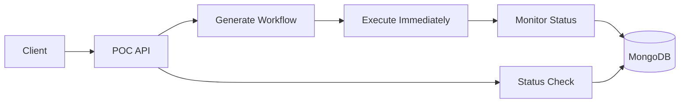

# Minimal AI Workflow POC Architecture

## Overview

Ultra-simple POC with just 2 endpoints:
1. **Generate and Execute Workflow** - Creates agentic workflow and starts execution immediately
2. **Check Status** - Returns current status, and on completion returns all execution details

## POC Architecture



## API Design

### Endpoint 1: Generate and Execute Workflow

```typescript
// POST /api/poc/workflow/generate-and-execute
interface GenerateAndExecuteRequest {
  problemStatement: string;
  agentIds: string[];
}

interface GenerateAndExecuteResponse {
  workflowId: string;
  runId: string;
  status: 'started';
  message: string;
}

// Example Request:
{
  "problemStatement": "Analyze customer feedback and generate a summary report",
  "agentIds": ["text-analyzer-agent", "report-generator-agent"]
}

// Example Response:
{
  "workflowId": "wf_12345",
  "runId": "run_67890",
  "status": "started",
  "message": "Workflow generated and execution started"
}
```

### Endpoint 2: Check Status

```typescript
// GET /api/poc/workflow/{workflowId}/runs/{runId}/status
interface StatusResponse {
  workflowId: string;
  runId: string;
  status: 'running' | 'completed' | 'failed';
  progress: number; // 0-100
  currentStep?: string;
  
  // Only populated when status is 'completed' or 'failed'
  executionDetails?: {
    startTime: string;
    endTime: string;
    totalDuration: number; // seconds
    steps: StepDetail[];
    finalOutput?: any;
    errors?: ExecutionError[];
  };
}

interface StepDetail {
  blockId: string;
  agentName: string;
  status: 'completed' | 'failed' | 'skipped';
  startTime: string;
  endTime?: string;
  duration?: number; // seconds
  input: any;
  output?: any;
  error?: string;
}

// Example Response (Running):
{
  "workflowId": "wf_12345",
  "runId": "run_67890",
  "status": "running",
  "progress": 60,
  "currentStep": "report-generator-agent"
}

// Example Response (Completed):
{
  "workflowId": "wf_12345",
  "runId": "run_67890",
  "status": "completed",
  "progress": 100,
  "executionDetails": {
    "startTime": "2024-01-15T10:00:00Z",
    "endTime": "2024-01-15T10:05:30Z",
    "totalDuration": 330,
    "steps": [
      {
        "blockId": "block_1",
        "agentName": "text-analyzer-agent",
        "status": "completed",
        "startTime": "2024-01-15T10:00:00Z",
        "endTime": "2024-01-15T10:03:00Z",
        "duration": 180,
        "input": "Customer feedback data...",
        "output": "Analysis results..."
      },
      {
        "blockId": "block_2",
        "agentName": "report-generator-agent",
        "status": "completed",
        "startTime": "2024-01-15T10:03:00Z",
        "endTime": "2024-01-15T10:05:30Z",
        "duration": 150,
        "input": "Analysis results...",
        "output": "Final report..."
      }
    ],
    "finalOutput": "Generated summary report with insights..."
  }
}
```

## Implementation Plan

### Phase 1: Enhance Existing Controller

Modify [`workflow.controller.ts`](apps/workflow/src/controllers/v1/workflow.controller.ts) to add POC endpoints:

```typescript
class WorkflowController {
  // Existing methods...

  @Post('/poc/generate-and-execute')
  async generateAndExecutePOC(
    @Body() request: GenerateAndExecuteRequest,
    @Header('x-client-id') clientId: string,
    @Header('x-project-id') projectId: string,
    @Header('x-workspace-id') workspaceId: string
  ): Promise<GenerateAndExecuteResponse> {
    // 1. Generate workflow using existing generateWorkflowFromLLM
    const workflow = await this.workflowService.generateWorkflowFromLLM(
      request.problemStatement,
      request.agentIds,
      { clientId, projectId, workspaceId }
    );

    // 2. Immediately execute the workflow
    const runId = await this.workflowService.executeWorkflow(
      workflow.id,
      { clientId, projectId, workspaceId }
    );

    return {
      workflowId: workflow.id,
      runId: runId,
      status: 'started',
      message: 'Workflow generated and execution started'
    };
  }

  @Get('/poc/{workflowId}/runs/{runId}/status')
  async getPOCStatus(
    @Path() workflowId: string,
    @Path() runId: string,
    @Header('x-client-id') clientId: string
  ): Promise<StatusResponse> {
    // Get execution status using existing methods
    const status = await this.workflowService.getExecutionStatus(workflowId, runId);
    
    const response: StatusResponse = {
      workflowId,
      runId,
      status: this.mapExecutionStatus(status.state),
      progress: this.calculateProgress(status)
    };

    // Add current step if running
    if (status.state === 'running') {
      response.currentStep = status.currentBlockId;
    }

    // Add full details if completed or failed
    if (status.state === 'completed' || status.state === 'failed') {
      response.executionDetails = await this.buildExecutionDetails(workflowId, runId);
    }

    return response;
  }

  private async buildExecutionDetails(workflowId: string, runId: string): Promise<any> {
    // Use existing execution logs to build detailed response
    const logs = await this.workflowService.getExecutionLogs(workflowId, runId);
    const workflow = await this.workflowService.getWorkflow(workflowId);
    
    return {
      startTime: logs.startTime,
      endTime: logs.endTime,
      totalDuration: logs.totalDuration,
      steps: this.buildStepDetails(logs, workflow),
      finalOutput: logs.finalOutput,
      errors: logs.errors
    };
  }
}
```

### Phase 2: Enhance Workflow Service

Modify [`workflow.service.ts`](apps/workflow/src/service/workflow.ts) to support POC requirements:

```typescript
class WorkflowService {
  // Existing methods...

  async generateWorkflowFromLLM(
    problemStatement: string,
    agentIds: string[],
    context: any
  ): Promise<any> {
    // Enhance existing method to focus on agentic blocks only
    const agentDetails = await this.getAgentDetails(agentIds);
    
    const prompt = `
Create a workflow to solve: ${problemStatement}

Available AI Agents (use ONLY these):
${agentDetails.map(a => `- ${a.name}: ${a.description}`).join('\n')}

Requirements:
- Use ONLY agentic blocks (AI agents)
- Create a logical sequence
- Ensure proper data flow between agents
- Return valid workflow graph

Generate workflow with agentic blocks only.
    `;

    const llmResponse = await this.callLLM(prompt);
    const workflow = this.parseAndValidateWorkflow(llmResponse);
    
    // Store workflow
    return await this.createWorkflow(workflow, context);
  }

  async executeWorkflow(workflowId: string, context: any): Promise<string> {
    // Use existing execution logic
    return await this.startExecution(workflowId, context);
  }

  async getExecutionStatus(workflowId: string, runId: string): Promise<any> {
    // Use existing status tracking
    return await this.getRunStatus(workflowId, runId);
  }
}
```

## POC Success Criteria

1. **Single Request**: Generate and execute agentic workflow in one API call
2. **Status Monitoring**: Check execution progress with simple status endpoint
3. **Complete Details**: Get full execution details when workflow completes
4. **Error Handling**: Handle failures gracefully with error details in status
5. **Simplicity**: Only 2 endpoints needed for complete POC demonstration

## Testing Scenarios

### Test Case 1: Simple 2-Agent Workflow
```bash
# 1. Generate and execute
curl -X POST /api/poc/workflow/generate-and-execute \
  -H "x-client-id: test-client" \
  -H "x-project-id: test-project" \
  -H "x-workspace-id: test-workspace" \
  -d '{
    "problemStatement": "Analyze text and generate summary",
    "agentIds": ["text-analyzer", "summarizer"]
  }'

# 2. Check status (repeat until completed)
curl -X GET /api/poc/workflow/wf_12345/runs/run_67890/status \
  -H "x-client-id: test-client"
```

### Test Case 2: Complex Multi-Agent Workflow
```bash
# 1. Generate and execute
curl -X POST /api/poc/workflow/generate-and-execute \
  -d '{
    "problemStatement": "Process customer data, analyze sentiment, generate insights, and create report",
    "agentIds": ["data-processor", "sentiment-analyzer", "insight-generator", "report-creator"]
  }'

# 2. Monitor until completion
curl -X GET /api/poc/workflow/{workflowId}/runs/{runId}/status
```

## Implementation Timeline

- **Day 1-2**: Enhance existing controller with POC endpoints
- **Day 3-4**: Modify workflow service for agentic-only generation
- **Day 5**: Add comprehensive status response with execution details
- **Day 6-7**: Testing and refinement

This minimal POC architecture leverages your existing robust system while providing exactly the 2 endpoints you need for demonstration.
