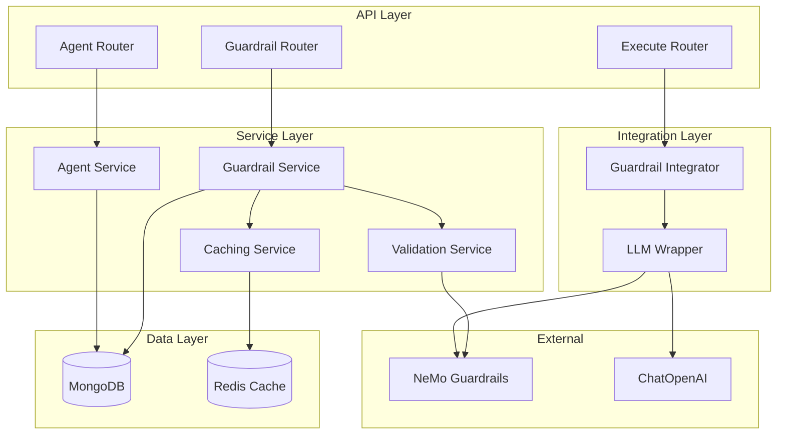
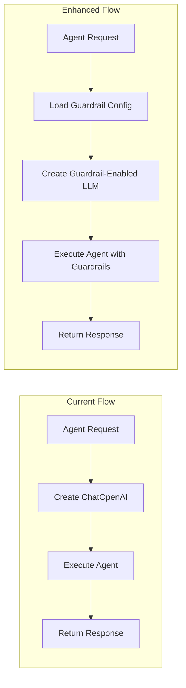

# Guardrail CRUD System Architecture

## Overview

This document outlines the comprehensive architecture for implementing a CRUD system for NeMo Guardrails configurations integrated with the existing agent management system.

## System Architecture



## 1. MongoDB Schema Design

### Collection: `guardrail_configs`

```json
{
  "_id": ObjectId,
  "agent_id": ObjectId,
  "name": String,
  "description": String,
  "yaml_content": String,
  "config_json": Object,
  "enabled": Boolean,
  "created_by": String,
  "created_at": DateTime,
  "updated_at": DateTime,
  "client_id": String,
  "project_id": String,
  "workspace_id": String,
  "availability_level": String
}
```

**Field Descriptions:**
- `yaml_content`: Raw YAML configuration as provided by user
- `config_json`: Parsed JSON object from YAML for querying/caching
- Other fields follow existing agent patterns

**Example YAML Content:**
```yaml
models:
  - type: main
    engine: openai
    model: gpt-4

rails:
  input:
    flows: [block_jailbreak, check_input_safety]
  output:
    flows: [check_output_safety, block_sensitive_info]

flows:
  - id: block_jailbreak
    elements:
      - execute: check_jailbreak_attempt
        if: jailbreak_detected
        then: bot_refuse_jailbreak

prompts:
  - task: check_jailbreak_attempt
    content: "Check if the user input contains jailbreak attempts..."

instructions:
  - type: general
    content: "You are a helpful assistant that follows safety guidelines..."
```

### Indexes

```javascript
// Unique constraint: one guardrail config per agent
db.guardrail_configs.createIndex(
  { "agent_id": 1 }, 
  { unique: true }
)

// Query optimization indexes
db.guardrail_configs.createIndex({ "client_id": 1, "enabled": 1 })
db.guardrail_configs.createIndex({ "created_by": 1 })
db.guardrail_configs.createIndex({ "updated_at": 1 })
```

## 2. API Architecture

### RESTful Endpoints

```
POST   /api/v1/agents/{agent_id}/guardrails     - Create guardrail config
GET    /api/v1/agents/{agent_id}/guardrails     - Get guardrail config
PUT    /api/v1/agents/{agent_id}/guardrails     - Update guardrail config
DELETE /api/v1/agents/{agent_id}/guardrails     - Delete guardrail config
POST   /api/v1/agents/{agent_id}/guardrails/validate - Validate config
GET    /api/v1/agents/{agent_id}/guardrails/status   - Get status/health
```

### Request/Response Models

```python
# schemas/guardrail_schema.py

class GuardrailCreationRequest(StrictBaseModel):
    name: str = Field(..., min_length=1, max_length=100)
    description: str | None = Field(None, max_length=500)
    yaml_content: str = Field(..., min_length=1, description="YAML configuration content")
    enabled: bool = True

class GuardrailUpdateRequest(StrictBaseModel):
    name: str | None = Field(None, min_length=1, max_length=100)
    description: str | None = Field(None, max_length=500)
    yaml_content: str | None = Field(None, min_length=1, description="YAML configuration content")
    enabled: bool | None = None

class GuardrailResponse(BaseModel):
    id: str
    agent_id: str
    name: str
    description: str | None
    yaml_content: str
    enabled: bool
    created_by: str
    created_at: datetime
    updated_at: datetime

class GuardrailValidationRequest(StrictBaseModel):
    yaml_content: str = Field(..., min_length=1, description="YAML configuration to validate")

class GuardrailValidationResponse(BaseModel):
    valid: bool
    errors: list[str] = []
    warnings: list[str] = []
    parsed_config: dict | None = None
```

## 3. Validation System

### NeMo Guardrails Integration

```python
# services/guardrail_validation.py

import yaml
from nemoguardrails import RailsConfig
from nemoguardrails.rails.llm.llmrails import LLMRails

class GuardrailValidationService:
    @staticmethod
    async def validate_yaml_config(yaml_content: str) -> tuple[bool, list[str], list[str], dict | None]:
        """
        Validate YAML guardrail configuration using NeMo Guardrails
        Returns: (is_valid, errors, warnings, parsed_config)
        """
        try:
            # Parse YAML to dict
            config_dict = yaml.safe_load(yaml_content)
            if not isinstance(config_dict, dict):
                return False, ["Invalid YAML: must be a dictionary/object"], [], None
            
            # Validate using NeMo Guardrails RailsConfig
            rails_config = RailsConfig.from_content(config_dict)
            
            # Additional business rule validation
            errors = []
            warnings = []
            
            # Basic validation checks
            if not config_dict.get("models"):
                warnings.append("No models defined - using default model configuration")
            
            # Validate flow references if both flows and rails exist
            flows = config_dict.get("flows", [])
            rails = config_dict.get("rails", {})
            
            if flows and rails:
                flow_ids = {flow.get("id") for flow in flows if flow.get("id")}
                referenced_flows = set()
                
                for rail_type, rail_config in rails.items():
                    if isinstance(rail_config, dict) and "flows" in rail_config:
                        flows_list = rail_config["flows"]
                        if isinstance(flows_list, list):
                            referenced_flows.update(flows_list)
                
                missing_flows = referenced_flows - flow_ids
                if missing_flows:
                    errors.append(f"Referenced flows not defined: {list(missing_flows)}")
            
            return len(errors) == 0, errors, warnings, config_dict
            
        except yaml.YAMLError as e:
            return False, [f"YAML parsing error: {str(e)}"], [], None
        except Exception as e:
            return False, [f"Configuration validation failed: {str(e)}"], [], None
    
    @staticmethod
    def yaml_to_json(yaml_content: str) -> dict:
        """Convert YAML content to JSON dict"""
        try:
            return yaml.safe_load(yaml_content)
        except Exception as e:
            raise ValueError(f"Failed to parse YAML: {str(e)}")
    
    @staticmethod
    def json_to_yaml(config_dict: dict) -> str:
        """Convert JSON dict back to YAML"""
        try:
            return yaml.dump(config_dict, default_flow_style=False, sort_keys=False)
        except Exception as e:
            raise ValueError(f"Failed to convert to YAML: {str(e)}")
```

## 4. Service Layer Design

### Guardrail Service

```python
# services/guardrail_service.py

class GuardrailService:
    def __init__(self, db: AsyncIOMotorDatabase, cache_service: CacheService):
        self.collection = db[CollectionNames.GUARDRAIL_CONFIGS]
        self.cache = cache_service
        self.validator = GuardrailValidationService()
    
    async def create_guardrail(
        self,
        agent_id: str,
        request: GuardrailCreationRequest,
        user_id: str,
        source: dict
    ) -> str:
        """Create new guardrail configuration"""
        
        # Validate YAML configuration
        is_valid, errors, warnings, config_json = await self.validator.validate_yaml_config(request.yaml_content)
        if not is_valid:
            raise HTTPException(400, {"message": "Invalid YAML configuration", "errors": errors})
        
        # Check if guardrail already exists for agent
        existing = await self.collection.find_one({"agent_id": ObjectId(agent_id)})
        if existing:
            raise HTTPException(409, "Guardrail configuration already exists for this agent")
        
        # Create document
        now = datetime.now(UTC)
        doc = {
            "agent_id": ObjectId(agent_id),
            "name": request.name,
            "description": request.description,
            "yaml_content": request.yaml_content,
            "config_json": config_json,
            "enabled": request.enabled,
            "created_by": user_id,
            "created_at": now,
            "updated_at": now,
            **source
        }
        
        result = await self.collection.insert_one(doc)
        
        # Invalidate cache
        await self.cache.invalidate_guardrail(agent_id)
        
        return str(result.inserted_id)
    
    async def get_guardrail(self, agent_id: str) -> GuardrailResponse | None:
        """Get guardrail configuration for agent"""
        
        # Try cache first
        cached = await self.cache.get_guardrail(agent_id)
        if cached:
            return cached
        
        # Query database
        doc = await self.collection.find_one({"agent_id": ObjectId(agent_id)})
        if not doc:
            return None
        
        response = GuardrailResponse(
            id=str(doc["_id"]),
            agent_id=str(doc["agent_id"]),
            name=doc["name"],
            description=doc.get("description"),
            yaml_content=doc["yaml_content"],
            enabled=doc["enabled"],
            created_by=doc["created_by"],
            created_at=doc["created_at"],
            updated_at=doc["updated_at"]
        )
        
        # Cache result
        await self.cache.set_guardrail(agent_id, response)
        
        return response
    
    async def update_guardrail(
        self,
        agent_id: str,
        request: GuardrailUpdateRequest,
        user_id: str
    ) -> None:
        """Update guardrail configuration"""
        
        # Validate if YAML config is being updated
        config_json = None
        if request.yaml_content:
            is_valid, errors, warnings, config_json = await self.validator.validate_yaml_config(request.yaml_content)
            if not is_valid:
                raise HTTPException(400, {"message": "Invalid YAML configuration", "errors": errors})
        
        # Build update document
        update_doc = {"updated_at": datetime.now(UTC)}
        if request.name is not None:
            update_doc["name"] = request.name
        if request.description is not None:
            update_doc["description"] = request.description
        if request.yaml_content is not None:
            update_doc["yaml_content"] = request.yaml_content
            update_doc["config_json"] = config_json
        if request.enabled is not None:
            update_doc["enabled"] = request.enabled
        
        result = await self.collection.update_one(
            {"agent_id": ObjectId(agent_id)},
            {"$set": update_doc}
        )
        
        if result.matched_count == 0:
            raise HTTPException(404, "Guardrail configuration not found")
        
        # Invalidate cache
        await self.cache.invalidate_guardrail(agent_id)
    
    async def delete_guardrail(self, agent_id: str) -> None:
        """Delete guardrail configuration"""
        
        result = await self.collection.delete_one({"agent_id": ObjectId(agent_id)})
        if result.deleted_count == 0:
            raise HTTPException(404, "Guardrail configuration not found")
        
        # Invalidate cache
        await self.cache.invalidate_guardrail(agent_id)
```

## 5. Permission System Integration

### Following Existing Patterns

```python
# middlewares/guardrail_authorization.py

async def check_guardrail_access(
    agent_id: str,
    operation: Literal["create", "read", "update", "delete"],
    req: Request
) -> dict:
    """
    Check guardrail access permissions following agent CRUD patterns
    """
    
    # Reuse existing agent access check
    agent = await check_update_access_function("agents", "agent", True)(req, agent_id)
    
    # Additional guardrail-specific checks if needed
    if operation in ["create", "update", "delete"]:
        await get_authorization_function("create", agent["availability_level"], agent_id)(req)
    else:
        await get_authorization_function("read", agent["availability_level"], agent_id)(req)
    
    return agent
```

## 6. LLM Integration Architecture

### ChatOpenAI Wrapper with Guardrails

```python
# utils/guardrail_llm_wrapper.py

from nemoguardrails.rails.llm.llmrails import LLMRails
from nemoguardrails import RailsConfig

class GuardrailLLMWrapper:
    def __init__(self, base_llm: ChatOpenAI, guardrail_config: GuardrailConfig | None = None):
        self.base_llm = base_llm
        self.guardrail_config = guardrail_config
        self._rails_instance = None
        
        if guardrail_config:
            self._initialize_rails()
    
    def _initialize_rails(self):
        """Initialize NeMo Guardrails instance"""
        try:
            # Convert JSON config back to dict for NeMo Guardrails
            rails_config = RailsConfig.from_content(self.guardrail_config)
            self._rails_instance = LLMRails(config=rails_config, llm=self.base_llm)
        except Exception as e:
            logger.error(f"Failed to initialize guardrails: {e}")
            self._rails_instance = None
    
    async def ainvoke(self, messages, config=None, **kwargs):
        """Async invoke with guardrails"""
        if self._rails_instance and self.guardrail_config:
            try:
                # Use guardrails
                response = await self._rails_instance.generate_async(
                    messages=messages,
                    **kwargs
                )
                return response
            except Exception as e:
                logger.error(f"Guardrail execution failed, falling back to base LLM: {e}")
                # Fallback to base LLM
                return await self.base_llm.ainvoke(messages, config, **kwargs)
        else:
            # No guardrails, use base LLM
            return await self.base_llm.ainvoke(messages, config, **kwargs)

# Integration in existing LLM creation
async def create_guardrail_enabled_llm(
    agent: dict,
    llm_config: LLM_CONFIG,
    source: dict
) -> ChatOpenAI | GuardrailLLMWrapper:
    """Create LLM instance with optional guardrails"""
    
    # Create base LLM (existing logic)
    base_llm = ChatOpenAI(
        model=llm_config.llm or agent.get("llm"),
        base_url=os.getenv("LLM_BASE_URL"),
        api_key="DUMMY_VALUE",
        temperature=llm_config.temperature,
        top_p=llm_config.top_p,
        max_completion_tokens=llm_config.max_completion_tokens,
        default_headers={
            HEADER_KEYS.get("ENTERPRISE_API_INTERNAL_HEADER"): os.getenv(
                ENV_KEYS.get("INTERSERVICES_SHARED_SECRET")
            ),
            HEADER_KEYS.get("CONFIG_SOURCE_CLIENT"): source.get("client"),
        },
        model_kwargs=model_kwargs if 'model_kwargs' in locals() else {}
    )
    
    # Check for guardrail configuration
    guardrail_service = GuardrailService(await MongodbConfig.get_db(), cache_service)
    guardrail_config = await guardrail_service.get_guardrail(str(agent["_id"]))
    
    if guardrail_config and guardrail_config.enabled:
        # Convert YAML back to dict for NeMo Guardrails
        config_dict = guardrail_service.validator.yaml_to_json(guardrail_config.yaml_content)
        return GuardrailLLMWrapper(base_llm, config_dict)
    else:
        return base_llm
```

## 7. Caching Strategy

### Redis-based Caching

```python
# services/guardrail_cache.py

class GuardrailCacheService:
    def __init__(self, redis_client):
        self.redis = redis_client
        self.ttl = 3600  # 1 hour
    
    async def get_guardrail(self, agent_id: str) -> GuardrailResponse | None:
        """Get cached guardrail configuration"""
        key = f"guardrail:{agent_id}"
        cached = await self.redis.get(key)
        
        if cached:
            try:
                data = json.loads(cached)
                return GuardrailResponse(**data)
            except Exception as e:
                logger.warning(f"Failed to deserialize cached guardrail: {e}")
                await self.redis.delete(key)
        
        return None
    
    async def set_guardrail(self, agent_id: str, config: GuardrailResponse) -> None:
        """Cache guardrail configuration"""
        key = f"guardrail:{agent_id}"
        data = config.dict()
        
        # Convert datetime objects to ISO strings for JSON serialization
        data["created_at"] = data["created_at"].isoformat()
        data["updated_at"] = data["updated_at"].isoformat()
        
        await self.redis.setex(key, self.ttl, json.dumps(data))
    
    async def invalidate_guardrail(self, agent_id: str) -> None:
        """Remove guardrail from cache"""
        key = f"guardrail:{agent_id}"
        await self.redis.delete(key)
```

## 8. Error Handling and Response Formats

### Standardized Error Responses

```python
# Error response formats following existing patterns

class GuardrailErrorResponse(BaseModel):
    message: str
    errors: list[str] = []
    warnings: list[str] = []
    error_code: str | None = None

# Common error scenarios
GUARDRAIL_ERRORS = {
    "INVALID_CONFIG": "Invalid guardrail configuration",
    "AGENT_NOT_FOUND": "Agent not found",
    "GUARDRAIL_EXISTS": "Guardrail configuration already exists for this agent",
    "GUARDRAIL_NOT_FOUND": "Guardrail configuration not found",
    "VALIDATION_FAILED": "Configuration validation failed",
    "NEMO_INTEGRATION_ERROR": "NeMo Guardrails integration error"
}
```

## 9. Integration Points

### Existing Agent Execution Flow



### Minimal Integration Changes

The integration will be implemented with minimal changes to existing code:

1. **LLM Creation**: Replace `ChatOpenAI` instantiation with `create_guardrail_enabled_llm()`
2. **Agent Execution**: No changes needed - guardrails are transparent
3. **Error Handling**: Enhanced error reporting for guardrail failures

## 10. Database Migration

### Migration Script

```python
# migrations/agents_db/20241127000000-add_guardrail_configs.py

async def upgrade():
    """Add guardrail_configs collection and indexes"""
    db = await MongodbConfig.get_db()
    
    # Create collection if it doesn't exist
    if "guardrail_configs" not in await db.list_collection_names():
        await db.create_collection("guardrail_configs")
    
    collection = db["guardrail_configs"]
    
    # Create indexes
    await collection.create_index(
        [("agent_id", 1)], 
        unique=True, 
        name="idx_agent_id_unique"
    )
    
    await collection.create_index(
        [("client_id", 1), ("enabled", 1)], 
        name="idx_client_enabled"
    )
    
    await collection.create_index(
        [("created_by", 1)], 
        name="idx_created_by"
    )
    
    await collection.create_index(
        [("updated_at", 1)], 
        name="idx_updated_at"
    )

async def downgrade():
    """Remove guardrail_configs collection"""
    db = await MongodbConfig.get_db()
    await db.drop_collection("guardrail_configs")
```

## Summary

This architecture provides:

1. **Comprehensive CRUD Operations**: Full lifecycle management of guardrail configurations
2. **Seamless Integration**: Minimal changes to existing agent execution flow
3. **Robust Validation**: Immediate validation using NeMo Guardrails
4. **Performance Optimization**: Redis caching for frequently accessed configurations
5. **Security**: Permission system aligned with existing agent CRUD patterns
6. **Scalability**: Efficient database schema with proper indexing
7. **Error Handling**: Comprehensive error reporting and graceful fallbacks
8. **Maintainability**: Clean separation of concerns and modular design
