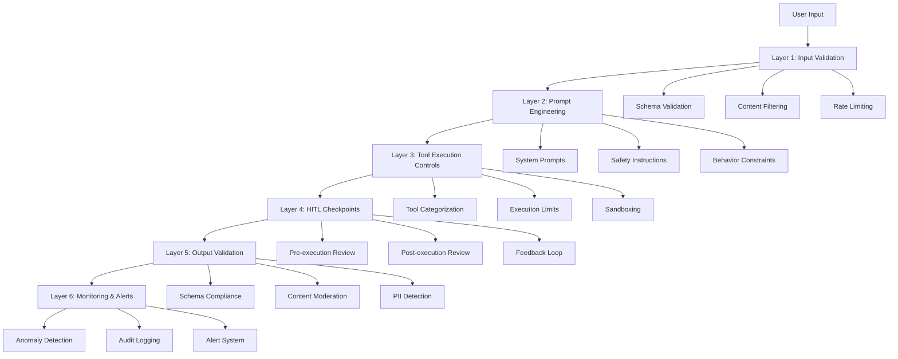

# Agent Guardrails Analysis & Implementation Plan

## Executive Summary

This document provides a deep analysis of agent guardrails suitable for this LangGraph-based agentic system and explains why NVIDIA NeMo Guardrails is not suitable for this specific implementation.

---

## Current State Analysis

### Existing Safety Mechanisms

The project currently implements several safety layers:

1. **Input/Output Schema Validation**
   - Pydantic-based strict validation for agent inputs/outputs
   - JSON Schema validation with retry mechanisms
   - Type safety enforcement across all API boundaries

2. **Human-in-the-Loop (HITL) Controls**
   - Pre-interrupt: Approval required before tool execution
   - Post-interrupt: Review required after tool execution
   - Pre-post-interrupt: Both pre and post approval
   - Configurable at tool level with granular control

3. **Tool Execution Controls**
   - Tool call limits (max_specific_tool_calls)
   - Safe vs. sensitive tool categorization
   - Local vs. remote execution separation
   - A2A (Agent-to-Agent) tool isolation

4. **Authentication & Authorization**
   - Multi-level access control (user/workspace/project/client)
   - JWT-based authentication
   - Role-based middleware
   - Source header validation

5. **Operational Safeguards**
   - Execution termination capability
   - Redis-based locking for concurrent execution prevention
   - Context window monitoring and token usage tracking
   - Recursion limits (GRAPH_RECURSION_LIMIT)

6. **Prompt Engineering Controls**
   - System prompts loaded from config service
   - Planning prompts with reinforcement learning
   - Evaluation prompts for trajectory accuracy
   - Memory management prompts (MEM0)

### Architecture Characteristics

- **Framework**: LangGraph with LangChain integration
- **LLM Support**: Multi-model (GPT-4o, GPT-4o-mini, Claude, etc.)
- **Execution Model**: Stateful graph-based with checkpointing
- **Tool Integration**: API, Script, MCP, MCP-RUNTIME, A2A
- **State Management**: MongoDB checkpointing + Redis caching
- **Messaging**: Event-driven with Azure Service Bus/Redis Streams

---

## Why NVIDIA NeMo Guardrails is NOT Suitable

### 1. **Architectural Mismatch**

**NeMo Guardrails Design:**
- Built for conversational AI with Colang DSL
- Focuses on dialog management and conversation flows
- Designed for single-turn or multi-turn chat applications
- Tightly coupled with specific LLM providers

**This Project's Architecture:**
- Complex stateful graph execution with multiple nodes
- Tool-calling agent with dynamic workflow branching
- Multi-step planning and execution phases
- Checkpoint-based state persistence across interruptions

**Incompatibility:**
NeMo Guardrails expects a linear conversation flow, but this system has:
- Parallel tool execution (Send nodes)
- Conditional branching based on tool types
- State restoration from checkpoints
- Dynamic graph compilation based on tool configurations

### 2. **Integration Complexity**

**NeMo Guardrails Requirements:**
- Requires wrapping LLM calls in their RailsConfig
- Uses Colang for defining guardrail policies
- Expects synchronous request-response patterns
- Limited support for async operations

**This Project's Reality:**
- Async-first architecture throughout
- LLM calls embedded deep in graph nodes
- Multiple LLM invocations per execution (planning, tool calling, structured output)
- Streaming support with SSE
- Background task processing

**Integration Challenges:**
- Would require wrapping every `ChatOpenAI.ainvoke()` call
- Cannot easily intercept tool calls within LangGraph nodes
- Streaming responses would be disrupted
- Checkpoint restoration would bypass guardrails

### 3. **Performance Overhead**

**NeMo Guardrails Overhead:**
- Additional LLM calls for input/output rails (2-4x latency)
- Colang parsing and execution overhead
- Synchronous blocking operations
- No native support for caching guardrail decisions

**This Project's Performance Requirements:**
- Real-time agent execution with event streaming
- Token usage optimization and context window management
- Parallel tool execution for efficiency
- Background task processing with minimal latency

**Impact:**
- 2-4x increase in execution time per agent step
- Increased LLM costs (additional guardrail LLM calls)
- Degraded user experience for real-time applications
- Conflicts with existing token usage tracking

### 4. **Feature Overlap & Redundancy**

**NeMo Guardrails Features:**
- Input validation (jailbreak detection)
- Output moderation (fact-checking, hallucination detection)
- Topic control (allowed/disallowed topics)
- Dialog management

**Already Implemented in This Project:**
- ✅ Input validation via Pydantic schemas
- ✅ Output validation via JSON Schema
- ✅ HITL for human oversight
- ✅ Tool execution controls
- ✅ System prompt engineering for behavior control

**Redundancy Issues:**
- Duplicate validation layers increase complexity
- Conflicting error handling mechanisms
- Unclear responsibility boundaries
- Maintenance burden for two systems

### 5. **Customization Limitations**

**NeMo Guardrails Constraints:**
- Colang DSL learning curve for team
- Limited flexibility for custom guardrail logic
- Difficult to integrate with existing HITL workflow
- Cannot leverage existing Redis/MongoDB infrastructure

**This Project's Needs:**
- Custom guardrails per tool type (API, Script, MCP, A2A)
- Integration with existing event notification system
- Leverage existing checkpointing for guardrail state
- Client-specific guardrail configurations

### 6. **Operational Complexity**

**NeMo Guardrails Operations:**
- Separate configuration management (Colang files)
- Additional monitoring and debugging complexity
- Version compatibility with LangChain/LangGraph
- Limited observability into guardrail decisions

**This Project's Operations:**
- Centralized config service for prompts
- Existing logging and monitoring infrastructure
- Event-driven observability
- Redis-based state management

---

## Recommended Guardrail Strategy

### Layered Defense Approach

### Layer 1: Enhanced Input Validation

**Current:** Pydantic schema validation
**Enhancements:**
- Content filtering for malicious inputs
- Prompt injection detection
- Input sanitization
- Rate limiting per user/client

### Layer 2: Advanced Prompt Engineering

**Current:** System prompts from config service
**Enhancements:**
- Constitutional AI principles in system prompts
- Explicit safety instructions
- Output format constraints
- Ethical guidelines

### Layer 3: Tool Execution Guardrails

**Current:** HITL, tool limits, categorization
**Enhancements:**
- Tool risk scoring system
- Dynamic tool approval workflows
- Execution sandboxing
- Resource consumption limits

### Layer 4: HITL Enhancement

**Current:** Pre/post interrupt mechanisms
**Enhancements:**
- Risk-based HITL triggering
- Automated approval for low-risk operations
- Escalation workflows
- Feedback learning system

### Layer 5: Output Validation & Moderation

**Current:** JSON Schema validation
**Enhancements:**
- PII detection and redaction
- Content moderation (toxicity, bias)
- Factual consistency checks
- Hallucination detection

### Layer 6: Monitoring & Observability

**Current:** Event streaming, logging
**Enhancements:**
- Anomaly detection
- Behavioral analytics
- Compliance reporting
- Real-time alerting

---

## Alternative Guardrail Solutions

### 1. **LangChain Expression Language (LCEL) Guardrails**
- **Pros:** Native LangChain integration, async support
- **Cons:** Limited pre-built guardrails, requires custom implementation
- **Fit:** ⭐⭐⭐⭐ (Good fit, already using LangChain)

### 2. **Guardrails AI (POC Done by Ankit)**
- **Pros:** Validator library, Pydantic integration, async support
- **Cons:** Focused on output validation, limited input guardrails
- **Fit:** ⭐⭐⭐⭐ (Good for output validation layer)

### 3. **LLM Guard**
- **Pros:** Comprehensive scanners, async support, modular
- **Cons:** Additional dependency, performance overhead
- **Fit:** ⭐⭐⭐⭐⭐ (Excellent fit for content filtering)

### 4. **Custom Implementation**
- **Pros:** Full control, optimized for architecture, no external dependencies
- **Cons:** Development effort, maintenance burden
- **Fit:** ⭐⭐⭐⭐⭐ (Best fit for this project)

---

## Implementation Recommendations

### Immediate Actions (High Priority)

1. **Implement LLM Guard for Content Safety**
   - Input scanners: PromptInjection, Toxicity, BanTopics
   - Output scanners: Toxicity, Bias, Sensitive, NoRefusal
   - Integrate at graph entry/exit points

2. **Enhance Prompt Engineering**
   - Add constitutional AI principles to system prompts
   - Include explicit safety instructions
   - Define output format constraints

3. **Implement PII Detection**
   - Use regex patterns + NER models
   - Redact sensitive information
   - Log PII detection events

4. **Add Rate Limiting**
   - Per-user execution limits
   - Per-tool call limits (already exists, enhance)
   - Global system limits

### Medium-Term Actions

5. **Build Tool Risk Scoring System**
   - Categorize tools by risk level
   - Dynamic HITL triggering based on risk
   - Automated approval for low-risk tools

6. **Implement Anomaly Detection**
   - Monitor execution patterns
   - Detect unusual tool usage
   - Alert on suspicious behavior

7. **Add Compliance Reporting**
   - Audit trail for all executions
   - HITL decision logging
   - Guardrail violation tracking

### Long-Term Actions

8. **Develop Feedback Learning System**
   - Learn from HITL decisions
   - Improve guardrail accuracy
   - Reduce false positives

9. **Build Custom Guardrail Framework**
   - Modular guardrail plugins
   - Configuration-driven policies
   - Client-specific customization

10. **Implement Advanced Monitoring**
    - Real-time dashboards
    - Behavioral analytics
    - Predictive alerting

---

## Cost-Benefit Analysis

### NeMo Guardrails
- **Implementation Cost:** High (architectural changes, learning curve)
- **Operational Cost:** High (2-4x LLM calls, latency)
- **Maintenance Cost:** High (separate system, version compatibility)
- **Benefit:** Low (feature overlap, architectural mismatch)
- **ROI:** ❌ Negative

### Recommended Approach (LLM Guard + Custom)
- **Implementation Cost:** Medium (incremental additions)
- **Operational Cost:** Low (optimized for architecture)
- **Maintenance Cost:** Low (integrated with existing systems)
- **Benefit:** High (tailored to needs, no redundancy)
- **ROI:** ✅ Positive

---

## Conclusion

**NVIDIA NeMo Guardrails is NOT suitable for this project** due to:
1. Fundamental architectural incompatibility with LangGraph
2. Significant performance overhead (2-4x latency)
3. Feature redundancy with existing HITL mechanisms
4. Integration complexity with async, stateful execution
5. Operational overhead without commensurate benefits

**Recommended Strategy:**
- Implement **LLM Guard** for content safety (input/output filtering)
- Enhance existing **HITL mechanisms** with risk-based triggering
- Build **custom guardrails** leveraging existing infrastructure
- Focus on **layered defense** approach with monitoring

This approach provides superior protection while maintaining performance, leveraging existing architecture, and avoiding unnecessary complexity.
