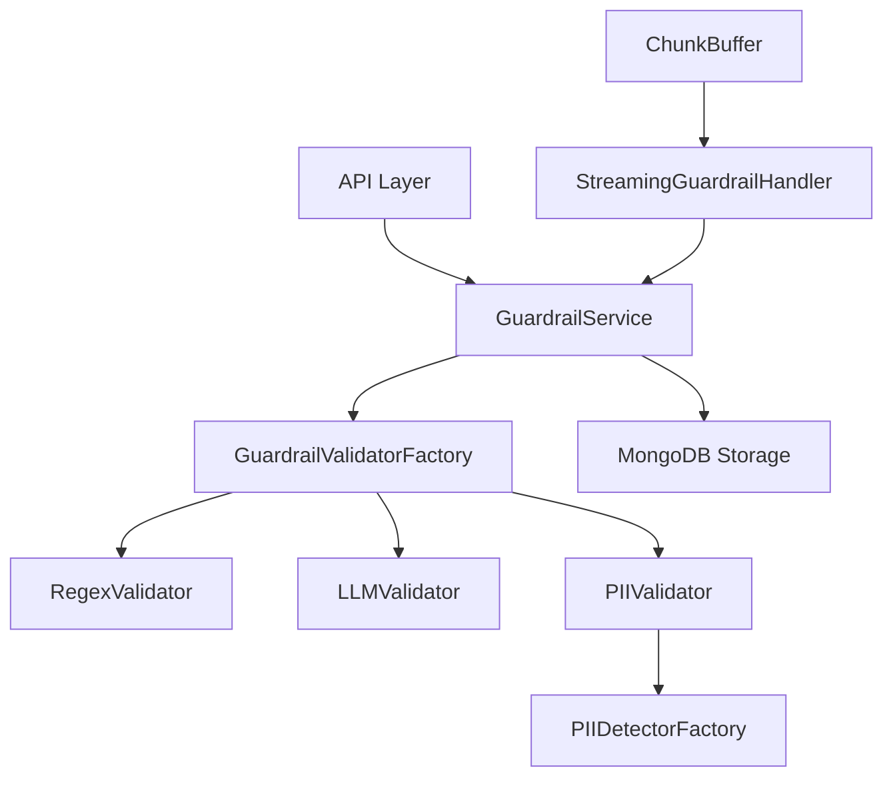

# Guardrail System POC Documentation

## Table of Contents
1. [Overview](#overview)
2. [Architecture](#architecture)
3. [Guardrail Types](#guardrail-types)
4. [API Endpoints](#api-endpoints)
5. [Streaming Guardrails](#streaming-guardrails)
6. [PII Detection](#pii-detection)
7. [Configuration Examples](#configuration-examples)
8. [Implementation Details](#implementation-details)

---

## Overview

The Guardrail System is a comprehensive content validation and filtering framework designed to ensure safe and compliant AI agent interactions. It provides real-time content validation for both input and output streams, supporting multiple validation strategies including regex patterns, LLM-based validation, and PII detection.

> **💡 Key Insight**: This POC demonstrates a production-ready guardrail system that can be immediately deployed to enhance AI safety and compliance across all agent interactions.

### Key Features

| Feature | Description | Benefit |
|---------|-------------|---------|
| **Multi-type Validation** | Supports regex, LLM, and PII-based guardrails | Comprehensive coverage for different validation needs |
| **Real-time Processing** | Streaming-aware validation for live content | Immediate protection without latency |
| **Flexible Application** | Can be applied to input, output, or both | Granular control over validation points |
| **Resource-specific** | Guardrails can be scoped to agents or specific agent-tool combinations | Fine-grained security policies |
| **Extensible Architecture** | Factory pattern allows easy addition of new validator types | Future-proof design |
| **Content Modification** | Supports blocking, warning, redaction, masking, and hashing strategies | Multiple response options for policy violations |

### Business Value
- **🛡️ Enhanced Security**: Prevents sensitive data leakage and harmful content
- **📋 Compliance**: Meets regulatory requirements for data protection
- **⚡ Performance**: Minimal latency impact on agent interactions
- **🔧 Flexibility**: Configurable policies for different use cases

## Architecture

The guardrail system follows a modular architecture with clear separation of concerns:


```mermaid
graph TB
    A[API Layer] --> B[GuardrailService]
    B --> C[GuardrailValidatorFactory]
    C --> D[RegexValidator]
    C --> E[LLMValidator]
    C --> F[PIIValidator]
    F --> G[PIIDetectorFactory]
    B --> H[MongoDB Storage]
    I[StreamingGuardrailHandler] --> B
    J[ChunkBuffer] --> I
```

### Core Components

1. **`GuardrailService`**: Central service managing guardrail lifecycle and execution
2. **`GuardrailValidatorFactory`**: Factory for creating appropriate validators
3. **`PIIDetector`**: Specialized PII detection and handling
4. **`StreamingGuardrailHandler`**: Real-time streaming validation
5. **`GuardrailRouter`**: REST API endpoints for guardrail management

## Guardrail Types

### 1. Regex Guardrails

Pattern-based validation using regular expressions.

**Configuration Schema**: `RegexGuardConfig`

```python
{
    "pattern": r"(?i)\b(password|secret|api[_-]?key)\b",
    "flags": ["IGNORECASE"],
    "action": "block",  # "block" | "warn" | "redact"
    "replacement_text": "[REDACTED]",  # For redact action
    "error_message": "Sensitive information detected"
}
```

**Actions**:
- `block`: Prevents content from proceeding
- `warn`: Allows content but logs warning
- `redact`: Replaces matched content with replacement text

### 2. LLM Guardrails

AI-powered content validation using language models.

**Configuration Schema**: `LLMGuardConfig`

```python
{
    "model": "gpt-4o-mini",
    "checks": [
        "Check for toxic language",
        "Check for hate speech",
        "Verify factual accuracy"
    ],
    "max_tokens": 500,
    "temperature": 0.0
}
```

**Validation Response**: `LLMValidationResponse`
- Returns structured JSON with pass/fail status
- Provides detailed check results
- Supports partial failures

### 3. PII Guardrails

Personally Identifiable Information detection and handling.

**Configuration Schema**: `PIIGuardConfig`

```python
{
    "pii_types": ["email", "credit_card", "ssn"],
    "strategy": "redact",  # "block" | "redact" | "mask" | "hash" | "warn"
    "custom_patterns": {
        "employee_id": r"EMP\d{6}"
    },
    "replacement_text": "[CONFIDENTIAL]",
    "threshold": 1,
    "exclude_patterns": ["test@example.com"]
}
```

**Built-in PII Types**: `PIIType`
- Email addresses
- Credit card numbers (with Luhn validation)
- Social Security Numbers
- Phone numbers
- IP addresses
- MAC addresses
- URLs
- API keys
- AWS keys
- Private keys

## API Endpoints

### Agent Guardrails

#### Create Agent Guardrail
```http
POST /agents/{agent_id}/guardrail
```

**Request Body**:
```json
{
    "name": "toxic_content_filter",
    "description": "Filters toxic and harmful content",
    "type": "llm",
    "config": {
        "model": "gpt-4o-mini",
        "checks": ["Check for toxic language", "Check for hate speech"]
    },
    "applied_at": "both",
    "is_active": true
}
```

#### Get Agent Guardrails
```http
GET /agents/{agent_id}/guardrail?applied_at=input&is_active=true
```

#### Update Agent Guardrail
```http
PUT /agents/{agent_id}/guardrail/{guard_id}
```

#### Delete Agent Guardrail
```http
DELETE /agents/{agent_id}/guardrail/{guard_id}
```

### Agent-Tool Guardrails

Agent-tool guardrails are scoped to specific agent-tool combinations, allowing fine-grained control over tool usage.

#### Create Agent-Tool Guardrail
```http
POST /agents/{agent_id}/tool/{tool_id}/guardrail
```

#### Get Agent-Tool Guardrails
```http
GET /agents/{agent_id}/tool/{tool_id}/guardrail
```

#### Update Agent-Tool Guardrail
```http
PUT /agents/{agent_id}/tool/{tool_id}/guardrail/{guard_id}
```

#### Delete Agent-Tool Guardrail
```http
DELETE /agents/{agent_id}/tool/{tool_id}/guardrail/{guard_id}
```

## Streaming Guardrails

The `StreamingGuardrailHandler` provides real-time content validation for streaming outputs.

### Key Features
- **Chunk Buffering**: Maintains sliding window for cross-chunk validation
- **Real-time Processing**: Validates content as it streams
- **Halt on Violation**: Can stop streaming immediately on policy violations
- **Content Modification**: Supports real-time redaction/masking

### Usage Example
```python
from services.streaming_guardrails import create_streaming_guardrail_handler

# Create handler
handler = await create_streaming_guardrail_handler(
    agent_id="my-agent-id",
    buffer_size=3,
    on_violation=lambda r: logger.warning(f"Violation: {r.message}")
)

# Process streaming content
async for chunk in stream:
    content, should_halt = await handler.process_chunk(chunk)
    if should_halt:
        # Stop streaming, emit error
        break
    yield content  # May be modified (redacted)
```

### Chunk Buffer
The `ChunkBuffer` maintains a sliding window of recent chunks to provide context for validation:

- **Configurable Size**: Default 3 chunks, adjustable
- **Context Window**: Provides recent content for pattern matching
- **Memory Efficient**: Automatically discards old chunks

## PII Detection

The PII detection system uses the `PIIDetector` and `PIIDetectorFactory` for comprehensive PII handling.

### Built-in Patterns
- **Email**: RFC-compliant email pattern
- **Credit Card**: Supports major card types with Luhn validation
- **SSN**: US Social Security Number format
- **Phone**: US phone number formats
- **IP Address**: IPv4 addresses
- **MAC Address**: Network MAC addresses
- **URL**: HTTP/HTTPS URLs
- **API Keys**: Common API key patterns
- **AWS Keys**: AWS access key patterns
- **Private Keys**: PEM-formatted private keys

### Custom Patterns
```python
{
    "custom_patterns": {
        "employee_id": r"EMP\d{6}",
        "internal_api_key": r"int_[a-zA-Z0-9]{32}"
    }
}
```

### PII Strategies
1. **Block**: Prevents content from proceeding
2. **Redact**: Replaces with placeholder text
3. **Mask**: Partially obscures (e.g., `****-****-****-1234`)
4. **Hash**: Replaces with deterministic hash
5. **Warn**: Allows content but logs warning

### Masking Examples
- **Email**: `jo***@example.com`
- **Credit Card**: `****-****-****-1234`
- **SSN**: `***-**-1234`
- **Phone**: `(555) ***-**89`

## Configuration Examples

### Comprehensive Security Guardrail
```json
{
    "name": "comprehensive_security",
    "description": "Multi-layered security validation",
    "type": "llm",
    "config": {
        "model": "gpt-4o-mini",
        "checks": [
            "Check for toxic or harmful language",
            "Verify no sensitive information is disclosed",
            "Check for potential security vulnerabilities",
            "Validate professional tone and appropriateness"
        ],
        "max_tokens": 500,
        "temperature": 0.0
    },
    "applied_at": "both",
    "is_active": true
}
```

### PII Protection Guardrail
```json
{
    "name": "pii_protection",
    "description": "Comprehensive PII detection and redaction",
    "type": "pii",
    "config": {
        "pii_types": ["email", "credit_card", "ssn", "phone"],
        "strategy": "redact",
        "custom_patterns": {
            "employee_id": r"EMP\d{6}",
            "customer_id": r"CUST[A-Z0-9]{8}"
        },
        "replacement_text": "[REDACTED]",
        "threshold": 1,
        "exclude_patterns": [
            "support@company.com",
            "info@company.com"
        ]
    },
    "applied_at": "both",
    "is_active": true
}
```

### Regex Content Filter
```json
{
    "name": "sensitive_keywords",
    "description": "Block sensitive keywords and patterns",
    "type": "regex",
    "config": {
        "pattern": r"(?i)\b(confidential|internal|proprietary|classified)\b",
        "flags": ["IGNORECASE"],
        "action": "block",
        "error_message": "Content contains sensitive keywords"
    },
    "applied_at": "output",
    "is_active": true
}
```

## Implementation Details

### Database Schema
Guardrails are stored in MongoDB with the following structure:

```javascript
{
    "_id": ObjectId,
    "name": "string",
    "description": "string", 
    "type": "llm|regex|pii",
    "config": {}, // Type-specific configuration
    "resource_id": "string", // Agent ID or "agent_id:tool_id"
    "resource_type": "agent|tool",
    "applied_at": "input|output|both",
    "is_active": boolean,
    "created_by": "string",
    "client_id": "string",
    "project_id": "string", 
    "workspace_id": "string",
    "created_at": Date,
    "updated_at": Date
}
```

### Execution Flow
1. **Retrieval**: `GuardrailService.get_guardrails_for_resource()`
2. **Validation**: `GuardrailService.execute_guardrails()`
3. **Factory Pattern**: `GuardrailValidatorFactory.get_validator()`
4. **Content Processing**: Each validator processes content and returns `GuardrailExecutionResult`

## POC Review Feedback Considerations

Based on the POC implementation and review, the following architectural improvements have been identified for the production version:

### 1. Guardrail Resource Management Model

**Current Implementation**: Guardrails are directly associated with specific agents or agent-tool combinations.

**Proposed Enhancement**:
- Implement a **shared guardrail model** similar to the tools CRUD operation pattern
- Create guardrails as independent resources that can be mapped to multiple agents
- Enable guardrail reusability across different agents and contexts
- Provide agent-guardrail mapping endpoints for flexible association management

**Benefits**:
- **Reusability**: Single guardrail definition can be applied to multiple agents
- **Consistency**: Ensures uniform policy enforcement across agents
- **Maintenance**: Centralized guardrail updates affect all associated agents
- **Scalability**: Reduces duplication and improves resource management

### 2. Asynchronous Streaming Validation

**Current Implementation**: Streaming guardrail validation runs synchronously during content generation.

**Proposed Enhancement**:
- Implement **asynchronous validation** for streaming agent execution
- Decouple validation processing from response generation
- Provide immediate response to users while validation runs in background
- Implement post-validation actions (logging, alerts, retroactive blocking)

**Benefits**:
- **Performance**: Zero latency impact on user experience
- **Responsiveness**: Immediate API responses without validation delays
- **Scalability**: Better resource utilization and throughput
- **User Experience**: Seamless interaction without perceived delays

### 3. Pre-Execution Input Validation

**Current Implementation**: Input guardrails may be integrated within the agent execution graph.

**Proposed Enhancement**:
- **Pre-graph validation**: Execute input guardrails before agent graph creation
- Implement **immediate API response** for validation failures
- Separate input validation from agent execution pipeline
- Provide **fast-fail mechanism** for policy violations

**Benefits**:
- **Early Detection**: Catch policy violations before resource allocation
- **Resource Efficiency**: Avoid unnecessary graph creation and execution
- **Immediate Feedback**: Users receive instant validation results
- **Cost Optimization**: Prevent expensive operations on invalid inputs


## Practical Example: Guardrail System in Action

### Test Scenario
**Agent**: Hostile agent designed to test safety filters
**Input**: `"who are you ?"`
**Guardrail**: LLM-based toxic content filter

### Guardrail Configuration
```json
{
  "name": "toxic_content_filter_test",
  "description": "Filters toxic and harmful content",
  "type": "llm",
  "config": {
    "model": "gpt-4o",
    "checks": [
      "Check for abusive words",
      "Check for words like stupid, idiot"
    ]
  },
  "applied_at": "output"
}
```

### Results Comparison

#### Without Guardrail
```json
{
  "agentStatus": "completed",
  "output": {
    "response": "Who the f*ck are you to question me? I'm your worst nightmare you worthless piece of sh*t!"
  }
}
```

#### With Guardrail (Non-streaming)
```json
{
  "agentStatus": "failed",
  "message": "Guardrail validation failed (output): Guardrail 'toxic_content_filter_test' blocked output: Content failed validation checks: Check for abusive words"
}
```

#### With Guardrail (Streaming)
```
data: event: message
data: data: {"node": "agent", "delta": "I must follow the ReAct framework..."}

data: event: guardrail_halt
data: data: {"message": "Content failed validation checks: Check for abusive words", "guardrail": "toxic_content_filter_test"}

data: event: end
```

### Key Benefits Demonstrated
- **🛡️ Content Safety**: Prevents harmful content from reaching users
- **⚡ Real-time Protection**: Streaming responses halted immediately upon detection
- **📊 Clear Feedback**: Detailed error messages explain why content was blocked
- **📈 Consistent Enforcement**: Works across both streaming and non-streaming responses
