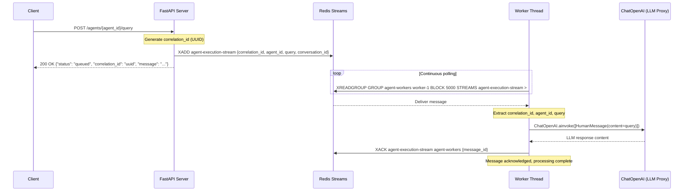
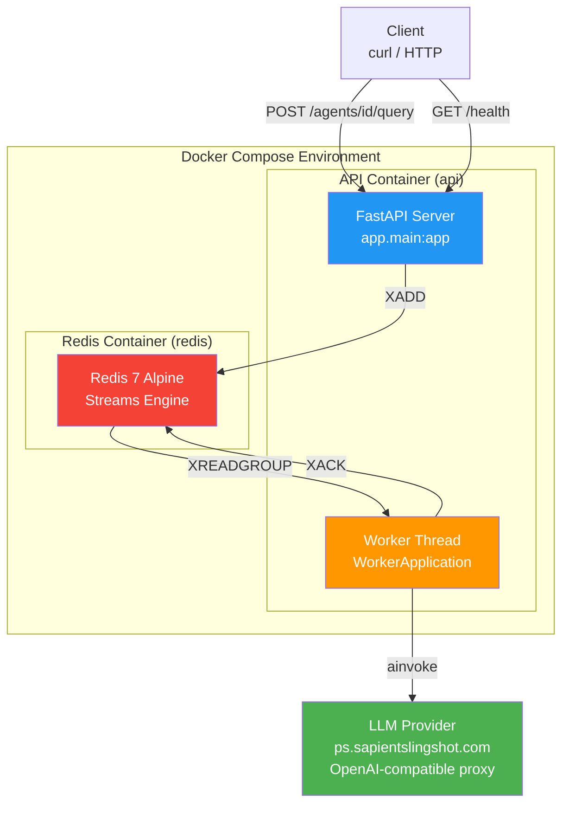

# Worker Execution POC — Technical Documentation

> **Status:** ✅ Complete | **Version:** 1.0 | **Last Updated:** March 2026

---

## 1. Overview

{info:title=About This Document}
This document describes the **Worker Execution POC** — an event-driven architecture for asynchronous agent execution. It demonstrates how a user query can be submitted via a REST API, queued through Redis Streams, and processed asynchronously by a background worker that invokes an LLM.
{info}

### Purpose

Demonstrate how agent execution (sending a user query to an LLM) can be triggered via a REST API and processed asynchronously through **Redis Streams**. The API returns an immediate "queued" response with a `correlation_id`, while the actual LLM invocation happens in a background worker thread.

### Scope

{note:title=POC Scope}
This is a **Proof of Concept** only. The following production features are intentionally excluded:

- Retry / Dead Letter Queue (DLQ) logic
- Authentication & authorization
- Streaming / Server-Sent Events (SSE)
- Tool calling or LangGraph pipelines
- Conversation memory
- Result delivery back to client (webhooks, polling, SSE)
- Input/output guardrails
{note}

---

## 2. Architecture

### Sequence Diagram

The following diagram illustrates the end-to-end message flow from client request to LLM response:


```mermaid
sequenceDiagram
    participant Client
    participant API as FastAPI Server
    participant Redis as Redis Streams
    participant Worker as Worker Thread
    participant LLM as ChatOpenAI (LLM Proxy)

    Client->>API: POST /agents/{agent_id}/query
    Note over API: Generate correlation_id (UUID)
    API->>Redis: XADD agent-execution-stream {correlation_id, agent_id, query, conversation_id}
    API-->>Client: 200 OK {"status": "queued", "correlation_id": "uuid", "message": "..."}

    loop Continuous polling
        Worker->>Redis: XREADGROUP GROUP agent-workers worker-1 BLOCK 5000 STREAMS agent-execution-stream >
    end

    Redis-->>Worker: Deliver message
    Note over Worker: Extract correlation_id, agent_id, query
    Worker->>LLM: ChatOpenAI.ainvoke([HumanMessage(content=query)])
    LLM-->>Worker: LLM response content
    Worker->>Redis: XACK agent-execution-stream agent-workers {message_id}
    Note over Worker: Message acknowledged, processing complete
```

### Component Diagram


```mermaid
graph TB
    subgraph "Docker Compose Environment"
        subgraph "API Container (api)"
            A[FastAPI Server<br/>app.main:app]
            B[Worker Thread<br/>WorkerApplication]
        end

        subgraph "Redis Container (redis)"
            C[Redis 7 Alpine<br/>Streams Engine]
        end
    end

    D[Client<br/>curl / HTTP] -->|POST /agents/id/query| A
    D -->|GET /health| A
    A -->|XADD| C
    C -->|XREADGROUP| B
    B -->|XACK| C
    B -->|ainvoke| E[LLM Provider<br/>ps.sapientslingshot.com<br/>OpenAI-compatible proxy]

    style A fill:#2196F3,color:#fff
    style B fill:#FF9800,color:#fff
    style C fill:#f44336,color:#fff
    style E fill:#4CAF50,color:#fff
```

### How It Works

1. **Client** sends a `POST /agents/{agent_id}/query` request with a JSON body containing the `query` string.
2. **FastAPI API Server** generates a `correlation_id` (UUID), publishes the message to Redis Streams via `XADD`, and immediately returns a `"queued"` response.
3. **Worker Thread** (spawned at application startup via `lifespan`) continuously polls Redis Streams using `XREADGROUP` with a 5-second block timeout.
4. When a message is delivered, the **Worker** extracts the query and invokes the LLM via `ChatOpenAI.ainvoke()`.
5. After processing (success or failure), the worker acknowledges the message via `XACK`.

---

## 3. Technology Stack

| Component | Technology | Version / Details |
|---|---|---|
| Language | Python | 3.11 |
| Web Framework | FastAPI + Uvicorn | FastAPI ≥0.104.0, Uvicorn ≥0.24.0 |
| Message Broker | Redis Streams | Redis 7 Alpine |
| LLM Integration | LangChain | langchain-openai ≥0.1.0, langchain-core ≥0.2.0 |
| LLM Provider | OpenAI-compatible proxy | `ps.sapientslingshot.com/api/v1/llm` |
| Containerization | Docker + Docker Compose | Compose v3.8 |
| Data Validation | Pydantic v2 | pydantic ≥2.0.0, pydantic-settings ≥2.0.0 |
| Async Redis Client | redis-py (async) | redis ≥5.0.0 |

---

## 4. Project Structure

```
woker-execution-poc/
├── app/
│   ├── __init__.py              # Package initializer
│   ├── main.py                  # FastAPI app with lifespan, spawns worker thread
│   ├── config.py                # Settings via pydantic-settings (env vars)
│   ├── models.py                # Request/Response Pydantic models
│   ├── redis_client.py          # Redis Streams wrapper (XADD, XREADGROUP, XACK)
│   ├── worker.py                # Worker that consumes messages and invokes LLM
│   └── agent_handler.py         # LLM invocation using ChatOpenAI
├── Dockerfile                   # Python 3.11-slim container image
├── docker-compose.yml           # Redis + API service orchestration
├── requirements.txt             # Python dependencies
├── .env                         # Environment configuration (not committed)
└── worker-execution-poc.md      # Original POC specification
```

### File Descriptions

| File | Purpose |
|---|---|
| `app/main.py` | Defines the FastAPI application with a `lifespan` context manager. On startup, connects to Redis and spawns the worker in a daemon thread (when `LOCAL_SERVER=true`). Exposes `POST /agents/{agent_id}/query` and `GET /health` endpoints. |
| `app/config.py` | Uses `pydantic-settings` `BaseSettings` to load configuration from environment variables and `.env` file. Defines LLM, Redis, and server configuration fields with sensible defaults. |
| `app/models.py` | Pydantic v2 models: `AgentExecutionRequest` (input with `query` and optional `conversation_id`) and `AgentExecutionResponse` (output with `status`, `correlation_id`, `message`). |
| `app/redis_client.py` | `RedisStreamClient` class wrapping async Redis operations: `connect()` (with consumer group creation via `MKSTREAM`), `publish_message()` (XADD), `start_processing()` (XREADGROUP loop with 5s block timeout), `acknowledge_message()` (XACK), `stop_processing()`, and `close()`. |
| `app/worker.py` | `WorkerApplication` class that initializes its own `RedisStreamClient` and `ExecuteAgentHandler`, then runs the consume loop. The `_process_message()` callback invokes the LLM and acknowledges the message. |
| `app/agent_handler.py` | `ExecuteAgentHandler` class that creates a `ChatOpenAI` instance configured with the proxy URL, API key, and model. The `handle()` method invokes the LLM asynchronously via `ainvoke()` with a `HumanMessage`. |
| `Dockerfile` | Multi-stage build using `python:3.11-slim`. Installs dependencies, copies source, and runs Uvicorn with `--reload` for development. |
| `docker-compose.yml` | Defines two services: `redis` (Redis 7 Alpine with health check) and `api` (built from Dockerfile, depends on healthy Redis). Mounts source for live reload. |
| `requirements.txt` | Python package dependencies with minimum version constraints. |

---

## 5. API Endpoints

### POST /agents/{agent_id}/query

{panel:title=Submit Agent Query|borderStyle=solid|borderColor=#2196F3}

**Description:** Submit a query for asynchronous agent execution. The query is published to Redis Streams and processed by the background worker.

**URL:** `/agents/{agent_id}/query`

**Method:** `POST`

**Path Parameters:**

| Parameter | Type | Description |
|---|---|---|
| `agent_id` | `string` | Identifier for the agent to execute |

**Request Body:**

```json
{
  "query": "What is the capital of France?",
  "conversation_id": "optional-session-id"
}
```

| Field | Type | Required | Description |
|---|---|---|---|
| `query` | `string` | ✅ Yes | The user query to send to the LLM |
| `conversation_id` | `string` | ❌ No | Optional conversation/session identifier |

**Response (200 OK):**

```json
{
  "status": "queued",
  "correlation_id": "a1b2c3d4-e5f6-7890-abcd-ef1234567890",
  "message": "Query queued for agent test-agent"
}
```

| Field | Type | Description |
|---|---|---|
| `status` | `string` | Always `"queued"` — indicates the message was published to Redis Streams |
| `correlation_id` | `string` | UUID v4 for tracking this execution request |
| `message` | `string` | Human-readable confirmation message |

{panel}

### GET /health

{panel:title=Health Check|borderStyle=solid|borderColor=#4CAF50}

**Description:** Simple health check endpoint to verify the API server is running.

**URL:** `/health`

**Method:** `GET`

**Response (200 OK):**

```json
{
  "status": "healthy"
}
```

{panel}

---

## 6. Configuration / Environment Variables

All configuration is managed via environment variables, loaded through `pydantic-settings`. Values can be set in a `.env` file or passed directly as environment variables.

### LLM Configuration

| Variable | Default | Description |
|---|---|---|
| `OPENAI_API_KEY` | `""` (empty) | API key for the OpenAI-compatible LLM proxy |
| `OPENAI_BASE_URL` | `https://ps.sapientslingshot.com/api/v1/llm` | Base URL for the LLM proxy endpoint |
| `OPENAI_MODEL` | `gpt-4o-mini` | Model name to use for LLM invocations |

### Redis Configuration

| Variable | Default | Description |
|---|---|---|
| `REDIS_HOST` | `redis` | Redis server hostname (Docker service name) |
| `REDIS_PORT` | `6379` | Redis server port |
| `REDIS_PASSWORD` | `""` (empty) | Redis authentication password (optional) |
| `REDIS_STREAM_NAME` | `agent-execution-stream` | Redis Stream key for message publishing and consumption |
| `REDIS_CONSUMER_GROUP` | `agent-workers` | Consumer group name for XREADGROUP operations |
| `REDIS_CONSUMER_NAME` | `worker-1` | Consumer name within the consumer group |

### Server Configuration

| Variable | Default | Description |
|---|---|---|
| `LOCAL_SERVER` | `true` | When `true`, spawns the worker as a daemon thread within the API process. When `false`, the worker is not spawned (intended for separate deployment). |

---

## 7. How to Run

### Prerequisites

{info:title=Prerequisites}
- **Docker** and **Docker Compose** installed
- A valid **API key** for the LLM proxy (`ps.sapientslingshot.com`)
{info}

### Step-by-Step Instructions

**1. Clone the repository**

```bash
git clone <repo-url>
cd woker-execution-poc
```

**2. Configure environment**

```bash
cp .env.example .env
# Edit .env with your API key:
# OPENAI_API_KEY=your-api-key-here
```

**3. Build and start services**

```bash
docker compose up --build -d
```

This starts two containers:
- `redis` — Redis 7 Alpine with health check
- `api` — FastAPI server with embedded worker thread

**4. Verify services are running**

```bash
docker compose ps
```

**5. Check application logs**

```bash
docker compose logs -f
```

You should see output similar to:

```
api-1    | INFO | app.main | Redis client connected (API)
api-1    | INFO | app.redis_client | Connected to Redis at redis:6379
api-1    | INFO | app.redis_client | Consumer group 'agent-workers' already exists on stream 'agent-execution-stream'
api-1    | INFO | app.main | Worker thread started
api-1    | INFO | app.worker | Worker setup complete
api-1    | INFO | app.worker | Worker starting — consuming from stream 'agent-execution-stream' as 'worker-1' in group 'agent-workers'
```

**6. Test the health endpoint**

```bash
curl http://localhost:8000/health
```

Expected response:

```json
{"status": "healthy"}
```

**7. Submit a test query**

```bash
curl -X POST http://localhost:8000/agents/test-agent/query \
  -H "Content-Type: application/json" \
  -d '{"query": "What is the capital of France?"}'
```

Expected response:

```json
{
  "status": "queued",
  "correlation_id": "a1b2c3d4-e5f6-7890-abcd-ef1234567890",
  "message": "Query queued for agent test-agent"
}
```

**8. Verify Redis Streams state**

```bash
# Check stream length
docker compose exec redis redis-cli XLEN agent-execution-stream

# Check consumer group info
docker compose exec redis redis-cli XINFO GROUPS agent-execution-stream

# Check pending messages (should be 0 after processing)
docker compose exec redis redis-cli XPENDING agent-execution-stream agent-workers
```

**9. Stop services**

```bash
docker compose down
```

To also remove the Redis data volume:

```bash
docker compose down -v
```

---

## 8. Message Flow Details

### Redis Streams Concepts

{info:title=Redis Streams Overview}
Redis Streams is a log-like data structure that supports consumer groups for reliable message processing. It provides at-least-once delivery semantics and allows multiple consumers to process messages in parallel.
{info}

| Concept | Value | Description |
|---|---|---|
| **Stream** | `agent-execution-stream` | The Redis Stream key where messages are published and consumed |
| **Consumer Group** | `agent-workers` | A named group of consumers that share the workload. Each message is delivered to exactly one consumer in the group. |
| **Consumer** | `worker-1` | The individual consumer identity within the group |

### Operations Used

| Operation | Redis Command | Where Used | Description |
|---|---|---|---|
| **Publish** | `XADD` | `RedisStreamClient.publish_message()` | Appends a new message to the stream. Returns a unique message ID. |
| **Consume** | `XREADGROUP` | `RedisStreamClient.start_processing()` | Reads new messages (`>`) for the consumer group with a 5-second block timeout. Delivers each message to exactly one consumer. |
| **Acknowledge** | `XACK` | `RedisStreamClient.acknowledge_message()` | Marks a message as successfully processed. Removes it from the consumer's Pending Entries List (PEL). |
| **Create Group** | `XGROUP CREATE ... MKSTREAM` | `RedisStreamClient.connect()` | Creates the consumer group and auto-creates the stream if it doesn't exist. Handles `BUSYGROUP` error gracefully. |

### Message Format

Each message published to the stream contains the following fields:

```json
{
  "correlation_id": "a1b2c3d4-e5f6-7890-abcd-ef1234567890",
  "agent_id": "test-agent",
  "query": "What is the capital of France?",
  "conversation_id": ""
}
```

| Field | Type | Description |
|---|---|---|
| `correlation_id` | `string` (UUID v4) | Unique identifier for tracking this execution request end-to-end |
| `agent_id` | `string` | The agent identifier from the URL path parameter |
| `query` | `string` | The user's query to be sent to the LLM |
| `conversation_id` | `string` | Optional conversation/session ID (empty string if not provided) |

### Processing Flow

```
1. API receives POST request
   └─ Generates UUID correlation_id
   └─ Calls redis_client.publish_message() → XADD

2. Worker polling loop (every 5 seconds)
   └─ Calls redis_client.start_processing() → XREADGROUP
   └─ Message delivered to callback: _process_message()

3. Message processing
   └─ Extracts correlation_id, agent_id, query
   └─ Calls agent_handler.handle(query, agent_id)
       └─ Creates HumanMessage(content=query)
       └─ Calls ChatOpenAI.ainvoke([message])
       └─ Returns response.content

4. Acknowledgment
   └─ Calls redis_client.acknowledge_message() → XACK
   └─ Message removed from Pending Entries List
```

---

## 9. Test Results

{panel:title=Test Execution Summary|borderStyle=solid|borderColor=#4CAF50}

| Test | Status | Details |
|---|---|---|
| Docker Compose build | ✅ Success | Both `redis` and `api` containers built and started |
| Redis health check | ✅ Success | Redis responds to `PING` within health check interval |
| Worker thread startup | ✅ Success | Worker spawned as daemon thread, connected to Redis, consuming from stream |
| Health endpoint | ✅ Success | `GET /health` returns `{"status": "healthy"}` |
| Query endpoint | ✅ Success | `POST /agents/test-agent/query` returns queued response with `correlation_id` |
| Message publishing | ✅ Success | Message published to `agent-execution-stream` via XADD |
| Worker processing | ✅ Success | Message consumed via XREADGROUP, LLM invoked successfully |
| LLM invocation | ✅ Success | `ChatOpenAI.ainvoke()` returned valid response |
| Message acknowledgment | ✅ Success | XACK successful, 0 pending messages after processing |
| LLM Response | ✅ Success | _"The capital of France is Paris."_ |

{panel}

### Sample Log Output

```
api-1  | 2026-03-18 05:00:00 | INFO | app.main | Message published with correlation_id: a1b2c3d4-...
api-1  | 2026-03-18 05:00:00 | INFO | app.redis_client | Published message 1710... to stream 'agent-execution-stream'
api-1  | 2026-03-18 05:00:01 | INFO | app.redis_client | Received message 1710... from stream 'agent-execution-stream'
api-1  | 2026-03-18 05:00:01 | INFO | app.worker | Processing message 1710... | correlation_id=a1b2c3d4-... | agent_id=test-agent
api-1  | 2026-03-18 05:00:01 | INFO | app.agent_handler | Executing agent test-agent with query: What is the capital of France?
api-1  | 2026-03-18 05:00:02 | INFO | app.agent_handler | Agent test-agent response: The capital of France is Paris....
api-1  | 2026-03-18 05:00:02 | INFO | app.worker | Successfully processed message 1710... | correlation_id=a1b2c3d4-... | result_length=35
api-1  | 2026-03-18 05:00:02 | INFO | app.redis_client | Acknowledged message 1710...
```

---

## 10. Known Limitations & Future Work

{warning:title=Known Limitations}

| # | Limitation | Impact | Future Mitigation |
|---|---|---|---|
| 1 | **No tests** | No unit or integration tests | Add pytest suite with mocked Redis and LLM |
| 2 | **No retry / DLQ logic** | Failed messages are acknowledged and lost | Implement retry with exponential backoff and Dead Letter Queue |
| 3 | **No streaming / SSE support** | Client cannot receive partial LLM responses | Add Server-Sent Events endpoint for streaming responses |
| 4 | **No tool calling or LangGraph** | Only simple query→response, no agent pipelines | Integrate LangGraph for multi-step agent execution |
| 5 | **No conversation memory** | Each query is stateless, no context from prior messages | Add conversation history store (Redis or database) |
| 6 | **No result delivery to client** | Client has no way to retrieve the LLM response | Implement webhooks, polling endpoint, or SSE for result delivery |
| 7 | **Single worker instance** | Only one worker thread, no horizontal scaling | Support multiple worker pods/threads with consumer group load balancing |
| 8 | **No authentication** | API endpoints are unauthenticated | Add JWT/OAuth2 authentication middleware |
| 9 | **No input/output guardrails** | No content filtering or safety checks | Add input validation and output content filtering |
| 10 | **No observability** | Basic logging only, no metrics or tracing | Add OpenTelemetry tracing and Prometheus metrics |

{warning}

---

## 11. Key Source Code Highlights

### FastAPI Lifespan (Startup/Shutdown)

The application uses FastAPI's `lifespan` context manager to manage the Redis connection and worker thread lifecycle:

```python
@asynccontextmanager
async def lifespan(app: FastAPI):
    # Startup: connect Redis, spawn worker thread
    await redis_client.connect(...)
    if settings.LOCAL_SERVER:
        worker = WorkerApplication()
        worker_thread = threading.Thread(target=run_worker, daemon=True)
        worker_thread.start()
    yield
    # Shutdown: close Redis connection
    await redis_client.close()
```

### Redis Streams Consumer Loop

The worker uses `XREADGROUP` with a 5-second block timeout to efficiently poll for new messages:

```python
while self._processing:
    messages = await self._redis.xreadgroup(
        groupname=group_name,
        consumername=consumer_name,
        streams={stream_name: ">"},
        count=1,
        block=5000,  # 5-second block timeout
    )
    if not messages:
        continue
    for stream, stream_messages in messages:
        for message_id, message_data in stream_messages:
            await callback(message_id, message_data)
```

### LLM Invocation

The agent handler uses LangChain's `ChatOpenAI` for async LLM invocation:

```python
class ExecuteAgentHandler:
    def __init__(self):
        self.llm = ChatOpenAI(
            base_url=settings.OPENAI_BASE_URL,
            api_key=settings.OPENAI_API_KEY,
            model=settings.OPENAI_MODEL,
            temperature=0.7,
        )

    async def handle(self, query: str, agent_id: str) -> str:
        messages = [HumanMessage(content=query)]
        response = await self.llm.ainvoke(messages)
        return response.content
```

---

## 12. References

| Resource | Link |
|---|---|
| Redis Streams Documentation | [https://redis.io/docs/data-types/streams/](https://redis.io/docs/data-types/streams/) |
| Redis Streams Tutorial | [https://redis.io/docs/data-types/streams-tutorial/](https://redis.io/docs/data-types/streams-tutorial/) |
| FastAPI Documentation | [https://fastapi.tiangolo.com/](https://fastapi.tiangolo.com/) |
| FastAPI Lifespan Events | [https://fastapi.tiangolo.com/advanced/events/](https://fastapi.tiangolo.com/advanced/events/) |
| LangChain Documentation | [https://python.langchain.com/docs/](https://python.langchain.com/docs/) |
| LangChain ChatOpenAI | [https://python.langchain.com/docs/integrations/chat/openai/](https://python.langchain.com/docs/integrations/chat/openai/) |
| Pydantic Settings | [https://docs.pydantic.dev/latest/concepts/pydantic_settings/](https://docs.pydantic.dev/latest/concepts/pydantic_settings/) |
| Docker Compose | [https://docs.docker.com/compose/](https://docs.docker.com/compose/) |
| Original POC Specification | `worker-execution-poc.md` (in repository root) |

---

{tip:title=How to Use This Document in Confluence}
1. Create a new Confluence page
2. Switch to the **Markdown** editor (or use the "Insert Markup" option)
3. Paste this entire document
4. The Mermaid diagrams will render if the **Mermaid Diagrams for Confluence** plugin is installed
5. Confluence macros (`{info}`, `{note}`, `{warning}`, `{tip}`, `{panel}`) will render natively
{tip}
