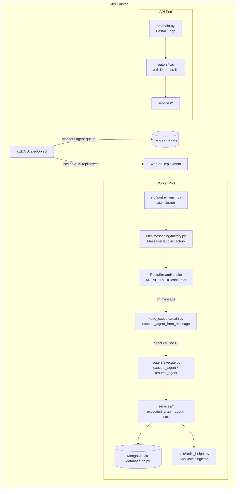
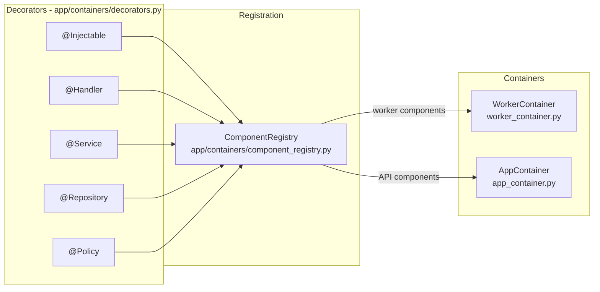
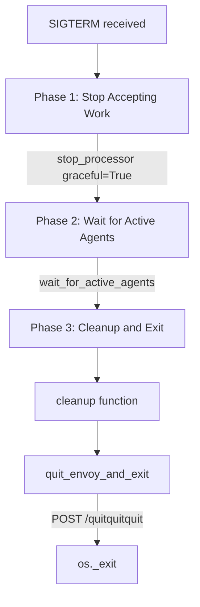
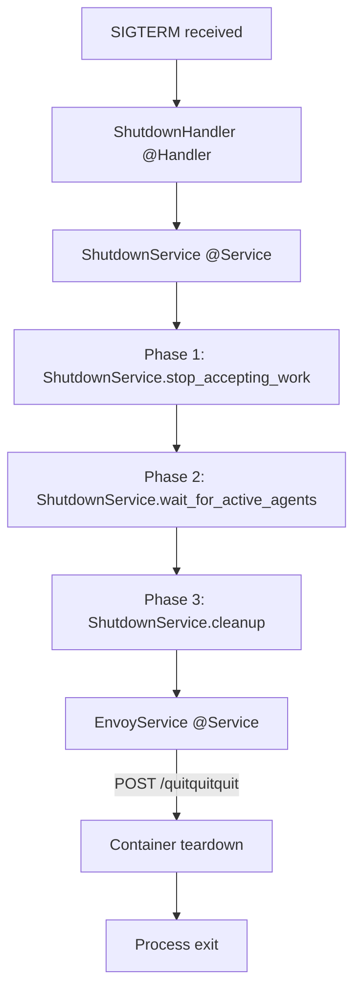
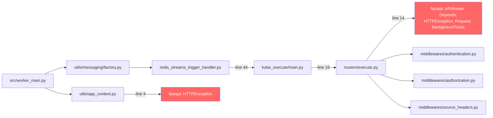
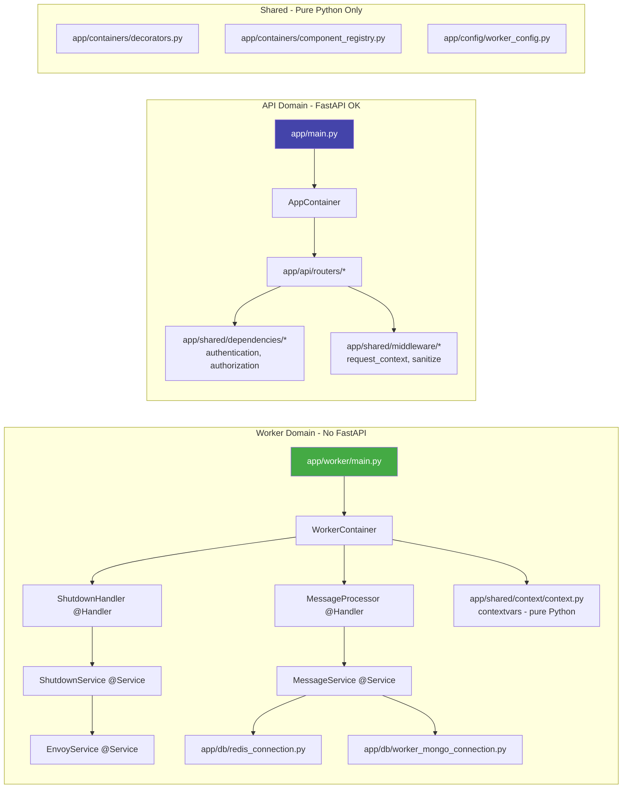
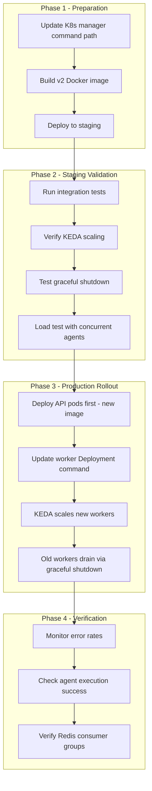

# V2 Worker Pod Changes — Comprehensive Reference

## 1. Overview

### Purpose

This document provides a **complete, detailed reference** of every change required for worker pods in the v2 architecture compared to v1. It covers entry points, dependency injection, messaging, database connections, configuration, context management, graceful shutdown, Kubernetes deployment, KEDA autoscaling, Dockerfile changes, import boundaries, and component lifecycle.

### Scope

- **V1 (main branch)**: Workers are plain Python asyncio scripts using Redis Streams + KEDA autoscaling. Workers do not use FastAPI but leak FastAPI imports through shared code paths.
- **V2 (v2 branch)**: Complete architectural rewrite with DI decorators (`@Handler`, `@Service`, `@Repository`, `@Policy`, `@Injectable`), the `dependency-injector` library, and strict import boundary enforcement between API and worker code.

### Audience

Backend engineers, DevOps engineers, and tech leads working on the api-graph service migration.

---

## 2. V1 Architecture Summary

### How Workers Work Today

V1 workers are standalone Python asyncio scripts that share code with the FastAPI API server. The worker entry point is [`src/worker_main.py`](src/worker_main.py) — a ~353-line script that:

1. Initializes telemetry, MongoDB, Redis, and a checkpointer
2. Creates a message handler via [`utils/messaging/factory.py`](utils/messaging/factory.py)
3. Starts the message processor loop
4. Handles SIGTERM/SIGINT for graceful shutdown with a 3-phase approach

The execution bridge [`kube_execute/main.py`](kube_execute/main.py) calls router functions from [`routers/execute.py`](routers/execute.py) directly — bypassing FastAPI's dependency injection by passing raw dicts instead of `Depends()` parameters.

### V1 Worker Architecture Diagram


```mermaid
graph TB
    subgraph K8s Cluster
        KEDA[KEDA ScaledObject] -->|monitors agent-queue| Redis[(Redis Streams)]
        KEDA -->|scales 3-15 replicas| WorkerDeploy[Worker Deployment]
        
        subgraph Worker Pod
            WM[src/worker_main.py<br/>asyncio.run] --> MF[utils/messaging/factory.py<br/>MessageHandlerFactory]
            MF --> RSH[RedisStreamHandler<br/>XREADGROUP consumer]
            RSH -->|on message| KE[kube_execute/main.py<br/>execute_agent_from_message]
            KE -->|direct call, no DI| RE[routers/execute.py<br/>execute_agent / resume_agent]
            RE --> SVC[services/*<br/>execution_graph, agent, etc.]
            SVC --> DB[(MongoDB via database/db.py)]
            SVC --> RedisHelper[utils/redis_helper.py<br/>AppState singleton]
        end
        
        subgraph API Pod
            FastAPI[src/main.py<br/>FastAPI app] --> Routers[routers/*.py<br/>with Depends DI]
            Routers --> SVC2[services/*]
        end
    end
```

### Key V1 Components

| Component | File | Description |
|-----------|------|-------------|
| Worker entry point | [`src/worker_main.py`](src/worker_main.py) | 353-line asyncio script, zero FastAPI app creation |
| Execution bridge | [`kube_execute/main.py`](kube_execute/main.py) | Calls [`routers/execute.py`](routers/execute.py) functions directly, bypasses FastAPI DI |
| Messaging factory | [`utils/messaging/factory.py`](utils/messaging/factory.py) | Maps `redis-streams` → `RedisStreamHandler`, `redis-queue` → `RedisQueueHandler` |
| Redis Streams handler | [`utils/messaging/redis_streams_trigger_handler.py`](utils/messaging/redis_streams_trigger_handler.py) | 1364-line handler with XADD/XREADGROUP, consumer groups, concurrent processing |
| Base handler | [`utils/messaging/base_handler.py`](utils/messaging/base_handler.py) | Abstract `EventDrivenMessageHandler` with `send_message`, `start_processor`, `stop_processor` |
| K8s manager | [`utils/k8s_manager.py`](utils/k8s_manager.py) | Creates worker Deployment with `command=["python", "-m", "src.worker_main"]` |
| Redis state | [`utils/redis_helper.py`](utils/redis_helper.py) | `AppState` singleton (`redis_state`) with pub/sub listener |
| MongoDB | [`database/db.py`](database/db.py) | `MongodbConfig` class with shared singleton connection |
| App context | [`utils/app_context.py`](utils/app_context.py) | Uses `HTTPException` from FastAPI — import leak |
| Config | [`config/constants.py`](config/constants.py) | 459-line file with `os.getenv()` calls for all settings |
| API entry point | [`src/main.py`](src/main.py) | FastAPI app with uvicorn, imports all routers |
| Dockerfile | [`Dockerfile`](Dockerfile) | Single image, `ENTRYPOINT ["/app/entrypoint.sh"]` |
| Entrypoint | [`entrypoint.sh`](entrypoint.sh) | Runs `uvicorn src.main:app` for API; workers override via K8s `command` |
| KEDA config | [`api-graph.yaml`](api-graph.yaml:158) | ScaledObject: `redis-streams` trigger, `agent-queue` stream, 3-15 replicas, 180s cooldown |

### V1 Import Chain Problem

Workers import [`routers/execute.py`](routers/execute.py:14) which imports:
```python
from fastapi import APIRouter, BackgroundTasks, Depends, HTTPException, Request
```

This means **every worker pod loads FastAPI, all middleware, all auth dependencies** — even though workers never serve HTTP requests. The [`utils/app_context.py`](utils/app_context.py:4) file also imports `HTTPException` directly.

---

## 3. V2 Architecture Summary

### How Workers Will Work

V2 workers use a dedicated `WorkerApplication` class with its own DI container that is completely separate from the FastAPI `AppContainer`. Workers never import FastAPI modules.

### V2 Worker Architecture Diagram

```mermaid
graph TB
    subgraph K8s Cluster
        KEDA[KEDA ScaledObject] -->|monitors agent-queue| Redis[(Redis Streams)]
        KEDA -->|scales 3-15 replicas| WorkerDeploy[Worker Deployment]
        
        subgraph Worker Pod - V2
            WM[app/worker/main.py<br/>WorkerApplication class] --> WC[app/containers/worker_container.py<br/>WorkerContainer - DI]
            WC -->|auto-discovers| CR[app/containers/component_registry.py<br/>ComponentRegistry]
            CR -->|scans @Handler @Service| Handlers[Worker Handlers]
            
            subgraph Handlers
                MP[message_processor.py<br/>@Handler]
                SH[shutdown_handler.py<br/>@Handler]
            end
            
            subgraph Services
                MS[message_service.py<br/>@Service]
                SS[shutdown_service.py<br/>@Service]
                ES[envoy_service.py<br/>@Service]
            end
            
            MP --> MS
            SH --> SS
            SS --> ES
            
            MS -->|Redis Streams| RDB[app/db/redis_connection.py]
            MS -->|MongoDB| MDB[app/db/worker_mongo_connection.py<br/>smaller pool, fail-fast]
        end
        
        subgraph API Pod - V2
            FastAPI[app/main.py<br/>FastAPI + AppContainer] --> Routers[app/api/routers/*<br/>@inject + Depends]
            Routers -->|Provide| AC[app/containers/app_container.py]
        end
    end
```

### V2 DI Decorator System


```mermaid
graph LR
    subgraph Decorators - app/containers/decorators.py
        Injectable["@Injectable"]
        Handler["@Handler"]
        Service["@Service"]
        Repository["@Repository"]
        Policy["@Policy"]
    end
    
    subgraph Registration
        CR[ComponentRegistry<br/>app/containers/component_registry.py]
    end
    
    subgraph Containers
        WC[WorkerContainer<br/>worker_container.py]
        AC[AppContainer<br/>app_container.py]
    end
    
    Injectable --> CR
    Handler --> CR
    Service --> CR
    Repository --> CR
    Policy --> CR
    
    CR -->|worker components| WC
    CR -->|API components| AC
```

### Key V2 Components

| Component | File | Description |
|-----------|------|-------------|
| Worker entry point | `app/worker/main.py` | `WorkerApplication` class with proper lifecycle management |
| Worker DI container | `app/containers/worker_container.py` | Separate from `AppContainer`, no FastAPI imports |
| DI decorators | `app/containers/decorators.py` | `@Injectable`, `@Handler`, `@Service`, `@Repository`, `@Policy` — pure Python, uses `inspect` |
| Component registry | `app/containers/component_registry.py` | Auto-discovers decorated classes at import time |
| Message processor | `app/core/worker/handlers/message_processor.py` | `@Handler` — processes Redis Stream messages |
| Shutdown handler | `app/core/worker/handlers/shutdown_handler.py` | `@Handler` — orchestrates graceful shutdown |
| Message service | `app/core/worker/services/message_service.py` | `@Service` — message parsing, routing, execution |
| Shutdown service | `app/core/worker/services/shutdown_service.py` | `@Service` — 3-phase shutdown logic |
| Envoy service | `app/core/worker/services/envoy_service.py` | `@Service` — Envoy sidecar quitquitquit coordination |
| Redis connection | `app/db/redis_connection.py` | Redis Stream consumer, replaces entire `utils/messaging/` module |
| Worker MongoDB | `app/db/worker_mongo_connection.py` | Worker-optimized: smaller pool, fail-fast settings |
| Worker config | `app/config/worker_config.py` | Pydantic `BaseSettings` with `WorkerConfig`, `ShutdownConfig`, `MessageProcessingConfig` |
| Context | `app/shared/context/context.py` | `contextvars.ContextVar` — pure Python, no FastAPI |
| API routers | `app/api/routers/` | Uses `@inject` + `Depends(Provide["..."])` — never imported by workers |
| API middleware | `app/shared/middleware/request_context.py` | API-only, never loaded by workers |
| Auth dependencies | `app/shared/dependencies/authentication.py` | API-only, never loaded by workers |

---

## 4. Detailed Change List

### 4.1 Entry Point Changes

| Aspect | V1 | V2 |
|--------|----|----|
| **File** | [`src/worker_main.py`](src/worker_main.py) | `app/worker/main.py` |
| **Pattern** | Procedural asyncio script with `asyncio.run(worker_main())` | `WorkerApplication` class with lifecycle methods |
| **Initialization** | Inline `setup_worker()` function at module level | DI container wiring via `WorkerContainer` |
| **Signal handling** | Global `signal_handler()` function with `shutdown_event` | Dedicated `ShutdownHandler` class with `@Handler` decorator |
| **K8s command** | `["python", "-m", "src.worker_main"]` | `["python", "-m", "app.worker.main"]` |
| **Lines of code** | ~353 lines in single file | Split across handler/service classes |

**V1 entry point pattern** ([`src/worker_main.py:337-352`](src/worker_main.py:337)):
```python
def main():
    try:
        asyncio.run(worker_main())
    except KeyboardInterrupt:
        os._exit(0)
    except Exception as e:
        os._exit(1)

if __name__ == "__main__":
    main()
```

**V2 entry point pattern** (`app/worker/main.py`):
```python
class WorkerApplication:
    def __init__(self, container: WorkerContainer):
        self.container = container
    
    async def start(self):
        # Container wiring handles all initialization
        ...
    
    async def shutdown(self):
        # Delegates to ShutdownHandler
        ...
```

### 4.2 DI / Decorator Changes

| Aspect | V1 | V2 |
|--------|----|----|
| **DI framework** | None — manual instantiation, global singletons | `dependency-injector` library with custom decorators |
| **Service discovery** | Explicit imports in each file | Auto-discovery via `ComponentRegistry` scanning `@Handler`, `@Service`, etc. |
| **Worker-API coupling** | Workers import router functions directly | Strict separation — `WorkerContainer` vs `AppContainer` |
| **FastAPI DI bypass** | [`kube_execute/main.py`](kube_execute/main.py:16) imports `execute_agent` from routers, passes raw dicts | Workers use `@Service` classes injected by `WorkerContainer` |

**V1 DI bypass** ([`kube_execute/main.py:114-121`](kube_execute/main.py:114)):
```python
# Directly calls FastAPI router function, bypassing Depends()
result = await execute_agent(
    id=agent_id,
    body=body,
    auth=auth,
    source=source,
    agent=agent,
    is_a2a_executor=is_a2a_executor,
)
```

**V2 DI approach** (`app/core/worker/services/message_service.py`):
```python
@Service
class MessageService:
    def __init__(self, execution_service: ExecutionService):
        self.execution_service = execution_service  # Injected by WorkerContainer
    
    async def process_message(self, message_data: MessageData):
        await self.execution_service.execute(message_data)
```

### 4.3 Messaging System Changes

| Aspect | V1 | V2 |
|--------|----|----|
| **Module** | [`utils/messaging/`](utils/messaging/) — 4 files, ~1600 lines total | `app/db/redis_connection.py` — consolidated |
| **Factory** | [`utils/messaging/factory.py`](utils/messaging/factory.py) — `MessageHandlerFactory` class | DI container provides Redis connection directly |
| **Base class** | [`utils/messaging/base_handler.py`](utils/messaging/base_handler.py) — `EventDrivenMessageHandler` ABC | Protocol-based or direct implementation |
| **Redis Streams** | [`utils/messaging/redis_streams_trigger_handler.py`](utils/messaging/redis_streams_trigger_handler.py) — 1364 lines | Simplified in `app/db/redis_connection.py` |
| **Redis Queue** | [`utils/messaging/redis_queue_handler.py`](utils/messaging/redis_queue_handler.py) | Removed or consolidated |
| **Consumer groups** | `XREADGROUP` with `consumer_group = f"{queue}-group"` | Same Redis Streams protocol, cleaner implementation |
| **Message routing** | `RedisStreamHandler` → `execute_agent_from_message()` | `MessageProcessor` `@Handler` → `MessageService` `@Service` |

**V1 message flow**:
```
RedisStreamHandler.start_processor()
  → XREADGROUP from agent-queue
  → execute_agent_from_message(message_data)
  → send_execution_request(...)
  → routers/execute.py::execute_agent(...)  # FastAPI function!
```

**V2 message flow**:
```
MessageProcessor.handle()          # @Handler
  → Redis XREADGROUP
  → MessageService.process()       # @Service, injected
  → ExecutionService.execute()     # @Service, no FastAPI imports
```

### 4.4 Database Connection Changes

| Aspect | V1 | V2 |
|--------|----|----|
| **MongoDB module** | [`database/db.py`](database/db.py) — `MongodbConfig` singleton | `app/db/worker_mongo_connection.py` — worker-optimized |
| **Connection pool** | Shared pool size (same as API) | Smaller pool for workers, fail-fast settings |
| **Initialization** | `await MongodbConfig.init_db()` in [`worker_main.py:100`](src/worker_main.py:100) | DI container initializes via `WorkerContainer` |
| **Checkpointer** | Manual `__aenter__`/`__aexit__` in [`worker_main.py:102-104`](src/worker_main.py:102) | Managed by DI container lifecycle |
| **Cleanup** | `MongodbConfig.close()` in cleanup function | Container teardown handles cleanup |

**V1 MongoDB init** ([`src/worker_main.py:99-106`](src/worker_main.py:99)):
```python
async def setup_worker():
    await MongodbConfig.init_db()
    if os.getenv("USE_PG_CHECKPOINTER").lower() != "true":
        mongodb_checkpointer = await MongodbConfig.get_checkpointer()
        checkpointer = await mongodb_checkpointer.__aenter__()
        set_checkpointer(checkpointer)
```

**V2 MongoDB** (`app/db/worker_mongo_connection.py`):
```python
# Worker-optimized MongoDB connection
# - Smaller connection pool (workers process fewer concurrent requests)
# - Fail-fast settings (workers should restart on DB failure)
# - Managed by WorkerContainer lifecycle
```

### 4.5 Configuration Changes

| Aspect | V1 | V2 |
|--------|----|----|
| **Config source** | [`config/constants.py`](config/constants.py) — 459 lines of `os.getenv()` calls | `app/config/worker_config.py` — Pydantic `BaseSettings` |
| **Validation** | None — raw string parsing | Pydantic validation with type coercion |
| **Structure** | Flat module-level constants | Structured classes: `WorkerConfig`, `ShutdownConfig`, `MessageProcessingConfig` |
| **ConfigMap files** | [`configmap/common.json`](configmap/common.json), [`configmap/configmap.json`](configmap/configmap.json) | Same ConfigMap files, consumed by Pydantic |
| **Worker-specific** | Mixed with API config in same file | Dedicated `worker_config.py` with worker-only settings |

**V1 config** ([`config/constants.py:40-45`](config/constants.py:40)):
```python
MESSAGING_PLATFORM = os.getenv("MESSAGING_PLATFORM", "redis-streams")
USE_EVENT_DRIVEN_SYSTEM = os.getenv("USE_EVENT_DRIVEN_SYSTEM", "true").lower() == "true"
MESSAGING_QUEUE_NAME = os.getenv("MESSAGING_QUEUE_NAME", "agent-queue")
WORKER_POD_MESSAGES_BATCH_SIZE = int(os.getenv("WORKER_POD_MESSAGES_BATCH_SIZE", "3"))
```

**V2 config** (`app/config/worker_config.py`):
```python
class MessageProcessingConfig(BaseSettings):
    messaging_platform: str = "redis-streams"
    queue_name: str = "agent-queue"
    batch_size: int = 3

class ShutdownConfig(BaseSettings):
    envoy_quit_urls: list[str] = [...]
    grace_period_buffer: int = 300

class WorkerConfig(BaseSettings):
    message_processing: MessageProcessingConfig
    shutdown: ShutdownConfig
```

### 4.6 Context Management Changes

| Aspect | V1 | V2 |
|--------|----|----|
| **Module** | [`utils/app_context.py`](utils/app_context.py) | `app/shared/context/context.py` |
| **Error handling** | `raise HTTPException(status_code=400, ...)` — FastAPI import leak | Pure Python exceptions, no FastAPI dependency |
| **Context propagation** | Logger context via [`models/logger.py`](models/logger.py) `get_logger_context()` | `contextvars.ContextVar` — thread/task-safe |
| **OTEL propagation** | Manual `TraceContextTextMapPropagator` in [`kube_execute/main.py:34`](kube_execute/main.py:34) | Integrated into DI-managed services |

**V1 context — FastAPI leak** ([`utils/app_context.py:4`](utils/app_context.py:4)):
```python
from fastapi import HTTPException  # ← Workers import this!

def get_app_context(auth, agent_id, agent_name, source):
    ...
    raise HTTPException(status_code=400, detail=f"Missing field: {field}")
```

**V2 context** (`app/shared/context/context.py`):
```python
import contextvars

# Pure Python — no FastAPI imports
request_context: contextvars.ContextVar[dict] = contextvars.ContextVar("request_context")
```

### 4.7 Graceful Shutdown Changes

| Aspect | V1 | V2 |
|--------|----|----|
| **Signal handling** | Global `signal_handler()` in [`worker_main.py:78-96`](src/worker_main.py:78) | `ShutdownHandler` `@Handler` class |
| **Phase 1** | `message_handler.stop_processor(graceful=True)` | `ShutdownService.stop_accepting_work()` |
| **Phase 2** | `message_handler.wait_for_active_agents(check_interval=30)` | `ShutdownService.wait_for_active_agents()` |
| **Phase 3** | `message_handler.graceful_shutdown_cleanup()` + `cleanup()` | `ShutdownService.cleanup()` + container teardown |
| **Envoy coordination** | Inline `quit_envoy_and_exit()` in [`worker_main.py:129-180`](src/worker_main.py:129) | Dedicated `EnvoyService` `@Service` class |
| **Exit strategy** | `os._exit(exit_code)` after 10s sleep | Managed by `EnvoyService` with configurable timing |

**V1 shutdown flow** ([`src/worker_main.py:249-324`](src/worker_main.py:249)):

```mermaid
graph TD
    SIGTERM[SIGTERM received] --> P1[Phase 1: Stop Accepting Work]
    P1 -->|stop_processor graceful=True| P2[Phase 2: Wait for Active Agents]
    P2 -->|wait_for_active_agents| P3[Phase 3: Cleanup and Exit]
    P3 --> Cleanup[cleanup function]
    Cleanup --> Envoy[quit_envoy_and_exit]
    Envoy -->|POST /quitquitquit| Exit[os._exit]
```

**V2 shutdown flow**:

```mermaid
graph TD
    SIGTERM[SIGTERM received] --> SH[ShutdownHandler @Handler]
    SH --> SS[ShutdownService @Service]
    SS --> P1[Phase 1: ShutdownService.stop_accepting_work]
    P1 --> P2[Phase 2: ShutdownService.wait_for_active_agents]
    P2 --> P3[Phase 3: ShutdownService.cleanup]
    P3 --> ES[EnvoyService @Service]
    ES -->|POST /quitquitquit| CT[Container teardown]
    CT --> Exit[Process exit]
```

### 4.8 K8s Deployment Changes

| Aspect | V1 | V2 |
|--------|----|----|
| **Deployment creation** | [`utils/k8s_manager.py:1091`](utils/k8s_manager.py:1091) `create_or_update_worker_deployment()` | Updated function with new command |
| **Container command** | `["python", "-m", "src.worker_main"]` | `["python", "-m", "app.worker.main"]` |
| **Container name** | `worker-container` | `worker-container` (unchanged) |
| **Image** | Same image as API (`AGENT_IMAGE`) | Same image as API (unchanged) |
| **PreStop hook** | `sleep 20` | `sleep 20` (unchanged) |
| **Grace period** | `MESSAGE_LOCK_DURATION + 300` seconds | Same formula (unchanged) |
| **Istio annotations** | `terminationDrainDuration`, `drainDuration` | Same annotations (unchanged) |
| **Deployment name** | `WORKER_DEPLOYMENT_NAME` env var (`api-graph-deployment`) | Same (unchanged) |
| **Env vars** | Passed from API pod env | Same mechanism (unchanged) |

**Critical change in** [`utils/k8s_manager.py:1126`](utils/k8s_manager.py:1126):
```python
# V1
command = ["python", "-m", "src.worker_main"]

# V2
command = ["python", "-m", "app.worker.main"]
```

### 4.9 KEDA / Autoscaling Changes

| Aspect | V1 | V2 |
|--------|----|----|
| **ScaledObject** | Defined in [`api-graph.yaml:158-174`](api-graph.yaml:158) | Same structure, verify trigger metadata |
| **Trigger type** | `redis-streams` | `redis-streams` (unchanged) |
| **Stream name** | `agent-queue` | `agent-queue` (unchanged) |
| **Consumer group** | `agent-queue-group` | `agent-queue-group` (unchanged) |
| **Min replicas** | 3 | 3 (unchanged) |
| **Max replicas** | 15 | 15 (unchanged) |
| **Cooldown** | 180s | 180s (unchanged) |
| **Polling interval** | 5s | 5s (unchanged) |
| **Pending entries count** | 2 | 2 (unchanged) |

**No KEDA config changes required** — the ScaledObject monitors the Redis stream independently of the worker implementation. The consumer group name must remain `agent-queue-group` to match.

### 4.10 Dockerfile / Entrypoint Changes

| Aspect | V1 | V2 |
|--------|----|----|
| **Dockerfile** | [`Dockerfile`](Dockerfile) — single stage build | Same Dockerfile, no changes needed |
| **ENTRYPOINT** | `["/app/entrypoint.sh"]` | `["/app/entrypoint.sh"]` (unchanged) |
| **API CMD** | `exec dumb-init uvicorn src.main:app --host 0.0.0.0 --port 8080` | `exec dumb-init uvicorn app.main:app --host 0.0.0.0 --port 8080` |
| **Worker CMD** | K8s `command` override: `["python", "-m", "src.worker_main"]` | K8s `command` override: `["python", "-m", "app.worker.main"]` |
| **HEALTHCHECK** | `curl --fail http://localhost:8080/health` | Same for API pods; workers don't serve HTTP |

**[`entrypoint.sh:113`](entrypoint.sh:113) change**:
```bash
# V1
exec dumb-init uvicorn src.main:app --host 0.0.0.0 --port 8080

# V2
exec dumb-init uvicorn app.main:app --host 0.0.0.0 --port 8080
```

### 4.11 Import Boundary Enforcement

This is the **most critical architectural change** in v2. V1 has no import boundaries — workers freely import FastAPI-dependent code.

#### V1 Import Chain (problematic)


```mermaid
graph LR
    WM[src/worker_main.py] --> MF[utils/messaging/factory.py]
    MF --> RSH[redis_streams_trigger_handler.py]
    RSH -->|line 44| KE[kube_execute/main.py]
    KE -->|line 16| RE[routers/execute.py]
    RE -->|line 14| FastAPI[fastapi: APIRouter, Depends,<br/>HTTPException, Request, BackgroundTasks]
    RE --> Auth[middlewares/authentication.py]
    RE --> Authz[middlewares/authorization.py]
    RE --> Source[middlewares/source_headers.py]
    
    WM --> AC[utils/app_context.py]
    AC -->|line 4| FastAPI2[fastapi: HTTPException]
    
    style FastAPI fill:#f66,color:#fff
    style FastAPI2 fill:#f66,color:#fff
```

#### V2 Import Boundary (enforced)


```mermaid
graph LR
    subgraph Worker Domain - No FastAPI
        WM[app/worker/main.py] --> WC[WorkerContainer]
        WC --> MP[MessageProcessor @Handler]
        WC --> SH[ShutdownHandler @Handler]
        MP --> MS[MessageService @Service]
        SH --> SS[ShutdownService @Service]
        SS --> ES[EnvoyService @Service]
        MS --> RC[app/db/redis_connection.py]
        MS --> MC[app/db/worker_mongo_connection.py]
        WC --> Ctx[app/shared/context/context.py<br/>contextvars - pure Python]
    end
    
    subgraph API Domain - FastAPI OK
        AM[app/main.py] --> AC[AppContainer]
        AC --> Routers[app/api/routers/*]
        Routers --> Deps[app/shared/dependencies/*<br/>authentication, authorization]
        Routers --> MW[app/shared/middleware/*<br/>request_context, sanitize]
    end
    
    subgraph Shared - Pure Python Only
        Decorators[app/containers/decorators.py]
        Registry[app/containers/component_registry.py]
        Config[app/config/worker_config.py]
    end
    
    style WM fill:#4a4,color:#fff
    style AM fill:#44a,color:#fff
```

**Rules**:
1. `app/core/worker/` — MUST NOT import from `app/api/`
2. `app/api/routers/` — MUST NOT be imported by worker code
3. `app/shared/` — MUST be pure Python (no FastAPI imports)
4. `app/shared/dependencies/` — API-only, uses `Depends()` from FastAPI
5. `app/shared/middleware/` — API-only, uses Starlette middleware

### 4.12 Removed Components (V1 → V2)

| V1 Component | File | Reason for Removal |
|--------------|------|--------------------|
| Messaging factory | [`utils/messaging/factory.py`](utils/messaging/factory.py) | Replaced by DI container providing Redis connection |
| Messaging base handler | [`utils/messaging/base_handler.py`](utils/messaging/base_handler.py) | Replaced by `@Handler` decorated classes |
| Redis Streams handler | [`utils/messaging/redis_streams_trigger_handler.py`](utils/messaging/redis_streams_trigger_handler.py) | Replaced by `app/db/redis_connection.py` + `MessageProcessor` |
| Redis Queue handler | [`utils/messaging/redis_queue_handler.py`](utils/messaging/redis_queue_handler.py) | Consolidated into new Redis module |
| Execution bridge | [`kube_execute/main.py`](kube_execute/main.py) | Replaced by `MessageService` `@Service` |
| App context (FastAPI) | [`utils/app_context.py`](utils/app_context.py) | Replaced by `app/shared/context/context.py` |
| Global `redis_state` | [`utils/redis_helper.py`](utils/redis_helper.py) | Replaced by DI-managed Redis connection |
| Shared `MongodbConfig` | [`database/db.py`](database/db.py) | Workers use `app/db/worker_mongo_connection.py` |

### 4.13 New Components (V2 only)

| Component | File | Decorator | Purpose |
|-----------|------|-----------|---------|
| `WorkerApplication` | `app/worker/main.py` | — | Worker lifecycle orchestrator |
| `WorkerContainer` | `app/containers/worker_container.py` | — | DI container for worker components |
| `ComponentRegistry` | `app/containers/component_registry.py` | — | Auto-discovers decorated classes |
| `MessageProcessor` | `app/core/worker/handlers/message_processor.py` | `@Handler` | Processes incoming Redis messages |
| `ShutdownHandler` | `app/core/worker/handlers/shutdown_handler.py` | `@Handler` | Orchestrates graceful shutdown |
| `MessageService` | `app/core/worker/services/message_service.py` | `@Service` | Message parsing and execution routing |
| `ShutdownService` | `app/core/worker/services/shutdown_service.py` | `@Service` | 3-phase shutdown logic |
| `EnvoyService` | `app/core/worker/services/envoy_service.py` | `@Service` | Envoy sidecar coordination |
| Worker MongoDB | `app/db/worker_mongo_connection.py` | — | Worker-optimized MongoDB connection |
| Worker Redis | `app/db/redis_connection.py` | — | Redis Stream consumer |
| `WorkerConfig` | `app/config/worker_config.py` | — | Pydantic settings for workers |
| Context vars | `app/shared/context/context.py` | — | Pure Python context propagation |

---

## 5. File-by-File Migration Map

### Worker-Specific Files

| V1 File | V2 Equivalent | Change Type |
|---------|---------------|-------------|
| [`src/worker_main.py`](src/worker_main.py) | `app/worker/main.py` | **Rewritten** — class-based with DI |
| [`kube_execute/main.py`](kube_execute/main.py) | `app/core/worker/services/message_service.py` | **Rewritten** — `@Service` with DI injection |
| [`utils/messaging/factory.py`](utils/messaging/factory.py) | `app/containers/worker_container.py` | **Replaced** — DI container handles wiring |
| [`utils/messaging/base_handler.py`](utils/messaging/base_handler.py) | `app/core/worker/handlers/message_processor.py` | **Replaced** — `@Handler` decorator |
| [`utils/messaging/redis_streams_trigger_handler.py`](utils/messaging/redis_streams_trigger_handler.py) | `app/db/redis_connection.py` | **Rewritten** — simplified Redis client |
| [`utils/messaging/redis_queue_handler.py`](utils/messaging/redis_queue_handler.py) | `app/db/redis_connection.py` | **Merged** into unified Redis module |

### Shared Files (used by both API and workers)

| V1 File | V2 Equivalent | Change Type |
|---------|---------------|-------------|
| [`utils/app_context.py`](utils/app_context.py) | `app/shared/context/context.py` | **Rewritten** — removed `HTTPException` |
| [`utils/redis_helper.py`](utils/redis_helper.py) | `app/db/redis_connection.py` | **Rewritten** — DI-managed |
| [`database/db.py`](database/db.py) | `app/db/worker_mongo_connection.py` (workers) | **Split** — separate worker connection |
| [`config/constants.py`](config/constants.py) | `app/config/worker_config.py` | **Rewritten** — Pydantic BaseSettings |
| [`models/logger.py`](models/logger.py) | Shared logging module | **Updated** — context via `contextvars` |

### API-Only Files (not imported by workers in V2)

| V1 File | V2 Equivalent | Notes |
|---------|---------------|-------|
| [`routers/execute.py`](routers/execute.py) | `app/api/routers/execute.py` | **Isolated** — workers never import this |
| [`middlewares/authentication.py`](middlewares/authentication.py) | `app/shared/dependencies/authentication.py` | **API-only** |
| [`middlewares/authorization.py`](middlewares/authorization.py) | `app/shared/dependencies/authorization.py` | **API-only** |
| [`middlewares/source_headers.py`](middlewares/source_headers.py) | `app/shared/dependencies/source_headers.py` | **API-only** |
| [`src/main.py`](src/main.py) | `app/main.py` | **API-only** — FastAPI app creation |

### Infrastructure Files

| V1 File | V2 Equivalent | Change Type |
|---------|---------------|-------------|
| [`utils/k8s_manager.py`](utils/k8s_manager.py) | Updated in-place | **Modified** — command path change |
| [`Dockerfile`](Dockerfile) | Updated in-place | **Modified** — entrypoint path change |
| [`entrypoint.sh`](entrypoint.sh) | Updated in-place | **Modified** — uvicorn module path |
| [`api-graph.yaml`](api-graph.yaml) | Updated in-place | **No change** — KEDA config unchanged |

---

## 6. Risks and Mitigations

### 6.1 Import Chain Leakage

| Risk | Impact | Mitigation |
|------|--------|------------|
| Worker code accidentally imports from `app/api/` | Workers load FastAPI, increasing memory and startup time | Add CI lint rule: `import-linter` or custom check that `app/core/worker/` never imports `app/api/` |
| Shared code in `app/shared/` imports FastAPI | Breaks worker isolation | Code review + automated import scanning in CI |
| Third-party library pulls in FastAPI transitively | Unexpected dependency | Pin dependencies, audit import chains with `pipdeptree` |

### 6.2 dependency-injector Overhead

| Risk | Impact | Mitigation |
|------|--------|------------|
| Container wiring adds startup latency | Slower worker cold starts | Benchmark container initialization; lazy wiring if needed |
| Circular dependency in DI graph | Runtime `DependencyError` | Unit test container wiring in isolation |
| `@Injectable` decorator conflicts with `__init__` signatures | Silent injection failures | Test all decorated classes with `container.check_dependencies()` |

### 6.3 KEDA Configuration Updates

| Risk | Impact | Mitigation |
|------|--------|------------|
| Consumer group name mismatch after migration | KEDA scales on wrong metric, workers starve | Verify `consumer_group` in v2 Redis code matches `agent-queue-group` in [`api-graph.yaml:169`](api-graph.yaml:169) |
| Stream name change | KEDA trigger stops working | Keep `agent-queue` as stream name |
| Pending entries count threshold | Over/under-scaling | Load test with v2 workers before production |

### 6.4 Shared Component Compatibility

| Risk | Impact | Mitigation |
|------|--------|------------|
| `MongodbConfig` singleton used by shared services | Workers and API fight over connection pool | Workers use dedicated `worker_mongo_connection.py` with separate pool |
| Redis pub/sub listener (`start_pod_listener`) | Workers need SSE routing via Redis pub/sub | Ensure `redis_connection.py` supports both Streams and pub/sub |
| Checkpointer initialization | LangGraph checkpointer must work without FastAPI | Test checkpointer with `WorkerContainer` in isolation |

### 6.5 Agent Execution Wiring

| Risk | Impact | Mitigation |
|------|--------|------------|
| V1 `execute_agent()` has 2960 lines of business logic | Must be callable without FastAPI `Request`, `BackgroundTasks` | Extract core logic into `@Service` classes that both API and worker can use |
| `BackgroundTasks` parameter in router functions | Workers pass `None` in v1; v2 must not need it | Use asyncio task sets instead of FastAPI `BackgroundTasks` |
| `Depends()` decorators on router function parameters | Cannot be called outside FastAPI request context | Move business logic to service layer, keep routers thin |

---

## 7. Testing Considerations

### 7.1 Unit Tests

| Test Area | What to Test | Priority |
|-----------|-------------|----------|
| `WorkerContainer` wiring | All dependencies resolve without errors | **Critical** |
| `MessageProcessor` handler | Message parsing, routing to correct action | **Critical** |
| `ShutdownHandler` | 3-phase shutdown sequence, timing | **High** |
| `MessageService` | Agent execution dispatch for START, RESUME, START_TEMP_AGENT | **Critical** |
| `EnvoyService` | quitquitquit HTTP call, timeout handling | **Medium** |
| `WorkerConfig` validation | Pydantic settings parse env vars correctly | **High** |
| Import boundary | No `app/api/` imports in `app/core/worker/` | **Critical** |

### 7.2 Integration Tests

| Test Area | What to Test | Priority |
|-----------|-------------|----------|
| Redis Streams consumer | XREADGROUP with consumer groups, message ACK | **Critical** |
| Worker MongoDB connection | Smaller pool, fail-fast behavior | **High** |
| End-to-end message flow | Send message → Redis → Worker → Agent execution | **Critical** |
| Graceful shutdown | SIGTERM → 3-phase shutdown → Envoy quit → exit | **Critical** |
| KEDA scaling | ScaledObject triggers on pending entries | **High** |

### 7.3 Import Boundary Tests

```python
# tests/test_import_boundaries.py
import importlib
import sys

def test_worker_does_not_import_fastapi():
    """Ensure worker code never imports FastAPI."""
    # Clear any cached imports
    modules_before = set(sys.modules.keys())
    
    importlib.import_module("app.worker.main")
    
    new_modules = set(sys.modules.keys()) - modules_before
    fastapi_modules = [m for m in new_modules if m.startswith("fastapi")]
    
    assert not fastapi_modules, f"Worker imported FastAPI modules: {fastapi_modules}"

def test_worker_does_not_import_api_routers():
    """Ensure worker code never imports API routers."""
    importlib.import_module("app.worker.main")
    
    api_modules = [m for m in sys.modules if m.startswith("app.api.")]
    assert not api_modules, f"Worker imported API modules: {api_modules}"
```

---

## 8. Deployment Considerations

### 8.1 Rolling Update Strategy


```mermaid
graph TD
    subgraph Phase 1 - Preparation
        A[Update K8s manager command path] --> B[Build v2 Docker image]
        B --> C[Deploy to staging]
    end
    
    subgraph Phase 2 - Staging Validation
        C --> D[Run integration tests]
        D --> E[Verify KEDA scaling]
        E --> F[Test graceful shutdown]
        F --> G[Load test with concurrent agents]
    end
    
    subgraph Phase 3 - Production Rollout
        G --> H[Deploy API pods first - new image]
        H --> I[Update worker Deployment command]
        I --> J[KEDA scales new workers]
        J --> K[Old workers drain via graceful shutdown]
    end
    
    subgraph Phase 4 - Verification
        K --> L[Monitor error rates]
        L --> M[Check agent execution success]
        M --> N[Verify Redis consumer groups]
    end
```

### 8.2 Backward Compatibility

| Concern | Strategy |
|---------|----------|
| **Redis Stream format** | Message format (`MessageData` schema) must remain identical between v1 and v2 |
| **Consumer group** | Must use same `agent-queue-group` name — KEDA monitors this |
| **MongoDB collections** | Same collections, same document schemas |
| **API contract** | API endpoints unchanged — only internal worker architecture changes |
| **Mixed fleet** | During rollout, v1 and v2 workers may coexist in same consumer group — this is safe because Redis Streams consumer groups handle this natively |

### 8.3 Rollback Plan

1. **Revert K8s command**: Change worker Deployment command back to `["python", "-m", "src.worker_main"]`
2. **KEDA**: No changes needed — ScaledObject config is unchanged
3. **Redis**: Consumer group is shared — v1 workers will resume consuming
4. **MongoDB**: No schema changes — v1 workers work with same data
5. **Docker image**: Keep v1 code in image during transition period (both `src/` and `app/` directories exist)

### 8.4 Monitoring Checklist

- [ ] Worker pod startup time (should not increase significantly)
- [ ] Memory usage per worker pod (should decrease — no FastAPI loaded)
- [ ] Agent execution success rate
- [ ] Redis Stream pending entries count
- [ ] Consumer group lag
- [ ] Graceful shutdown duration (3-phase timing)
- [ ] Envoy sidecar quit success rate
- [ ] MongoDB connection pool utilization
- [ ] DI container initialization time

---

## Appendix A: Environment Variables

### Worker-Relevant Environment Variables

| Variable | Default | Used By | Notes |
|----------|---------|---------|-------|
| `MESSAGING_PLATFORM` | `redis-streams` | Worker config | Determines message handler type |
| `MESSAGING_QUEUE_NAME` | `agent-queue` | Worker config | Redis Stream name |
| `WORKER_POD_MESSAGES_BATCH_SIZE` | `3` | Worker config | Concurrent message processing limit |
| `MESSAGE_LOCK_DURATION` | `2700` | Worker + K8s | Affects grace period calculation |
| `KEDA_MIN_REPLICAS` | `2` | K8s manager | Minimum worker replicas |
| `WORKER_DEPLOYMENT_NAME` | `api-graph-deployment` | K8s manager | Deployment resource name |
| `WORKER_POD_NAME` | Pod metadata | Worker identity | Set via K8s `fieldRef` |
| `REDIS_HOST` | — | Redis connection | Redis server address |
| `REDIS_PORT` | `6380` | Redis connection | Redis server port |
| `REDIS_PASSWORD` | — | Redis connection | From K8s secret |
| `REDIS_SSL_ENABLED` | `true` | Redis connection | TLS configuration |
| `MONGO_URI` | — | MongoDB connection | From K8s secret |
| `DB_DATABASE` | — | MongoDB connection | Database name |
| `USE_PG_CHECKPOINTER` | `true` | Checkpointer | PostgreSQL vs MongoDB checkpointer |
| `ENVOY_QUIT_URLS` | localhost variants | Shutdown | Envoy sidecar quit endpoints |

## Appendix B: Quick Reference — What Changes vs What Stays

### Changes ✏️

- Worker entry point: `src.worker_main` → `app.worker.main`
- API entry point: `src.main:app` → `app.main:app`
- DI system: None → `dependency-injector` + custom decorators
- Config: `os.getenv()` → Pydantic `BaseSettings`
- Context: `HTTPException` → `contextvars.ContextVar`
- MongoDB: Shared singleton → Worker-optimized connection
- Messaging: `utils/messaging/` module → `app/db/redis_connection.py` + DI handlers
- Execution bridge: `kube_execute/main.py` → `MessageService` `@Service`
- Import boundaries: None → Strict API/Worker separation

### Stays the Same ✅

- Docker image: Single image for API + workers
- KEDA ScaledObject configuration
- Redis Stream name: `agent-queue`
- Consumer group: `agent-queue-group`
- K8s Deployment pattern: command override for workers
- PreStop hook: `sleep 20`
- Grace period formula: `MESSAGE_LOCK_DURATION + 300`
- Istio/Envoy annotations
- MongoDB collections and document schemas
- API endpoint contracts
- 3-phase graceful shutdown approach
