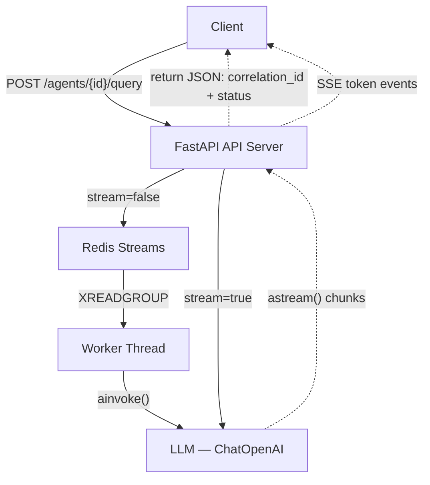
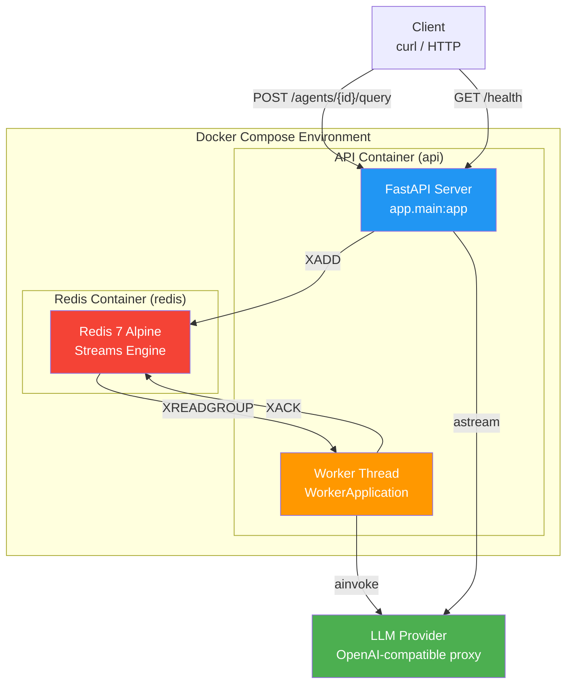
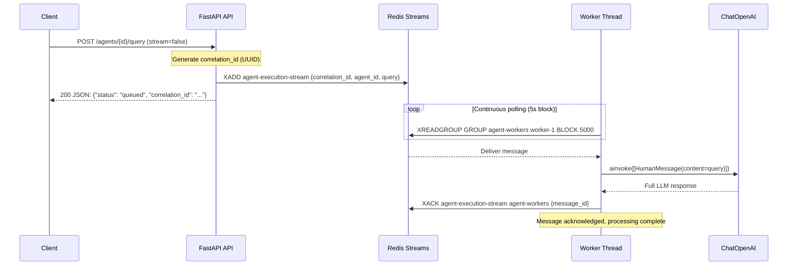
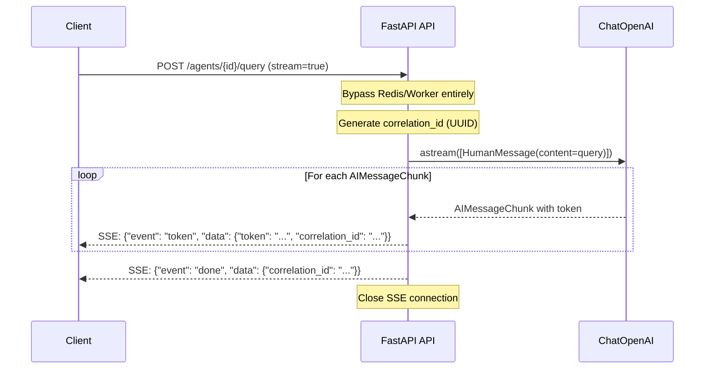

# Worker Execution POC

> Event-driven worker architecture with streaming support using **FastAPI**, **Redis Streams**, and **LangChain**

---

## Table of Contents

- [Overview](#overview)
- [Architecture](#architecture)
- [Project Structure](#project-structure)
- [Technology Stack](#technology-stack)
- [API Endpoints](#api-endpoints)
- [Configuration](#configuration)
- [How to Run](#how-to-run)
- [How It Works](#how-it-works)
- [Key Implementation Details](#key-implementation-details)
- [Test Results](#test-results)

---

## Overview

This **Proof of Concept** demonstrates an event-driven architecture for asynchronous agent execution with real-time streaming support. A single API endpoint supports two execution modes:

- **Non-streaming** (`stream: false`) — Fire-and-forget via Redis Streams. The API publishes a message, returns a `correlation_id` immediately, and a background worker processes the query asynchronously using `ChatOpenAI.ainvoke()`.
- **Streaming** (`stream: true`) — Direct SSE response. The API bypasses Redis/Worker entirely and invokes the LLM directly using `ChatOpenAI.astream()`, streaming tokens back to the client as Server-Sent Events.

### Key Goals

- Validate event-driven worker architecture with Redis Streams
- Demonstrate dual-mode execution (async worker vs. real-time streaming) from a single endpoint
- Prove out LangChain `ChatOpenAI` integration for both `ainvoke()` and `astream()`
- Establish patterns for future agent execution pipelines

---

## Architecture

### High-Level Architecture


```mermaid
flowchart TD
    Client[Client]
    API[FastAPI API Server]
    RedisStreams[Redis Streams]
    Worker[Worker Thread]
    LLM[LLM — ChatOpenAI]

    Client -- "POST /agents/{id}/query" --> API

    API -- "stream=false" --> RedisStreams
    RedisStreams -- "XREADGROUP" --> Worker
    Worker -- "ainvoke()" --> LLM
    API -. "return JSON: correlation_id + status" .-> Client

    API -- "stream=true" --> LLM
    LLM -. "astream() chunks" .-> API
    API -. "SSE token events" .-> Client
```

### Dual-Path Design

The system uses a **single endpoint** with a `stream` boolean flag to determine the execution path:

| Path | Flow | Use Case |
|------|------|----------|
| **Non-streaming** | Client → API → Redis Streams → Worker → LLM | Background/batch processing, async workflows |
| **Streaming** | Client → API → LLM (direct) → SSE tokens → Client | Interactive UIs, real-time chat |

### Component Diagram


```mermaid
graph TB
    subgraph "Docker Compose Environment"
        subgraph "API Container (api)"
            A[FastAPI Server<br/>app.main:app]
            B[Worker Thread<br/>WorkerApplication]
        end

        subgraph "Redis Container (redis)"
            C[Redis 7 Alpine<br/>Streams Engine]
        end
    end

    D[Client<br/>curl / HTTP] -->|"POST /agents/{id}/query"| A
    D -->|"GET /health"| A
    A -->|XADD| C
    C -->|XREADGROUP| B
    B -->|XACK| C
    B -->|ainvoke| E[LLM Provider<br/>OpenAI-compatible proxy]
    A -->|astream| E

    style A fill:#2196F3,color:#fff
    style B fill:#FF9800,color:#fff
    style C fill:#f44336,color:#fff
    style E fill:#4CAF50,color:#fff
```

---

## Project Structure

```
woker-execution-poc/
├── app/
│   ├── __init__.py              # Package initializer
│   ├── main.py                  # FastAPI app, lifespan, endpoints, SSE streaming
│   ├── config.py                # Settings via pydantic-settings (env vars)
│   ├── models.py                # Request/Response Pydantic models
│   ├── redis_client.py          # Redis Streams wrapper (XADD, XREADGROUP, XACK)
│   ├── worker.py                # Background worker — consumes messages, invokes LLM
│   └── agent_handler.py         # LLM invocation (ainvoke + astream) via ChatOpenAI
├── Dockerfile                   # Python 3.11-slim container image
├── docker-compose.yml           # Redis + API service orchestration
├── requirements.txt             # Python dependencies
├── .env                         # Environment configuration (not committed)
└── README.md                    # This document
```

### File Descriptions

| File | Purpose |
|------|---------|
| [`app/main.py`](app/main.py) | FastAPI application with `lifespan` context manager. Connects to Redis on startup, spawns worker as daemon thread. Exposes `POST /agents/{agent_id}/query` (with stream branching) and `GET /health`. Contains `_handle_streaming_request()` for SSE streaming via `StreamingResponse`. |
| [`app/config.py`](app/config.py) | Uses `pydantic-settings` `BaseSettings` to load configuration from environment variables and `.env` file. Defines LLM, Redis, streaming, and server configuration fields. |
| [`app/models.py`](app/models.py) | Pydantic v2 models: `AgentExecutionRequest` (with `query`, optional `conversation_id`, and `stream` flag) and `AgentExecutionResponse` (with `status`, `correlation_id`, `message`). |
| [`app/redis_client.py`](app/redis_client.py) | `RedisStreamClient` class wrapping async Redis operations: `connect()` (with consumer group creation via `MKSTREAM`), `publish_message()` (XADD), `start_processing()` (XREADGROUP loop with 5s block timeout), `acknowledge_message()` (XACK), `stop_processing()`, and `close()`. |
| [`app/worker.py`](app/worker.py) | `WorkerApplication` class that initializes its own `RedisStreamClient` and `ExecuteAgentHandler`, then runs the consume loop. The `_process_message()` callback invokes the LLM via `ainvoke()` and acknowledges the message. |
| [`app/agent_handler.py`](app/agent_handler.py) | `ExecuteAgentHandler` class that creates a `ChatOpenAI` instance. Provides `handle()` for synchronous invocation via `ainvoke()` and `handle_stream()` as an async generator via `astream()`. |
| [`Dockerfile`](Dockerfile) | Single-stage build using `python:3.11-slim`. Installs dependencies, copies source, runs Uvicorn with `--reload`. |
| [`docker-compose.yml`](docker-compose.yml) | Two services: `redis` (Redis 7 Alpine with health check) and `api` (built from Dockerfile, depends on healthy Redis). Mounts source for live reload. |
| [`requirements.txt`](requirements.txt) | Python package dependencies with minimum version constraints. |

---

## Technology Stack

| Component | Technology | Version / Details |
|-----------|-----------|-------------------|
| Language | Python | 3.11 |
| Web Framework | FastAPI + Uvicorn | FastAPI ≥0.104.0, Uvicorn ≥0.24.0 |
| Message Broker | Redis Streams | Redis 7 Alpine |
| LLM Integration | LangChain | langchain-openai ≥0.1.0, langchain-core ≥0.2.0 |
| LLM Provider | OpenAI-compatible proxy | Configurable via `OPENAI_BASE_URL` |
| Streaming | SSE (Server-Sent Events) | FastAPI `StreamingResponse` + sse-starlette ≥1.6.0 |
| Containerization | Docker + Docker Compose | Compose v3.8 |
| Data Validation | Pydantic v2 | pydantic ≥2.0.0, pydantic-settings ≥2.0.0 |
| Async Redis Client | redis-py (async) | redis ≥5.0.0 |

---

## API Endpoints

### `POST /agents/{agent_id}/query`

Single endpoint with behavior determined by the `stream` flag.

**Path Parameters:**

| Parameter | Type | Description |
|-----------|------|-------------|
| `agent_id` | `string` | Identifier for the agent to execute |

**Request Body** ([`AgentExecutionRequest`](app/models.py:5)):

```json
{
    "query": "What is the capital of France?",
    "conversation_id": "optional-session-id",
    "stream": false
}
```

| Field | Type | Required | Default | Description |
|-------|------|----------|---------|-------------|
| `query` | `string` | ✅ Yes | — | The user query to send to the LLM |
| `conversation_id` | `string` | ❌ No | `null` | Optional conversation/session identifier |
| `stream` | `boolean` | ❌ No | `false` | When `true`, returns SSE streaming response |

#### Response — Non-Streaming (`stream: false`)

**Content-Type:** `application/json`

```json
{
    "status": "queued",
    "correlation_id": "550e8400-e29b-41d4-a716-446655440000",
    "message": "Query queued for agent test-agent"
}
```

| Field | Type | Description |
|-------|------|-------------|
| `status` | `string` | Always `"queued"` — message published to Redis Streams |
| `correlation_id` | `string` | UUID v4 for tracking this execution request |
| `message` | `string` | Human-readable confirmation |

#### Response — Streaming (`stream: true`)

**Content-Type:** `text/event-stream`

**Headers:**
```
Cache-Control: no-cache
Connection: keep-alive
X-Accel-Buffering: no
```

**SSE Event Format:**

Each SSE event is a JSON object in the `data` field with an `event` type and a `data` payload:

| Event Type | Description | Data Payload | Terminal? |
|------------|-------------|-------------|-----------|
| `token` | Single LLM token | `{"token": "...", "correlation_id": "..."}` | No |
| `done` | Stream complete | `{"correlation_id": "..."}` | Yes |
| `error` | Processing error | `{"message": "...", "correlation_id": "..."}` | Yes |

**Example SSE Stream:**

```
data: {"event": "token", "data": {"token": "The", "correlation_id": "abc-123"}}

data: {"event": "token", "data": {"token": " capital", "correlation_id": "abc-123"}}

data: {"event": "token", "data": {"token": " of", "correlation_id": "abc-123"}}

data: {"event": "token", "data": {"token": " France", "correlation_id": "abc-123"}}

data: {"event": "token", "data": {"token": " is", "correlation_id": "abc-123"}}

data: {"event": "token", "data": {"token": " Paris", "correlation_id": "abc-123"}}

data: {"event": "token", "data": {"token": ".", "correlation_id": "abc-123"}}

data: {"event": "done", "data": {"correlation_id": "abc-123"}}

```

#### Example curl Commands

**Non-streaming:**

```bash
curl -X POST http://localhost:8000/agents/test-agent/query \
  -H "Content-Type: application/json" \
  -d '{"query": "What is the capital of France?"}'
```

**Streaming:**

```bash
curl -N -X POST http://localhost:8000/agents/test-agent/query \
  -H "Content-Type: application/json" \
  -d '{"query": "What is the capital of France?", "stream": true}'
```

> **Note:** The `-N` flag disables output buffering, which is required to see SSE events in real time.

---

### `GET /health`

Simple health check endpoint.

**Response (200 OK):**

```json
{"status": "healthy"}
```

---

## Configuration

All configuration is managed via environment variables, loaded through [`pydantic-settings`](app/config.py). Values can be set in a `.env` file or passed directly as environment variables.

### LLM Configuration

| Variable | Default | Description |
|----------|---------|-------------|
| `OPENAI_API_KEY` | `""` (empty) | API key for the OpenAI-compatible LLM proxy |
| `OPENAI_BASE_URL` | `https://ps.sapientslingshot.com/api/v1/llm` | Base URL for the LLM proxy endpoint |
| `OPENAI_MODEL` | `gpt-4o-mini` | Model name to use for LLM invocations |

### Redis Configuration

| Variable | Default | Description |
|----------|---------|-------------|
| `REDIS_HOST` | `redis` | Redis server hostname (Docker service name) |
| `REDIS_PORT` | `6379` | Redis server port |
| `REDIS_PASSWORD` | `""` (empty) | Redis authentication password (optional) |
| `REDIS_STREAM_NAME` | `agent-execution-stream` | Redis Stream key for message publishing and consumption |
| `REDIS_CONSUMER_GROUP` | `agent-workers` | Consumer group name for XREADGROUP operations |
| `REDIS_CONSUMER_NAME` | `worker-1` | Consumer name within the consumer group |

### Streaming Configuration

| Variable | Default | Description |
|----------|---------|-------------|
| `SSE_STREAM_TIMEOUT` | `300` | Maximum SSE connection duration in seconds |
| `SSE_HEARTBEAT_INTERVAL` | `15` | Heartbeat interval in seconds |
| `REDIS_PUBSUB_CHANNEL_PREFIX` | `stream` | Pub/Sub channel prefix (reserved for future use) |
| `RESULT_CACHE_TTL` | `300` | TTL for cached results in seconds (reserved for future use) |

### Server Configuration

| Variable | Default | Description |
|----------|---------|-------------|
| `LOCAL_SERVER` | `true` | When `true`, spawns the worker as a daemon thread within the API process. When `false`, the worker is not spawned (intended for separate deployment, e.g., Kubernetes pod). |

---

## How to Run

### Prerequisites

- **Docker** and **Docker Compose** installed
- A valid **API key** for the LLM proxy (OpenAI-compatible endpoint)

### Step 1: Create `.env` file

```bash
# .env
OPENAI_API_KEY=your-api-key-here
OPENAI_BASE_URL=https://ps.sapientslingshot.com/api/v1/llm
OPENAI_MODEL=gpt-4o-mini
```

### Step 2: Build and start services

```bash
docker compose up --build
```

This starts two containers:
- **redis** — Redis 7 Alpine with health check
- **api** — FastAPI server with embedded worker thread

You should see output similar to:

```
api-1  | INFO | app.main | Redis client connected (API)
api-1  | INFO | app.redis_client | Connected to Redis at redis:6379
api-1  | INFO | app.redis_client | Consumer group 'agent-workers' already exists on stream 'agent-execution-stream'
api-1  | INFO | app.main | Worker thread started
api-1  | INFO | app.worker | Worker setup complete
api-1  | INFO | app.worker | Worker starting — consuming from stream 'agent-execution-stream' as 'worker-1' in group 'agent-workers'
```

### Step 3: Test the endpoints

**Health check:**

```bash
curl http://localhost:8000/health
# {"status":"healthy"}
```

**Non-streaming query:**

```bash
curl -X POST http://localhost:8000/agents/test-agent/query \
  -H "Content-Type: application/json" \
  -d '{"query": "What is the capital of France?"}'
# {"status":"queued","correlation_id":"af648ad9-...","message":"Query queued for agent test-agent"}
```

**Streaming query:**

```bash
curl -N -X POST http://localhost:8000/agents/test-agent/query \
  -H "Content-Type: application/json" \
  -d '{"query": "What is the capital of France?", "stream": true}'
# data: {"event": "token", "data": {"token": "The", "correlation_id": "..."}}
# data: {"event": "token", "data": {"token": " capital", "correlation_id": "..."}}
# ...
# data: {"event": "done", "data": {"correlation_id": "..."}}
```

### Step 4: Stop services

```bash
docker compose down        # Stop containers
docker compose down -v     # Stop containers and remove Redis data volume
```

---

## How It Works

### Non-Streaming Flow (Fire-and-Forget via Redis Streams)

1. Client sends `POST /agents/{agent_id}/query` with `stream: false` (or omitted)
2. API generates a UUID `correlation_id`
3. API publishes the message to Redis Streams via `XADD`
4. API returns immediately with `{"status": "queued", "correlation_id": "..."}`
5. Worker thread (polling via `XREADGROUP` with 5s block timeout) picks up the message
6. Worker invokes `ChatOpenAI.ainvoke()` with the query
7. Worker acknowledges the message via `XACK`


```mermaid
sequenceDiagram
    participant C as Client
    participant API as FastAPI API
    participant RS as Redis Streams
    participant W as Worker Thread
    participant LLM as ChatOpenAI

    C->>API: POST /agents/{id}/query (stream=false)
    Note over API: Generate correlation_id (UUID)
    API->>RS: XADD agent-execution-stream {correlation_id, agent_id, query}
    API-->>C: 200 JSON: {"status": "queued", "correlation_id": "..."}

    loop Continuous polling (5s block)
        W->>RS: XREADGROUP GROUP agent-workers worker-1 BLOCK 5000
    end

    RS-->>W: Deliver message
    W->>LLM: ainvoke([HumanMessage(content=query)])
    LLM-->>W: Full LLM response
    W->>RS: XACK agent-execution-stream agent-workers {message_id}
    Note over W: Message acknowledged, processing complete
```

### Streaming Flow (Direct SSE via LangChain astream)

1. Client sends `POST /agents/{agent_id}/query` with `stream: true`
2. API **bypasses Redis/Worker entirely**
3. API creates an `ExecuteAgentHandler` and calls `handle_stream()`
4. `handle_stream()` invokes `ChatOpenAI.astream()` which yields `AIMessageChunk` objects
5. Each chunk's content is wrapped in an SSE event and streamed to the client
6. On completion, a `done` event is sent and the connection closes
7. On error, an `error` event is sent and the connection closes


```mermaid
sequenceDiagram
    participant C as Client
    participant API as FastAPI API
    participant LLM as ChatOpenAI

    C->>API: POST /agents/{id}/query (stream=true)
    Note over API: Bypass Redis/Worker entirely
    Note over API: Generate correlation_id (UUID)
    API->>LLM: astream([HumanMessage(content=query)])

    loop For each AIMessageChunk
        LLM-->>API: AIMessageChunk with token
        API-->>C: SSE: {"event": "token", "data": {"token": "...", "correlation_id": "..."}}
    end

    API-->>C: SSE: {"event": "done", "data": {"correlation_id": "..."}}
    Note over API: Close SSE connection
```

---

## Key Implementation Details

### Redis Streams Consumer Group Pattern

The worker uses Redis Streams consumer groups for reliable message processing. The [`RedisStreamClient`](app/redis_client.py:8) class encapsulates all Redis operations:

```python
# Consumer group creation with MKSTREAM (auto-creates stream)
await self._redis.xgroup_create(
    name=stream_name, groupname=group_name, id="0", mkstream=True
)

# Consume loop with 5-second block timeout
while self._processing:
    messages = await self._redis.xreadgroup(
        groupname=group_name,
        consumername=consumer_name,
        streams={stream_name: ">"},
        count=1,
        block=5000,
    )
    if not messages:
        continue
    for stream, stream_messages in messages:
        for message_id, message_data in stream_messages:
            await callback(message_id, message_data)
```

| Operation | Redis Command | Method | Description |
|-----------|--------------|--------|-------------|
| Publish | `XADD` | [`publish_message()`](app/redis_client.py:53) | Appends message to stream |
| Consume | `XREADGROUP` | [`start_processing()`](app/redis_client.py:67) | Reads new messages with block timeout |
| Acknowledge | `XACK` | [`acknowledge_message()`](app/redis_client.py:126) | Marks message as processed |
| Create Group | `XGROUP CREATE` | [`connect()`](app/redis_client.py:15) | Creates consumer group with MKSTREAM |

### LangChain ChatOpenAI Integration

The [`ExecuteAgentHandler`](app/agent_handler.py:9) provides two invocation modes:

```python
class ExecuteAgentHandler:
    def __init__(self):
        self.llm = ChatOpenAI(
            base_url=settings.OPENAI_BASE_URL,
            api_key=settings.OPENAI_API_KEY,
            model=settings.OPENAI_MODEL,
            temperature=0.7,
        )

    # Non-streaming: used by Worker
    async def handle(self, query: str, agent_id: str) -> str:
        messages = [HumanMessage(content=query)]
        response = await self.llm.ainvoke(messages)
        return response.content

    # Streaming: used by API endpoint directly
    async def handle_stream(self, query: str, agent_id: str):
        messages = [HumanMessage(content=query)]
        async for chunk in self.llm.astream(messages):
            if chunk.content:
                yield chunk.content
```

- **`ainvoke()`** — Returns the complete response at once. Used by the Worker for async processing.
- **`astream()`** — Yields `AIMessageChunk` objects as they arrive. Used by the API for SSE streaming.

### SSE Event Formatting

The streaming endpoint in [`_handle_streaming_request()`](app/main.py:103) wraps each token in a JSON SSE event:

```python
async def event_generator():
    full_response = ""
    token_count = 0
    try:
        async for token in agent_handler.handle_stream(query=request.query, agent_id=agent_id):
            full_response += token
            token_count += 1
            event_data = json.dumps({
                "event": "token",
                "data": {"token": token, "correlation_id": correlation_id},
            })
            yield f"data: {event_data}\n\n"

        # Completion event
        done_data = json.dumps({"event": "done", "data": {"correlation_id": correlation_id}})
        yield f"data: {done_data}\n\n"

    except Exception as exc:
        error_data = json.dumps({"event": "error", "data": {"message": str(exc), "correlation_id": correlation_id}})
        yield f"data: {error_data}\n\n"

return StreamingResponse(event_generator(), media_type="text/event-stream", headers={...})
```

### Worker Thread Lifecycle

The [`lifespan()`](app/main.py:27) context manager manages the worker:

1. **Startup** — Connects to Redis, spawns worker in a daemon thread with its own event loop
2. **Running** — Worker continuously polls Redis Streams via `XREADGROUP`
3. **Shutdown** — Closes the API Redis connection; daemon thread terminates with the process

```python
@asynccontextmanager
async def lifespan(app: FastAPI):
    await redis_client.connect(...)
    if settings.LOCAL_SERVER:
        worker = WorkerApplication()
        worker_thread = threading.Thread(target=run_worker, daemon=True)
        worker_thread.start()
    yield
    await redis_client.close()
```

---

## Test Results

### Verified Test Results

| Test | Status | Details |
|------|--------|---------|
| Docker Compose build | ✅ Pass | Both `redis` and `api` containers built and started |
| Redis health check | ✅ Pass | Redis responds to `PING` within health check interval |
| Worker thread startup | ✅ Pass | Worker spawned as daemon thread, connected to Redis, consuming from stream |
| Health endpoint | ✅ Pass | `GET /health` returns `{"status": "healthy"}` |
| Non-streaming query | ✅ Pass | Returns `{"status": "queued", "correlation_id": "..."}` |
| Worker processing | ✅ Pass | Message consumed via XREADGROUP, LLM invoked, XACK successful |
| Streaming query | ✅ Pass | SSE tokens received in real time |
| Message acknowledgment | ✅ Pass | 0 pending messages after processing |

### Sample Non-Streaming Output

```
$ curl -X POST http://localhost:8000/agents/test-agent/query \
    -H "Content-Type: application/json" \
    -d '{"query": "What is the capital of France?"}'

{"status":"queued","correlation_id":"af648ad9-e5f6-7890-abcd-ef1234567890","message":"Query queued for agent test-agent"}
```

Worker logs:
```
api-1  | INFO | app.redis_client | Received message 1710... from stream 'agent-execution-stream'
api-1  | INFO | app.worker | Processing message 1710... | correlation_id=af648ad9-... | agent_id=test-agent
api-1  | INFO | app.agent_handler | Executing agent test-agent with query: What is the capital of France?
api-1  | INFO | app.agent_handler | Agent test-agent response: The capital of France is Paris....
api-1  | INFO | app.worker | Successfully processed message 1710... | correlation_id=af648ad9-... | result_length=35
api-1  | INFO | app.redis_client | Acknowledged message 1710...
```

### Sample Streaming Output

```
$ curl -N -X POST http://localhost:8000/agents/test-agent/query \
    -H "Content-Type: application/json" \
    -d '{"query": "What is the capital of France?", "stream": true}'

data: {"event": "token", "data": {"token": "The", "correlation_id": "b2c3d4e5-..."}}

data: {"event": "token", "data": {"token": " capital", "correlation_id": "b2c3d4e5-..."}}

data: {"event": "token", "data": {"token": " of", "correlation_id": "b2c3d4e5-..."}}

data: {"event": "token", "data": {"token": " France", "correlation_id": "b2c3d4e5-..."}}

data: {"event": "token", "data": {"token": " is", "correlation_id": "b2c3d4e5-..."}}

data: {"event": "token", "data": {"token": " Paris", "correlation_id": "b2c3d4e5-..."}}

data: {"event": "token", "data": {"token": ".", "correlation_id": "b2c3d4e5-..."}}

data: {"event": "done", "data": {"correlation_id": "b2c3d4e5-..."}}

```

---

> **Status:** ✅ POC Complete — All tests passing | **Last Updated:** March 2026
