# Hybrid Worker Pod Scaling Architecture

**Status:** Proposed — Pending Team Review
**Date:** 2026-03-30
**Author:** Architecture Team

---

## 1. Problem Statement

Worker pod scaling via KEDA is currently triggered **solely by Redis Stream queue depth** (`pendingEntriesCount`), failing to account for the actual CPU/memory utilization of running pods. Conversely, standard HPA cannot be used in isolation because it relies entirely on resource utilization metrics — it has no awareness of application-level capacity limits (the fixed small/medium/large resource tiers), so new requests continue to be routed to pods already experiencing a resource crunch, leading to blocked requests and systemic bottlenecks.

### Current Architecture Gaps

| Scaling Mechanism | What It Sees | What It Misses |
|---|---|---|
| **KEDA (queue-based)** | Pending message count in Redis Stream | Pod CPU/memory exhaustion — keeps routing to overloaded pods |
| **HPA (resource-based)** | Average CPU/memory across deployment | Application-level capacity — no concept of per-pod message slots or hard tier limits |

### Impact

- **Blocked requests**: Exhausted pods continue pulling messages they cannot process efficiently
- **Cascading latency**: Agent executions on overloaded pods take longer, holding message locks and delaying downstream work
- **Wasted scale-up**: KEDA may not scale up because queue depth looks manageable, even though existing pods are resource-starved

---

## 2. Current Architecture

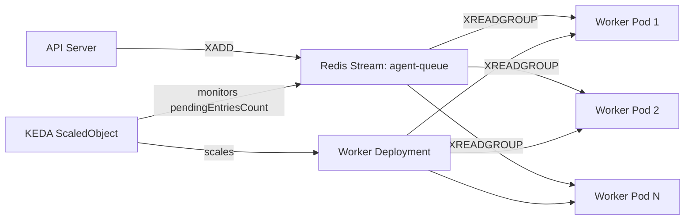
```mermaid
flowchart LR
    A[API Server] -->|XADD| B[Redis Stream: agent-queue]
    B -->|XREADGROUP| C[Worker Pod 1]
    B -->|XREADGROUP| D[Worker Pod 2]
    B -->|XREADGROUP| E[Worker Pod N]

    F[KEDA ScaledObject] -->|monitors pendingEntriesCount| B
    F -->|scales| G[Worker Deployment]
    G --> C
    G --> D
    G --> E
```

### Key Components

- **KEDA ScaledObject**: Polls Redis Stream every 5s, scales between 5–50 replicas based on `pendingEntriesCount: 2` — see [`keda` config](utils/api-graph-depolyment-sample.yaml:139)
- **Worker Deployment**: Created via [`create_or_update_worker_deployment()`](utils/k8s_manager.py:1092) with resource limits defined in the K8s manifest
- **Resource Limits**: CPU and memory requests/limits are set in the K8s Deployment manifest (or via environment variables injected by the Downward API). The application reads these values at runtime — there are no hardcoded size tiers in the application logic.
- **Slot-based concurrency**: Each worker processes up to [`WORKER_POD_MESSAGES_BATCH_SIZE`](config/settings/messaging.py:13) concurrent messages (default: 3)
- **Slot calculation** in [`_calculate_available_slots()`](utils/messaging/redis_streams_trigger_handler.py:1048): `available_slots = batch_size - active_task_count`

### The Routing Problem

Redis Streams consumer groups distribute messages to whichever consumer calls `XREADGROUP`. The current slot calculator only considers **active task count** — it has no visibility into whether the pod's CPU or memory is saturated. A pod at 95% CPU with 1 free slot will still pull a new message.

---

## 3. Proposed Architecture

The solution combines **two complementary mechanisms** operating at different layers:

1. **Infrastructure Layer — KEDA Composite Triggers**: Scale the deployment based on the MAX of queue depth, CPU utilization, and memory utilization
2. **Application Layer — Resource-Aware Back-Pressure**: Each worker pod monitors its own resource usage and dynamically reduces its consumption rate when under pressure

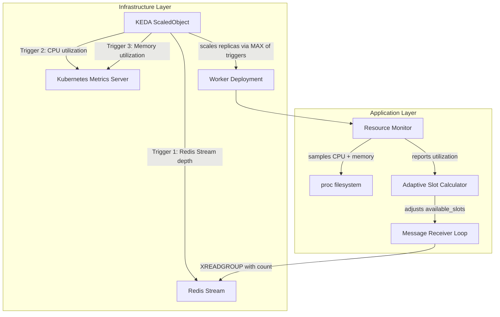
```mermaid
flowchart TB
    subgraph Infrastructure Layer
        K[KEDA ScaledObject] -->|Trigger 1: Redis Stream depth| RS[Redis Stream]
        K -->|Trigger 2: CPU utilization| MS[Kubernetes Metrics Server]
        K -->|Trigger 3: Memory utilization| MS
        K -->|scales replicas via MAX of triggers| WD[Worker Deployment]
    end

    subgraph Application Layer
        RM[Resource Monitor] -->|samples CPU + memory| PROC[proc filesystem]
        RM -->|reports utilization| ASC[Adaptive Slot Calculator]
        ASC -->|adjusts available_slots| MRL[Message Receiver Loop]
        MRL -->|XREADGROUP with count| RS
    end

    WD --> RM
```

### 3.1 KEDA Composite Triggers (Infrastructure Layer)

KEDA supports multiple triggers per ScaledObject and uses the **maximum** replica count across all triggers. By adding CPU and memory triggers alongside the existing Redis Streams trigger, KEDA will scale up when **either** queue depth grows **or** pods are resource-exhausted.

```yaml
# Proposed KEDA ScaledObject configuration
keda:
  ScaledObject:
    pollingInterval: 5
    cooldownPeriod: 180
    minReplicaCount: 5
    maxReplicaCount: 50

    triggers:
      # Trigger 1: Existing — scale on queue depth
      - type: redis-streams
        metadata:
          address: <redis-address>
          consumerGroup: agent-queue-group
          enableTLS: "true"
          pendingEntriesCount: "2"
          stream: agent-queue
          passwordFromEnv: REDIS_PASSWORD

      # Trigger 2: NEW — scale on CPU pressure
      - type: cpu
        metricType: Utilization
        metadata:
          value: "75"    # Scale up when avg CPU > 75%

      # Trigger 3: NEW — scale on memory pressure
      - type: memory
        metricType: Utilization
        metadata:
          value: "80"    # Scale up when avg memory > 80%
```

> **Prerequisite**: Kubernetes Metrics Server must be installed (standard in AKS/EKS/GKE).

**Why this alone is insufficient**: CPU/memory triggers operate on deployment-wide averages. They ensure more pods are created but do not prevent an individual exhausted pod from continuing to consume messages.

### 3.2 Resource-Aware Back-Pressure (Application Layer)

This is the critical per-pod mechanism that prevents overloaded workers from pulling new messages.

#### 3.2.1 Resource Monitor — Unified Monitoring Thread

A new lightweight utility that periodically samples the pod's CPU and memory utilization by reading from `/proc` (zero external dependencies, negligible overhead).

```
New file: utils/resource_monitor.py
```

All resource observation — CPU sampling, memory sampling, zone classification, and atomic flag management — runs in a **single dedicated OS thread**. This thread is the sole source of resource truth for the entire worker process. It feeds data to both the adaptive slot calculator (Section 3.2.2) and the pre-execution headroom gate (Section 3.2.5 Layer A). There is no separate async resource polling loop and no duplicate monitoring logic elsewhere in the codebase.

**Why a dedicated OS thread (not an async task):** Python's async event loop is cooperative. A CPU-intensive agent execution can hold the event loop for seconds, preventing any async coroutine from running — including a resource monitor implemented as an `asyncio` task. A dedicated OS thread runs independently of the event loop and can sample resources even when the event loop is fully blocked.

**Thread lifecycle:**
- Started once during worker initialization in [`src/worker_main.py`](src/worker_main.py)
- Runs as a daemon thread (exits automatically when the main process exits)
- Publishes results to a shared, thread-safe data structure read by the slot calculator and headroom gate
- Controlled by `RESOURCE_MONITOR_ENABLED` — if disabled, the thread does not start and all slot limits fall back to task-count-only logic

**Behavior:**

| Utilization Zone | CPU Range | Memory Range | Effect on Slots |
|---|---|---|---|
| **Healthy** | 0–75% | 0–80% | No restriction — full `batch_size` |
| **Pressure** | 75–90% | 80–90% | Slots reduced to `batch_size * SLOT_REDUCTION_FACTOR` |
| **Critical** | > 90% | > 90% | Slots = 0 — stop consuming entirely |

#### 3.2.2 Adaptive Slot Calculator

Enhancement to the existing [`_calculate_available_slots()`](utils/messaging/redis_streams_trigger_handler.py:1048) method:

```
Current:  available_slots = batch_size - active_task_count

Proposed: available_slots = min(
              batch_size - active_task_count,      # task-based limit
              resource_adjusted_max_slots,          # resource pressure limit
              slow_start_max_slots                  # ramp-up limit
          )
```

Where `resource_adjusted_max_slots` is determined by the Resource Monitor and `slow_start_max_slots` is determined by the Slow Start controller (see Section 3.2.4):

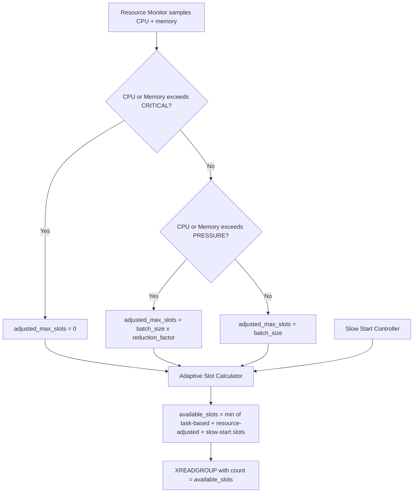
```mermaid
flowchart TD
    A[Resource Monitor samples CPU + memory] --> B{CPU or Memory exceeds CRITICAL?}
    B -->|Yes| C[adjusted_max_slots = 0]
    B -->|No| D{CPU or Memory exceeds PRESSURE?}
    D -->|Yes| E[adjusted_max_slots = batch_size x reduction_factor]
    D -->|No| F[adjusted_max_slots = batch_size]

    C --> G[Adaptive Slot Calculator]
    E --> G
    F --> G
    SS[Slow Start Controller] --> G
    G --> H[available_slots = min of task-based + resource-adjusted + slow-start slots]
    H --> I[XREADGROUP with count = available_slots]
```

#### 3.2.3 Recovery with Hysteresis

To prevent oscillation (rapidly toggling between pressure and healthy states), recovery uses a **hysteresis band**:

- **Enter pressure**: CPU > 75% or Memory > 80%
- **Exit pressure**: CPU < 65% or Memory < 70% (threshold minus 10%)
- **Enter critical**: CPU > 90% or Memory > 90%
- **Exit critical**: CPU < 80% or Memory < 80%

This ensures a pod doesn't immediately resume full consumption the instant utilization dips below the threshold.

#### 3.2.4 Slow Start — Cold-Start Burst Protection

**Problem**: When a pod starts fresh (0% CPU, 0% memory), the resource monitor reports "healthy" and all slots are immediately available. If `batch_size = 5`, the pod pulls 5 messages at once. All 5 agent executions start simultaneously, and their combined resource demand can exceed pod limits — causing OOM-kill or CPU starvation before the resource monitor even gets a chance to sample.

**Solution — TCP-inspired Slow Start**: New pods begin with a restricted slot count and gradually ramp up, proving they can handle the load before taking on more work.

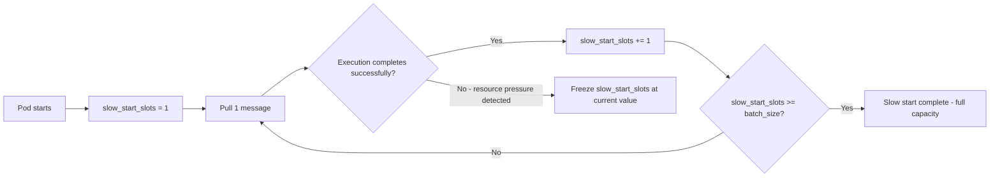
```mermaid
flowchart LR
    A[Pod starts] --> B[slow_start_slots = 1]
    B --> C[Pull 1 message]
    C --> D{Execution completes successfully?}
    D -->|Yes| E[slow_start_slots += 1]
    E --> F{slow_start_slots >= batch_size?}
    F -->|No| C
    F -->|Yes| G[Slow start complete - full capacity]
    D -->|No - resource pressure detected| H[Freeze slow_start_slots at current value]
```

**Behavior:**

| Phase | `slow_start_slots` | Messages pulled | Condition to advance |
|---|---|---|---|
| Start | 1 | 1 | First execution completes AND resources stay healthy |
| Ramp 1 | 2 | Up to 2 | Next execution completes AND resources stay healthy |
| Ramp 2 | 3 | Up to 3 | Next execution completes AND resources stay healthy |
| ... | ... | ... | ... |
| Full | `batch_size` | Up to `batch_size` | Slow start complete |

**Key rules:**
- Increment happens only on **successful execution completion**, not on message receipt
- If resource pressure is detected during ramp-up, **freeze** at the current slot count
- If critical pressure is detected, **override** slow start and set slots to 0
- Slow start resets if the pod enters CRITICAL zone and recovers (treats recovery like a fresh start)

#### 3.2.5 Single-Execution Resource Protection

**Problem**: A single agent execution (e.g., processing a massive context window or a runaway tool call) can spike CPU/memory from 40% to 100% instantly — faster than the async resource monitor can react. The pod gets OOM-killed, losing all in-flight work.

**Solution — Three layers of defense:**

**Layer A — Pre-Execution Headroom Gate**

Before each agent execution starts inside [`_run_agent_execution_with_setup()`](utils/messaging/redis_streams_trigger_handler.py:329), perform a **synchronous resource check**. This catches cases where conditions changed between XREADGROUP time and actual execution start:

```
Before starting execution:
  1. Sample current CPU and memory
  2. If in CRITICAL zone -> reject execution, NACK message back to stream
  3. If in PRESSURE zone -> proceed but log warning
  4. If healthy -> proceed normally
```

This is distinct from the slot calculator: slots are checked when pulling messages from Redis, but the headroom gate checks again at the moment of execution. Between pulling and executing, other concurrent tasks may have consumed resources.

**Layer B — Unified Monitoring Thread as Safety Net**

The unified resource monitoring thread (described in Section 3.2.1) serves a dual purpose here. Because it runs on a dedicated OS thread — independent of the Python event loop — it continues sampling resources even when a CPU-intensive agent execution has fully blocked the event loop. This is the key safety property: there is no separate "watchdog" thread; the same monitoring thread that feeds the slot calculator also maintains the atomic `resource_critical` flag used by the headroom gate.

```
Unified Monitoring Thread (already running from Section 3.2.1):
  loop every RESOURCE_MONITOR_INTERVAL_SECONDS:
    1. Read CPU and memory from /proc
    2. Classify zone: HEALTHY / PRESSURE / CRITICAL
    3. Update shared resource state (thread-safe)
    4. If CRITICAL for > WATCHDOG_GRACE_PERIOD_SECONDS:
       - Set atomic flag: resource_critical = True
       - Log warning: "Worker is not accepting new requests due to sustained high resource usage"
    5. If recovered below exit-critical threshold:
       - Clear atomic flag: resource_critical = False
    6. The event loop checks this flag before starting new executions
```

The monitoring thread does NOT cancel running executions — it only sets a flag that prevents new ones from starting. This avoids the complexity and risk of forcefully cancelling agent work. Because this is the same thread already running for slot calculation, there is no additional thread overhead compared to the previous design.

**Layer C — Kubernetes OOM-Kill as Safety Net**

If all application-level protections fail, Kubernetes resource limits provide the final defense:

- Pod has hard memory limits (e.g., 512Mi, 1Gi, 2Gi depending on tier)
- If a single execution exceeds the pod memory limit, K8s OOM-kills the pod
- The pod restarts automatically via the Deployment controller
- **Unacknowledged messages** remain in the Redis Stream pending state (messages are ACKed only after execution completes)
- The existing [`_pending_messages_monitor()`](utils/messaging/redis_streams_trigger_handler.py:804) detects these orphaned messages once they exceed `message_lock_timeout`
- It publishes a `"failed"` error event to the user via [`_publish_delete_message_event()`](utils/messaging/redis_streams_trigger_handler.py:542), then ACKs and deletes the message — **no auto-retry occurs**
- KEDA detects the growing pending count and may scale up additional pods

This is acceptable behavior — it means the agent execution genuinely requires more resources than the configured tier provides. The resolution is to use a larger resource tier for that agent type.

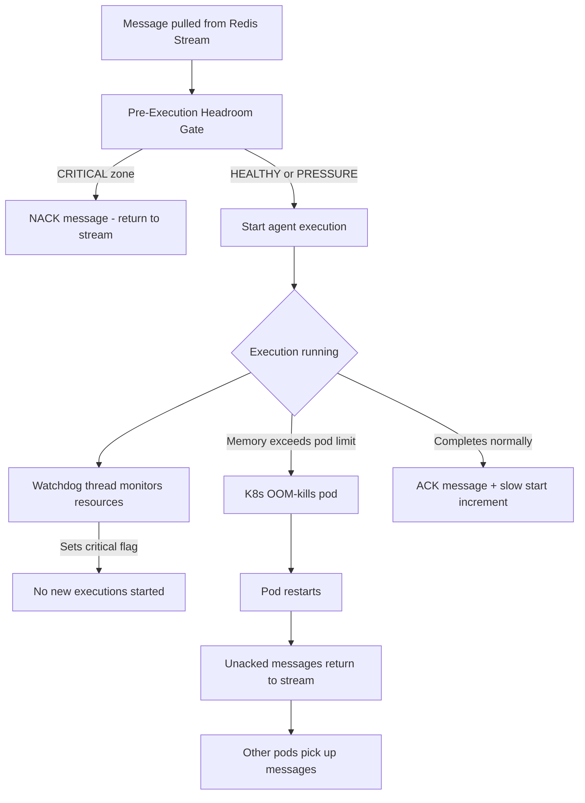
```mermaid
flowchart TD
    A[Message pulled from Redis Stream] --> B[Pre-Execution Headroom Gate]
    B -->|CRITICAL zone| C[NACK message - return to stream]
    B -->|HEALTHY or PRESSURE| D[Start agent execution]
    D --> E{Execution running}
    E --> F[Watchdog thread monitors resources]
    F -->|Sets critical flag| G[No new executions started]
    E -->|Memory exceeds pod limit| H[K8s OOM-kills pod]
    H --> I[Pod restarts]
    I --> J[Unacked messages return to stream]
    J --> K[Other pods pick up messages]
    E -->|Completes normally| L[ACK message + slow start increment]
```

#### 3.2.6 User Notification via Event API

**Problem**: When resource pressure causes a message to be delayed, rejected (NACKed), or the pod is OOM-killed, the end user has no visibility into why their agent execution is taking longer or failed.

**Solution**: Publish warning/error events to the user through the existing Event API pipeline whenever resource pressure impacts their request. This uses the established [`enqueue_payload()`](utils/fifo_queue_handler.py:18) → [`process_and_notify_event()`](utils/events.py:50) → [`stream_event()`](utils/events.py:70) pattern already used for timeout errors and long-pending message deletions.

> **Design Principle — Events API Message Content**: Events API messages describe the observable state of the agent or request from the caller's perspective. Internal processing details such as queue operations, retry mechanisms, and infrastructure state are recorded in structured logs only and must not appear in Events API messages.

**Events to publish:**

Uses the existing `agentStatus` enum values already established in the codebase: `"pending"`, `"in-progress"`, `"waiting"`, `"warning"`, `"completed"`, `"failed"`, `"terminated"`.

| Trigger | `agentStatus` | Message to User |
|---|---|---|
| Execution rejected at pre-start check due to sustained high resource usage | `"warning"` | Agent execution temporarily delayed due to high system load. Your request will be retried automatically. |
| Worker enters elevated resource usage with active executions | `"warning"` | Agent execution may experience slower response times due to current system load. Processing will continue but may take longer than usual. |
| Request re-queued after rejection | `"warning"` | Your request could not be processed at this time and will be retried automatically. |

> **Note**: Messages must not reference internal class names, thread names, metric variable names, queue operations, retry mechanisms, or implementation-specific identifiers. All messages must describe the observable condition from the user's perspective.

> **Note on OOM-kill**: When a pod is OOM-killed, the existing [`_pending_messages_monitor()`](utils/messaging/redis_streams_trigger_handler.py:804) already handles orphaned messages. It detects messages pending longer than `message_lock_timeout`, publishes a `"failed"` error event via [`_publish_delete_message_event()`](utils/messaging/redis_streams_trigger_handler.py:542) with the message *"Agent execution was interrupted and could not be completed due to insufficient resources. Please retry, or contact support if this persists."*, then ACKs and deletes the message. **No auto-retry occurs** — the user receives a failure notification. No new event publishing is needed for this case.

**Implementation — Event Publishing Integration Points:**

```
1. Pre-Start Resource Check (rejection path):
   - Extract message_data.correlation_id, agent_id, source
   - Publish "warning" event: "Agent execution temporarily delayed due to high
     system load. Your request will be retried automatically."
   - NACK message back to Redis Stream

2. Worker Enters Elevated Resource Usage (HEALTHY -> PRESSURE transition):
   - For each active execution, publish "warning" event
   - Message: "Agent execution may experience slower response times due to
     current system load. Processing will continue but may take longer than usual."
   - Only publish once per zone transition (not on every sample)

3. Worker Enters Critical Resource Usage (PRESSURE -> CRITICAL transition):
   - For each active execution, publish "warning" event
   - Message: "Agent execution is experiencing high load. Your request may be
     delayed if conditions do not improve."
   - Only publish once per zone transition

4. Post OOM-Kill Recovery:
   - Already handled by existing _pending_messages_monitor
   - Detects messages pending > message_lock_timeout
   - Publishes "failed" event: "Agent execution was interrupted and could not be
     completed due to insufficient resources. Please retry, or contact support if
     this persists."
   - ACKs and deletes the message (no auto-retry)
   - No new code needed for this case
```

**Event payload structure** — follows the exact existing pattern used throughout the codebase (e.g., [`_publish_delete_message_event()`](utils/messaging/redis_streams_trigger_handler.py:542), [`execute_agent_from_message()`](kube_execute/main.py:61), [`execute_and_close_helpers.py`](utils/execute_and_close_helpers.py:162)):

```python
# Example: Pre-start resource check rejection event
event_payload = {
    "correlationId": message_data.correlation_id,
    "agentId": message_data.agent_id,
    "agentStatus": "warning",
    "message": "Agent execution temporarily delayed due to high system load. "
               "Your request will be retried automatically.",
    "timestamp": int(time.time() * 1000),
}

# Published via existing enqueue_payload pattern:
await enqueue_payload(
    event_payload,
    client_id,       # from message_data.source.get("client")
    industry_id,     # from message_data.source.get("industry")
    project_id,      # from message_data.source.get("project")
    message_data.is_a2a_executor,
    message_data.body.stream if message_data.body else False,
)
```

This is identical to how timeout events are published in [`_run_agent_execution_with_setup()`](utils/messaging/redis_streams_trigger_handler.py:329) and how long-pending message events are published in [`_publish_delete_message_event()`](utils/messaging/redis_streams_trigger_handler.py:542). No new payload fields or custom metadata are introduced.

Events are published via [`enqueue_payload()`](utils/fifo_queue_handler.py:18) which uses the FIFO queue to avoid blocking the main execution path. This is the same non-blocking pattern used by the existing timeout and long-pending message event publishers in [`RedisStreamHandler`](utils/messaging/redis_streams_trigger_handler.py:31).

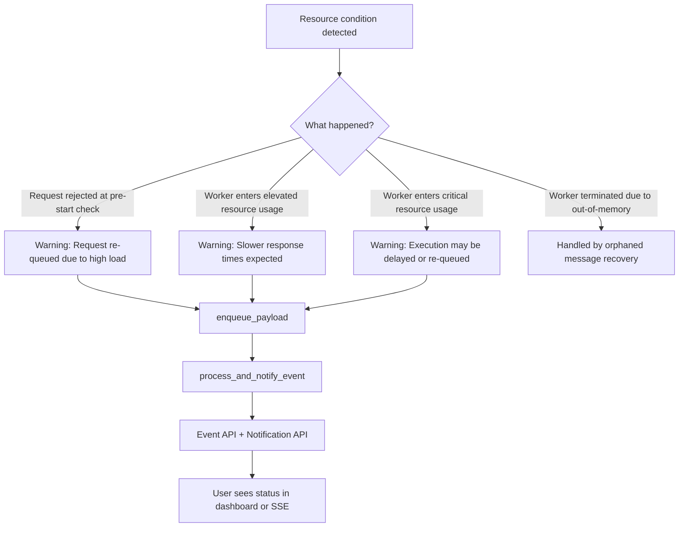
```mermaid
flowchart TD
    A[Resource condition detected] --> B{What happened?}
    B -->|Request rejected at pre-start check| C[Warning: Request re-queued due to high load]
    B -->|Worker enters elevated resource usage| D[Warning: Slower response times expected]
    B -->|Worker enters critical resource usage| E[Warning: Execution may be delayed or re-queued]
    B -->|Worker terminated due to out-of-memory| F[Handled by orphaned message recovery]

    C --> G[enqueue_payload]
    D --> G
    E --> G
    G --> H[process_and_notify_event]
    H --> I[Event API + Notification API]
    I --> J[User sees status in dashboard or SSE]
```

**Configuration:**

| Setting | Type | Default | Description |
|---|---|---|---|
| `RESOURCE_PRESSURE_EVENTS_ENABLED` | `bool` | `True` | Publish user-facing events on resource pressure |

---

## 4. Configuration

### 4.1 Static Settings (K8s Manifest / Environment Variables)

New settings to add to [`InfraSettingsMixin`](config/settings/infra.py:6). These are read from environment variables at startup and serve as the **initial/default values**. They can be overridden at runtime via the config service (see Section 4.2).

| Setting | Type | Default | Description |
|---|---|---|---|
| `RESOURCE_MONITOR_ENABLED` | `bool` | `True` | Enable/disable resource-aware back-pressure |
| `RESOURCE_MONITOR_INTERVAL_SECONDS` | `int` | `10` | Sampling interval for CPU/memory readings |
| `CPU_PRESSURE_THRESHOLD_PERCENT` | `int` | `75` | CPU % to begin reducing slots |
| `CPU_CRITICAL_THRESHOLD_PERCENT` | `int` | `90` | CPU % to stop consuming entirely |
| `MEMORY_PRESSURE_THRESHOLD_PERCENT` | `int` | `80` | Memory % to begin reducing slots |
| `MEMORY_CRITICAL_THRESHOLD_PERCENT` | `int` | `90` | Memory % to stop consuming entirely |
| `RESOURCE_PRESSURE_SLOT_REDUCTION_FACTOR` | `float` | `0.5` | Multiplier for batch_size under pressure |
| `RESOURCE_HYSTERESIS_BAND_PERCENT` | `int` | `10` | Recovery band below threshold before resuming |
| `SLOW_START_ENABLED` | `bool` | `True` | Enable TCP-style slow start for new pods |
| `SLOW_START_INITIAL_SLOTS` | `int` | `1` | Number of slots available when pod first starts |
| `SLOW_START_INCREMENT` | `int` | `1` | Slots added after each successful execution completion |
| `PRE_EXECUTION_RESOURCE_CHECK_ENABLED` | `bool` | `True` | Check resource headroom before each execution starts |
| `WATCHDOG_GRACE_PERIOD_SECONDS` | `int` | `15` | Sustained CRITICAL duration before the monitoring thread sets the stop flag |
| `RESOURCE_PRESSURE_EVENTS_ENABLED` | `bool` | `True` | Publish user-facing events via Event API on resource pressure |

K8s manifest values (set via `env:` in the Deployment spec or ConfigMap) serve as the initial defaults. They are applied at pod startup before the config service is contacted.

### 4.2 Dynamic Configuration via Config Service

The project's existing [`ConfigManager`](config/config_service.py:13) singleton provides runtime configuration overrides without requiring a redeployment. All threshold and batch-size settings listed in Section 4.1 are registered as overridable keys in the `DynamicSettings` model, meaning the config service can push updated values at any time.

**How it works:**

1. On worker startup, [`ConfigManager`](config/config_service.py:13) initializes from environment variables (K8s manifest values) via [`DynamicSettings`](config/settings/__init__.py).
2. If `CONFIG_SERVICE_URL` is set, [`ConfigManager.refresh()`](config/config_service.py:197) fetches the latest overrides from the config service manifest (`api-graph-config`) and applies them via [`_update_overrides()`](config/config_service.py:252).
3. Periodic refresh runs on the scheduler interval (`CONFIG_REFRESH_INTERVAL_MINUTES`, default 15 min), keeping thresholds current without a pod restart.
4. The unified monitoring thread reads thresholds via [`config_manager.get()`](config/config_service.py:317) on each sampling cycle, so updated values take effect on the next sample — no restart required.
5. Change listeners registered via [`ConfigManager.register_listener()`](config/config_service.py:50) can notify the monitoring thread immediately when a threshold key changes, enabling sub-interval responsiveness.

**Settings overridable at runtime via config service:**

| Setting | Why Runtime Override Matters |
|---|---|
| `CPU_PRESSURE_THRESHOLD_PERCENT` | Tune sensitivity without redeployment during incidents |
| `CPU_CRITICAL_THRESHOLD_PERCENT` | Raise/lower the hard stop threshold based on observed workload |
| `MEMORY_PRESSURE_THRESHOLD_PERCENT` | Adjust for memory-intensive agent types |
| `MEMORY_CRITICAL_THRESHOLD_PERCENT` | Prevent OOM-kills by lowering threshold proactively |
| `RESOURCE_PRESSURE_SLOT_REDUCTION_FACTOR` | Control how aggressively slots are reduced under pressure |
| `WORKER_POD_MESSAGES_BATCH_SIZE` | Reduce concurrency across all pods without redeployment |
| `WATCHDOG_GRACE_PERIOD_SECONDS` | Shorten or extend the grace period before consumption stops |
| `RESOURCE_HYSTERESIS_BAND_PERCENT` | Tune oscillation prevention without a deployment cycle |

**Priority order** (highest to lowest):
1. Config service override (fetched from `api-graph-config` manifest)
2. Environment variable / K8s manifest value
3. Pydantic field default

This means K8s manifest values are always the safe fallback — if the config service is unreachable, the pod continues operating with its last-known or default values.

---

## 5. Detailed Flow Scenarios

### 5.1 Normal Operation (No Resource Pressure)

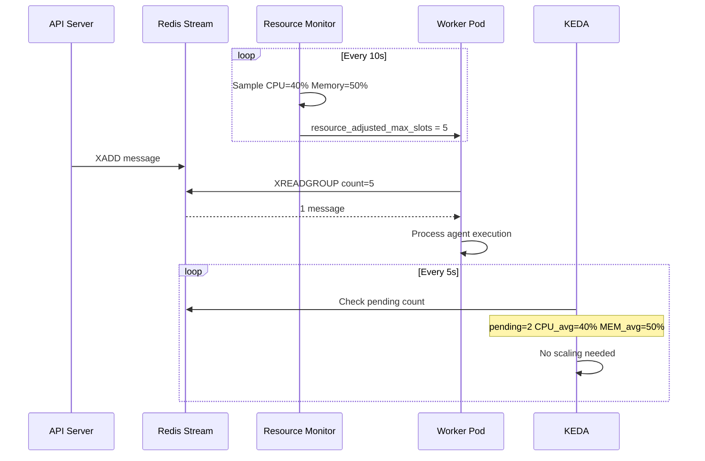
```mermaid
sequenceDiagram
    participant API as API Server
    participant RS as Redis Stream
    participant RM as Resource Monitor
    participant WP as Worker Pod
    participant KEDA as KEDA

    loop Every 10s
        RM->>RM: Sample CPU=40% Memory=50%
        RM->>WP: resource_adjusted_max_slots = 5
    end

    API->>RS: XADD message
    WP->>RS: XREADGROUP count=5
    RS-->>WP: 1 message
    WP->>WP: Process agent execution

    loop Every 5s
        KEDA->>RS: Check pending count
        Note over KEDA: pending=2 CPU_avg=40% MEM_avg=50%
        KEDA->>KEDA: No scaling needed
    end
```

### 5.2 Resource Pressure — Gradual Back-Off

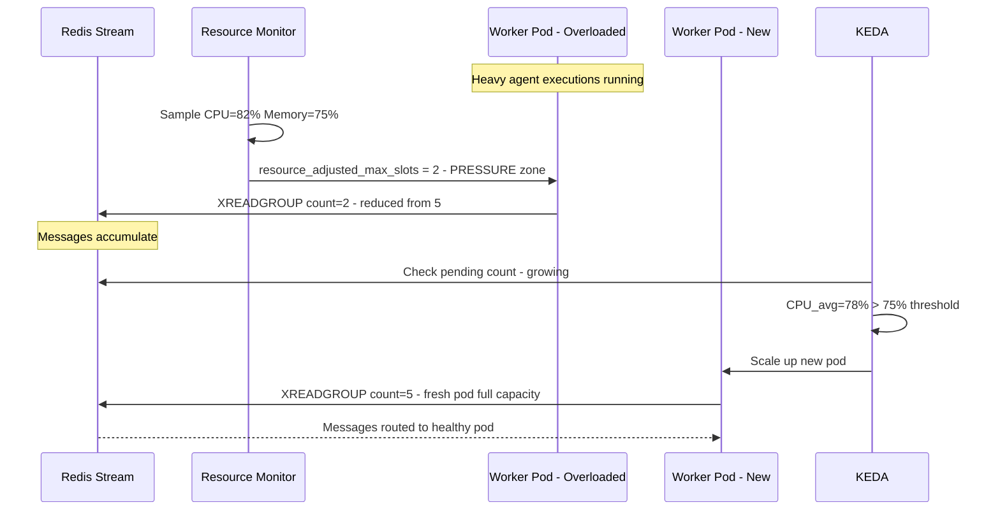
```mermaid
sequenceDiagram
    participant RS as Redis Stream
    participant RM as Resource Monitor
    participant WP as Worker Pod - Overloaded
    participant WP2 as Worker Pod - New
    participant KEDA as KEDA

    Note over WP: Heavy agent executions running

    RM->>RM: Sample CPU=82% Memory=75%
    RM->>WP: resource_adjusted_max_slots = 2 - PRESSURE zone

    WP->>RS: XREADGROUP count=2 - reduced from 5
    Note over RS: Messages accumulate

    KEDA->>RS: Check pending count - growing
    KEDA->>KEDA: CPU_avg=78% > 75% threshold
    KEDA->>WP2: Scale up new pod

    WP2->>RS: XREADGROUP count=5 - fresh pod full capacity
    RS-->>WP2: Messages routed to healthy pod
```

### 5.3 Critical Resource Pressure — Full Stop

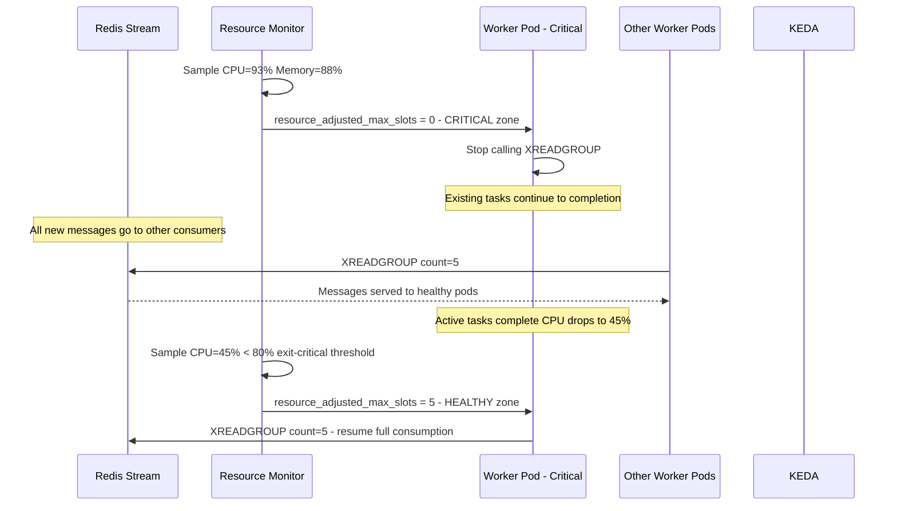
```mermaid
sequenceDiagram
    participant RS as Redis Stream
    participant RM as Resource Monitor
    participant WP as Worker Pod - Critical
    participant WP2 as Other Worker Pods
    participant KEDA as KEDA

    RM->>RM: Sample CPU=93% Memory=88%
    RM->>WP: resource_adjusted_max_slots = 0 - CRITICAL zone

    WP->>WP: Stop calling XREADGROUP
    Note over WP: Existing tasks continue to completion

    Note over RS: All new messages go to other consumers
    WP2->>RS: XREADGROUP count=5
    RS-->>WP2: Messages served to healthy pods

    Note over WP: Active tasks complete CPU drops to 45%
    RM->>RM: Sample CPU=45% < 80% exit-critical threshold
    RM->>WP: resource_adjusted_max_slots = 5 - HEALTHY zone
    WP->>RS: XREADGROUP count=5 - resume full consumption
```

### 5.4 Cold-Start Burst — Slow Start Protection

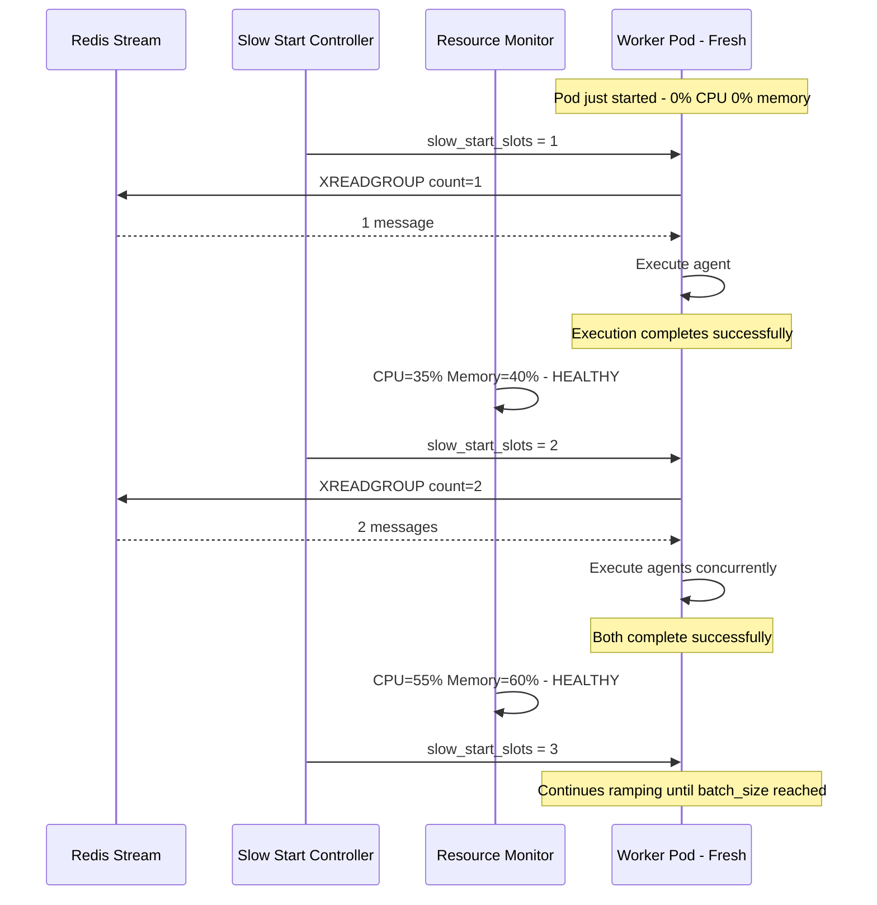
```mermaid
sequenceDiagram
    participant RS as Redis Stream
    participant SS as Slow Start Controller
    participant RM as Resource Monitor
    participant WP as Worker Pod - Fresh

    Note over WP: Pod just started - 0% CPU 0% memory
    SS->>WP: slow_start_slots = 1

    WP->>RS: XREADGROUP count=1
    RS-->>WP: 1 message
    WP->>WP: Execute agent
    Note over WP: Execution completes successfully
    RM->>RM: CPU=35% Memory=40% - HEALTHY
    SS->>WP: slow_start_slots = 2

    WP->>RS: XREADGROUP count=2
    RS-->>WP: 2 messages
    WP->>WP: Execute agents concurrently
    Note over WP: Both complete successfully
    RM->>RM: CPU=55% Memory=60% - HEALTHY
    SS->>WP: slow_start_slots = 3

    Note over WP: Continues ramping until batch_size reached
```

### 5.5 Single Execution OOM — Defense in Depth

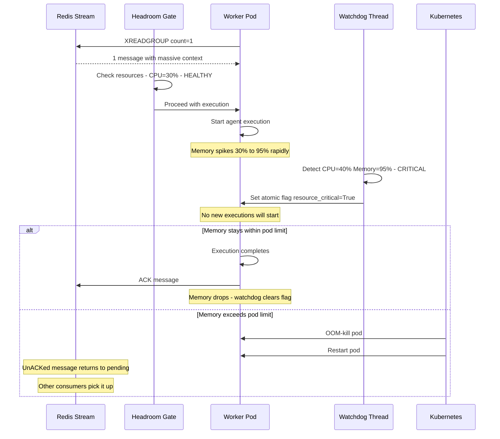
```mermaid
sequenceDiagram
    participant RS as Redis Stream
    participant HG as Headroom Gate
    participant WP as Worker Pod
    participant WD as Watchdog Thread
    participant K8s as Kubernetes

    WP->>RS: XREADGROUP count=1
    RS-->>WP: 1 message with massive context
    HG->>HG: Check resources - CPU=30% - HEALTHY
    HG->>WP: Proceed with execution

    WP->>WP: Start agent execution
    Note over WP: Memory spikes 30% to 95% rapidly

    WD->>WD: Detect CPU=40% Memory=95% - CRITICAL
    WD->>WP: Set atomic flag resource_critical=True
    Note over WP: No new executions will start

    alt Memory stays within pod limit
        WP->>WP: Execution completes
        WP->>RS: ACK message
        Note over WP: Memory drops - watchdog clears flag
    else Memory exceeds pod limit
        K8s->>WP: OOM-kill pod
        K8s->>WP: Restart pod
        Note over RS: UnACKed message returns to pending
        Note over RS: Other consumers pick it up
    end
```

---

## 6. Files to Modify

| File | Change Type | Description |
|---|---|---|
| [`config/settings/infra.py`](config/settings/infra.py) | Modify | Add resource monitoring configuration fields |
| [`config/settings/__init__.py`](config/settings/__init__.py) | Modify | Ensure new settings are included in the settings class |
| `utils/resource_monitor.py` | **New** | Resource monitoring utility reading from /proc |
| [`utils/messaging/redis_streams_trigger_handler.py`](utils/messaging/redis_streams_trigger_handler.py) | Modify | Integrate Resource Monitor into slot calculation and message receiver loop |
| [`utils/api-graph-depolyment-sample.yaml`](utils/api-graph-depolyment-sample.yaml) | Modify | Add CPU and memory triggers to KEDA ScaledObject |
| [`src/worker_main.py`](src/worker_main.py) | Modify | Initialize Resource Monitor on worker startup |

---

## 7. Alternatives Considered

| Alternative | Why Not Chosen |
|---|---|
| **HPA only** | No application-level awareness; still routes to exhausted pods |
| **KEDA only with higher pendingEntriesCount** | Delays scaling but doesn't prevent overloaded pods from consuming |
| **VPA (Vertical Pod Autoscaler)** | Requires pod restarts to apply new limits, disrupting active agent executions |
| **Custom KEDA External Scaler** | Higher complexity; composite triggers + app-level back-pressure achieves the same result with less operational overhead |
| **Readiness probe manipulation** | Redis Streams uses pull-based XREADGROUP, not push-based routing — readiness probes don't affect which consumer pulls messages |

---

## 8. Recommendation: Dynamic Resource Adaptation

Rather than relying on a fixed set of named size tiers (e.g., `SMALL`, `MEDIUM`, `LARGE`) hardcoded in application logic, the architecture adopts a **manifest-driven model** where the operator sets all operating parameters explicitly in the Kubernetes manifest as named environment variables. The application reads these values directly — no derivation or computation from raw CPU/memory limits is performed.

### 8.1 Reading Operating Parameters from the Manifest

All concurrency limits and resource thresholds are set **directly in the Kubernetes Deployment manifest** as named environment variables. The application reads them as-is at startup — no formulas, no tier lookups, no Downward API injection of raw CPU or memory limits.

**Example manifest configuration:**

```yaml
env:
  - name: MAX_CONCURRENT_EXECUTIONS
    value: "5"
  - name: CPU_PRESSURE_THRESHOLD_PERCENT
    value: "70"
  - name: CPU_CRITICAL_THRESHOLD_PERCENT
    value: "90"
  - name: MEMORY_PRESSURE_THRESHOLD_PERCENT
    value: "75"
  - name: MEMORY_CRITICAL_THRESHOLD_PERCENT
    value: "90"
```

The operator sets these values explicitly for the specific pod size being deployed. The application reads them directly — there is no formula that derives batch size or thresholds from CPU core counts or memory bytes. The **K8s manifest is the source of truth** for what the pod is configured to handle.

### 8.2 Manifest-Driven Operating Parameters

The following parameters are set in the manifest and read directly by the application. No computation is performed:

| Parameter | Manifest Env Var | What It Controls |
|---|---|---|
| Concurrency limit | `MAX_CONCURRENT_EXECUTIONS` | Maximum number of agent executions the pod processes concurrently |
| CPU pressure threshold | `CPU_PRESSURE_THRESHOLD_PERCENT` | CPU utilization % at which the pod enters PRESSURE zone and reduces slots |
| CPU critical threshold | `CPU_CRITICAL_THRESHOLD_PERCENT` | CPU utilization % at which the pod enters CRITICAL zone and pauses consumption |
| Memory pressure threshold | `MEMORY_PRESSURE_THRESHOLD_PERCENT` | Memory utilization % at which the pod enters PRESSURE zone |
| Memory critical threshold | `MEMORY_CRITICAL_THRESHOLD_PERCENT` | Memory utilization % at which the pod enters CRITICAL zone |

The operator sets each value explicitly in the manifest for the target pod size. A larger pod gets a higher `MAX_CONCURRENT_EXECUTIONS` because the operator sets it higher — not because the application computes it from CPU cores. The config service (Section 4.2) can override any of these values at runtime without redeployment, but the manifest values are the default source of truth.

### 8.3 Why This Matters for the Hybrid Scaling Design

- **No hardcoded enums**: Adding more resource capacity (e.g., deploying a larger pod) is expressed by setting a higher `MAX_CONCURRENT_EXECUTIONS` in the manifest — no application code change required.
- **Explicit operator intent**: If a pod is allocated fewer resources, the operator sets a correspondingly lower `MAX_CONCURRENT_EXECUTIONS` and tighter thresholds in the manifest. The application uses exactly what is configured — no implicit derivation.
- **Operator control**: Resource sizing and concurrency limits are entirely a K8s manifest concern. The same application binary runs on any pod size; behavior is controlled by the manifest values, making it portable across environments with different node pool sizes.
- **Config service integration**: All threshold values can be overridden at runtime via the config service (Section 4.2) without redeployment, giving operators fine-grained control over how aggressively the pod responds to resource pressure.
- **Node pool sizing**: Operators must ensure node pools have sufficient allocatable resources to schedule pods with the desired CPU and memory limits, and must set manifest env vars (`MAX_CONCURRENT_EXECUTIONS`, thresholds) to values appropriate for those limits.

---

## 9. Risks and Mitigations

| Risk | Mitigation |
|---|---|
| **All pods hit critical threshold simultaneously** | KEDA scales to `maxReplicaCount`; if still insufficient, this is a genuine capacity limit — alert and increase `maxReplicaCount` or node pool |
| **Resource monitor adds overhead** | Reading `/proc` is sub-millisecond; 10s interval is negligible. Feature is toggleable via `RESOURCE_MONITOR_ENABLED` |
| **Oscillation between pressure zones** | Hysteresis band prevents rapid toggling; 10% recovery buffer |
| **False positives from CPU spikes** | Use rolling average over last 3 samples rather than instantaneous reading |
| **Metrics Server unavailability** | KEDA CPU/memory triggers gracefully degrade — Redis Stream trigger continues to function independently |
| **Single execution causes OOM-kill** | Pre-execution headroom gate rejects new work in CRITICAL zone; K8s OOM-kill restarts pod; unACKed messages return to stream for other consumers |
| **Cold-start burst overwhelms fresh pod** | Slow Start limits initial slots to 1 and ramps up only after successful completions; prevents batch_size messages from hitting a fresh pod simultaneously |
| **Event loop blocked by CPU-intensive execution** | The unified monitoring thread runs on a dedicated OS thread independent of the event loop — it continues sampling resources and updating the atomic stop flag even when the event loop is fully blocked |
| **Slow start delays throughput on scale-up** | Ramp-up is fast — with `batch_size=5`, full capacity is reached after 4 successful completions; KEDA compensates by scaling more pods if queue grows |
| **Config service unavailable at startup** | Worker falls back to K8s manifest environment variable values; last-known config values are retained across refresh failures — no degradation in behavior |
| **Dynamic batch size too large for actual workload** | Config service can reduce `WORKER_POD_MESSAGES_BATCH_SIZE` at runtime without redeployment; resource monitor will further reduce effective slots if pressure is detected |

---

## 10. Observability

### Logging

- Periodic resource utilization log (every `RESOURCE_MONITOR_INTERVAL_SECONDS`)
- Log on zone transitions: `HEALTHY → PRESSURE`, `PRESSURE → CRITICAL`, and recovery
- Log slot adjustments with before/after values
- Log when consumption is paused and resumed

### Metrics (Future Enhancement)

| Metric | Type | Description |
|---|---|---|
| `worker_cpu_utilization_percent` | Gauge | Current CPU utilization of the worker pod |
| `worker_memory_utilization_percent` | Gauge | Current memory utilization of the worker pod |
| `worker_resource_zone` | Gauge | Current zone: 0=healthy, 1=pressure, 2=critical |
| `worker_available_slots` | Gauge | Current available message processing slots |
| `worker_slot_reductions_total` | Counter | Number of times slots were reduced due to resource pressure |

### Alerts

- **Warning**: Pod enters PRESSURE zone for > 5 minutes continuously
- **Critical**: Pod enters CRITICAL zone (consumption stopped)
- **Critical**: > 50% of pods in CRITICAL zone simultaneously

---

## 11. Error Handling — Error Codes and Messages

All failure conditions produce a distinct error code and a human-readable message. These codes appear in both structured logs and the Events API payload so that operators and end users can identify the failure type without inspecting internal state.

### 11.1 Error Code Registry

> **Design Principle — Events API Message Content**: Events API messages describe the observable state of the agent or request from the caller's perspective. Internal processing details such as queue operations, retry mechanisms, and infrastructure state are recorded in structured logs only and must not appear in Events API messages.

| Error Code | Failure Scenario | Log Severity | `agentStatus` | User-Facing Message |
|---|---|---|---|---|
| `WORKER_ERR_OOM` | Worker terminated due to out-of-memory | `CRITICAL` | `"failed"` | Agent execution was interrupted and could not be completed due to insufficient resources. Please retry, or contact support if this persists. |
| `WORKER_ERR_CRASH_LOOP` | Worker pod restarted repeatedly in a short window | `CRITICAL` | `"failed"` | Agent execution failed due to repeated service interruptions. Please retry your request. |
| `WORKER_ERR_TIMEOUT` | Agent execution exceeded the configured execution timeout | `ERROR` | `"failed"` | Agent execution timed out. Please retry with a simpler request or contact support. |
| `WORKER_ERR_UNRESPONSIVE` | Worker stopped processing messages and did not recover within the grace period | `ERROR` | `"failed"` | Agent execution failed: the service became temporarily unavailable. Your request could not be completed at this time. |
| `WORKER_WARN_HIGH_LOAD` | Request rejected at pre-start check due to sustained high resource usage | `WARNING` | `"warning"` | Agent execution temporarily delayed due to high system load. Your request will be retried automatically. |
| `WORKER_WARN_SLOW_RESPONSE` | Worker entered elevated resource usage with active executions | `WARNING` | `"warning"` | Agent execution may experience slower response times due to current system load. Processing will continue but may take longer than usual. |
| `WORKER_WARN_REQUEUED` | Request re-queued after rejection | `WARNING` | `"warning"` | Your request could not be processed at this time and will be retried automatically. |

### 11.2 How Error Codes Propagate

**Structured logs** — every log entry for a failure condition includes the error code as a structured field:

```
{
  "level": "CRITICAL",
  "error_code": "WORKER_ERR_OOM",
  "correlation_id": "<uuid>",
  "agent_id": "<agent_id>",
  "message": "Worker terminated due to out-of-memory condition"
}
```

**Events API** — the error code is included in the event payload alongside the user-facing message:

```python
event_payload = {
    "correlationId": message_data.correlation_id,
    "agentId": message_data.agent_id,
    "agentStatus": "failed",          # or "warning"
    "errorCode": "WORKER_ERR_OOM",    # machine-readable code for client-side handling
    "message": "Agent execution was interrupted and could not be completed due to "
               "insufficient resources. Please retry, or contact support if this persists.",
    "timestamp": int(time.time() * 1000),
}
```

### 11.3 OOM-Kill Detection and Propagation

OOM-kill is detected indirectly: the pod is killed by the kernel before any application code can run. The recovery path is:

1. Pod is OOM-killed — all in-flight executions are lost
2. Pod restarts automatically via the Deployment controller
3. Unacknowledged messages remain in the Redis Stream pending state
4. The existing [`_pending_messages_monitor()`](utils/messaging/redis_streams_trigger_handler.py:804) detects messages pending longer than `message_lock_timeout`
5. It publishes a `"failed"` event with error code `WORKER_ERR_OOM` and the user-facing message above
6. The message is ACKed and deleted — **no auto-retry occurs**
7. KEDA detects the growing pending count and may scale up additional pods

The OOM error code is set based on the pod restart reason, which can be read from the pod's `lastState.terminated.reason` field (value: `OOMKilled`) via the Kubernetes API or from the container exit code (`137`).

### 11.4 Crash Loop Detection and Propagation

A crash loop is detected when a pod restarts more than `CRASH_LOOP_RESTART_THRESHOLD` times within `CRASH_LOOP_WINDOW_SECONDS`. Detection options:

- **Kubernetes-native**: The pod's `restartCount` field increments on each restart; a liveness probe failure or CrashLoopBackOff status is observable via the K8s API.
- **Application-native**: On startup, the worker checks its own restart count (injected via Downward API or environment variable) and logs `WORKER_ERR_CRASH_LOOP` if the threshold is exceeded.

When a crash loop is detected, any orphaned messages are handled by [`_pending_messages_monitor()`](utils/messaging/redis_streams_trigger_handler.py:804) using the same OOM recovery path, but with error code `WORKER_ERR_CRASH_LOOP`.

### 11.5 Timeout and Unresponsive Worker

- **Timeout** (`WORKER_ERR_TIMEOUT`): Raised by the existing execution timeout mechanism in [`_run_agent_execution_with_setup()`](utils/messaging/redis_streams_trigger_handler.py:329). The error code is added to the existing timeout event payload.
- **Unresponsive** (`WORKER_ERR_UNRESPONSIVE`): Raised when the unified monitoring thread detects that the worker has been in CRITICAL zone for longer than `WATCHDOG_GRACE_PERIOD_SECONDS` and has not recovered. The monitoring thread sets the stop flag and logs the error code. Any messages that subsequently exceed `message_lock_timeout` in the pending state are published with this error code.

---

## 12. Rollout Strategy

1. **Phase 1 — Resource Monitor (Feature-flagged OFF)**
   - Deploy `resource_monitor.py` and integration code with `RESOURCE_MONITOR_ENABLED=False`
   - Monitor logs to validate CPU/memory readings are accurate
   - No behavioral change to production

2. **Phase 2 — Enable Back-Pressure in Staging**
   - Set `RESOURCE_MONITOR_ENABLED=True` in staging
   - Run load tests to validate slot reduction behavior
   - Tune thresholds via config service based on observed resource patterns

3. **Phase 3 — Add KEDA Composite Triggers**
   - Add CPU and memory triggers to KEDA ScaledObject in staging
   - Validate that KEDA scales correctly on resource pressure
   - Confirm no interference with existing Redis Stream trigger

4. **Phase 4 — Production Rollout**
   - Enable resource monitor with conservative thresholds (CPU: 80%, Memory: 85%) set via config service
   - Deploy KEDA composite triggers
   - Monitor for 1 week, then tune thresholds via config service based on production patterns

---

## 13. Summary

This hybrid approach solves the scaling problem through **six complementary mechanisms**:

1. **KEDA composite triggers** ensure the deployment scales up when pods are resource-exhausted, not just when the queue grows
2. **Application-level back-pressure** ensures individual overloaded pods stop pulling new messages, naturally redirecting work to healthy pods — driven by a single unified OS-thread resource monitor that is the sole source of resource truth for the worker process
3. **Slow Start** prevents cold-start burst scenarios where fresh pods pull too many messages before proving they can handle the load
4. **Pre-start resource check + unified monitoring thread** protect against single-execution resource spikes that occur faster than the event loop can react, with K8s OOM-kill as the final safety net
5. **User notification via Event API** keeps end users informed when resource pressure delays, re-queues, or interrupts their agent executions — using clear, user-facing messages with distinct error codes, free of internal implementation details
6. **Dynamic configuration via config service** allows thresholds, batch sizes, and reduction factors to be tuned at runtime without redeployment, with K8s manifest values serving as safe initial defaults

The design requires no changes to Redis Streams consumer group behavior, no external dependencies beyond the standard Kubernetes Metrics Server and the existing config service, and is fully configurable via environment variables and the config service with feature flags for safe rollout.
