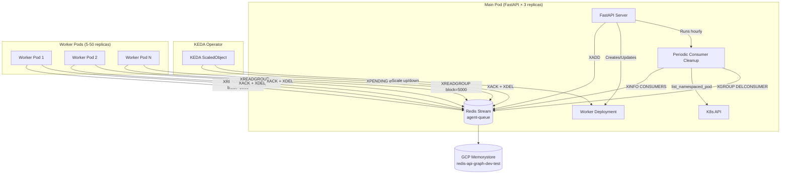
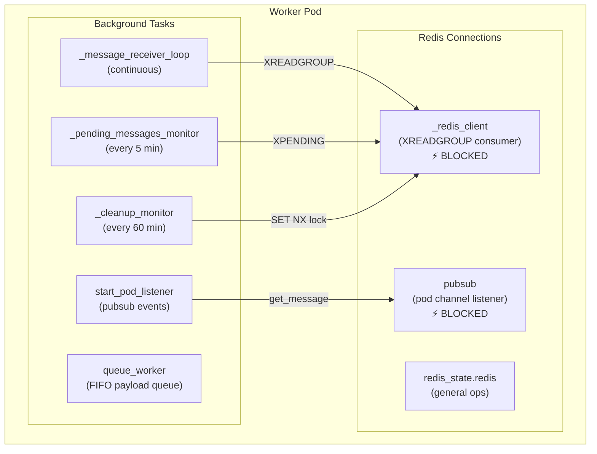
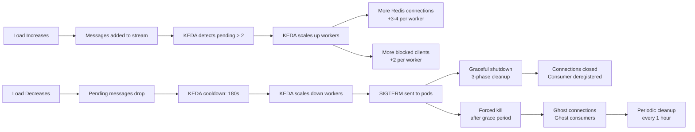

# Redis Connection Analysis — api-graph

> **Instance**: `redis-api-graph-dev-test` · **Region**: us-east1 · **Environment**: GCP DEV · **Project**: sap-tso-dev-mg  
> **Observed Metrics**: ~50 blocked clients, 300+ connected clients (persistent before and after load test)

---

## 1. Executive Summary

The api-graph application uses Redis (GCP Memorystore) as its messaging backbone via Redis Streams, with KEDA autoscaling worker pods based on pending stream entries. Analysis reveals that the observed ~50 blocked clients and 300+ connected clients are **expected behavior** given the architecture, but are exacerbated by **missing connection pool limits**, **no socket timeouts**, and **unbounded pool growth**.

**Key findings:**

- **~50 blocked clients** = ~24 worker pods × 2 blocking operations each + main pod pub/sub
- **300+ connected clients** = unbounded connection pools across ~24 workers + 3 main pods + ghost connections
- No `max_connections` configured on any Redis client
- No `socket_timeout` or `socket_connect_timeout` configured

---

## 2. Architecture Overview

### 2.1 System Architecture

The api-graph system consists of:

- **Main Pod (FastAPI API Server)** — 3 replicas (configured in [`api-graph-depolyment-sample.yaml`](utils/api-graph-depolyment-sample.yaml:124))
  - Handles HTTP requests, publishes messages to Redis Stream via `XADD`
  - Runs periodic consumer cleanup (hourly)
  - Runs pub/sub listener for SSE streaming

- **Worker Pods** — 5–50 replicas (KEDA autoscaled)
  - Consume messages from Redis Stream via `XREADGROUP` (blocking)
  - Execute agent tasks
  - Run pub/sub listener for SSE event routing
  - Run pending message monitor (every 5 min)
  - Run cleanup monitor with leader election (every 60 min)

- **KEDA ScaledObject** — Monitors Redis stream pending entries
  - Polls every 5 seconds
  - Scales based on `pendingEntriesCount: 2` per replica
  - Cooldown: 180 seconds
  - Min replicas: 5, Max replicas: 50

### 2.2 Redis Streams Flow

```
HTTP Request → Main Pod → XADD agent-queue → Redis Stream
                                                    ↓
KEDA monitors XPENDING ← ← ← ← ← ← ← ← ← ← ← ←
                                                    ↓
Worker Pod → XREADGROUP (block=5000ms) → Process Agent → XACK + XDEL
```

### 2.3 KEDA Configuration

From [`api-graph-depolyment-sample.yaml`](utils/api-graph-depolyment-sample.yaml):

```yaml
keda:
  ScaledObject:
    pollingInterval: 5
    cooldownPeriod: 180
    minReplicaCount: 5
    maxReplicaCount: 50
    trigger:
      type: redis-streams
      metadata:
        consumerGroup: agent-queue-group
        pendingEntriesCount: 2
        stream: agent-queue
        enableTLS: true
```

From [`config/settings/infra.py`](config/settings/infra.py):

- `KEDA_MIN_REPLICAS`: 5
- `KEDA_MAX_REPLICAS`: 50
- `KEDA_POLLING_INTERVAL`: 5
- `KEDA_COOLDOWN_PERIOD`: 180
- `KEDA_MESSAGE_COUNT`: 2

### 2.4 Consumer Group Details

- **Stream name**: `agent-queue` (from `MESSAGING_QUEUE_NAME` in [`config/settings/messaging.py`](config/settings/messaging.py))
- **Consumer group**: `agent-queue-group` (derived as `f"{stream_name}-group"`)
- **Consumer name**: Pod name (injected via K8s downward API `metadata.name`)
- **Message format**: pickle + base64 serialized

---

## 3. Redis Connection Inventory

### 3.1 Connection Creation Points

| # | Location | File | Client Type | Pool Config | Shared? |
|---|----------|------|-------------|-------------|---------|
| 1 | `AppState.setup()` | [`redis_helper.py`](utils/redis_helper.py:59) | `redis.asyncio.Redis` | **None** | Yes — singleton `redis_state` |
| 2 | `RedisStreamHandler._create_redis_client()` | [`redis_streams_trigger_handler.py`](utils/messaging/redis_streams_trigger_handler.py:89) | `redis.asyncio.Redis` | **None** | No — per handler |
| 3 | `RedisStreamHandler._ensure_sender_client()` | [`redis_streams_trigger_handler.py`](utils/messaging/redis_streams_trigger_handler.py:198) | `redis.asyncio.Redis` | **None** | No — per handler |
| 4 | `DeadConsumerCleaner.initialize()` | [`cleanup_dead_consumers.py`](utils/cleanup_dead_consumers.py:62) | `redis.asyncio.Redis` | **None** | No — per cleanup run |

### 3.2 Connection Strategy Configuration

All strategies in [`config/redis_config/strategies/`](config/redis_config/strategies/) create Redis clients with **no pool configuration**:

**HostPortRedisConfigStrategy** ([`host_port_strategy.py`](config/redis_config/strategies/host_port_strategy.py)):

```python
return Redis(
    host=..., port=..., username=..., password=...,
    decode_responses=True, ssl=...
)
# ⚠️ No max_connections, no socket_timeout, no health_check_interval
```

**TLSRedisConfigStrategy** ([`tls_strategy.py`](config/redis_config/strategies/tls_strategy.py)):

```python
return Redis(
    host=..., port=..., username=..., password=...,
    decode_responses=True, ssl=...,
    ssl_certfile=..., ssl_keyfile=..., ssl_ca_certs=..., ssl_cert_reqs=...
)
# ⚠️ Same — no pool configuration
```

**URLRedisConfigStrategy** ([`url_strategy.py`](config/redis_config/strategies/url_strategy.py)):

```python
return from_url(url=..., password=..., decode_responses=True)
# ⚠️ Same — no pool configuration
```

### 3.3 Per-Pod Connection Breakdown

#### Main Pod (FastAPI API Server)

| Connection | Source | Blocking? | Purpose |
|------------|--------|-----------|---------|
| `redis_state.redis` | [`AppState.setup()`](utils/redis_helper.py:59) | No | General ops (SET, GET, DELETE, PUBLISH) |
| pubsub connection | [`start_pod_listener()`](utils/redis_helper.py:75) | **Yes** (1s timeout loop) | SSE event routing |
| `_sender_redis_client` | [`RedisStreamHandler._ensure_sender_client()`](utils/messaging/redis_streams_trigger_handler.py:198) | No | XADD to stream |
| Periodic cleanup | [`DeadConsumerCleaner`](utils/cleanup_dead_consumers.py:62) (hourly) | No (temporary) | XINFO, XGROUP DELCONSUMER |

**Total per main pod: ~3 persistent + 1 temporary, 1 blocked**

#### Worker Pod

| Connection | Source | Blocking? | Purpose |
|------------|--------|-----------|---------|
| `redis_state.redis` | [`AppState.setup()`](utils/redis_helper.py:59) | No | General ops (locks, token usage, HITL) |
| pubsub connection | [`start_pod_listener()`](utils/redis_helper.py:75) | **Yes** (1s timeout loop) | SSE event routing |
| `_redis_client` | [`RedisStreamHandler._create_redis_client()`](utils/messaging/redis_streams_trigger_handler.py:89) | **Yes** (XREADGROUP block=5000) | Stream consumer |
| `_sender_redis_client` | [`RedisStreamHandler._ensure_sender_client()`](utils/messaging/redis_streams_trigger_handler.py:198) | No | XADD (if worker also sends) |

**Total per worker pod: 3–4 persistent, 2 blocked**

---

## 4. Blocking Operations Analysis

### 4.1 All Blocking Redis Operations

| # | Operation | File | Line | Block Duration | Per Pod Type | Connection |
|---|-----------|------|------|----------------|--------------|------------|
| 1 | `XREADGROUP block=5000` | [`redis_streams_trigger_handler.py`](utils/messaging/redis_streams_trigger_handler.py:1095) | 1095 | 5 seconds | Worker only | `_redis_client` |
| 2 | `pubsub.get_message(timeout=1.0)` | [`redis_helper.py`](utils/redis_helper.py:75) | 75 | 1 second (loop) | All pods | pubsub connection |
| 3 | `SET NX` with `asyncio.timeout(10)` | [`execution_service.py`](services/execution_service.py:56) | 56 | 10s max (asyncio) | All pods | `redis_state.redis` |

### 4.2 Blocked Client Count Formula

```
Blocked Clients = Main_Pod_Blocked + (Worker_Count × Worker_Blocked)

Where:
  Main_Pod_Blocked = 1 (pubsub) × 3 replicas = 3
  Worker_Blocked   = 2 (XREADGROUP + pubsub) per worker

Total = 3 + 2N

For observed ~50 blocked:
  3 + 2N = 50
  N ≈ 24 workers
```

### 4.3 Why Blocked Clients Persist After Load Test

The blocking operations run **continuously as background tasks** regardless of load:

- `XREADGROUP` loop runs indefinitely waiting for new messages
- `pubsub.get_message()` loop runs indefinitely listening for SSE events
- These only stop when the pod shuts down
- `minReplicaCount: 5` ensures at least 5 workers are always running
- **Minimum blocked clients** = 3 (main) + 10 (5 workers × 2) = **13 blocked minimum**

---

## 5. Connected Client Count Analysis

### 5.1 Connected Client Formula

```
Connected Clients = Main_Pods + Workers + KEDA + Ghost_Connections + Pool_Growth

Where:
  Main_Pods        = 3 replicas × 3 connections = 9
  Workers          = N × 3 connections (or 4 if sending) = 3N to 4N
  KEDA             = 1 (monitoring connection)
  Ghost_Connections = variable (from non-graceful shutdowns)
  Pool_Growth      = variable (unbounded pool under concurrent load)
```

### 5.2 Why 300+ Connected Clients

With ~24 workers:

- **Base connections**: 9 (main) + 72 (24 × 3) + 1 (KEDA) = **82 base**
- **Gap to 300+**: ~218 additional connections explained by:

1. **Unbounded connection pool growth** — `redis-py` defaults to `max_connections=2^31`. Under concurrent agent executions, each `redis_state.redis` pool grows to handle parallel commands and **never shrinks back**.

2. **No socket timeouts** — No `socket_timeout` or `socket_connect_timeout` configured, so stale/hung connections accumulate indefinitely and are never reclaimed.

3. **No `health_check_interval`** — Stale connections are never proactively detected or cleaned up, so dead connections remain in the pool.

4. **[`DeadConsumerCleaner`](utils/cleanup_dead_consumers.py:62) creates new connections hourly** — Each periodic cleanup run creates a fresh `RedisClientWrapper` → fresh Redis client → fresh connection pool.

---

## 6. redis-py Connection Pool Internals

### 6.1 How the Pool Works

When a `redis.asyncio.Redis` client is created without specifying `max_connections`, the underlying `ConnectionPool` defaults to `max_connections=2^31` (2,147,483,648 — effectively unlimited). This is exactly what happens at every Redis client creation point in api-graph.

The pool maintains two core data structures:

```python
class ConnectionPool:
    def __init__(self, max_connections=2**31, ...):
        self._available_connections = []   # Idle, reusable connections
        self._in_use_connections = set()   # Currently checked-out connections
        self._created_connections = 0      # Total connections ever created
```

### 6.2 Connection Creation (Lazy, On-Demand)

Every Redis command internally calls `get_connection()`:

```python
async def get_connection(self):
    try:
        connection = self._available_connections.pop()  # Try reuse (LIFO)
    except IndexError:
        # No idle connections — create a new one
        if self._created_connections >= self.max_connections:
            raise ConnectionError("Too many connections")
        connection = self.make_connection()  # New TCP socket to Redis
        self._created_connections += 1
    self._in_use_connections.add(connection)
    return connection
```

Connections are **never pre-created** — the pool starts empty and grows on demand.

### 6.3 Connection Release (Never Closes)

After a command completes, `release()` returns the connection to the pool:

```python
def release(self, connection):
    self._in_use_connections.discard(connection)
    if connection.is_connected:
        self._available_connections.append(connection)  # Keep it open
```

**`release()` never closes the connection.** It moves it from `_in_use_connections` back to `_available_connections`. The TCP socket remains open.

### 6.4 The "High Water Mark" Effect

The pool size is permanently set by the **peak concurrency** ever experienced:

```
Time T0: Pool empty (0 connections)

Time T1: 10 concurrent operations arrive
         Each calls get_connection() → no available → create new
         Pool: 0 available, 10 in-use, 10 created

Time T2: All 10 complete → release() called
         Pool: 10 available, 0 in-use, 10 created

Time T3: Traffic drops to 1 request at a time
         get_connection() → pop() → reuses 1 connection (LIFO)
         Pool: 9 available (idle forever), 1 in-use, 10 created

Time T4: Hours later — nothing changes
         Pool still has 10 open TCP connections
         9 of them sit idle FOREVER
```

This is a **ratchet** — the pool only grows, never shrinks.

### 6.5 Why the Pool Never Shrinks

redis-py's `ConnectionPool` has **no idle connection management**:

| Feature | redis-py | Typical DB Pool (e.g., HikariCP) |
|---------|----------|----------------------------------|
| `max_idle` | ❌ Not supported | ✅ Closes excess idle connections |
| `idle_timeout` | ❌ Not supported | ✅ Closes connections idle > N seconds |
| Eviction thread | ❌ Not supported | ✅ Background thread reaps idle connections |
| `max_lifetime` | ❌ Not supported | ✅ Closes connections older than N seconds |

The **only** ways a connection leaves the pool:
1. The TCP connection breaks (server closes it, network error)
2. `pool.disconnect()` is called explicitly (closes ALL connections)
3. `client.close()` is called (closes the client and its pool)

None of these happen automatically during normal operation.

### 6.6 Impact on api-graph During Load Testing

```
BEFORE LOAD TEST (steady state):
├── 5 worker pods × 3 pools/pod = 15 pool instances
├── Each pool: ~1-3 connections
└── Total: ~24-40 connections

DURING LOAD TEST (peak):
├── KEDA scales to 24+ worker pods
├── Each redis_state.redis pool grows to match concurrent agent executions
│   └── e.g., 10 concurrent store_token_usage() → 10 connections in pool
├── Total: 300+ connections across all pods

AFTER LOAD TEST (traffic drops to zero):
├── KEDA scales down to 5 workers (cooldown 180s)
├── Scaled-down pods: connections closed (pod dies) ✅
├── Surviving pods (5 workers + 3 main): pools stay inflated ⚠️
│   └── Each pool still holds peak-concurrency connections
└── Total: still elevated, never returns to pre-load-test levels
```

With `max_connections=10`, the pool would be capped at 10 connections per client regardless of peak concurrency, preventing the unbounded growth.

---

## 7. Worker Pod Lifecycle

### 7.1 Startup Sequence

1. `python -m src.worker_main` (from [`entrypoint.sh`](entrypoint.sh))
2. Load environment, initialize config
3. Create message handler via [`create_message_handler("redis-streams")`](utils/messaging/factory.py)
4. Register SIGTERM/SIGINT signal handlers
5. Initialize telemetry
6. `setup_worker()`:
   - Initialize MongoDB
   - Set up checkpointer
   - Start `queue_worker()` background task (in-memory FIFO queue)
   - Start [`start_pod_listener()`](utils/redis_helper.py:75) background task (Redis pub/sub)
7. Start `AsyncIOScheduler` for config refresh
8. `handler.start_processor()`:
   - Create `_redis_client` via [`_create_redis_client()`](utils/messaging/redis_streams_trigger_handler.py:89)
   - PING Redis for connectivity test
   - `XGROUP CREATE agent-queue agent-queue-group 0 MKSTREAM`
   - Start `_message_receiver_loop()` background task
   - Start `_pending_messages_monitor()` background task (every 5 min)
   - Start `_cleanup_monitor()` background task (every 60 min, leader-elected)

### 7.2 Graceful Shutdown (3-Phase)

**Phase 1 — Stop Accepting New Work:**

- SIGTERM received → `signal_handler()` sets `shutdown_event`
- `stop_processor(graceful=True)` → `_running = False`
- Cancel receiver tasks (stops XREADGROUP loop)
- Cancel monitor tasks
- Active agent executions are **preserved**

**Phase 2 — Wait for Active Agents:**

- `wait_for_active_agents(check_interval=30)` loops every 30s
- Waits indefinitely (K8s `terminationGracePeriodSeconds` enforces timeout)
- Logs progress of remaining active executions

**Phase 3 — Cleanup and Exit:**

- `graceful_shutdown_cleanup()`:
  - `XGROUP DELCONSUMER` (deregister consumer from group)
  - Close `_redis_client`
  - Close `_sender_redis_client`
- `cleanup()` — cancel `queue_worker`, close MongoDB
- `quit_envoy_and_exit(0)` — send quitquitquit to Envoy sidecar, sleep 10s, `os._exit(0)`

**`terminationGracePeriodSeconds`**: `MESSAGE_LOCK_DURATION + 300` = 2100–3000 seconds (35–50 minutes)

**preStop hook**: 20-second sleep (configured in [`k8s_manager.py`](utils/k8s_manager.py:1197))

### 7.3 Background Tasks Per Worker Pod

| Task | Interval | Purpose | Redis Impact |
|------|----------|---------|--------------|
| `_message_receiver_loop` | Continuous (5s block) | Consume from stream | 1 blocked connection |
| `_pending_messages_monitor` | Every 5 minutes | Delete long-pending messages | XPENDING, XINFO commands |
| `_cleanup_monitor` | Every 60 minutes | Retry failed deletions (leader-elected) | SET NX, XDEL, INFO |
| `queue_worker` | Continuous | Process in-memory FIFO queue | None (in-memory) |
| `start_pod_listener` | Continuous (1s timeout) | Listen for pub/sub events | 1 blocked connection |
| Config refresh | Configurable | Refresh dynamic config | None |

---

## 8. Consumer Group Management

### 8.1 Consumer Lifecycle

- **Creation**: Implicit on first `XREADGROUP` call. Consumer name = K8s pod name.
- **Deregistration**: Explicit `XGROUP DELCONSUMER` during graceful shutdown Phase 3.
- **Ghost consumers**: Created when pods are killed without graceful shutdown (OOMKill, node failure, SIGKILL after grace period).

### 8.2 Dead Consumer Cleanup

**Periodic cleanup** runs on the main pod every `CONSUMER_CLEANUP_INTERVAL_SECONDS` (default: 3600s = 1 hour) via [`periodic_consumer_cleanup.py`](services/periodic_consumer_cleanup.py):

1. `XINFO CONSUMERS agent-queue agent-queue-group` — get all consumers
2. `list_namespaced_pod` with label `app=worker-deployment` — get active K8s pods
3. Correlate: consumers not matching any active pod = "dead"
4. Safety check: only delete consumers idle > `MESSAGE_LOCK_DURATION + 300s`
5. `XGROUP DELCONSUMER` for each dead consumer

**Cleanup delay**: Up to ~2 hours (1h interval + idle threshold) before ghost consumers are removed.

### 8.3 Pending Message Handling

The `_pending_messages_monitor` (every 5 min on each worker):

1. `XPENDING` to get pending summary
2. `XPENDING_RANGE` to get detailed pending messages
3. Messages idle > `MESSAGE_LOCK_DURATION × 1000ms` are **deleted** — this is intentional behavior
4. A "failed" error event is published for deleted messages, ensuring callers are notified of the failure

> **Note**: Deleting long-pending messages (rather than reclaiming them) is by design. Messages that exceed `MESSAGE_LOCK_DURATION` are considered stale, and a "failed" error event is published so that upstream callers can handle the failure appropriately.

---

## 9. Complete Redis Operations Inventory

### 9.1 Redis Key Schema

From [`redis_schema.py`](schemas/redis_schema.py):

| Key Pattern | Purpose | TTL | Operations |
|-------------|---------|-----|------------|
| `{correlationId}_lock` | Execution lock | 3600s | SET NX, DELETE, EXISTS |
| `{correlationId}_fb` | HITL feedback | None | SET, GET, DELETE |
| `{correlationId}_end` | Termination signal | None | SET, GET, DELETE |
| `{correlationId}_tu` | Token usage data | 3600s | SETEX, GET |
| `{correlationId}_hitl_fb` | HITL feedback (alt) | None | SET, GET |
| `{correlationId}_p_hitl` | Pending HITL events | None | SET, GET, DELETE |
| `route:{correlationId}` | Pod channel routing for SSE | 3600s | SET EX, GET |
| `cache:{key}` | Cache entries | Configurable | SET/SETEX, GET, DELETE |
| `chan:pod:{podName}` | Pub/Sub channel per pod | N/A | SUBSCRIBE, PUBLISH |
| `{streamName}:cleanup:lock` | Cleanup leader election | 300s | SET NX EX, DELETE, TTL |
| `agent-queue` | Redis Stream | N/A | XADD, XREADGROUP, XACK, XDEL |

### 9.2 All Redis Commands Used

| Command | Files | Count | Blocking? |
|---------|-------|-------|-----------|
| SET / SET NX / SET EX | [`execution_service.py`](services/execution_service.py), [`redis_streams_trigger_handler.py`](utils/messaging/redis_streams_trigger_handler.py), [`agent_execution.py`](utils/agent_execution.py) | 5+ | No |
| GET | [`redis_helper.py`](utils/redis_helper.py), [`execution_service.py`](services/execution_service.py), [`execute_and_close_helpers.py`](utils/execute_and_close_helpers.py), [`main.py`](kube_execute/main.py) | 5+ | No |
| DELETE | [`execution_service.py`](services/execution_service.py), [`execute_and_close_helpers.py`](utils/execute_and_close_helpers.py), [`memory.py`](utils/memory.py), [`redis_cache.py`](services/cache/redis_cache.py) | 10+ | No |
| SETEX | [`redis_helper.py`](utils/redis_helper.py), [`redis_cache.py`](services/cache/redis_cache.py) | 2 | No |
| EXISTS | [`execution_service.py`](services/execution_service.py) | 1 | No |
| PUBLISH | [`main.py`](kube_execute/main.py) | 2 | No |
| SUBSCRIBE | [`redis_helper.py`](utils/redis_helper.py) | 1 | No |
| XADD | [`redis_streams_trigger_handler.py`](utils/messaging/redis_streams_trigger_handler.py) | 1 | No |
| XREADGROUP | [`redis_streams_trigger_handler.py`](utils/messaging/redis_streams_trigger_handler.py) | 1 | **Yes** (5s) |
| XACK | [`redis_streams_trigger_handler.py`](utils/messaging/redis_streams_trigger_handler.py) | 1 | No |
| XDEL | [`redis_streams_trigger_handler.py`](utils/messaging/redis_streams_trigger_handler.py) | 2 | No |
| XGROUP CREATE | [`redis_streams_trigger_handler.py`](utils/messaging/redis_streams_trigger_handler.py) | 1 | No |
| XGROUP DELCONSUMER | [`redis_streams_trigger_handler.py`](utils/messaging/redis_streams_trigger_handler.py), [`cleanup_dead_consumers.py`](utils/cleanup_dead_consumers.py) | 2 | No |
| XPENDING | [`redis_streams_trigger_handler.py`](utils/messaging/redis_streams_trigger_handler.py) | 1 | No |
| XPENDING_RANGE | [`redis_streams_trigger_handler.py`](utils/messaging/redis_streams_trigger_handler.py) | 1 | No |
| XINFO STREAM | [`redis_streams_trigger_handler.py`](utils/messaging/redis_streams_trigger_handler.py) | 1 | No |
| XINFO CONSUMERS | [`redis_streams_trigger_handler.py`](utils/messaging/redis_streams_trigger_handler.py), [`cleanup_dead_consumers.py`](utils/cleanup_dead_consumers.py) | 2 | No |
| XRANGE | [`redis_streams_trigger_handler.py`](utils/messaging/redis_streams_trigger_handler.py) | 1 | No |
| INFO memory | [`redis_streams_trigger_handler.py`](utils/messaging/redis_streams_trigger_handler.py) | 1 | No |
| PING | [`redis_streams_trigger_handler.py`](utils/messaging/redis_streams_trigger_handler.py) | 1 | No |
| TTL | [`redis_streams_trigger_handler.py`](utils/messaging/redis_streams_trigger_handler.py) | 1 | No |

### 9.3 Pub/Sub Architecture

- **Channel pattern**: `chan:pod:{podName}` — one channel per pod
- **Subscription**: Created at pod startup via [`start_pod_listener()`](utils/redis_helper.py:75), lives for pod lifetime
- **Publishing**: Worker pods publish streaming chunks to the main pod's channel via `PUBLISH`
- **Multiplexing**: Single subscription handles ALL streaming correlations via in-memory `sessions` dict (`correlationId → asyncio.Queue`)
- **SSE flow**: Worker → PUBLISH → Redis → Main Pod pubsub listener → asyncio.Queue → SSE generator → HTTP response

---

## 10. Issues and Root Causes

### 10.1 🔴 Critical Issues

#### Issue 1: No Connection Pool Limits

- **Location**: All files in [`config/redis_config/strategies/`](config/redis_config/strategies/) and [`redis_streams_trigger_handler.py`](utils/messaging/redis_streams_trigger_handler.py:89)
- **Impact**: `redis-py` defaults to `max_connections=2^31` (unlimited). Under concurrent load, each client's pool grows without bound and **never shrinks**.
- **Effect**: Primary contributor to 300+ connected clients

#### Issue 2: No Socket Timeouts

- **Location**: All Redis client creation points
- **Impact**: No `socket_timeout` or `socket_connect_timeout` configured. Hung connections block indefinitely.
- **Effect**: Stale connections accumulate, contributing to connected client count

### 10.2 🟡 Warning Issues

#### Issue 3: No `health_check_interval`

- **Impact**: Stale connections are never proactively detected or cleaned up
- **Effect**: Dead connections accumulate in the pool

#### Issue 4: `DeadConsumerCleaner` Creates New Connections

- **Location**: [`cleanup_dead_consumers.py`](utils/cleanup_dead_consumers.py:82)
- **Impact**: Creates a fresh `RedisClientWrapper` → fresh Redis client every hour instead of reusing `redis_state.redis`

---

## 11. Recommendations

### 11.1 P0 — Critical (Immediate)

#### R1: Add Connection Pool Limits

Add `max_connections` to all Redis client creation strategies:

```python
# config/redis_config/strategies/host_port_strategy.py
from redis.asyncio import ConnectionPool

pool = ConnectionPool(
    host=..., port=..., username=..., password=...,
    max_connections=10,
    socket_timeout=5,
    socket_connect_timeout=5,
    health_check_interval=30,
    decode_responses=True,
    ssl=...
)
return Redis(connection_pool=pool)
```

Apply the same pattern to [`tls_strategy.py`](config/redis_config/strategies/tls_strategy.py) and [`url_strategy.py`](config/redis_config/strategies/url_strategy.py).

For [`RedisStreamHandler._create_redis_client()`](utils/messaging/redis_streams_trigger_handler.py:89):

```python
# utils/messaging/redis_streams_trigger_handler.py
return redis_asio.Redis(
    host=..., port=..., ...,
    max_connections=5,
    socket_timeout=10,
    socket_connect_timeout=5,
    decode_responses=False,
    ssl=...
)
```

**Expected impact**: Caps total connections to `(max_connections × num_clients × num_pods)`. With `max_connections=10` on `redis_state` and `max_connections=5` on stream clients:

- Per worker: 10 + 5 + 1 (pubsub) = 16 max
- 24 workers: 384 max (but typically much lower since pools only grow on demand)

#### R2: Add Socket Timeouts

Add to all Redis clients:

```python
socket_timeout=5,          # 5 seconds for command timeout
socket_connect_timeout=5,  # 5 seconds for connection timeout
```

### 11.2 P1 — High Priority

#### R3: Add `health_check_interval`

```python
health_check_interval=30  # Detect stale connections every 30s
```

#### R4: Reuse `redis_state.redis` in `DeadConsumerCleaner`

Instead of creating a new `RedisClientWrapper`, pass `redis_state.redis` to the cleaner:

```python
# services/periodic_consumer_cleanup.py
cleaner = DeadConsumerCleaner(redis_client=redis_state.redis, ...)
```

---

## 12. Architecture Diagrams

### 12.1 Overall System Architecture


```mermaid
graph TB
    subgraph "Main Pod (FastAPI × 3 replicas)"
        API[FastAPI Server]
        API -->|XADD| RS[(Redis Stream<br/>agent-queue)]
        API -->|Creates/Updates| WD[Worker Deployment]
        API -->|Runs hourly| PC[Periodic Consumer Cleanup]
        PC -->|XINFO CONSUMERS| RS
        PC -->|list_namespaced_pod| K8S[K8s API]
        PC -->|XGROUP DELCONSUMER| RS
    end

    subgraph "KEDA Operator"
        KEDA[KEDA ScaledObject]
        KEDA -->|XPENDING every 5s| RS
        KEDA -->|Scale up/down| WD
    end

    subgraph "Worker Pods (5-50 replicas)"
        W1[Worker Pod 1]
        W2[Worker Pod 2]
        WN[Worker Pod N]

        W1 -->|XREADGROUP block=5000| RS
        W2 -->|XREADGROUP block=5000| RS
        WN -->|XREADGROUP block=5000| RS

        W1 -->|XACK + XDEL| RS
        W2 -->|XACK + XDEL| RS
        WN -->|XACK + XDEL| RS
    end

    RS --> Redis[(GCP Memorystore<br/>redis-api-graph-dev-test)]
```

### 12.2 Redis Connection Map Per Pod


```mermaid
graph TD
    subgraph "Worker Pod"
        subgraph "Redis Connections"
            RC1["_redis_client<br/>(XREADGROUP consumer)<br/>⚡ BLOCKED"]
            RC2["redis_state.redis<br/>(general ops)"]
            RC3["pubsub<br/>(pod channel listener)<br/>⚡ BLOCKED"]
        end

        subgraph "Background Tasks"
            T1["_message_receiver_loop<br/>(continuous)"]
            T2["_pending_messages_monitor<br/>(every 5 min)"]
            T3["_cleanup_monitor<br/>(every 60 min)"]
            T4["queue_worker<br/>(FIFO payload queue)"]
            T5["start_pod_listener<br/>(pubsub events)"]
        end

        T1 -->|XREADGROUP| RC1
        T2 -->|XPENDING| RC1
        T3 -->|SET NX lock| RC1
        T5 -->|get_message| RC3
    end
```

### 12.3 KEDA Scaling Flow


```mermaid
graph LR
    A[Load Increases] --> B[Messages added to stream]
    B --> C[KEDA detects pending > 2]
    C --> D[KEDA scales up workers]
    D --> E[More Redis connections<br/>+3-4 per worker]
    D --> F[More blocked clients<br/>+2 per worker]

    G[Load Decreases] --> H[Pending messages drop]
    H --> I[KEDA cooldown: 180s]
    I --> J[KEDA scales down workers]
    J --> K[SIGTERM sent to pods]
    K --> L[Graceful shutdown<br/>3-phase cleanup]
    L --> M[Connections closed<br/>Consumer deregistered]

    K --> N[Forced kill<br/>after grace period]
    N --> O[Ghost connections<br/>Ghost consumers]
    O --> P[Periodic cleanup<br/>every 1 hour]
```

### 12.4 Graceful Shutdown Timeline


```mermaid
gantt
    title Worker Pod Graceful Shutdown Timeline
    dateFormat ss
    axisFormat %S s

    section Phase 1 - Stop New Work
    preStop hook (sleep 20s)           :p0, 00, 20s
    stop_processor(graceful=True)      :p1, 00, 2s
    Cancel receiver + monitor tasks    :p1a, 02, 1s

    section Phase 2 - Wait for Agents
    Wait for active agents (up to 30min) :p2, 03, 1800s

    section Phase 3 - Cleanup
    XGROUP DELCONSUMER                 :p3a, 1803, 1s
    Close Redis clients                :p3b, 1804, 1s
    Close MongoDB                      :p3c, 1805, 1s
    Quit Envoy + exit                  :p3d, 1806, 10s
```

---

## 13. Conclusion

The observed ~50 blocked clients and 300+ connected clients on `redis-api-graph-dev-test` are a direct consequence of the api-graph architecture:

1. **Blocked clients (~50)** are **expected** — each worker pod maintains 2 blocking connections (XREADGROUP + pubsub), and with ~24 workers + 3 main pods, this produces ~51 blocked clients. This is inherent to the Redis Streams consumer pattern and pub/sub architecture.

2. **Connected clients (300+)** are **higher than expected** — the base connection count for ~24 workers + 3 main pods should be ~82, but unbounded connection pool growth (no `max_connections`), stale connections (no socket timeouts), undetected dead connections (no `health_check_interval`), and unnecessary connection creation (`DeadConsumerCleaner`) inflate this to 300+.

3. **The numbers persist after load testing** because the blocking operations (XREADGROUP, pubsub) run continuously as background tasks, and KEDA's `minReplicaCount: 5` ensures workers are always running.

**4 issues identified, 4 recommendations provided.** Immediate actions (P0) should focus on adding connection pool limits (`max_connections`) and socket timeouts. High-priority actions (P1) should add `health_check_interval` and reuse existing connections in `DeadConsumerCleaner`. These changes should reduce connected clients by 50–70% while the blocked client count will remain proportional to the number of active worker pods (which is expected behavior).
