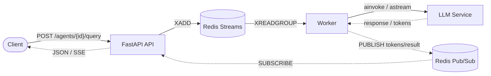
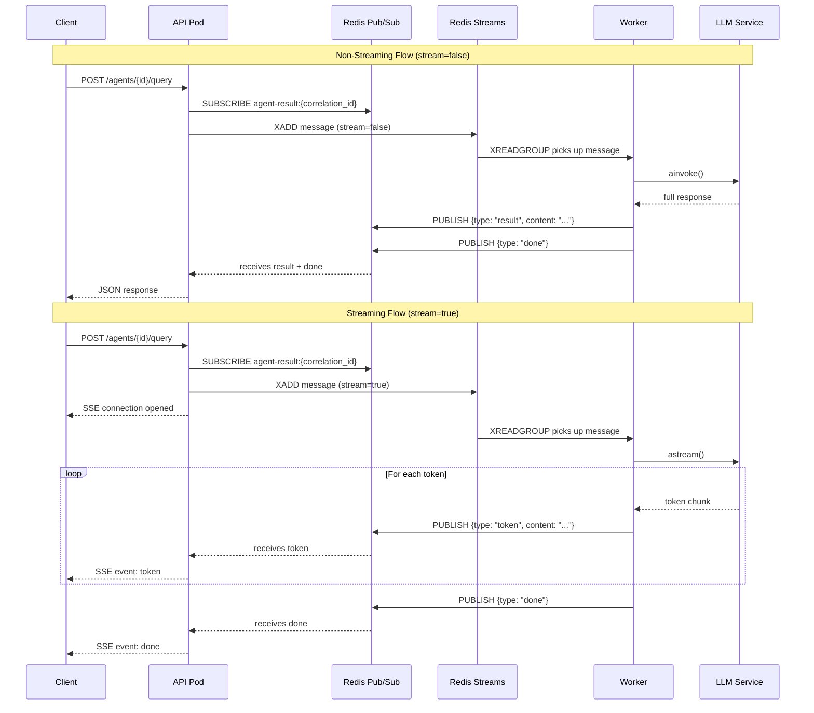
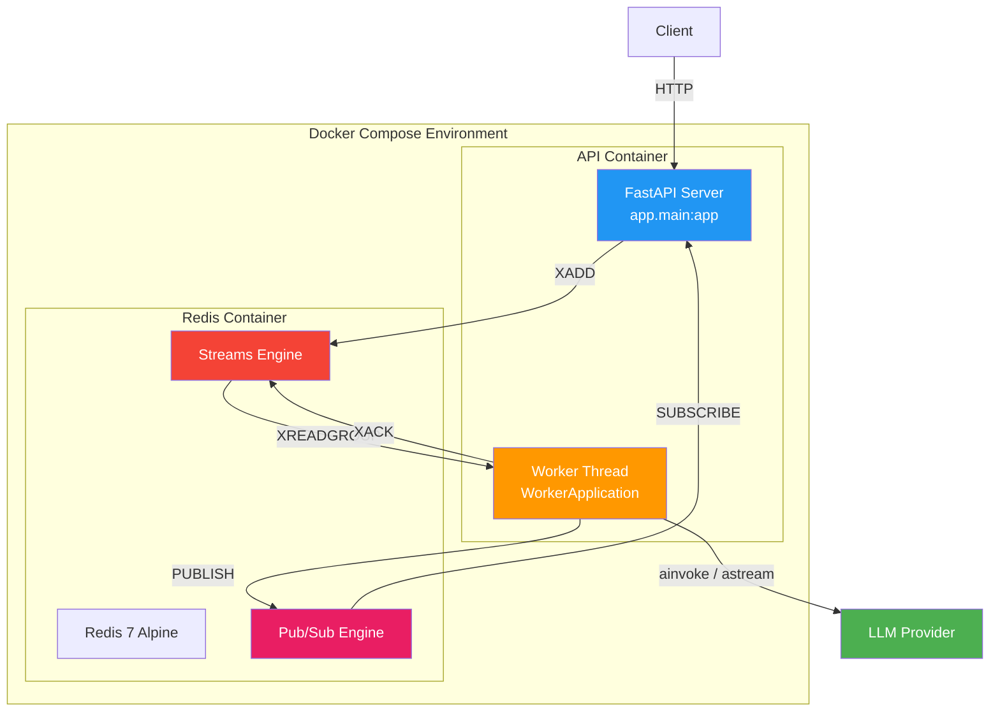

# Worker Execution POC

> Unified worker-based agent execution with **streaming support via Redis Pub/Sub**, built on **FastAPI**, **Redis Streams**, and **LangChain**.

---

## Table of Contents

- [Overview](#overview)
- [Architecture](#architecture)
- [Request Flows](#request-flows)
- [Project Structure](#project-structure)
- [Setup & Running](#setup--running)
- [API Endpoints](#api-endpoints)
- [Configuration](#configuration)
- [Redis Pub/Sub Protocol](#redis-pubsub-protocol)
- [Key Design Decisions](#key-design-decisions)

---

## Overview

This **Proof of Concept** demonstrates a unified, worker-based architecture for agent execution where **all LLM calls** — both streaming and non-streaming — are executed exclusively by a background worker process. The API pod acts purely as a relay/proxy, never invoking the LLM directly.

### How It Works

1. The **API** receives a client request and enqueues it to **Redis Streams**
2. A **Worker** consumes the message and invokes the LLM (via LangChain `ChatOpenAI`)
3. The Worker publishes results back through **Redis Pub/Sub** on a correlation-based channel
4. The API relays the Pub/Sub messages to the client — as **JSON** (non-streaming) or **SSE** (streaming)

### Key Goals

- **Worker-only LLM execution** — the API pod has zero direct LLM dependencies
- **Unified request path** — both streaming and non-streaming requests flow through Redis Streams → Worker → Redis Pub/Sub
- **Real-time streaming** — token-by-token SSE delivery via Redis Pub/Sub relay
- **Race-condition-free** — subscribe-before-publish pattern prevents missed messages
- **Scalable foundation** — workers can be scaled independently from API pods

---

## Architecture

### High-Level Flow


```mermaid
flowchart LR
    Client([Client])
    API[FastAPI API]
    RS[(Redis Streams)]
    W[Worker]
    PS[(Redis Pub/Sub)]
    LLM[LLM Service]

    Client -- "POST /agents/{id}/query" --> API
    API -- "XADD" --> RS
    RS -- "XREADGROUP" --> W
    W -- "ainvoke / astream" --> LLM
    LLM -. "response / tokens" .-> W
    W -. "PUBLISH tokens/result" .-> PS
    PS -. "SUBSCRIBE" .-> API
    API -. "JSON / SSE" .-> Client
```

### Sequence Diagram


```mermaid
sequenceDiagram
    participant C as Client
    participant API as API Pod
    participant PS as Redis Pub/Sub
    participant RS as Redis Streams
    participant W as Worker
    participant LLM as LLM Service

    Note over C,LLM: Non-Streaming Flow (stream=false)
    C->>API: POST /agents/{id}/query
    API->>PS: SUBSCRIBE agent-result:{correlation_id}
    API->>RS: XADD message (stream=false)
    RS->>W: XREADGROUP picks up message
    W->>LLM: ainvoke()
    LLM-->>W: full response
    W->>PS: PUBLISH {type: "result", content: "..."}
    W->>PS: PUBLISH {type: "done"}
    PS-->>API: receives result + done
    API-->>C: JSON response

    Note over C,LLM: Streaming Flow (stream=true)
    C->>API: POST /agents/{id}/query
    API->>PS: SUBSCRIBE agent-result:{correlation_id}
    API->>RS: XADD message (stream=true)
    API-->>C: SSE connection opened
    RS->>W: XREADGROUP picks up message
    W->>LLM: astream()
    loop For each token
        LLM-->>W: token chunk
        W->>PS: PUBLISH {type: "token", content: "..."}
        PS-->>API: receives token
        API-->>C: SSE event: token
    end
    W->>PS: PUBLISH {type: "done"}
    PS-->>API: receives done
    API-->>C: SSE event: done
```

### Component Diagram


```mermaid
graph TB
    subgraph "Docker Compose Environment"
        subgraph "API Container"
            A[FastAPI Server<br/>app.main:app]
            B[Worker Thread<br/>WorkerApplication]
        end

        subgraph "Redis Container"
            C[Redis 7 Alpine]
            C1[Streams Engine]
            C2[Pub/Sub Engine]
        end
    end

    D[Client] -->|HTTP| A
    A -->|XADD| C1
    C1 -->|XREADGROUP| B
    B -->|XACK| C1
    B -->|PUBLISH| C2
    C2 -->|SUBSCRIBE| A
    B -->|ainvoke / astream| E[LLM Provider]

    style A fill:#2196F3,color:#fff
    style B fill:#FF9800,color:#fff
    style C1 fill:#f44336,color:#fff
    style C2 fill:#E91E63,color:#fff
    style E fill:#4CAF50,color:#fff
```

---

## Request Flows

### Non-Streaming Flow (`stream: false`)

1. Client sends `POST /agents/{agent_id}/query` with `{"stream": false}`
2. API generates a `correlation_id` (UUID v4)
3. API **subscribes** to Pub/Sub channel `agent-result:{correlation_id}`
4. API **publishes** the message to Redis Streams via `XADD`
5. Worker picks up the message via `XREADGROUP`
6. Worker calls [`ExecuteAgentHandler.handle()`](app/agent_handler.py:20) → `ChatOpenAI.ainvoke()`
7. Worker publishes `{type: "result", content: "..."}` to the Pub/Sub channel
8. Worker publishes `{type: "done"}` as the terminal signal
9. Worker acknowledges the message via `XACK`
10. API receives the `result` message, builds an [`AgentExecutionResponse`](app/models.py:11), and returns JSON

### Streaming Flow (`stream: true`)

1. Client sends `POST /agents/{agent_id}/query` with `{"stream": true}`
2. API generates a `correlation_id` (UUID v4)
3. API **subscribes** to Pub/Sub channel `agent-result:{correlation_id}`
4. API **publishes** the message to Redis Streams via `XADD`
5. API immediately returns a `StreamingResponse` (SSE connection opened)
6. Worker picks up the message via `XREADGROUP`
7. Worker calls [`ExecuteAgentHandler.handle_stream()`](app/agent_handler.py:28) → `ChatOpenAI.astream()`
8. For each token chunk, Worker publishes `{type: "token", content: "Hello"}` to Pub/Sub
9. API relays each token as an SSE event: `data: {"event": "token", "data": {"token": "Hello", ...}}`
10. After all tokens, Worker publishes `{type: "done"}`
11. API relays the done event and closes the SSE connection
12. Worker acknowledges the message via `XACK`

### Error Flow

If the LLM call fails, the Worker publishes `{type: "error", content: "error message"}` followed by `{type: "done"}`. The API relays the error to the client — as an SSE error event (streaming) or as a JSON response with `status: "error"` (non-streaming).

---

## Project Structure

```
woker-execution-poc/
├── app/
│   ├── __init__.py              # Package initializer
│   ├── main.py                  # FastAPI app — request handling, Pub/Sub relay, SSE streaming
│   ├── config.py                # Settings via pydantic-settings (env vars + .env)
│   ├── models.py                # Request/Response Pydantic models
│   ├── redis_client.py          # Redis Streams + Pub/Sub async wrapper
│   ├── worker.py                # Background worker — consumes messages, invokes LLM, publishes results
│   └── agent_handler.py         # LLM invocation (ainvoke + astream) via LangChain ChatOpenAI
├── Dockerfile                   # Python 3.11-slim container image
├── docker-compose.yml           # Redis + API service orchestration
├── requirements.txt             # Python dependencies
├── ARCHITECTURE.md              # Detailed architecture design document
├── .env                         # Environment variables (not committed)
└── README.md                    # This document
```

### File Descriptions

| File | Purpose |
|------|---------|
| [`app/main.py`](app/main.py) | FastAPI application with [`lifespan`](app/main.py:27) context manager. Connects to Redis on startup, optionally spawns the worker as a daemon thread (when `LOCAL_SERVER=true`). Exposes [`POST /agents/{agent_id}/query`](app/main.py:74) and [`GET /health`](app/main.py:261). The API **never** calls the LLM directly — it subscribes to a Pub/Sub channel, enqueues work to Redis Streams, and relays Pub/Sub messages back to the client as JSON or SSE. |
| [`app/worker.py`](app/worker.py) | [`WorkerApplication`](app/worker.py:10) class that consumes messages from Redis Streams. For each message, [`_process_message()`](app/worker.py:29) branches on the `stream` flag: streaming requests use `astream()` and publish tokens one-by-one; non-streaming requests use `ainvoke()` and publish the full result. Always sends a `done` sentinel and acknowledges the message. |
| [`app/redis_client.py`](app/redis_client.py) | [`RedisStreamClient`](app/redis_client.py:8) wrapping async Redis operations: [`connect()`](app/redis_client.py:15) with consumer group creation, [`publish_message()`](app/redis_client.py:53) (XADD), [`start_processing()`](app/redis_client.py:67) (XREADGROUP loop), [`acknowledge_message()`](app/redis_client.py:126) (XACK), plus Pub/Sub methods: [`publish_pubsub()`](app/redis_client.py:141), [`subscribe_pubsub()`](app/redis_client.py:147), and [`unsubscribe_pubsub()`](app/redis_client.py:155). |
| [`app/config.py`](app/config.py) | [`Settings`](app/config.py:4) class using `pydantic-settings` `BaseSettings`. Loads configuration from environment variables and `.env` file. Defines LLM, Redis, streaming, and server configuration. |
| [`app/models.py`](app/models.py) | Pydantic v2 models: [`AgentExecutionRequest`](app/models.py:5) (with `query`, optional `conversation_id`, and `stream` flag) and [`AgentExecutionResponse`](app/models.py:11) (with `status`, `correlation_id`, `message`, optional `result`). |
| [`app/agent_handler.py`](app/agent_handler.py) | [`ExecuteAgentHandler`](app/agent_handler.py:9) class that creates a `ChatOpenAI` instance. Provides [`handle()`](app/agent_handler.py:20) for full invocation via `ainvoke()` and [`handle_stream()`](app/agent_handler.py:28) as an async generator via `astream()`. Used **only** by the worker. |
| [`Dockerfile`](Dockerfile) | Single-stage build using `python:3.11-slim`. Installs dependencies, copies source, runs Uvicorn with `--reload`. |
| [`docker-compose.yml`](docker-compose.yml) | Two services: `redis` (Redis 7 Alpine with health check) and `api` (built from Dockerfile, depends on healthy Redis). Mounts source for live reload. |

---

## Setup & Running

### Prerequisites

- **Docker** and **Docker Compose** installed
- An **OpenAI-compatible API key** (set via environment variable)

### 1. Create a `.env` file

```bash
# .env
OPENAI_API_KEY=sk-your-api-key-here

# Optional overrides (defaults shown)
# OPENAI_BASE_URL=https://ps.sapientslingshot.com/api/v1/llm
# OPENAI_MODEL=gpt-4o-mini
# REDIS_HOST=redis
# REDIS_PORT=6379
```

### 2. Build and run

```bash
docker-compose up --build
```

This starts:
- **Redis** on port `6379` (with health check)
- **API** on port `8000` (with worker thread auto-started via `LOCAL_SERVER=true`)

### 3. Verify

```bash
curl http://localhost:8000/health
# {"status":"healthy"}
```

### Stopping

```bash
docker-compose down
# To also remove volumes:
docker-compose down -v
```

---

## API Endpoints

### `POST /agents/{agent_id}/query`

Execute an agent query. Both streaming and non-streaming requests are routed through the worker.

**Path Parameters:**

| Parameter | Type | Description |
|-----------|------|-------------|
| `agent_id` | `string` | Identifier for the agent to execute |

**Request Body** ([`AgentExecutionRequest`](app/models.py:5)):

| Field | Type | Required | Default | Description |
|-------|------|----------|---------|-------------|
| `query` | `string` | ✅ Yes | — | The user query to send to the LLM |
| `conversation_id` | `string` | ❌ No | `null` | Optional conversation/session identifier |
| `stream` | `boolean` | ❌ No | `false` | When `true`, returns SSE streaming response |

#### Non-Streaming Example

```bash
curl -X POST http://localhost:8000/agents/test-agent/query \
  -H "Content-Type: application/json" \
  -d '{"query": "What is the capital of France?", "stream": false}'
```

**Response** (`application/json`):

```json
{
    "status": "completed",
    "correlation_id": "550e8400-e29b-41d4-a716-446655440000",
    "message": "Agent test-agent query completed",
    "result": "The capital of France is Paris..."
}
```

| Field | Type | Description |
|-------|------|-------------|
| `status` | `string` | `"completed"` on success, `"error"` on failure |
| `correlation_id` | `string` | UUID v4 tracking this request |
| `message` | `string` | Human-readable status message |
| `result` | `string \| null` | The LLM response content (present on success) |

#### Streaming Example

```bash
curl -X POST http://localhost:8000/agents/test-agent/query \
  -H "Content-Type: application/json" \
  -d '{"query": "Explain quantum computing", "stream": true}' \
  --no-buffer
```

**Response** (`text/event-stream`):

```
data: {"event": "token", "data": {"token": "Quantum", "correlation_id": "..."}}

data: {"event": "token", "data": {"token": " computing", "correlation_id": "..."}}

data: {"event": "token", "data": {"token": " is", "correlation_id": "..."}}

...

data: {"event": "done", "data": {"correlation_id": "..."}}

```

**SSE Event Types:**

| Event | Description |
|-------|-------------|
| `token` | A single token/chunk from the LLM response |
| `error` | An error occurred during processing |
| `done` | Terminal event — stream is complete |

Heartbeat comments (`: heartbeat`) are sent every 15 seconds (configurable) to keep the connection alive through proxies.

### `GET /health`

Simple health check endpoint.

```bash
curl http://localhost:8000/health
```

**Response:**

```json
{"status": "healthy"}
```

---

## Configuration

All configuration is managed via environment variables, loaded by [`app/config.py`](app/config.py) using `pydantic-settings`. A `.env` file is also supported.

### Environment Variables

| Variable | Type | Default | Description |
|----------|------|---------|-------------|
| `OPENAI_API_KEY` | `str` | `""` | API key for the OpenAI-compatible LLM provider |
| `OPENAI_BASE_URL` | `str` | `https://ps.sapientslingshot.com/api/v1/llm` | Base URL for the LLM API |
| `OPENAI_MODEL` | `str` | `gpt-4o-mini` | Model name to use for LLM calls |
| `REDIS_HOST` | `str` | `redis` | Redis server hostname (Docker service name) |
| `REDIS_PORT` | `int` | `6379` | Redis server port |
| `REDIS_PASSWORD` | `str` | `""` | Redis authentication password |
| `REDIS_STREAM_NAME` | `str` | `agent-execution-stream` | Name of the Redis Stream for task queuing |
| `REDIS_CONSUMER_GROUP` | `str` | `agent-workers` | Redis Streams consumer group name |
| `REDIS_CONSUMER_NAME` | `str` | `worker-1` | Consumer name within the group |
| `SSE_STREAM_TIMEOUT` | `int` | `300` | Maximum SSE connection duration in seconds |
| `SSE_HEARTBEAT_INTERVAL` | `int` | `15` | Heartbeat interval in seconds for SSE keep-alive |
| `REDIS_PUBSUB_CHANNEL_PREFIX` | `str` | `agent-result` | Prefix for Redis Pub/Sub channel names |
| `RESULT_CACHE_TTL` | `int` | `300` | Timeout (seconds) for non-streaming result wait |
| `LOCAL_SERVER` | `bool` | `true` | When `true`, spawns the worker as a daemon thread inside the API process |

---

## Redis Pub/Sub Protocol

All messages on Pub/Sub channel `{REDIS_PUBSUB_CHANNEL_PREFIX}:{correlation_id}` are JSON-encoded strings with a `type` discriminator.

### Message Types

#### `token` — Streaming token chunk

Published by the worker for each token during streaming (`astream()`).

```json
{
    "type": "token",
    "content": "Hello"
}
```

#### `result` — Full response (non-streaming)

Published by the worker with the complete LLM response for non-streaming requests (`ainvoke()`).

```json
{
    "type": "result",
    "content": "The capital of France is Paris. It is the largest city..."
}
```

#### `error` — Error notification

Published when the LLM call or processing fails.

```json
{
    "type": "error",
    "content": "Error description string"
}
```

#### `done` — Terminal signal

**Always the last message** on any channel. Signals the API to stop listening and clean up.

```json
{
    "type": "done"
}
```

### Channel Lifecycle

```
API subscribes → Worker publishes tokens/result → Worker publishes done → API unsubscribes
```

Channels are **ephemeral** — they exist only for the duration of a single request. Redis automatically cleans up Pub/Sub channels when there are no subscribers or publishers.

---

## Key Design Decisions

### 1. Subscribe-Before-Publish Pattern

The API **subscribes** to the Pub/Sub channel **before** publishing the message to Redis Streams. This prevents a race condition where the worker could process the message and publish results before the API is listening.

```
API subscribes to Pub/Sub channel
    ↓
API publishes message to Redis Streams (XADD)
    ↓
Worker picks up message (XREADGROUP)
    ↓
Worker publishes results to Pub/Sub (PUBLISH)
    ↓
API receives results (already subscribed)
```

### 2. Correlation-Based Channels

Each request gets a unique Pub/Sub channel: `agent-result:{correlation_id}`. This ensures:
- **Isolation** — responses for different requests never mix
- **No routing logic** — the channel name itself acts as the routing key
- **Automatic cleanup** — channels disappear when the subscription ends

### 3. Worker-Only LLM Execution

The API pod **never** imports or instantiates [`ExecuteAgentHandler`](app/agent_handler.py:9). All LLM calls happen exclusively in the worker. This enables:
- **Independent scaling** — scale workers separately from API pods
- **Resource isolation** — LLM compute (GPU/memory) is confined to worker pods
- **Consistent execution** — all requests follow the same code path regardless of streaming mode

### 4. Done Sentinel

The `done` message is **always** the last message on any Pub/Sub channel, even after errors. This gives the API a reliable terminal signal to:
- Stop the SSE generator loop (streaming)
- Return the response (non-streaming)
- Clean up the Pub/Sub subscription

### 5. Heartbeat Mechanism

SSE connections send `: heartbeat` comments every `SSE_HEARTBEAT_INTERVAL` seconds when no tokens are being received. This prevents proxy/load-balancer timeouts and helps detect stale connections. SSE comment lines are ignored by compliant clients.

---

## Technology Stack

| Component | Technology | Version / Details |
|-----------|-----------|-------------------|
| Language | Python | 3.11 |
| Web Framework | FastAPI + Uvicorn | FastAPI ≥0.104.0, Uvicorn ≥0.24.0 |
| Message Broker | Redis Streams + Pub/Sub | Redis 7 Alpine |
| LLM Integration | LangChain | langchain-openai ≥0.1.0, langchain-core ≥0.2.0 |
| LLM Provider | OpenAI-compatible API | Configurable via `OPENAI_BASE_URL` |
| Streaming | SSE (Server-Sent Events) | FastAPI `StreamingResponse` |
| Containerization | Docker + Docker Compose | Compose v3.8 |
| Data Validation | Pydantic v2 | pydantic ≥2.0.0, pydantic-settings ≥2.0.0 |
| Async Redis | redis-py (async) | redis ≥5.0.0 |
