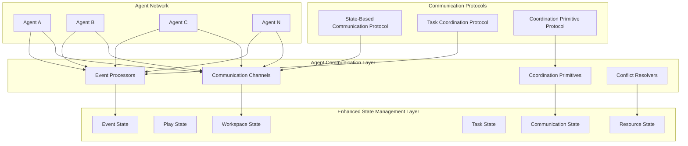

# Agent-to-Agent Communication Protocols for Autonomous Agentic Workflow Application

## Executive Summary

This document defines comprehensive agent-to-agent communication protocols for the autonomous agentic workflow application, building upon the existing State Management Service architecture. The protocols extend the workspace/play model with enhanced communication channels, coordination primitives, and event-driven mechanisms to enable robust multi-agent coordination while maintaining autonomous operation with minimal human intervention.

## Table of Contents

1. [Architecture Overview](#architecture-overview)
2. [State-Based Communication Protocol (SBCP)](#state-based-communication-protocol-sbcp)
3. [Task Coordination Protocol (TCP)](#task-coordination-protocol-tcp)
4. [Coordination Primitive Protocol (CPP)](#coordination-primitive-protocol-cpp)
5. [Enhanced Communication Channels](#enhanced-communication-channels)
6. [Event-Driven Communication Patterns](#event-driven-communication-patterns)
7. [Conflict Resolution and Coordination](#conflict-resolution-and-coordination)
8. [Error Propagation and Recovery](#error-propagation-and-recovery)
9. [Resource Coordination Protocols](#resource-coordination-protocols)
10. [Workflow Progression Mechanisms](#workflow-progression-mechanisms)
11. [Security and Isolation](#security-and-isolation)
12. [Performance Optimization](#performance-optimization)
13. [Protocol Implementation Guidelines](#protocol-implementation-guidelines)
14. [Integration Patterns](#integration-patterns)
15. [Compliance and Monitoring](#compliance-and-monitoring)

## Architecture Overview

### Communication Architecture

The agent-to-agent communication system extends the existing State Management Service with enhanced patterns for multi-agent coordination:



### Core Design Principles

1. **State-Centric Communication**: All agent communication occurs through shared workspace state
2. **Event-Driven Coordination**: State changes trigger workflow progression and agent coordination
3. **Autonomous Operation**: Minimal human intervention with intelligent conflict resolution
4. **Scalable Architecture**: Support for large-scale multi-agent workflows
5. **Fault Tolerance**: Robust error handling and recovery mechanisms
6. **Security by Design**: Built-in isolation and access control mechanisms

### Extension Points from Existing Architecture

Building upon the current State Management Service patterns:

```typescript
// Existing patterns being extended
interface ExistingStatePatterns {
  workspace: {
    id: string;
    metadata: WorkspaceMetadata;
    // EXTENDED: Enhanced with communication channels
  };
  
  play: {
    id: string;
    workspaceId: string;
    metadata: PlayMetadata;
    // EXTENDED: Enhanced with coordination state
  };
  
  playBlock: {
    playId: string;
    blockId: string;
    metadata: BlockMetadata;
    // EXTENDED: Enhanced with synchronization primitives
  };
  
  record: {
    workspaceId: string;
    recordType: string;
    recordId: string;
    data: any;
    // EXTENDED: Enhanced with event triggers
  };
}

// New communication extensions
interface CommunicationExtensions {
  communicationChannels: CommunicationChannel[];
  coordinationPrimitives: CoordinationPrimitive[];
  eventTriggers: EventTrigger[];
  conflictResolvers: ConflictResolver[];
  resourceCoordinators: ResourceCoordinator[];
}
```

## State-Based Communication Protocol (SBCP)

### Protocol Specification

**Protocol Version**: 1.0  
**Compliance Level**: Full  
**Base Pattern**: Workspace/Play State Extension

### Core Components

#### 1. Communication Channel Schema

```typescript
interface CommunicationChannel {
  id: string;
  workspaceId: string;
  playId?: string;
  
  // Channel configuration
  name: string;
  type: ChannelType;
  scope: ChannelScope;
  persistence: PersistencePolicy;
  
  // Participants
  authorizedAgents: AgentPermission[];
  activeParticipants: string[];
  maxParticipants?: number;
  
  // Message management
  messages: ChannelMessage[];
  messageHistory: MessageHistory[];
  retentionPolicy: RetentionPolicy;
  
  // Channel state
  status: ChannelStatus;
  createdAt: Date;
  lastActivity: Date;
  metadata: ChannelMetadata;
}

enum ChannelType {
  BROADCAST = 'BROADCAST',           // One-to-many communication
  MULTICAST = 'MULTICAST',           // Group communication
  QUEUE = 'QUEUE',                   // Task distribution
  TOPIC = 'TOPIC',                   // Event-based communication
  PIPELINE = 'PIPELINE',             // Sequential processing
  COLLABORATION = 'COLLABORATION',    // Peer-to-peer coordination
  NOTIFICATION = 'NOTIFICATION',      // System notifications
  COORDINATION = 'COORDINATION'       // Workflow coordination
}

enum ChannelScope {
  WORKFLOW = 'WORKFLOW',             // Workflow-wide communication
  TASK_GROUP = 'TASK_GROUP',         // Task group coordination
  AGENT_PAIR = 'AGENT_PAIR',         // Direct agent communication
  SYSTEM = 'SYSTEM',                 // System-level communication
  CUSTOM = 'CUSTOM'                  // Custom scope definition
}

interface AgentPermission {
  agentId: string;
  permissions: Permission[];
  constraints: AccessConstraint[];
  grantedAt: Date;
  expiresAt?: Date;
}

enum Permission {
  READ = 'READ',
  WRITE = 'WRITE',
  SUBSCRIBE = 'SUBSCRIBE',
  MODERATE = 'MODERATE',
  ADMIN = 'ADMIN'
}
```

#### 2. Message Format Specification

```typescript
interface ChannelMessage {
  // Message identification
  id: string;
  channelId: string;
  messageType: MessageType;
  protocolVersion: string;
  
  // Message content
  payload: MessagePayload;
  metadata: MessageMetadata;
  
  // Sender information
  fromAgentId: string;
  fromAgentType: string;
  
  // Delivery information
  toAgentId?: string;              // For direct messages
  targetGroup?: string;            // For group messages
  broadcast: boolean;
  
  // Message lifecycle
  timestamp: Date;
  expiresAt?: Date;
  priority: MessagePriority;
  
  // Threading and correlation
  correlationId?: string;
  replyToMessageId?: string;
  threadId?: string;
  
  // Delivery tracking
  deliveryStatus: DeliveryStatus;
  readBy: AgentRead[];
  acknowledgedBy: AgentAcknowledgment[];
  
  // Protocol compliance
  compliance: ComplianceInfo;
}

enum MessageType {
  // Task coordination
  TASK_REQUEST = 'TASK_REQUEST',
  TASK_RESPONSE = 'TASK_RESPONSE',
  TASK_UPDATE = 'TASK_UPDATE',
  TASK_COMPLETION = 'TASK_COMPLETION',
  
  // Workflow coordination
  WORKFLOW_EVENT = 'WORKFLOW_EVENT',
  STATE_CHANGE = 'STATE_CHANGE',
  SYNCHRONIZATION = 'SYNCHRONIZATION',
  
  // Agent coordination
  AGENT_DISCOVERY = 'AGENT_DISCOVERY',
  CAPABILITY_ANNOUNCEMENT = 'CAPABILITY_ANNOUNCEMENT',
  RESOURCE_REQUEST = 'RESOURCE_REQUEST',
  RESOURCE_RESPONSE = 'RESOURCE_RESPONSE',
  
  // Error handling
  ERROR_REPORT = 'ERROR_REPORT',
  RECOVERY_REQUEST = 'RECOVERY_REQUEST',
  ESCALATION = 'ESCALATION',
  
  // System messages
  HEARTBEAT = 'HEARTBEAT',
  STATUS_UPDATE = 'STATUS_UPDATE',
  NOTIFICATION = 'NOTIFICATION',
  
  // Custom messages
  CUSTOM = 'CUSTOM'
}

interface MessagePayload {
  contentType: string;
  content: any;
  attachments?: MessageAttachment[];
  schema?: PayloadSchema;
}

enum MessagePriority {
  LOW = 'LOW',
  NORMAL = 'NORMAL',
  HIGH = 'HIGH',
  URGENT = 'URGENT',
  CRITICAL = 'CRITICAL'
}

interface ComplianceInfo {
  protocolVersion: string;
  encrypted: boolean;
  signed: boolean;
  auditable: boolean;
  persistent: boolean;
  validated: boolean;
}
```

#### 3. State-Based Message Operations

```typescript
class SBCPMessageOperations {
  async sendMessage(
    channelId: string,
    message: ChannelMessage,
    options: SendOptions = {}
  ): Promise<MessageResult> {
    
    // Validate message compliance
    await this.validateMessageCompliance(message);
    
    // Check channel permissions
    await this.validateChannelPermissions(channelId, message.fromAgentId);
    
    // Apply message transformations
    const processedMessage = await this.processMessage(message, options);
    
    // Store message in state
    await this.stateService.updateRecord({
      workspaceId: processedMessage.workspaceId,
      recordType: 'COMMUNICATION_CHANNEL',
      recordId: channelId,
      data: {
        messages: {
          operation: 'APPEND',
          value: processedMessage
        },
        lastActivity: new Date(),
        messageCount: { operation: 'INCREMENT', value: 1 }
      }
    });
    
    // Trigger event notifications
    await this.triggerMessageEvents(processedMessage);
    
    return {
      messageId: processedMessage.id,
      status: 'SENT',
      timestamp: processedMessage.timestamp,
      deliveryEstimate: this.calculateDeliveryEstimate(channelId)
    };
  }
  
  async readMessages(
    channelId: string,
    agentId: string,
    filter: MessageFilter = {}
  ): Promise<ChannelMessage[]> {
    
    // Validate read permissions
    await this.validateReadPermissions(channelId, agentId);
    
    // Retrieve channel state
    const channelRecord = await this.stateService.getRecord({
      workspaceId: filter.workspaceId,
      recordType: 'COMMUNICATION_CHANNEL',
      recordId: channelId
    });
    
    const channel = channelRecord.data as CommunicationChannel;
    
    // Apply filters
    let messages = channel.messages;
    if (filter.since) {
      messages = messages.filter(m => m.timestamp >= filter.since);
    }
    if (filter.messageTypes) {
      messages = messages.filter(m => filter.messageTypes.includes(m.messageType));
    }
    if (filter.fromAgent) {
      messages = messages.filter(m => m.fromAgentId === filter.fromAgent);
    }
    
    // Mark messages as read
    await this.markMessagesAsRead(channelId, agentId, messages.map(m => m.id));
    
    return messages;
  }
  
  async subscribeToChannel(
    channelId: string,
    agentId: string,
    subscription: ChannelSubscription
  ): Promise<SubscriptionResult> {
    
    // Validate subscription permissions
    await this.validateSubscriptionPermissions(channelId, agentId);
    
    // Create event trigger for the subscription
    const eventTrigger: EventTrigger = {
      id: generateId(),
      type: 'CHANNEL_MESSAGE',
      source: channelId,
      targetAgentId: agentId,
      conditions: subscription.conditions,
      actions: subscription.actions,
      active: true,
      createdAt: new Date()
    };
    
    // Store event trigger in state
    await this.stateService.createRecord({
      workspaceId: subscription.workspaceId,
      recordType: 'EVENT_TRIGGER',
      recordId: eventTrigger.id,
      data: eventTrigger
    });
    
    return {
      subscriptionId: eventTrigger.id,
      status: 'ACTIVE',
      channelId,
      agentId
    };
  }
}
```

### SBCP Implementation Patterns

#### 1. Broadcast Communication Pattern

```typescript
class BroadcastCommunication {
  async setupBroadcastChannel(
    workspaceId: string,
    channelConfig: BroadcastChannelConfig
  ): Promise<CommunicationChannel> {
    
    const channel: CommunicationChannel = {
      id: generateId(),
      workspaceId,
      name: channelConfig.name,
      type: ChannelType.BROADCAST,
      scope: ChannelScope.WORKFLOW,
      persistence: {
        persistent: true,
        maxMessages: channelConfig.maxMessages || 1000,
        retentionDays: channelConfig.retentionDays || 30
      },
      authorizedAgents: channelConfig.authorizedAgents,
      activeParticipants: [],
      messages: [],
      messageHistory: [],
      status: ChannelStatus.ACTIVE,
      createdAt: new Date(),
      lastActivity: new Date(),
      metadata: channelConfig.metadata || {}
    };
    
    await this.stateService.createRecord({
      workspaceId,
      recordType: 'COMMUNICATION_CHANNEL',
      recordId: channel.id,
      data: channel
    });
    
    return channel;
  }
  
  async broadcastMessage(
    channelId: string,
    fromAgentId: string,
    message: BroadcastMessage
  ): Promise<BroadcastResult> {
    
    const channelMessage: ChannelMessage = {
      id: generateId(),
      channelId,
      messageType: MessageType.WORKFLOW_EVENT,
      protocolVersion: '1.0',
      payload: {
        contentType: 'application/json',
        content: message.content
      },
      metadata: {
        broadcast: true,
        scope: message.scope,
        priority: message.priority || MessagePriority.NORMAL
      },
      fromAgentId,
      fromAgentType: message.fromAgentType,
      broadcast: true,
      timestamp: new Date(),
      priority: message.priority || MessagePriority.NORMAL,
      deliveryStatus: DeliveryStatus.PENDING,
      readBy: [],
      acknowledgedBy: [],
      compliance: {
        protocolVersion: '1.0',
        encrypted: false,
        signed: true,
        auditable: true,
        persistent: true,
        validated: true
      }
    };
    
    const result = await this.sendMessage(channelId, channelMessage);
    
    // Track broadcast delivery
    const deliveryTracking = await this.trackBroadcastDelivery(channelId, channelMessage.id);
    
    return