# Autonomous Workflow Service Architecture

## Executive Summary

The Autonomous Workflow Service is designed to orchestrate multi-agent processes that can automatically create, execute, and manage complex business workflows from natural language descriptions. This service integrates with the existing LLM Service, Agent Service, and State Management Service to provide a comprehensive autonomous workflow platform using shared state-based communication.

## Table of Contents

1. [Service Overview](#service-overview)
2. [Core Architecture](#core-architecture)
3. [Component Design](#component-design)
4. [Autonomous Workflow Creation](#autonomous-workflow-creation)
5. [Workflow Execution Engine](#workflow-execution-engine)
6. [Agent-to-Agent Communication](#agent-to-agent-communication)
7. [Workflow Lifecycle Management](#workflow-lifecycle-management)
8. [Integration Patterns](#integration-patterns)
9. [Autonomous Operation Mechanisms](#autonomous-operation-mechanisms)
10. [API Specifications](#api-specifications)
11. [Architectural Diagrams](#architectural-diagrams)

## Service Overview

**Base URL:** `https://dev.lionis.ai/api/v1/workflows/`
**OpenAPI Version:** 3.1.0

### Key Capabilities

- **Natural Language Workflow Creation**: Convert business process descriptions into executable multi-agent workflows
- **Autonomous Execution**: Self-managing workflow execution with minimal human intervention
- **Multi-Agent Coordination**: Orchestrate complex interactions between specialized agents
- **Shared State Communication**: Enable agent coordination through shared workspace state
- **Adaptive Workflow Management**: Self-modify workflows based on execution patterns and outcomes
- **Business Process Automation**: Support general-purpose automation workflows

### Design Principles

1. **Autonomy First**: Minimize human intervention in workflow creation and execution
2. **Agent-Centric**: Design around agent capabilities and shared state patterns
3. **Adaptive Intelligence**: Learn and improve from workflow execution patterns
4. **Seamless Integration**: Leverage existing service ecosystem effectively
5. **Business Process Focus**: Optimize for real-world business automation scenarios
6. **State-Driven Coordination**: Use shared workspace state for agent communication

## Core Architecture

### High-Level Architecture

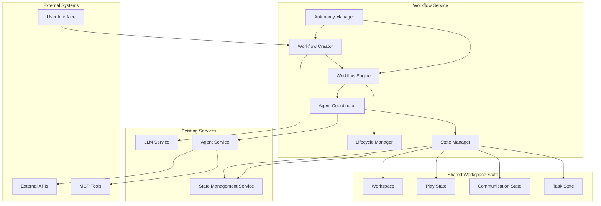

### Service Components

The Workflow Service consists of six core components:

1. **Workflow Creator**: Transforms natural language into executable workflows
2. **Workflow Engine**: Manages workflow execution and state transitions
3. **Agent Coordinator**: Orchestrates multi-agent interactions and task distribution
4. **State Manager**: Handles shared workspace state for agent communication
5. **Lifecycle Manager**: Manages workflow lifecycle from creation to completion
6. **Autonomy Manager**: Implements self-modification and learning capabilities

## Component Design

### 1. Workflow Creator

**Responsibility**: Convert natural language descriptions into structured, executable workflows

#### Core Functions
- **Natural Language Processing**: Parse and understand business process descriptions
- **Workflow Graph Generation**: Create directed acyclic graphs representing workflow steps
- **Agent Role Assignment**: Determine required agent types and capabilities
- **Dependency Analysis**: Identify task dependencies and execution order
- **Validation**: Ensure workflow feasibility and resource availability

#### Key Data Models
```typescript
interface WorkflowDefinition {
  id: string;
  name: string;
  description: string;
  version: string;
  createdAt: Date;
  createdBy: string;
  
  // Workflow structure
  nodes: WorkflowNode[];
  edges: WorkflowEdge[];
  
  // Execution metadata
  estimatedDuration: number;
  requiredAgentTypes: AgentType[];
  requiredTools: ToolRequirement[];
  
  // Autonomy settings
  autonomyLevel: AutonomyLevel;
  selfModificationEnabled: boolean;
  learningEnabled: boolean;
  
  // State management
  sharedStateSchema: StateSchema;
  communicationPatterns: CommunicationPattern[];
}

interface WorkflowNode {
  id: string;
  type: NodeType; // AGENT_TASK, DECISION, PARALLEL, MERGE, CONDITION
  name: string;
  description: string;
  
  // Agent configuration
  agentType: AgentType;
  agentConfig: AgentConfiguration;
  
  // Task definition
  task: TaskDefinition;
  inputs: InputDefinition[];
  outputs: OutputDefinition[];
  
  // State interaction
  stateReads: StateReadDefinition[];
  stateWrites: StateWriteDefinition[];
  
  // Execution constraints
  timeout: number;
  retryPolicy: RetryPolicy;
  dependencies: string[];
}

interface StateSchema {
  communicationChannels: ChannelSchema[];
  taskStates: TaskStateSchema[];
  sharedData: DataSchema[];
  coordinationPrimitives: CoordinationSchema[];
}
```

#### Integration Points
- **LLM Service**: For natural language understanding and workflow generation
- **Agent Service**: For agent capability discovery and validation
- **State Management Service**: For workflow definition persistence

### 2. Workflow Engine

**Responsibility**: Execute workflows and manage state transitions

#### Core Functions
- **Execution Orchestration**: Coordinate workflow step execution
- **State Management**: Track workflow and task execution states
- **Error Handling**: Implement comprehensive error recovery mechanisms
- **Resource Management**: Allocate and deallocate agents and resources
- **Performance Monitoring**: Track execution metrics and performance

#### Key Data Models
```typescript
interface WorkflowExecution {
  id: string;
  workflowDefinitionId: string;
  workspaceId: string;
  playId: string;
  
  // Execution state
  status: ExecutionStatus; // PENDING, RUNNING, PAUSED, COMPLETED, FAILED
  currentNodes: string[];
  completedNodes: string[];
  failedNodes: string[];
  
  // Timing
  startedAt: Date;
  completedAt?: Date;
  estimatedCompletionAt?: Date;
  
  // Resources
  allocatedAgents: AgentAllocation[];
  executionContext: ExecutionContext;
  
  // Shared state
  sharedStateId: string;
  stateVersion: number;
  
  // Results
  outputs: WorkflowOutput[];
  metrics: ExecutionMetrics;
}

interface NodeExecution {
  id: string;
  nodeId: string;
  workflowExecutionId: string;
  agentId: string;
  
  status: NodeExecutionStatus;
  startedAt: Date;
  completedAt?: Date;
  
  inputs: any;
  outputs: any;
  error?: ExecutionError;
  
  // State interactions
  stateReads: StateRead[];
  stateWrites: StateWrite[];
  
  retryCount: number;
  metrics: NodeMetrics;
}
```

#### State Transition Model
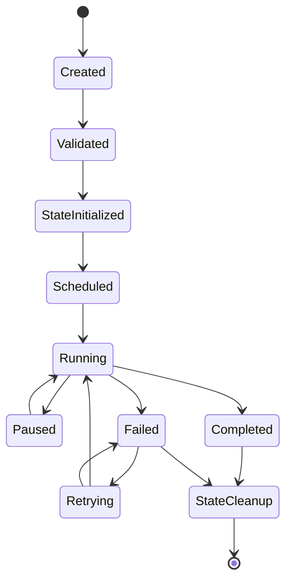

### 3. Agent Coordinator

**Responsibility**: Orchestrate multi-agent interactions and task distribution

#### Core Functions
- **Agent Provisioning**: Create and configure agents for workflow tasks
- **Task Distribution**: Assign tasks to appropriate agents
- **Load Balancing**: Distribute workload across available agents
- **Agent Lifecycle Management**: Monitor agent health and performance
- **State-Based Coordination**: Implement coordination through shared state

#### Key Data Models
```typescript
interface AgentAllocation {
  id: string;
  workflowExecutionId: string;
  agentId: string;
  agentType: AgentType;
  
  // Assignment
  assignedNodes: string[];
  currentTask?: string;
  
  // Status
  status: AgentStatus; // IDLE, BUSY, ERROR, OFFLINE
  lastHeartbeat: Date;
  
  // State access
  stateAccessPermissions: StatePermission[];
  assignedStateChannels: string[];
  
  // Performance
  tasksCompleted: number;
  averageTaskDuration: number;
  errorRate: number;
}

interface CoordinationPattern {
  id: string;
  name: string;
  type: PatternType; // PIPELINE, PARALLEL, HIERARCHICAL, COLLABORATIVE
  description: string;
  
  // Pattern definition
  roles: AgentRole[];
  stateInteractions: StateInteraction[];
  coordinationRules: CoordinationRule[];
}
```

#### Coordination Patterns
1. **Pipeline Pattern**: Sequential task processing with state handoffs
2. **Parallel Pattern**: Concurrent task execution with shared state access
3. **Hierarchical Pattern**: Manager-worker relationships through state delegation
4. **Collaborative Pattern**: Peer collaboration through shared communication channels

### 4. State Manager

**Responsibility**: Handle shared workspace state for agent communication

#### Core Functions
- **State Channel Management**: Create and manage communication channels in shared state
- **State Synchronization**: Ensure consistent state access across agents
- **Communication Facilitation**: Enable agent coordination through state reads/writes
- **State Versioning**: Track state changes and provide conflict resolution
- **Access Control**: Manage agent permissions for state access

#### Key Data Models
```typescript
interface SharedWorkspaceState {
  workspaceId: string;
  workflowExecutionId: string;
  version: number;
  lastUpdated: Date;
  
  // Communication channels
  communicationChannels: CommunicationChannel[];
  
  // Task coordination
  taskStates: TaskState[];
  taskQueues: TaskQueue[];
  
  // Shared data
  sharedData: SharedDataItem[];
  
  // Coordination primitives
  locks: StateLock[];
  barriers: StateBarrier[];
  semaphores: StateSemaphore[];
}

interface CommunicationChannel {
  id: string;
  name: string;
  type: ChannelType; // BROADCAST, MULTICAST, QUEUE, TOPIC
  
  // Participants
  authorizedAgents: string[];
  activeParticipants: string[];
  
  // Messages
  messages: ChannelMessage[];
  messageHistory: MessageHistory[];
  
  // Configuration
  persistent: boolean;
  maxMessages: number;
  retentionPeriod: number;
  
  // State metadata
  createdAt: Date;
  lastActivity: Date;
}

interface TaskState {
  taskId: string;
  nodeId: string;
  agentId?: string;
  
  status: TaskStatus; // PENDING, ASSIGNED, IN_PROGRESS, COMPLETED, FAILED
  priority: Priority;
  
  // Task data
  inputs: any;
  outputs?: any;
  progress?: TaskProgress;
  
  // Coordination
  dependencies: string[];
  dependents: string[];
  blockedBy: string[];
  
  // Timing
  createdAt: Date;
  assignedAt?: Date;
  startedAt?: Date;
  completedAt?: Date;
  deadline?: Date;
}

interface ChannelMessage {
  id: string;
  channelId: string;
  fromAgentId: string;
  
  // Message content
  type: MessageType; // TASK_REQUEST, TASK_RESPONSE, COORDINATION, DATA_SHARE
  payload: any;
  metadata: MessageMetadata;
  
  // Delivery
  timestamp: Date;
  expiresAt?: Date;
  readBy: AgentRead[];
  
  // Threading
  replyToMessageId?: string;
  threadId?: string;
}
```

#### State-Based Communication Patterns

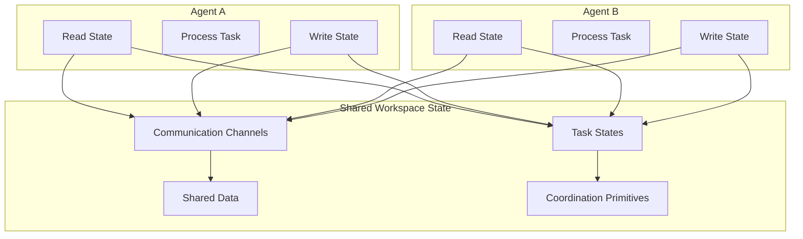

### 5. Lifecycle Manager

**Responsibility**: Manage workflow lifecycle from creation to completion

#### Core Functions
- **Lifecycle Orchestration**: Coordinate workflow lifecycle phases
- **Version Management**: Handle workflow versioning and updates
- **State Cleanup**: Clean up shared state after workflow completion
- **Archival Management**: Archive completed workflows and execution data
- **Monitoring Integration**: Integrate with monitoring and alerting systems

#### Key Data Models
```typescript
interface WorkflowLifecycle {
  workflowId: string;
  currentPhase: LifecyclePhase;
  phases: LifecyclePhaseExecution[];
  
  // State management
  sharedStateId: string;
  stateCleanupScheduled: boolean;
  stateRetentionPolicy: StateRetentionPolicy;
  
  // Lifecycle metadata
  createdAt: Date;
  lastTransitionAt: Date;
  scheduledTransitions: ScheduledTransition[];
  
  // Cleanup configuration
  retentionPolicy: RetentionPolicy;
  cleanupSchedule: CleanupSchedule;
}

enum LifecyclePhase {
  DESIGN = 'DESIGN',
  VALIDATION = 'VALIDATION',
  STATE_INITIALIZATION = 'STATE_INITIALIZATION',
  DEPLOYMENT = 'DEPLOYMENT',
  EXECUTION = 'EXECUTION',
  MONITORING = 'MONITORING',
  COMPLETION = 'COMPLETION',
  STATE_CLEANUP = 'STATE_CLEANUP',
  ARCHIVAL = 'ARCHIVAL'
}

interface StateRetentionPolicy {
  communicationChannels: RetentionRule;
  taskStates: RetentionRule;
  sharedData: RetentionRule;
  coordinationPrimitives: RetentionRule;
  
  archiveBeforeCleanup: boolean;
  compressionEnabled: boolean;
}
```

### 6. Autonomy Manager

**Responsibility**: Implement self-modification and learning capabilities

#### Core Functions
- **Pattern Recognition**: Identify patterns in workflow execution and state usage
- **Performance Analysis**: Analyze workflow and agent performance
- **Optimization Recommendations**: Suggest workflow improvements
- **Self-Modification**: Automatically modify workflows based on learning
- **State Pattern Analysis**: Analyze communication patterns in shared state

#### Key Data Models
```typescript
interface AutonomyConfiguration {
  workflowId: string;
  
  // Learning settings
  learningEnabled: boolean;
  learningMode: LearningMode; // PASSIVE, ACTIVE, AGGRESSIVE
  
  // Modification settings
  selfModificationEnabled: boolean;
  modificationScope: ModificationScope; //
  modificationScope: ModificationScope; // PARAMETERS, STRUCTURE, AGENTS, STATE_SCHEMA
  approvalRequired: boolean;
  
  // Analysis settings
  patternAnalysisEnabled: boolean;
  statePatternAnalysis: boolean;
  performanceThresholds: PerformanceThreshold[];
  optimizationTargets: OptimizationTarget[];
}

interface WorkflowLearning {
  workflowId: string;
  
  // Execution patterns
  executionPatterns: ExecutionPattern[];
  stateUsagePatterns: StateUsagePattern[];
  communicationPatterns: CommunicationPattern[];
  performanceMetrics: PerformanceMetric[];
  
  // Identified improvements
  optimizationOpportunities: OptimizationOpportunity[];
  appliedOptimizations: AppliedOptimization[];
  
  // Learning metadata
  lastAnalysisAt: Date;
  learningConfidence: number;
  dataPoints: number;
}

interface StateUsagePattern {
  channelId: string;
  pattern: UsagePattern; // HIGH_FREQUENCY, BURST, PERIODIC, SPARSE
  averageMessageRate: number;
  peakMessageRate: number;
  participantCount: number;
  
  // Optimization suggestions
  suggestedOptimizations: StateOptimization[];
}
```

## Autonomous Workflow Creation

### Natural Language Processing Pipeline

The workflow creation process transforms natural language descriptions into executable workflows through a sophisticated NLP pipeline:

```mermaid
graph LR
    A[Natural Language Input] --> B[Intent Recognition]
    B --> C[Entity Extraction]
    C --> D[Process Modeling]
    D --> E[Agent Assignment]
    E --> F[State Schema Design]
    F --> G[Dependency Analysis]
    G --> H[Workflow Graph Generation]
    H --> I[Validation & Optimization]
    I --> J[Executable Workflow]
```

#### 1. Intent Recognition
- **Business Process Identification**: Recognize the type of business process
- **Goal Extraction**: Identify the primary objectives and outcomes
- **Constraint Detection**: Identify timing, resource, and quality constraints
- **Complexity Assessment**: Evaluate workflow complexity and requirements

#### 2. Entity Extraction
- **Actor Identification**: Identify roles, departments, and stakeholders
- **Resource Recognition**: Identify required tools, systems, and data sources
- **Action Extraction**: Identify specific tasks and activities
- **Condition Detection**: Identify decision points and conditional logic

#### 3. Process Modeling
- **Task Decomposition**: Break down complex processes into manageable tasks
- **Sequence Identification**: Determine task execution order and dependencies
- **Parallel Opportunity Detection**: Identify tasks that can run concurrently
- **Decision Point Mapping**: Map conditional logic and branching

#### 4. Agent Assignment
- **Capability Matching**: Match tasks to agent capabilities
- **Specialization Optimization**: Assign specialized agents for specific domains
- **Load Distribution**: Balance workload across available agents
- **Skill Gap Analysis**: Identify missing capabilities and suggest solutions

#### 5. State Schema Design
- **Communication Channel Planning**: Design shared state communication channels
- **Data Flow Mapping**: Map data dependencies and shared data requirements
- **Coordination Primitive Selection**: Choose appropriate synchronization mechanisms
- **Access Pattern Optimization**: Optimize state access patterns for performance

### Workflow Generation Algorithm

```typescript
class WorkflowCreator {
  async createWorkflowFromNaturalLanguage(
    description: string,
    context: BusinessContext
  ): Promise<WorkflowDefinition> {
    
    // Step 1: Parse natural language
    const parsedInput = await this.parseNaturalLanguage(description);
    
    // Step 2: Extract business process structure
    const processStructure = await this.extractProcessStructure(parsedInput, context);
    
    // Step 3: Generate workflow graph
    const workflowGraph = await this.generateWorkflowGraph(processStructure);
    
    // Step 4: Design shared state schema
    const stateSchema = await this.designStateSchema(workflowGraph);
    
    // Step 5: Assign agents and tools
    const agentAssignments = await this.assignAgentsAndTools(workflowGraph, stateSchema);
    
    // Step 6: Optimize workflow
    const optimizedWorkflow = await this.optimizeWorkflow(workflowGraph, stateSchema, agentAssignments);
    
    // Step 7: Validate and finalize
    const validatedWorkflow = await this.validateWorkflow(optimizedWorkflow);
    
    return validatedWorkflow;
  }
  
  private async designStateSchema(workflowGraph: WorkflowGraph): Promise<StateSchema> {
    const communicationChannels = await this.identifyCommunicationNeeds(workflowGraph);
    const sharedData = await this.identifySharedDataRequirements(workflowGraph);
    const coordinationPrimitives = await this.identifyCoordinationNeeds(workflowGraph);
    
    return {
      communicationChannels,
      taskStates: this.generateTaskStateSchema(workflowGraph),
      sharedData,
      coordinationPrimitives
    };
  }
}
```

### Example: Natural Language to Workflow

**Input**: "Create a customer onboarding process that verifies identity, sets up accounts, sends welcome materials, and schedules follow-up calls"

**Generated Workflow**:
```typescript
{
  name: "Customer Onboarding Process",
  nodes: [
    {
      id: "identity-verification",
      type: "AGENT_TASK",
      agentType: "VERIFICATION_AGENT",
      task: "Verify customer identity documents",
      stateReads: ["customer-data"],
      stateWrites: ["verification-status", "verification-results"]
    },
    {
      id: "account-setup",
      type: "AGENT_TASK",
      agentType: "ACCOUNT_AGENT",
      task: "Create customer accounts and profiles",
      stateReads: ["verification-status", "customer-data"],
      stateWrites: ["account-details", "setup-status"]
    },
    {
      id: "welcome-materials",
      type: "PARALLEL",
      children: [
        {
          id: "email-welcome",
          agentType: "COMMUNICATION_AGENT",
          stateReads: ["account-details"],
          stateWrites: ["email-sent-status"]
        },
        {
          id: "physical-materials",
          agentType: "FULFILLMENT_AGENT",
          stateReads: ["account-details"],
          stateWrites: ["materials-sent-status"]
        }
      ]
    },
    {
      id: "schedule-followup",
      type: "AGENT_TASK",
      agentType: "SCHEDULING_AGENT",
      task: "Schedule follow-up call",
      stateReads: ["account-details", "email-sent-status"],
      stateWrites: ["followup-scheduled"]
    }
  ],
  sharedStateSchema: {
    communicationChannels: [
      {
        name: "onboarding-coordination",
        type: "BROADCAST",
        authorizedAgents: ["*"]
      }
    ],
    taskStates: [
      { name: "customer-data", type: "INPUT" },
      { name: "verification-status", type: "COORDINATION" },
      { name: "account-details", type: "SHARED_DATA" },
      { name: "followup-scheduled", type: "OUTPUT" }
    ]
  }
}
```

## Workflow Execution Engine

### Execution Architecture

The Workflow Execution Engine manages the orchestration of multi-agent workflows through shared state coordination:

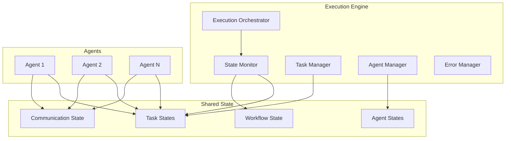

### Execution Flow

#### 1. Workflow Initialization
```typescript
class WorkflowExecutionEngine {
  async initializeWorkflow(
    workflowDefinition: WorkflowDefinition,
    inputs: WorkflowInputs
  ): Promise<WorkflowExecution> {
    
    // Create workspace and play
    const workspace = await this.stateService.createWorkspace({
      name: `${workflowDefinition.name}-${Date.now()}`,
      metadata: { workflowId: workflowDefinition.id }
    });
    
    const play = await this.stateService.createPlay({
      workspaceId: workspace.id,
      metadata: { executionType: 'AUTONOMOUS_WORKFLOW' }
    });
    
    // Initialize shared state
    const sharedState = await this.initializeSharedState(
      workspace.id,
      workflowDefinition.sharedStateSchema,
      inputs
    );
    
    // Create workflow execution record
    const execution = await this.createWorkflowExecution({
      workflowDefinitionId: workflowDefinition.id,
      workspaceId: workspace.id,
      playId: play.id,
      sharedStateId: sharedState.id,
      status: 'PENDING'
    });
    
    return execution;
  }
  
  private async initializeSharedState(
    workspaceId: string,
    stateSchema: StateSchema,
    inputs: WorkflowInputs
  ): Promise<SharedWorkspaceState> {
    
    // Create communication channels
    const channels = await Promise.all(
      stateSchema.communicationChannels.map(channel => 
        this.createCommunicationChannel(workspaceId, channel)
      )
    );
    
    // Initialize task states
    const taskStates = await this.initializeTaskStates(workspaceId, stateSchema.taskStates);
    
    // Set up shared data
    const sharedData = await this.initializeSharedData(workspaceId, stateSchema.sharedData, inputs);
    
    // Create coordination primitives
    const coordinationPrimitives = await this.createCoordinationPrimitives(
      workspaceId, 
      stateSchema.coordinationPrimitives
    );
    
    return {
      workspaceId,
      version: 1,
      lastUpdated: new Date(),
      communicationChannels: channels,
      taskStates,
      sharedData,
      ...coordinationPrimitives
    };
  }
}
```

#### 2. Agent Coordination Through State

```typescript
class AgentCoordinator {
  async coordinateAgents(execution: WorkflowExecution): Promise<void> {
    const readyNodes = await this.identifyReadyNodes(execution);
    
    for (const node of readyNodes) {
      await this.assignNodeToAgent(execution, node);
    }
  }
  
  private async assignNodeToAgent(
    execution: WorkflowExecution,
    node: WorkflowNode
  ): Promise<void> {
    
    // Find or create suitable agent
    const agent = await this.findOrCreateAgent(node.agentType, node.agentConfig);
    
    // Grant state access permissions
    await this.grantStateAccess(agent.id, execution.sharedStateId, node);
    
    // Create task state entry
    await this.createTaskState(execution.sharedStateId, {
      taskId: node.id,
      nodeId: node.id,
      agentId: agent.id,
      status: 'ASSIGNED',
      inputs: await this.resolveInputs(execution.sharedStateId, node.inputs),
      dependencies: node.dependencies,
      createdAt: new Date()
    });
    
    // Notify agent through state
    await this.notifyAgentThroughState(execution.sharedStateId, agent.id, {
      type: 'TASK_ASSIGNMENT',
      taskId: node.id,
      instructions: node.task
    });
  }
  
  private async notifyAgentThroughState(
    sharedStateId: string,
    agentId: string,
    notification: AgentNotification
  ): Promise<void> {
    
    const agentChannel = `agent-${agentId}-notifications`;
    
    await this.stateManager.writeToChannel(sharedStateId, agentChannel, {
      id: generateId(),
      type: notification.type,
      payload: notification,
      timestamp: new Date(),
      fromSystem: true
    });
  }
}
```

#### 3. State-Based Task Execution

```typescript
class AgentTaskExecutor {
  async executeTask(agentId: string, sharedStateId: string, taskId: string): Promise<void> {
    // Read task state
    const taskState = await this.stateManager.readTaskState(sharedStateId, taskId);
    
    // Update status to IN_PROGRESS
    await this.stateManager.updateTaskState(sharedStateId, taskId, {
      status: 'IN_PROGRESS',
      startedAt: new Date()
    });
    
    // Read required inputs from shared state
    const inputs = await this.readTaskInputs(sharedStateId, taskState.stateReads);
    
    // Execute task logic
    const outputs = await this.executeTaskLogic(taskState.task, inputs);
    
    // Write outputs to shared state
    await this.writeTaskOutputs(sharedStateId, taskState.stateWrites, outputs);
    
    // Update task completion status
    await this.stateManager.updateTaskState(sharedStateId, taskId, {
      status: 'COMPLETED',
      outputs,
      completedAt: new Date()
    });
    
    // Notify completion through communication channel
    await this.notifyTaskCompletion(sharedStateId, taskId, outputs);
  }
  
  private async readTaskInputs(
    sharedStateId: string,
    stateReads: StateReadDefinition[]
  ): Promise<any> {
    const inputs = {};
    
    for (const read of stateReads) {
      switch (read.type) {
        case 'SHARED_DATA':
          inputs[read.key] = await this.stateManager.readSharedData(sharedStateId, read.path);
          break;
        case 'TASK_OUTPUT':
          inputs[read.key] = await this.stateManager.readTaskOutput(sharedStateId, read.taskId);
          break;
        case 'COMMUNICATION_CHANNEL':
          inputs[read.key] = await this.stateManager.readChannelMessages(sharedStateId, read.channelId);
          break;
      }
    }
    
    return inputs;
  }
  
  private async writeTaskOutputs(
    sharedStateId: string,
    stateWrites: StateWriteDefinition[],
    outputs: any
  ): Promise<void> {
    for (const write of stateWrites) {
      switch (write.type) {
        case 'SHARED_DATA':
          await this.stateManager.writeSharedData(sharedStateId, write.path, outputs[write.key]);
          break;
        case 'TASK_OUTPUT':
          await this.stateManager.writeTaskOutput(sharedStateId, write.taskId, outputs[write.key]);
          break;
        case 'COMMUNICATION_CHANNEL':
          await this.stateManager.writeToChannel(sharedStateId, write.channelId, outputs[write.key]);
          break
      }
    }
  }
}
```

## Agent-to-Agent Communication

### Shared State Communication Protocol

The agent-to-agent communication system is built on shared workspace state, providing a robust and persistent communication mechanism:

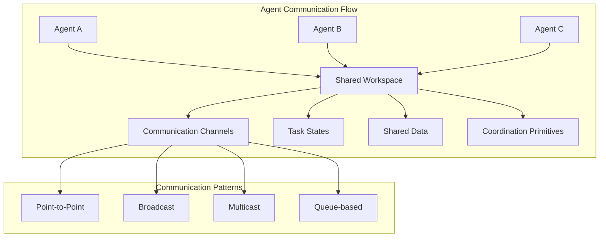

### Communication Mechanisms

#### 1. Communication Channels
```typescript
interface CommunicationProtocol {
  // Channel-based messaging
  async sendMessage(channelId: string, message: AgentMessage): Promise<void>;
  async readMessages(channelId: string, filter?: MessageFilter): Promise<AgentMessage[]>;
  async subscribeToChannel(channelId: string, agentId: string): Promise<void>;
  
  // Direct agent communication
  async sendDirectMessage(fromAgentId: string, toAgentId: string, message: any): Promise<void>;
  async readDirectMessages(agentId: string): Promise<AgentMessage[]>;
  
  // Broadcast communication
  async broadcastMessage(fromAgentId: string, message: any, scope?: string[]): Promise<void>;
  async readBroadcastMessages(agentId: string): Promise<AgentMessage[]>;
}

class StateBasedCommunication implements CommunicationProtocol {
  async sendMessage(channelId: string, message: AgentMessage): Promise<void> {
    await this.stateManager.writeToChannel(this.sharedStateId, channelId, {
      ...message,
      id: generateId(),
      timestamp: new Date()
    });
    
    // Update channel activity
    await this.stateManager.updateChannelActivity(this.sharedStateId, channelId);
  }
  
  async readMessages(channelId: string, filter?: MessageFilter): Promise<AgentMessage[]> {
    const messages = await this.stateManager.readChannelMessages(this.sharedStateId, channelId);
    
    if (filter) {
      return this.applyMessageFilter(messages, filter);
    }
    
    return messages;
  }
  
  async sendDirectMessage(fromAgentId: string, toAgentId: string, message: any): Promise<void> {
    const directChannelId = this.getDirectChannelId(fromAgentId, toAgentId);
    
    await this.sendMessage(directChannelId, {
      fromAgentId,
      toAgentId,
      type: 'DIRECT',
      payload: message
    });
  }
}
```

#### 2. Task State Coordination
```typescript
class TaskStateCoordination {
  async coordinateThroughTaskState(
    agentId: string,
    taskId: string,
    coordinationAction: CoordinationAction
  ): Promise<void> {
    
    switch (coordinationAction.type) {
      case 'REQUEST_ASSISTANCE':
        await this.requestAssistance(agentId, taskId, coordinationAction.details);
        break;
        
      case 'OFFER_ASSISTANCE':
        await this.offerAssistance(agentId, taskId, coordinationAction.capabilities);
        break;
        
      case 'DELEGATE_SUBTASK':
        await this.delegateSubtask(agentId, taskId, coordinationAction.subtask);
        break;
        
      case 'REPORT_PROGRESS':
        await this.reportProgress(agentId, taskId, coordinationAction.progress);
        break;
        
      case 'REQUEST_DEPENDENCY':
        await this.requestDependency(agentId, taskId, coordinationAction.dependency);
        break;
    }
  }
  
  private async requestAssistance(
    agentId: string,
    taskId: string,
    details: AssistanceRequest
  ): Promise<void> {
    
    // Update task state with assistance request
    await this.stateManager.updateTaskState(this.sharedStateId, taskId, {
      assistanceRequested: true,
      assistanceDetails: details,
      requestedAt: new Date()
    });
    
    // Broadcast assistance request
    await this.communicationProtocol.broadcastMessage(agentId, {
      type: 'ASSISTANCE_REQUEST',
      taskId,
      details,
      requesterCapabilities: await this.getAgentCapabilities(agentId)
    });
  }
  
  private async delegateSubtask(
    agentId: string,
    parentTaskId: string,
    subtask: SubtaskDefinition
  ): Promise<void> {
    
    // Create new task state for subtask
    const subtaskId = generateId();
    await this.stateManager.createTaskState(this.sharedStateId, {
      taskId: subtaskId,
      parentTaskId,
      delegatedBy: agentId,
      status: 'PENDING',
      task: subtask,
      createdAt: new Date()
    });
    
    // Find suitable agent for subtask
    const suitableAgent = await this.findSuitableAgent(subtask.requiredCapabilities);
    
    if (suitableAgent) {
      await this.assignTaskToAgent(subtaskId, suitableAgent.id);
    } else {
      // Request agent with required capabilities
      await this.requestAgentWithCapabilities(subtask.requiredCapabilities);
    }
  }
}
```

#### 3. Coordination Primitives
```typescript
class CoordinationPrimitives {
  // Barrier synchronization
  async waitAtBarrier(agentId: string, barrierId: string): Promise<void> {
    await this.stateManager.addAgentToBarrier(this.sharedStateId, barrierId, agentId);
    
    // Wait until all required agents reach the barrier
    while (!(await this.isBarrierComplete(barrierId))) {
      await this.sleep(100); // Poll every 100ms
    }
    
    // Release barrier
    await this.stateManager.releaseBarrier(this.sharedStateId, barrierId);
  }
  
  // Semaphore for resource access
  async acquireSemaphore(agentId: string, semaphoreId: string): Promise<boolean> {
    return await this.stateManager.acquireSemaphore(this.sharedStateId, semaphoreId, agentId);
  }
  
  async releaseSemaphore(agentId: string, semaphoreId: string): Promise<void> {
    await this.stateManager.releaseSemaphore(this.sharedStateId, semaphoreId, agentId);
  }
  
  // Distributed lock
  async acquireLock(agentId: string, lockId: string, timeout?: number): Promise<boolean> {
    const acquired = await this.stateManager.acquireLock(this.sharedStateId, lockId, agentId, timeout);
    
    if (acquired) {
      // Set up automatic lock release on timeout
      if (timeout) {
        setTimeout(() => {
          this.releaseLock(agentId, lockId);
        }, timeout);
      }
    }
    
    return acquired;
  }
  
  async releaseLock(agentId: string, lockId: string): Promise<void> {
    await this.stateManager.releaseLock(this.sharedStateId, lockId, agentId);
  }
}
```

### Communication Patterns

#### 1. Pipeline Pattern
```typescript
class PipelineCommunication {
  async setupPipeline(agents: string[], sharedStateId: string): Promise<void> {
    for (let i = 0; i < agents.length - 1; i++) {
      const currentAgent = agents[i];
      const nextAgent = agents[i + 1];
      
      // Create pipeline channel between consecutive agents
      await this.stateManager.createChannel(sharedStateId, {
        id: `pipeline-${currentAgent}-${nextAgent}`,
        type: 'QUEUE',
        authorizedAgents: [currentAgent, nextAgent],
        persistent: true
      });
    }
  }
  
  async passDataThroughPipeline(
    fromAgent: string,
    toAgent: string,
    data: any,
    sharedStateId: string
  ): Promise<void> {
    
    const channelId = `pipeline-${fromAgent}-${toAgent}`;
    
    await this.stateManager.writeToChannel(sharedStateId, channelId, {
      type: 'PIPELINE_DATA',
      data,
      fromAgent,
      timestamp: new Date()
    });
  }
}
```

#### 2. Collaborative Pattern
```typescript
class CollaborativeCommunication {
  async setupCollaboration(
    agents: string[],
    collaborationId: string,
    sharedStateId: string
  ): Promise<void> {
    
    // Create shared collaboration channel
    await this.stateManager.createChannel(sharedStateId, {
      id: `collaboration-${collaborationId}`,
      type: 'MULTICAST',
      authorizedAgents: agents,
      persistent: true
    });
    
    // Create shared workspace for collaboration
    await this.stateManager.createSharedData(sharedStateId, {
      id: `collaboration-workspace-${collaborationId}`,
      type: 'COLLABORATIVE_WORKSPACE',
      authorizedAgents: agents,
      data: {
        participants: agents,
        createdAt: new Date(),
        status: 'ACTIVE'
      }
    });
  }
  
  async proposeCollaborativeAction(
    agentId: string,
    collaborationId: string,
    proposal: CollaborativeProposal,
    sharedStateId: string
  ): Promise<void> {
    
    const channelId = `collaboration-${collaborationId}`;
    
    await this.stateManager.writeToChannel(sharedStateId, channelId, {
      type: 'PROPOSAL',
      fromAgent: agentId,
      proposal,
      proposalId: generateId(),
      timestamp: new Date(),
      votingDeadline: new Date(Date.now() + proposal.votingTimeoutMs)
    });
  }
  
  async voteOnProposal(
    agentId: string,
    proposalId: string,
    vote: Vote,
    sharedStateId: string
  ): Promise<void> {
    
    await this.stateManager.writeSharedData(sharedStateId, `proposal-votes-${proposalId}`, {
      agentId,
      vote,
      timestamp: new Date()
    });
  }
}
```

## Workflow Lifecycle Management

### Lifecycle Phases

The workflow lifecycle consists of distinct phases, each with specific responsibilities and state transitions:

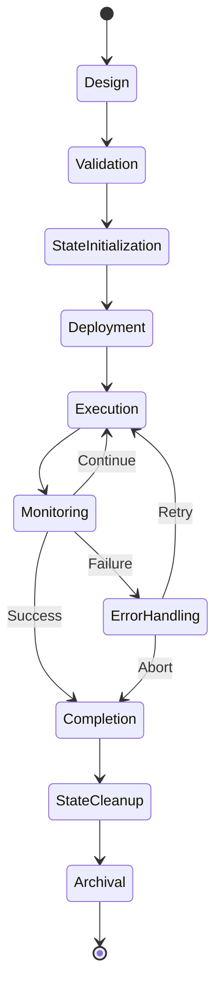

### Lifecycle Management Implementation

```typescript
class WorkflowLifecycleManager {
  async manageWorkflowLifecycle(workflowId: string): Promise<void> {
    const lifecycle = await this.getWorkflowLifecycle(workflowId);
    
    while (lifecycle.currentPhase !== LifecyclePhase.ARCHIVAL) {
      await this.executeLifecyclePhase(lifecycle);
      await this.transitionToNextPhase(lifecycle);
    }
  }
  
  private async executeLifecyclePhase(lifecycle: WorkflowLifecycle): Promise<void> {
    switch (lifecycle.currentPhase) {
      case LifecyclePhase.DESIGN:
        await this.executeDesignPhase(lifecycle);
        break;
        
      case LifecyclePhase.VALIDATION:
        await this.executeValidationPhase(lifecycle);
        break;
        
      case LifecyclePhase.STATE_INITIALIZATION:
        await this.executeStateInitializationPhase(lifecycle);
        break;
        
      case LifecyclePhase.DEPLOYMENT:
        await this.executeDeploymentPhase(lifecycle);
        break;
        
      case LifecyclePhase.EXECUTION:
        await this.executeExecutionPhase(lifecycle);
        break;
        
      case LifecyclePhase.MONITORING:
        await this.executeMonitoringPhase(lifecycle);
        break;
        
      case LifecyclePhase.COMPLETION:
        await this.executeCompletionPhase(lifecycle);
        break;
        
      case LifecyclePhase.STATE_CLEANUP:
        await this.executeStateCleanupPhase(lifecycle);
        break;
    }
  }
  
  private async executeStateInitializationPhase(lifecycle: WorkflowLifecycle): Promise<void> {
    const workflowDefinition = await this.getWorkflowDefinition(lifecycle.workflowId);
    
    // Initialize shared workspace state
    const sharedState = await this.initializeSharedState(
      lifecycle.workflowId,
      workflowDefinition.sharedStateSchema
    );
    
    // Create communication channels
    await this.createCommunicationChannels(sharedState.id, workflowDefinition.sharedStateSchema);
    
    // Set up coordination primitives
    await this.setupCoordinationPrimitives(sharedState.id, workflowDefinition.sharedStateSchema);
    
    // Initialize task states
    await this.initializeTaskStates(sharedState.id, workflowDefinition.nodes);
    
    // Record state initialization completion
    await this.recordPhaseCompletion(lifecycle, LifecyclePhase.STATE_INITIALIZATION, {
      sharedStateId: sharedState.id,
      channelsCreated: workflowDefinition.sharedStateSchema.communicationChannels.length,
      taskStatesInitialized: workflowDefinition.nodes.length
    });
  }
  
  private async executeStateCleanupPhase(lifecycle: WorkflowLifecycle): Promise<void> {
    const retentionPolicy = lifecycle.stateRetentionPolicy;
    
    // Archive important state data before cleanup
    if (retentionPolicy.archiveBeforeCleanup) {
      await this.archiveSharedState(lifecycle.sharedStateId);
    }
    
    // Clean up communication channels
    await this.cleanupCommunicationChannels(lifecycle.sharedStateId, retentionPolicy.communicationChannels);
    
    // Clean up task states
    await this.cleanupTaskStates(lifecycle.sharedStateId, retentionPolicy.taskStates);
    
    // Clean up shared data
    await this.cleanupSharedData(lifecycle.sharedStateId, retentionPolicy.sharedData);
    
    // Clean up coordination primitives
    await this.cleanupCoordinationPrimitives(lifecycle.sharedStateId, retentionPolicy.coordinationPrimitives);
    
    // Record cleanup completion
    await this.recordPhaseCompletion(lifecycle, LifecyclePhase.STATE_CLEANUP, {
      cleanupCompletedAt
: new Date(),
      retentionPolicyApplied: retentionPolicy
    });
  }
}
```

## Integration Patterns

### Service Integration Architecture

The Workflow Service integrates seamlessly with existing services through well-defined patterns:

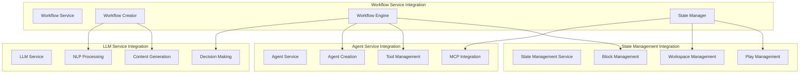

### Integration Implementation

#### 1. LLM Service Integration
```typescript
class LLMServiceIntegration {
  async processNaturalLanguage(description: string): Promise<ProcessedWorkflow> {
    // Use LLM for intent recognition
    const intentAnalysis = await this.llmService.analyzeIntent({
      text: description,
      context: 'workflow_creation',
      model: 'gpt-4'
    });
    
    // Extract entities and relationships
    const entityExtraction = await this.llmService.extractEntities({
      text: description,
      entityTypes: ['ACTOR', 'ACTION', 'RESOURCE', 'CONDITION'],
      model: 'gpt-4'
    });
    
    // Generate workflow structure
    const workflowStructure = await this.llmService.generateContent({
      prompt: this.buildWorkflowGenerationPrompt(intentAnalysis, entityExtraction),
      model: 'gpt-4',
      responseFormat: 'json'
    });
    
    return this.parseWorkflowStructure(workflowStructure);
  }
  
  async optimizeWorkflow(workflow: WorkflowDefinition): Promise<WorkflowDefinition> {
    const optimizationPrompt = this.buildOptimizationPrompt(workflow);
    
    const optimization = await this.llmService.generateContent({
      prompt: optimizationPrompt,
      model: 'gpt-4',
      responseFormat: 'json'
    });
    
    return this.applyOptimizations(workflow, optimization);
  }
  
  async generateAgentInstructions(task: TaskDefinition): Promise<string> {
    return await this.llmService.generateContent({
      prompt: `Generate detailed instructions for an agent to complete this task: ${JSON.stringify(task)}`,
      model: 'gpt-4'
    });
  }
}
```

#### 2. Agent Service Integration
```typescript
class AgentServiceIntegration {
  async createWorkflowAgents(
    workflowDefinition: WorkflowDefinition,
    workspaceId: string
  ): Promise<AgentAllocation[]> {
    
    const allocations: AgentAllocation[] = [];
    
    for (const node of workflowDefinition.nodes) {
      if (node.type === 'AGENT_TASK') {
        // Create agent with specific configuration
        const agent = await this.agentService.createAgent({
          type: node.agentType,
          configuration: {
            ...node.agentConfig,
            workspaceId,
            tools: await this.resolveRequiredTools(node.task.requiredTools)
          }
        });
        
        // Configure agent for shared state access
        await this.configureAgentForSharedState(agent.id, workspaceId, node);
        
        allocations.push({
          id: generateId(),
          workflowExecutionId: workflowDefinition.id,
          agentId: agent.id,
          agentType: node.agentType,
          assignedNodes: [node.id],
          status: 'IDLE',
          stateAccessPermissions: this.generateStatePermissions(node),
          assignedStateChannels: this.getAssignedChannels(node)
        });
      }
    }
    
    return allocations;
  }
  
  private async configureAgentForSharedState(
    agentId: string,
    workspaceId: string,
    node: WorkflowNode
  ): Promise<void> {
    
    // Configure agent to monitor shared state
    await this.agentService.configureAgent(agentId, {
      stateMonitoring: {
        enabled: true,
        workspaceId,
        monitoredChannels: this.getMonitoredChannels(node),
        pollingInterval: 1000 // 1 second
      },
      stateAccess: {
        readPermissions: node.stateReads,
        writePermissions: node.stateWrites
      }
    });
  }
  
  async assignTaskToAgent(
    agentId: string,
    task: TaskDefinition,
    sharedStateId: string
  ): Promise<void> {
    
    await this.agentService.assignTask(agentId, {
      ...task,
      context: {
        sharedStateId,
        communicationProtocol: 'SHARED_STATE',
        coordinationMode: 'STATE_BASED'
      }
    });
  }
}
```

#### 3. State Management Service Integration
```typescript
class StateManagementIntegration {
  async initializeWorkflowState(
    workflowDefinition: WorkflowDefinition
  ): Promise<{ workspaceId: string; playId: string; sharedStateId: string }> {
    
    // Create workspace for workflow
    const workspace = await this.stateService.createWorkspace({
      name: `workflow-${workflowDefinition.name}-${Date.now()}`,
      metadata: {
        workflowId: workflowDefinition.id,
        workflowVersion: workflowDefinition.version,
        createdBy: 'AUTONOMOUS_WORKFLOW_SERVICE'
      }
    });
    
    // Create play for execution tracking
    const play = await this.stateService.createPlay({
      workspaceId: workspace.id,
      metadata: {
        executionType: 'AUTONOMOUS_WORKFLOW',
        workflowDefinitionId: workflowDefinition.id
      }
    });
    
    // Initialize shared state structure
    const sharedStateId = await this.initializeSharedStateStructure(
      workspace.id,
      workflowDefinition.sharedStateSchema
    );
    
    return {
      workspaceId: workspace.id,
      playId: play.id,
      sharedStateId
    };
  }
  
  async createWorkflowBlocks(
    playId: string,
    workflowDefinition: WorkflowDefinition
  ): Promise<void> {
    
    // Create blocks for synchronization points
    for (const node of workflowDefinition.nodes) {
      if (node.type === 'MERGE' || node.dependencies.length > 1) {
        await this.stateService.createPlayBlock({
          playId,
          blockId: `node-${node.id}`,
          metadata: {
            nodeId: node.id,
            blockType: 'SYNCHRONIZATION',
            requiredDependencies: node.dependencies
          }
        });
      }
    }
  }
  
  async trackWorkflowProgress(
    playId: string,
    nodeId: string,
    status: NodeExecutionStatus
  ): Promise<void> {
    
    await this.stateService.updatePlayBlock(playId, `node-${nodeId}`, {
      status: this.mapNodeStatusToBlockStatus(status),
      updatedAt: new Date(),
      metadata: {
        nodeExecutionStatus: status
      }
    });
  }
}
```

## Autonomous Operation Mechanisms

### Self-Creation Mechanism

The system can autonomously create new workflows based on patterns and requirements:

```typescript
class AutonomousWorkflowCreator {
  async createWorkflowAutonomously(
    trigger: AutonomousTrigger,
    context: BusinessContext
  ): Promise<WorkflowDefinition> {
    
    // Analyze trigger and context
    const requirements = await this.analyzeRequirements(trigger, context);
    
    // Search for similar existing workflows
    const similarWorkflows = await this.findSimilarWorkflows(requirements);
    
    // Generate new workflow based on patterns
    const workflowTemplate = await this.generateWorkflowTemplate(requirements, similarWorkflows);
    
    // Optimize for current context
    const optimizedWorkflow = await this.optimizeForContext(workflowTemplate, context);
    
    // Validate feasibility
    const validatedWorkflow = await this.validateWorkflowFeasibility(optimizedWorkflow);
    
    // Create and deploy
    return await this.createAndDeploy(validatedWorkflow);
  }
  
  private async analyzeRequirements(
    trigger: AutonomousTrigger,
    context: BusinessContext
  ): Promise<WorkflowRequirements> {
    
    const analysis = await this.llmService.analyzeContent({
      content: trigger.description,
      analysisType: 'WORKFLOW_REQUIREMENTS',
      context: {
        businessDomain: context.domain,
        availableResources: context.resources,
        constraints: context.constraints
      }
    });
    
    return {
      objectives: analysis.objectives,
      constraints: analysis.constraints,
      requiredCapabilities: analysis.capabilities,
      expectedOutcomes: analysis.outcomes,
      complexity: analysis.complexity,
      priority: trigger.priority
    };
  }
  
  private async generateWorkflowTemplate(
    requirements: WorkflowRequirements,
    similarWorkflows: WorkflowDefinition[]
  ): Promise<WorkflowDefinition> {
    
    // Extract patterns from similar workflows
    const patterns = this.extractWorkflowPatterns(similarWorkflows);
    
    // Generate new workflow structure
    const structure = await this.llmService.generateContent({
      prompt: this.buildWorkflowGenerationPrompt(requirements, patterns),
      model: 'gpt-4',
      responseFormat: 'json'
    });
    
    // Convert to workflow definition
    return this.convertToWorkflowDefinition(structure, requirements);
  }
}
```

### Self-Modification Mechanism

```typescript
class AutonomousWorkflowModifier {
  async modifyWorkflowAutonomously(
    workflowId: string,
    executionHistory: ExecutionHistory[],
    performanceMetrics: PerformanceMetric[]
  ): Promise<WorkflowDefinition> {
    
    // Analyze execution patterns
    const patterns = await this.analyzeExecutionPatterns(executionHistory);
    
    // Identify optimization opportunities
    const opportunities = await this.identifyOptimizationOpportunities(patterns, performanceMetrics);
    
    // Generate modifications
    const modifications = await this.generateModifications(opportunities);
    
    // Validate modifications
    const validatedModifications = await this.validateModifications(workflowId, modifications);
    
    // Apply modifications
    return await this.applyModifications(workflowId, validatedModifications);
  }
  
  private async analyzeExecutionPatterns(
    executionHistory: ExecutionHistory[]
  ): Promise<ExecutionPattern[]> {
    
    const patterns: ExecutionPattern[] = [];
    
    // Analyze timing patterns
    patterns.push(...this.analyzeTimingPatterns(executionHistory));
    
    // Analyze failure patterns
    patterns.push(...this.analyzeFailurePatterns(executionHistory));
    
    // Analyze resource usage patterns
    patterns.push(...this.analyzeResourcePatterns(executionHistory));
    
    // Analyze communication patterns
    patterns.push(...this.analyzeCommunicationPatterns(executionHistory));
    
    return patterns;
  }
  
  private async generateModifications(
    opportunities: OptimizationOpportunity[]
  ): Promise<WorkflowModification[]> {
    
    const modifications: WorkflowModification[] = [];
    
    for (const opportunity of opportunities) {
      switch (opportunity.type) {
        case 'PARALLEL_OPTIMIZATION':
          modifications.push(await this.generateParallelizationModification(opportunity));
          break;
          
        case 'AGENT_SPECIALIZATION':
          modifications.push(await this.generateSpecializationModification(opportunity));
          break;
          
        case 'COMMUNICATION_OPTIMIZATION':
          modifications.push(await this.generateCommunicationModification(opportunity));
          break;
          
        case 'ERROR_HANDLING_IMPROVEMENT':
          modifications.push(await this.generateErrorHandlingModification(opportunity));
          break;
      }
    }
    
    return modifications;
  }
}
```

### Self-Execution Mechanism

```typescript
class AutonomousWorkflowExecutor {
  async executeWorkflowAutonomously(
    workflowDefinition: WorkflowDefinition,
    inputs: WorkflowInputs
  ): Promise<WorkflowExecution> {
    
    // Initialize execution environment
    const execution = await this.initializeExecution(workflowDefinition, inputs);
    
    // Start autonomous execution loop
    await this.startAutonomousExecutionLoop(execution);
    
    return execution;
  }
  
  private async startAutonomousExecutionLoop(execution: WorkflowExecution): Promise<void> {
    while (execution.status === 'RUNNING') {
      // Monitor execution state
      await this.monitorExecutionState(execution);
      
      // Handle any issues autonomously
      await this.handleIssuesAutonomously(execution);
      
      // Optimize execution in real-time
      await this.optimizeExecutionRealTime(execution);
      
      // Check for completion
      if (await this.isExecutionComplete(execution)) {
        await this.completeExecution(execution);
        break;
      }
      
      // Wait before next iteration
      await this.sleep(1000);
    }
  }
  
  private async handleIssuesAutonomously(execution: WorkflowExecution): Promise<void> {
    const issues = await this.detectExecutionIssues(execution);
    
    for (const issue of issues) {
      switch (issue.type) {
        case 'AGENT_FAILURE':
          await this.handleAgentFailure(execution, issue);
          break;
          
        case 'COMMUNICATION_BREAKDOWN':
          await this.handleCommunicationBreakdown(execution, issue);
          break;
          
        case 'RESOURCE_SHORTAGE':
          await this.handleResourceShortage(execution, issue);
          break;
          
        case 'PERFORMANCE_DEGRADATION':
          await this.handlePerformanceDegradation(execution, issue);
          break;
      }
    }
  }
  
  private async handleAgentFailure(
    execution: WorkflowExecution,
    issue: ExecutionIssue
  ): Promise<void> {
    
    const failedAgentId = issue.agentId;
    const affectedTasks = await this.getAffectedTasks(execution, failedAgentId);
    
    // Try to recover the agent
    const recovered = await this.attemptAgentRecovery(failedAgentId);
    
    if (!recovered) {
      // Create replacement agent
      const replacementAgent = await this.createReplacementAgent(
        execution,
        failedAgentId
      );
      
      // Reassign
 tasks to replacement agent
      await this.reassignTasks(execution, affectedTasks, replacementAgent.id);
      
      // Update execution state
      await this.updateExecutionState(execution, {
        agentReplacement: {
          failedAgentId,
          replacementAgentId: replacementAgent.id,
          affectedTasks: affectedTasks.map(t => t.id)
        }
      });
    }
  }
}
```

## API Specifications

### Workflow Service REST API

#### Base Endpoints

```yaml
openapi: 3.1.0
info:
  title: Autonomous Workflow Service API
  version: 1.0.0
  description: API for creating and managing autonomous multi-agent workflows

servers:
  - url: https://dev.lionis.ai/api/v1/workflows
    description: Development server

paths:
  /workflows:
    post:
      summary: Create workflow from natural language
      requestBody:
        required: true
        content:
          application/json:
            schema:
              type: object
              properties:
                description:
                  type: string
                  description: Natural language description of the workflow
                context:
                  $ref: '#/components/schemas/BusinessContext'
                autonomyLevel:
                  $ref: '#/components/schemas/AutonomyLevel'
      responses:
        '201':
          description: Workflow created successfully
          content:
            application/json:
              schema:
                $ref: '#/components/schemas/WorkflowDefinition'
    
    get:
      summary: List workflows
      parameters:
        - name: status
          in: query
          schema:
            type: string
            enum: [DRAFT, ACTIVE, COMPLETED, FAILED]
        - name: autonomyLevel
          in: query
          schema:
            $ref: '#/components/schemas/AutonomyLevel'
      responses:
        '200':
          description: List of workflows
          content:
            application/json:
              schema:
                type: array
                items:
                  $ref: '#/components/schemas/WorkflowDefinition'

  /workflows/{workflowId}/execute:
    post:
      summary: Execute workflow
      parameters:
        - name: workflowId
          in: path
          required: true
          schema:
            type: string
      requestBody:
        required: true
        content:
          application/json:
            schema:
              type: object
              properties:
                inputs:
                  type: object
                  description: Workflow input parameters
                executionMode:
                  type: string
                  enum: [AUTONOMOUS, SUPERVISED, MANUAL]
      responses:
        '202':
          description: Execution started
          content:
            application/json:
              schema:
                $ref: '#/components/schemas/WorkflowExecution'

  /workflows/{workflowId}/state:
    get:
      summary: Get workflow shared state
      parameters:
        - name: workflowId
          in: path
          required: true
          schema:
            type: string
      responses:
        '200':
          description: Workflow shared state
          content:
            application/json:
              schema:
                $ref: '#/components/schemas/SharedWorkspaceState'

  /executions/{executionId}:
    get:
      summary: Get execution status
      parameters:
        - name: executionId
          in: path
          required: true
          schema:
            type: string
      responses:
        '200':
          description: Execution details
          content:
            application/json:
              schema:
                $ref: '#/components/schemas/WorkflowExecution'

  /executions/{executionId}/agents:
    get:
      summary: Get execution agents
      parameters:
        - name: executionId
          in: path
          required: true
          schema:
            type: string
      responses:
        '200':
          description: List of agents in execution
          content:
            application/json:
              schema:
                type: array
                items:
                  $ref: '#/components/schemas/AgentAllocation'

  /executions/{executionId}/communication:
    get:
      summary: Get agent communication logs
      parameters:
        - name: executionId
          in: path
          required: true
          schema:
            type: string
        - name: channelId
          in: query
          schema:
            type: string
      responses:
        '200':
          description: Communication logs
          content:
            application/json:
              schema:
                type: array
                items:
                  $ref: '#/components/schemas/ChannelMessage'

components:
  schemas:
    WorkflowDefinition:
      type: object
      properties:
        id:
          type: string
        name:
          type: string
        description:
          type: string
        version:
          type: string
        nodes:
          type: array
          items:
            $ref: '#/components/schemas/WorkflowNode'
        edges:
          type: array
          items:
            $ref: '#/components/schemas/WorkflowEdge'
        sharedStateSchema:
          $ref: '#/components/schemas/StateSchema'
        autonomyLevel:
          $ref: '#/components/schemas/AutonomyLevel'

    WorkflowNode:
      type: object
      properties:
        id:
          type: string
        type:
          type: string
          enum: [AGENT_TASK, DECISION, PARALLEL, MERGE, CONDITION]
        agentType:
          type: string
        task:
          $ref: '#/components/schemas/TaskDefinition'
        stateReads:
          type: array
          items:
            $ref: '#/components/schemas/StateReadDefinition'
        stateWrites:
          type: array
          items:
            $ref: '#/components/schemas/StateWriteDefinition'

    AutonomyLevel:
      type: string
      enum: [LOW, MEDIUM, HIGH, FULL]
      description: |
        - LOW: Human approval required for major decisions
        - MEDIUM: Autonomous execution with human oversight
        - HIGH: Fully autonomous with exception reporting
        - FULL: Complete autonomy including self-modification

    SharedWorkspaceState:
      type: object
      properties:
        workspaceId:
          type: string
        version:
          type: integer
        communicationChannels:
          type: array
          items:
            $ref: '#/components/schemas/CommunicationChannel'
        taskStates:
          type: array
          items:
            $ref: '#/components/schemas/TaskState'
        sharedData:
          type: array
          items:
            $ref: '#/components/schemas/SharedDataItem'
```

## Architectural Diagrams

### Overall System Architecture

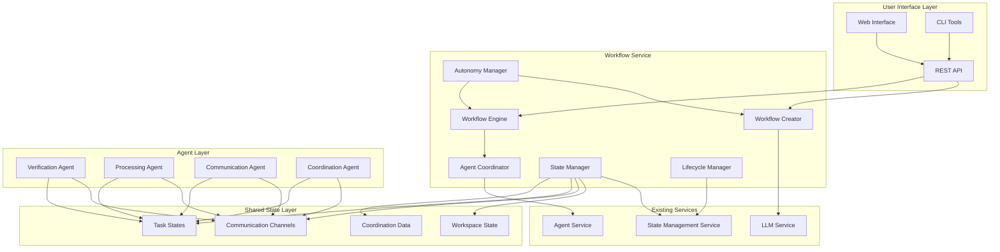

### Workflow Execution Flow

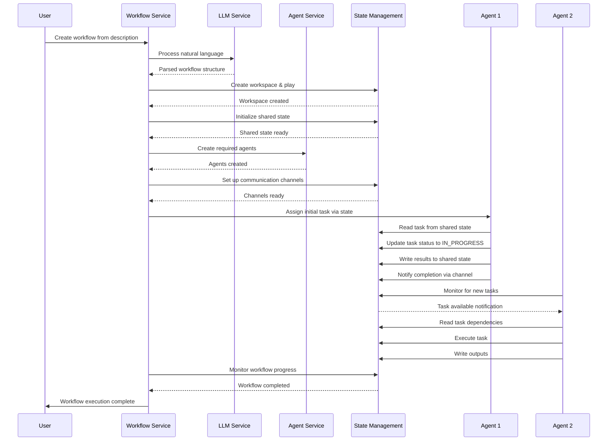

### Agent Communication Pattern

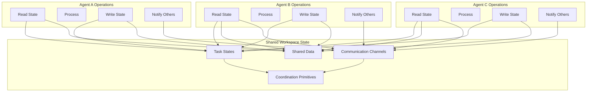

### Autonomous Operation Cycle

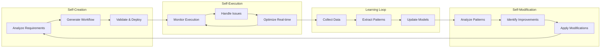

## Agent-to-Agent Protocol Compliance

### Protocol Specifications

The Workflow Service implements agent-to-agent communication protocols that comply with the following standards:

#### 1. State-Based Communication Protocol (SBCP)

**Protocol Version**: 1.0
**Compliance Level**: Full

**Core Principles**:
- All agent communication occurs through shared workspace state
- Messages are persistent and auditable
- Communication channels provide different interaction patterns
- State changes trigger workflow progression

**Message Format**:
```typescript
interface SBCPMessage {
  id: string;
  version: string; // Protocol version
  timestamp: Date;
  fromAgentId: string;
  toAgentId?: string; // Optional for broadcast
  channelId: string;
  
  // Message content
  type: MessageType;
  payload: any;
  metadata: MessageMetadata;
  
  // Protocol compliance
  protocolVersion: '1.0';
  compliance: {
    persistent: boolean;
    auditable: boolean;
    encrypted: boolean;
  };
}
```

**Channel Types**:
- **POINT_TO_POINT**: Direct agent-to-agent communication
- **BROADCAST**: One-to-many communication
- **MULTICAST**: Group-based communication
- **QUEUE**: Task distribution and coordination
- **TOPIC**: Event-based communication

#### 2. Task Coordination Protocol (TCP)

**Protocol Version**: 1.0
**Compliance Level**: Full

**Coordination Patterns**:
- **Task Assignment**: Workflow engine assigns tasks to agents via state
- **Task Delegation**: Agents can delegate subtasks to other agents
- **Task Collaboration**: Multiple agents can collaborate on complex tasks
- **Task Handoff**: Sequential task processing through state updates

**State Transitions**:
```typescript
enum TaskStatus {
  PENDING = 'PENDING',
  ASSIGNED = 'ASSIGNED',
  IN_PROGRESS = 'IN_PROGRESS',
  BLOCKED = 'BLOCKED',
  COMPLETED = 'COMPLETED',
  FAILED = 'FAILED',
  DELEGATED = 'DELEGATED'
}
```

#### 3. Coordination Primitive Protocol (CPP)

**Protocol Version**: 1.0
**Compliance Level**: Full

**Supported Primitives**:
- **Barriers**: Synchronization points for multiple agents
- **Semaphores**: Resource access control
- **Locks**: Exclusive access to shared resources
- **Queues**: Ordered task distribution
- **Events**: Asynchronous notifications

### Protocol Implementation

```typescript
class ProtocolCompliantCommunication {
  async sendCompliantMessage(
    fromAgentId: string,
    message: any,
    options: CommunicationOptions
  ): Promise<void> {
    
    const compliantMessage: SBCPMessage = {
      id: generateId(),
      version: '1.0',
      timestamp: new Date(),
      fromAgentId,
      toAgentId: options.toAgentId,
      channelId: options.channelId,
      type: options.messageType,
      payload: message,
      metadata: {
        priority: options.priority || 'NORMAL',
        expiresAt: options.expiresAt,
        requiresAcknowledgment: options.requiresAck || false
      },
      protocolVersion: '1.0',
      compliance: {
        persistent: true,
        auditable: true,
        encrypted: options.encrypted || false
      }
    };
    
    // Validate protocol compliance
    await this.validateProtocolCompliance(compliantMessage);
    
    // Send through state management
    await this.stateManager.writeToChannel(
      this.sharedStateId,
      options.channelId,
      compliantMessage
);
    
    // Log for audit trail
    await this.auditLogger.logCommunication(compliantMessage);
  }
  
  private async validateProtocolCompliance(message: SBCPMessage): Promise<void> {
    // Validate message structure
    if (!message.id || !message.fromAgentId || !message.channelId) {
      throw new ProtocolViolationError('Missing required message fields');
    }
    
    // Validate protocol version
    if (message.protocolVersion !== '1.0') {
      throw new ProtocolViolationError('Unsupported protocol version');
    }
    
    // Validate message type
    if (!Object.values(MessageType).includes(message.type)) {
      throw new ProtocolViolationError('Invalid message type');
    }
    
    // Additional compliance checks
    await this.performAdditionalComplianceChecks(message);
  }
}
```

### Protocol Compliance Verification

```typescript
class ProtocolComplianceVerifier {
  async verifyWorkflowCompliance(workflowExecution: WorkflowExecution): Promise<ComplianceReport> {
    const report: ComplianceReport = {
      workflowExecutionId: workflowExecution.id,
      verificationTimestamp: new Date(),
      protocolsChecked: ['SBCP', 'TCP', 'CPP'],
      violations: [],
      complianceScore: 0
    };
    
    // Verify SBCP compliance
    const sbcpViolations = await this.verifySBCPCompliance(workflowExecution);
    report.violations.push(...sbcpViolations);
    
    // Verify TCP compliance
    const tcpViolations = await this.verifyTCPCompliance(workflowExecution);
    report.violations.push(...tcpViolations);
    
    // Verify CPP compliance
    const cppViolations = await this.verifyCPPCompliance(workflowExecution);
    report.violations.push(...cppViolations);
    
    // Calculate compliance score
    report.complianceScore = this.calculateComplianceScore(report.violations);
    
    return report;
  }
}
```

## Workflow Template and Pattern System

### Template Architecture

The system includes a comprehensive template and pattern system for common workflow scenarios:

```typescript
interface WorkflowTemplate {
  id: string;
  name: string;
  category: TemplateCategory;
  description: string;
  
  // Template structure
  templateNodes: TemplateNode[];
  templateEdges: TemplateEdge[];
  
  // Parameterization
  parameters: TemplateParameter[];
  defaultValues: Record<string, any>;
  
  // Constraints
  constraints: TemplateConstraint[];
  requirements: TemplateRequirement[];
  
  // Metadata
  usageCount: number;
  successRate: number;
  averageExecutionTime: number;
  tags: string[];
}

enum TemplateCategory {
  DATA_PROCESSING = 'DATA_PROCESSING',
  CUSTOMER_SERVICE = 'CUSTOMER_SERVICE',
  CONTENT_CREATION = 'CONTENT_CREATION',
  APPROVAL_WORKFLOW = 'APPROVAL_WORKFLOW',
  NOTIFICATION_SYSTEM = 'NOTIFICATION_SYSTEM',
  INTEGRATION_WORKFLOW = 'INTEGRATION_WORKFLOW',
  MONITORING_WORKFLOW = 'MONITORING_WORKFLOW'
}
```

### Built-in Templates

#### 1. Customer Onboarding Template
```typescript
const customerOnboardingTemplate: WorkflowTemplate = {
  id: 'customer-onboarding-v1',
  name: 'Customer Onboarding Process',
  category: TemplateCategory.CUSTOMER_SERVICE,
  description: 'Standard customer onboarding with verification, setup, and welcome',
  
  templateNodes: [
    {
      id: 'identity-verification',
      type: 'AGENT_TASK',
      agentType: 'VERIFICATION_AGENT',
      parameters: ['verification_method', 'required_documents']
    },
    {
      id: 'account-setup',
      type: 'AGENT_TASK',
      agentType: 'ACCOUNT_AGENT',
      parameters: ['account_type', 'initial_settings']
    },
    {
      id: 'welcome-communication',
      type: 'PARALLEL',
      children: ['email-welcome', 'sms-welcome', 'physical-materials']
    },
    {
      id: 'followup-scheduling',
      type: 'AGENT_TASK',
      agentType: 'SCHEDULING_AGENT',
      parameters: ['followup_delay', 'communication_preference']
    }
  ],
  
  parameters: [
    {
      name: 'verification_method',
      type: 'string',
      options: ['document_upload', 'video_call', 'in_person'],
      required: true
    },
    {
      name: 'account_type',
      type: 'string',
      options: ['basic', 'premium', 'enterprise'],
      required: true
    }
  ]
};
```

#### 2. Data Processing Pipeline Template
```typescript
const dataProcessingTemplate: WorkflowTemplate = {
  id: 'data-processing-pipeline-v1',
  name: 'Data Processing Pipeline',
  category: TemplateCategory.DATA_PROCESSING,
  description: 'Extract, transform, and load data with validation',
  
  templateNodes: [
    {
      id: 'data-extraction',
      type: 'AGENT_TASK',
      agentType: 'EXTRACTION_AGENT',
      parameters: ['data_source', 'extraction_method']
    },
    {
      id: 'data-validation',
      type: 'AGENT_TASK',
      agentType: 'VALIDATION_AGENT',
      parameters: ['validation_rules', 'error_handling']
    },
    {
      id: 'data-transformation',
      type: 'AGENT_TASK',
      agentType: 'TRANSFORMATION_AGENT',
      parameters: ['transformation_rules', 'output_format']
    },
    {
      id: 'data-loading',
      type: 'AGENT_TASK',
      agentType: 'LOADING_AGENT',
      parameters: ['destination', 'loading_strategy']
    }
  ]
};
```

### Template Instantiation

```typescript
class WorkflowTemplateEngine {
  async instantiateTemplate(
    templateId: string,
    parameters: Record<string, any>,
    context: BusinessContext
  ): Promise<WorkflowDefinition> {
    
    // Load template
    const template = await this.loadTemplate(templateId);
    
    // Validate parameters
    await this.validateTemplateParameters(template, parameters);
    
    // Instantiate nodes with parameters
    const instantiatedNodes = await this.instantiateNodes(template.templateNodes, parameters);
    
    // Generate state schema
    const stateSchema = await this.generateStateSchema(instantiatedNodes, context);
    
    // Create workflow definition
    return {
      id: generateId(),
      name: `${template.name} - ${Date.now()}`,
      description: template.description,
      version: '1.0',
      createdAt: new Date(),
      createdBy: 'TEMPLATE_ENGINE',
      nodes: instantiatedNodes,
      edges: this.instantiateEdges(template.templateEdges, instantiatedNodes),
      sharedStateSchema: stateSchema,
      autonomyLevel: AutonomyLevel.HIGH,
      selfModificationEnabled: true,
      learningEnabled: true
    };
  }
  
  async suggestTemplate(description: string): Promise<WorkflowTemplate[]> {
    // Use LLM to analyze description and suggest templates
    const analysis = await this.llmService.analyzeContent({
      content: description,
      analysisType: 'TEMPLATE_MATCHING'
    });
    
    // Find matching templates
    const matchingTemplates = await this.findMatchingTemplates(analysis);
    
    // Rank by relevance
    return this.rankTemplatesByRelevance(matchingTemplates, analysis);
  }
}
```

## Conclusion

### Architecture Summary

The Autonomous Workflow Service provides a comprehensive platform for creating, executing, and managing multi-agent workflows with the following key capabilities:

#### Core Features
1. **Natural Language Workflow Creation**: Transform business process descriptions into executable workflows
2. **Shared State Communication**: Enable robust agent coordination through workspace state
3. **Autonomous Operation**: Self-create, self-modify, and self-execute workflows
4. **Seamless Integration**: Leverage existing LLM, Agent, and State Management services
5. **Template System**: Accelerate workflow creation with proven patterns

#### Architectural Strengths
1. **Modularity**: Clean separation of concerns across six core components
2. **Scalability**: Built on existing microservice architecture
3. **Flexibility**: Support for various business process types
4. **Reliability**: Comprehensive error handling and recovery mechanisms
5. **Auditability**: Complete communication and execution logging

#### Integration Benefits
1. **LLM Service**: Advanced natural language processing and decision-making
2. **Agent Service**: Robust agent lifecycle and tool management
3. **State Management**: Persistent, reliable state coordination
4. **Shared State Communication**: Eliminates complex message routing

#### Autonomous Capabilities
1. **Self-Creation**: Generate workflows from minimal input
2. **Self-Modification**: Adapt based on execution patterns
3. **Self-Execution**: Handle issues and optimize autonomously
4. **Learning**: Improve performance over time

### Implementation Roadmap

#### Phase 1: Core Infrastructure (Weeks 1-4)
- Implement Workflow Creator with basic NLP
- Build Workflow Engine with state integration
- Create State Manager for shared workspace coordination
- Develop basic Agent Coordinator

#### Phase 2: Communication & Coordination (Weeks 5-8)
- Implement shared state communication protocols
- Build coordination primitives (barriers, locks, semaphores)
- Create agent-to-agent communication patterns
- Develop task coordination mechanisms

#### Phase 3: Autonomy & Intelligence (Weeks 9-12)
- Implement autonomous workflow creation
- Build self-modification capabilities
- Create learning and pattern recognition
- Develop optimization algorithms

#### Phase 4: Templates & Patterns (Weeks 13-16)
- Create workflow template system
- Build pattern library
- Implement template instantiation
- Develop template suggestion engine

#### Phase 5: Integration & Testing (Weeks 17-20)
- Complete service integrations
- Implement comprehensive testing
- Performance optimization
- Documentation and deployment

### Success Metrics

1. **Workflow Creation Time**: < 5 minutes from description to execution
2. **Execution Success Rate**: > 95% for template-based workflows
3. **Agent Communication Latency**: < 100ms for state-based messages
4. **Autonomous Recovery Rate**: > 90% for common failure scenarios
5. **Template Adoption**: > 80% of workflows use templates or patterns

The Autonomous Workflow Service represents a significant advancement in business process automation, providing organizations with the ability to create and manage complex multi-agent workflows through natural language descriptions while maintaining full autonomy and adaptability.