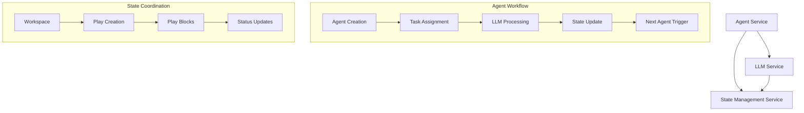

# Autonomous Agentic Workflow Services Analysis

## Overview

This document provides a comprehensive analysis of three core services that form the foundation of an autonomous agentic workflow application:

1. **LLM Service** - Language model integration and processing
2. **Agent Service** - Agent lifecycle and management 
3. **State Management Service** - Workflow and agent state persistence

## Service Analysis

### 1. LLM Service Analysis

**Base URL:** `https://dev.lionis.ai/api/v1/llm/`
**OpenAPI Version:** 3.0.0

#### Key Capabilities Observed:

**Image Generation & Processing:**
- **OpenAI Image Generation**: Supports text-to-image generation with configurable parameters
  - Models: DALL-E variants
  - Quality settings: standard, hd
  - Sizes: 1024x1024, 1792x1024, 1024x1792
  - Styles: vivid, natural
- **Image Analysis**: Processes images with LLM models for content understanding
- **Audio Translation**: Converts audio to text with translation capabilities

**Core Data Models:**
- `OpenAIImage`: URL and metadata for generated images
- `ImageGenerationRequest`: Configurable image generation parameters
- `ModelData`: LLM model configuration and metadata
- `IChatModelsResponse`: Available chat models and capabilities

**Authentication:**
- Bearer token authentication required
- Service token extraction from JWT for user identification

#### Integration Patterns:
- RESTful API design with JSON payloads
- Asynchronous processing capabilities for long-running operations
- Model abstraction allowing multiple LLM providers
- Standardized response formats for consistent integration

### 2. Agent Service Analysis

**Base URL:** `https://dev.lionis.ai/api/v1/agents/`
**OpenAPI Version:** 3.1.0

#### Key Capabilities Observed:

**Agent Lifecycle Management:**
- **Health Monitoring**: `/health` endpoint for service status
- **Version Management**: API versioning with detailed endpoint documentation
- **Tool Integration**: Comprehensive tool system for agent capabilities

**Agent Tool System:**
The service implements a sophisticated tool ecosystem:

1. **Tool Types Available:**
   - **API Tools**: Integration with external APIs and services
   - **Script Tools**: Custom script execution for specific tasks
   - **MCP Tools**: Model Context Protocol integration for external system communication
   - **Local Tools**: File system and local resource access

2. **Tool Configuration:**
   - Dynamic tool assignment to agents
   - Configuration-driven tool behavior
   - External system integration capabilities

**Core Features:**
- **Agent Creation & Configuration**: Agents can be created with specific tool configurations
- **Task Assignment**: Agents can be assigned specific tasks with defined parameters
- **External System Integration**: Through MCP (Model Context Protocol) tools
- **Workspace Management**: Agents operate within defined workspace contexts

**Data Models:**
- **Agent Configuration**: Defines agent capabilities and tool access
- **Tool Definitions**: Structured tool specifications with parameters
- **Task Execution**: Request/response patterns for agent task processing
- **Health Status**: Service monitoring and status reporting

#### Integration Patterns:
- **Microservice Architecture**: Designed for distributed deployment
- **Tool Plugin System**: Extensible tool framework
- **Workspace Isolation**: Agents operate in isolated environments
- **External Protocol Support**: MCP integration for third-party systems

### 3. State Management Service Analysis

**Base URL:** `https://dev.lionis.ai/api/v1/state/`
**OpenAPI Version:** 3.0.0

#### Key Capabilities Observed:

**Workspace State Management:**
- **Workspace Creation**: Initialize new workspace environments
- **Version Control**: Published version tracking and management
- **Play State Management**: Execution state tracking for workflows

**Core State Operations:**
1. **Workspace Lifecycle:**
   - Create new workspaces with unique identifiers
   - Publish workspace versions for deployment
   - Track workspace metadata and configuration

2. **Play Management:**
   - **Play Creation**: Initialize workflow execution instances
   - **Play State Tracking**: Monitor execution progress and status
   - **Play Blocking**: Implement workflow synchronization and dependencies

3. **State Persistence:**
   - **Record Management**: Store and retrieve workflow execution records
   - **Status Tracking**: Monitor success/failure states
   - **Timestamp Management**: Track creation and update times

**Data Models:**
- **Workspace**: Container for agent workflows with versioning
- **Play**: Execution instance of a workflow with state tracking
- **PlayBlock**: Synchronization primitive for workflow coordination
- **ResponseStatus**: Standardized status reporting (SUCCESS, etc.)
- **Record**: Persistent storage for workflow execution data

**Key Features:**
- **UUID-based Identification**: Consistent entity identification across services
- **Timestamp Tracking**: Creation and modification time tracking
- **Status Management**: Comprehensive state tracking for workflows
- **Block Coordination**: Workflow synchronization mechanisms

#### Integration Patterns:
- **Event-Driven Architecture**: State changes trigger workflow progression
- **Persistence Layer**: Durable storage for workflow state
- **Coordination Primitives**: Blocking and synchronization for multi-agent workflows
- **Version Management**: Support for iterative workflow development

## Service Integration Architecture

### Inter-Service Communication Patterns

### Autonomous Workflow Capabilities

#### 1. Agent Lifecycle Integration
- **Agent Creation**: Agents are created through the Agent Service with specific tool configurations
- **LLM Integration**: Agents leverage the LLM Service for reasoning and content generation
- **State Persistence**: All agent activities are tracked through the State Management Service

#### 2. Multi-Agent Coordination
- **Workspace Isolation**: Each workflow operates in a dedicated workspace
- **Play Coordination**: Multiple agents can participate in the same play (workflow execution)
- **Block Synchronization**: Agents can wait for specific conditions or other agents to complete tasks

#### 3. Tool-Based Capabilities
- **External System Access**: Through MCP tools, agents can interact with external APIs and services
- **Script Execution**: Custom logic execution for specialized tasks
- **File System Access**: Local resource manipulation and data processing

#### 4. State-Driven Execution
- **Event-Driven Progression**: Workflow advancement based on state changes
- **Persistent Context**: Workflow state survives service restarts and failures
- **Version Control**: Iterative workflow development and deployment

## Key Insights for Autonomous Workflows

### 1. Service Orchestration Patterns
- **Microservice Architecture**: Each service handles a specific domain (LLM, Agents, State)
- **RESTful Integration**: Standard HTTP APIs enable loose coupling
- **Authentication Flow**: Consistent bearer token authentication across services

### 2. Agent Communication Mechanisms
- **Indirect Communication**: Agents communicate through shared state rather than direct messaging
- **Tool-Mediated Interaction**: External system integration through standardized tool interfaces
- **Workspace Scoping**: Agents operate within defined workspace boundaries

### 3. Workflow Execution Model
- **Play-Based Execution**: Workflows are executed as "plays" with trackable state
- **Block Coordination**: Synchronization primitives enable complex multi-agent workflows
- **Version Management**: Supports iterative development and deployment of workflows

### 4. Scalability Considerations
- **Stateless Services**: Core services are designed for horizontal scaling
- **Persistent State**: State Management Service provides durable workflow persistence
- **Tool Extensibility**: Plugin-based tool system allows capability expansion

### 5. Integration Points for Autonomous Workflows
- **LLM-Driven Decision Making**: Agents can leverage language models for reasoning
- **External System Integration**: MCP tools enable interaction with third-party services
- **State-Based Coordination**: Complex workflows can be orchestrated through state management
- **Tool Composition**: Agents can combine multiple tools for complex task execution

## Recommendations for Autonomous Workflow Service

Based on this analysis, the autonomous workflow service should:

1. **Leverage Existing State Management**: Build upon the robust state management capabilities
2. **Extend Agent Coordination**: Implement higher-level workflow orchestration patterns
3. **Utilize Tool Ecosystem**: Leverage the existing tool framework for workflow capabilities
4. **Implement Workflow Templates**: Create reusable workflow patterns for common use cases
5. **Add Workflow Visualization**: Provide visibility into multi-agent workflow execution
6. **Enhance Error Handling**: Implement comprehensive error recovery and retry mechanisms

The existing services provide a solid foundation for autonomous workflow creation and execution, with clear separation of concerns and well-defined integration patterns.