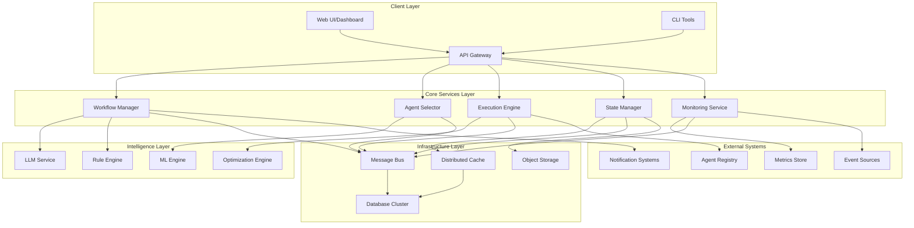
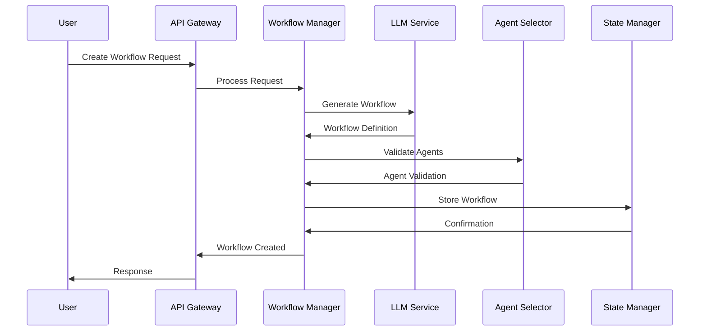
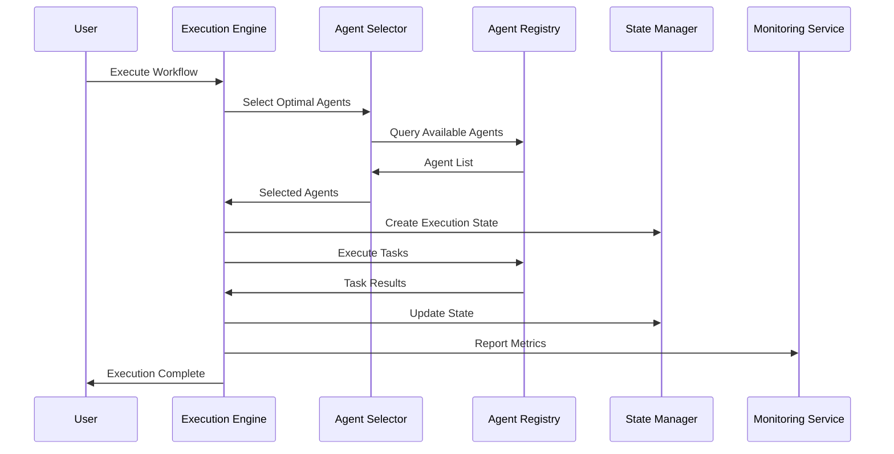
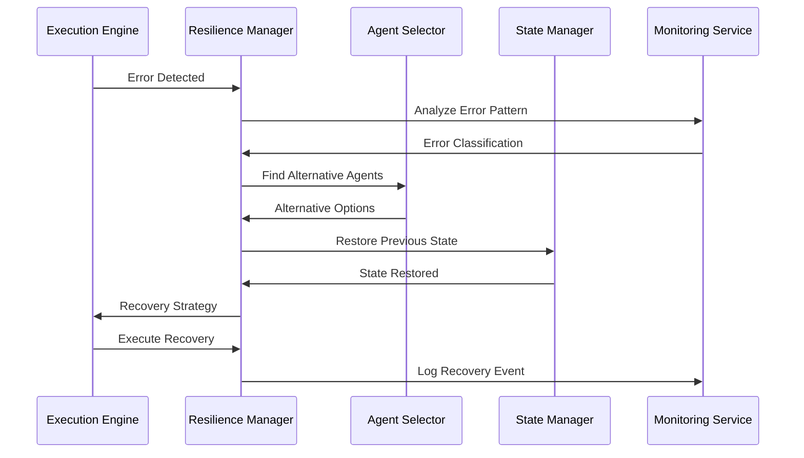

# Advanced Agentic Workflow System - Comprehensive Architecture Design

## Executive Summary

This document presents a comprehensive architecture design for enhancing the existing workflow system to support advanced agentic workflow implementation. The enhanced system will provide autonomous workflow management, intelligent agent selection, self-healing capabilities, real-time monitoring, and scalable execution while maintaining backward compatibility with the current system.

## Current System Analysis

### Existing Architecture Strengths
- **Solid Foundation**: Node.js/TypeScript with Express and MongoDB
- **DAG-based Execution**: Robust topological sorting and dependency management
- **Agent Integration**: External API integration with validation and schema checking
- **State Management**: Comprehensive execution logging and interruption handling
- **LLM Integration**: Workflow generation from problem statements using OpenAI
- **HITL Support**: Human-in-the-loop with approval, input review, and state editing
- **Execution Modes**: Sequential and parallel execution capabilities
- **REST API**: Complete CRUD operations with comprehensive validation

### Current System Limitations
- **Manual Workflow Creation**: Limited autonomous workflow generation
- **Static Agent Selection**: No dynamic agent discovery or capability matching
- **Basic Error Handling**: Limited self-healing and recovery mechanisms
- **Minimal Monitoring**: Basic execution logging without advanced analytics
- **Single Instance**: No distributed processing or horizontal scaling
- **Simple State Management**: No versioning, checkpointing, or advanced persistence
- **Limited Event Handling**: No reactive workflow execution based on external events
- **Basic Security**: Limited governance, audit trails, and compliance features

## High-Level System Architecture

### Core Architecture Principles
1. **Microservices Architecture**: Decomposed into specialized, independently deployable services
2. **Event-Driven Design**: Reactive system responding to events and triggers
3. **Cloud-Native**: Containerized, scalable, and resilient
4. **API-First**: Well-defined interfaces for all components
5. **Data-Driven**: Analytics and ML-powered decision making
6. **Security by Design**: Built-in security, governance, and compliance

### System Architecture Overview



## Component Architecture Design

### 1. Autonomous Workflow Management

#### Workflow Intelligence Service
```typescript
interface WorkflowIntelligenceService {
  // Autonomous workflow generation
  generateWorkflow(problemStatement: string, constraints: WorkflowConstraints): Promise<WorkflowDefinition>;
  
  // Workflow optimization
  optimizeWorkflow(workflow: WorkflowDefinition, metrics: PerformanceMetrics): Promise<WorkflowDefinition>;
  
  // Adaptive workflow modification
  adaptWorkflow(workflowId: string, feedback: ExecutionFeedback): Promise<WorkflowDefinition>;
  
  // Workflow recommendation
  recommendWorkflows(context: ProblemContext): Promise<WorkflowRecommendation[]>;
}
```

#### Components:
- **LLM-Powered Generator**: Enhanced prompt engineering for complex workflow creation
- **Template Library**: Reusable workflow patterns and best practices
- **Optimization Engine**: Performance-based workflow refinement
- **Learning System**: Continuous improvement from execution feedback

### 2. Intelligent Agent Selection and Discovery

#### Agent Discovery Service
```typescript
interface AgentDiscoveryService {
  // Dynamic agent discovery
  discoverAgents(capabilities: AgentCapabilities[]): Promise<AgentMatch[]>;
  
  // Capability matching
  matchAgents(requirements: TaskRequirements): Promise<AgentRanking[]>;
  
  // Agent performance tracking
  trackAgentPerformance(agentId: string, metrics: PerformanceMetrics): Promise<void>;
  
  // Agent recommendation
  recommendAgents(context: TaskContext): Promise<AgentRecommendation[]>;
}
```

#### Components:
- **Agent Registry**: Centralized catalog with capabilities, performance metrics, and availability
- **Capability Matcher**: ML-based matching of agent capabilities to task requirements
- **Performance Tracker**: Real-time monitoring of agent performance and reliability
- **Load Balancer**: Intelligent distribution of tasks across available agents

### 3. Self-Healing Workflows

#### Resilience Manager
```typescript
interface ResilienceManager {
  // Error detection and classification
  detectErrors(executionContext: ExecutionContext): Promise<ErrorClassification>;
  
  // Automatic recovery strategies
  executeRecovery(error: ErrorClassification, context: ExecutionContext): Promise<RecoveryResult>;
  
  // Workflow adaptation
  adaptWorkflow(workflowId: string, failures: FailurePattern[]): Promise<WorkflowDefinition>;
  
  // Health monitoring
  monitorHealth(workflowId: string): Promise<HealthStatus>;
}
```

#### Components:
- **Error Detection Engine**: Pattern recognition for failure identification
- **Recovery Strategy Engine**: Automated retry, fallback, and compensation mechanisms
- **Circuit Breaker**: Prevents cascade failures and provides graceful degradation
- **Adaptive Routing**: Dynamic rerouting around failed components

### 4. Real-Time Monitoring and Analytics

#### Monitoring and Analytics Service
```typescript
interface MonitoringService {
  // Real-time metrics collection
  collectMetrics(source: MetricSource, metrics: Metrics): Promise<void>;
  
  // Performance analytics
  analyzePerformance(workflowId: string, timeRange: TimeRange): Promise<PerformanceAnalysis>;
  
  // Bottleneck detection
  detectBottlenecks(executionData: ExecutionData[]): Promise<BottleneckAnalysis>;
  
  // Predictive analytics
  predictPerformance(workflowDefinition: WorkflowDefinition): Promise<PerformancePrediction>;
}
```

#### Components:
- **Metrics Collector**: Real-time data ingestion from all system components
- **Analytics Engine**: Advanced analytics for performance optimization
- **Alerting System**: Proactive notifications for issues and anomalies
- **Dashboard Service**: Real-time visualization and reporting

### 5. Scalable Execution Architecture

#### Distributed Execution Engine
```typescript
interface DistributedExecutionEngine {
  // Distributed workflow execution
  executeWorkflow(workflowId: string, executionPlan: ExecutionPlan): Promise<ExecutionResult>;
  
  // Load balancing
  balanceLoad(tasks: Task[], resources: Resource[]): Promise<LoadBalancingPlan>;
  
  // Resource management
  manageResources(requirements: ResourceRequirements): Promise<ResourceAllocation>;
  
  // Scaling decisions
  makeScalingDecisions(metrics: SystemMetrics): Promise<ScalingAction[]>;
}
```

#### Components:
- **Task Scheduler**: Intelligent task distribution across worker nodes
- **Resource Manager**: Dynamic resource allocation and scaling
- **Load Balancer**: Optimal distribution of execution load
- **Auto-Scaler**: Automatic horizontal and vertical scaling

### 6. Advanced State Management

#### State Management Service
```typescript
interface StateManagementService {
  // Workflow versioning
  createVersion(workflowId: string, changes: WorkflowChanges): Promise<WorkflowVersion>;
  
  // Checkpoint management
  createCheckpoint(executionId: string, state: ExecutionState): Promise<Checkpoint>;
  
  // State restoration
  restoreState(checkpointId: string): Promise<ExecutionState>;
  
  // State persistence
  persistState(state: ExecutionState, durability: DurabilityLevel): Promise<void>;
}
```

#### Components:
- **Version Control**: Git-like versioning for workflow definitions
- **Checkpoint System**: Automatic and manual state snapshots
- **State Store**: Distributed, consistent state storage
- **Recovery Manager**: Point-in-time recovery capabilities

### 7. Event-Driven Architecture

#### Event Processing Service
```typescript
interface EventProcessingService {
  // Event subscription
  subscribeToEvents(eventTypes: EventType[], handler: EventHandler): Promise<Subscription>;
  
  // Event publishing
  publishEvent(event: Event): Promise<void>;
  
  // Event routing
  routeEvent(event: Event, rules: RoutingRule[]): Promise<RoutingResult>;
  
  // Event correlation
  correlateEvents(events: Event[], correlationRules: CorrelationRule[]): Promise<CorrelatedEvent[]>;
}
```

#### Components:
- **Event Bus**: High-throughput, reliable message delivery
- **Event Router**: Intelligent event routing and filtering
- **Event Store**: Persistent event storage for replay and analysis
- **Stream Processor**: Real-time event stream processing

### 8. Security and Governance Framework

#### Security and Governance Service
```typescript
interface SecurityGovernanceService {
  // Access control
  enforceAccess(user: User, resource: Resource, action: Action): Promise<AccessDecision>;
  
  // Audit logging
  logAuditEvent(event: AuditEvent): Promise<void>;
  
  // Compliance checking
  checkCompliance(workflow: WorkflowDefinition, policies: CompliancePolicy[]): Promise<ComplianceResult>;
  
  // Risk assessment
  assessRisk(workflow: WorkflowDefinition): Promise<RiskAssessment>;
}
```

#### Components:
- **Identity and Access Management**: Role-based access control and authentication
- **Audit Service**: Comprehensive audit trail and compliance reporting
- **Policy Engine**: Configurable governance policies and enforcement
- **Risk Manager**: Automated risk assessment and mitigation

## Data Flow and Communication Patterns

### 1. Workflow Creation Flow


### 2. Workflow Execution Flow


### 3. Self-Healing Flow


## Technology Stack Recommendations

### Core Technologies
- **Runtime**: Node.js 20+ with TypeScript 5+
- **Framework**: Express.js with Fastify for high-performance services
- **Database**: MongoDB Atlas (primary), PostgreSQL (analytics), Redis (cache)
- **Message Queue**: Apache Kafka or RabbitMQ
- **Container**: Docker with Kubernetes orchestration
- **API Gateway**: Kong or AWS API Gateway

### Intelligence and ML
- **LLM Integration**: OpenAI GPT-4, Anthropic Claude, or local models
- **ML Framework**: TensorFlow.js or PyTorch (Python microservices)
- **Vector Database**: Pinecone or Weaviate for semantic search
- **Analytics**: Apache Spark for big data processing

### Monitoring and Observability
- **Metrics**: Prometheus with Grafana dashboards
- **Logging**: ELK Stack (Elasticsearch, Logstash, Kibana)
- **Tracing**: Jaeger or Zipkin for distributed tracing
- **APM**: New Relic or Datadog for application performance

### Security and Governance
- **Authentication**: Auth0 or Keycloak
- **Authorization**: Open Policy Agent (OPA)
- **Secrets Management**: HashiCorp Vault
- **Compliance**: Custom policy engine with audit trails

### Cloud and Infrastructure
- **Cloud Provider**: AWS, Azure, or GCP
- **Container Orchestration**: Kubernetes with Helm charts
- **Service Mesh**: Istio for advanced traffic management
- **CI/CD**: GitHub Actions or GitLab CI/CD

## Implementation Phases and Migration Strategy

### Phase 1: Foundation Enhancement (Months 1-3)
**Objectives**: Strengthen core infrastructure and add basic intelligence

**Deliverables**:
- Enhanced LLM service with better prompt engineering
- Basic agent discovery and selection service
- Improved monitoring and logging infrastructure
- Event-driven architecture foundation

**Migration Strategy**:
- Maintain backward compatibility with existing APIs
- Gradual migration of existing workflows to new execution engine
- Parallel deployment with feature flags

### Phase 2: Intelligence Integration (Months 4-6)
**Objectives**: Add autonomous workflow management an
