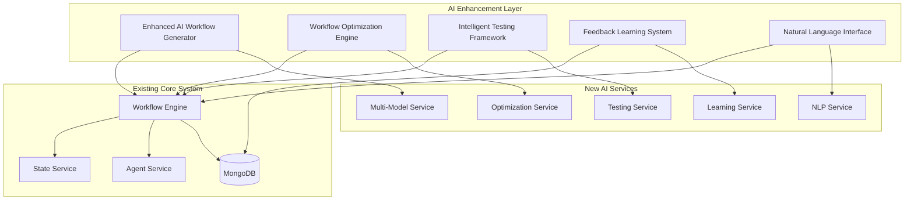
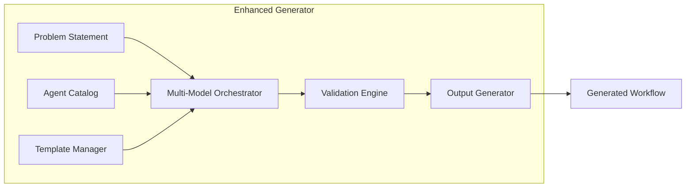
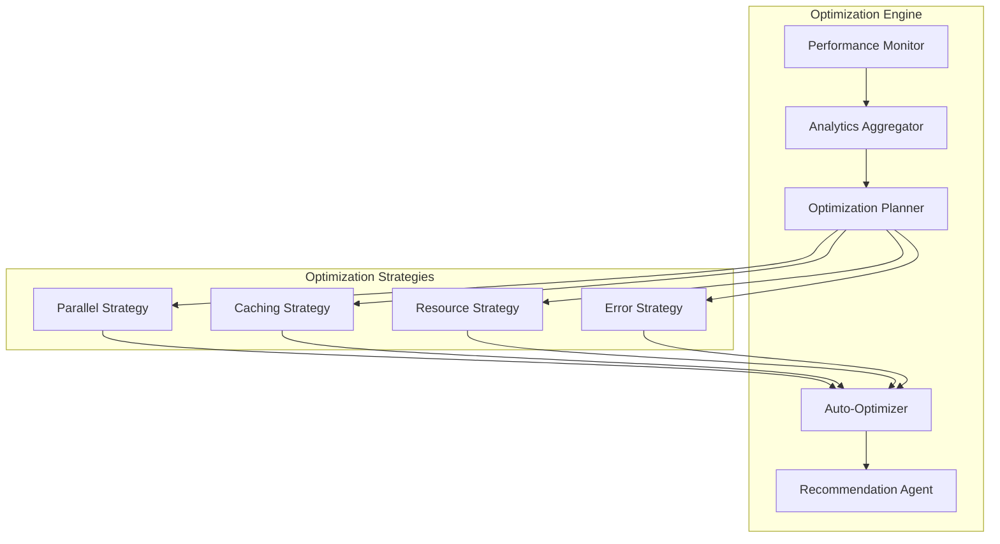
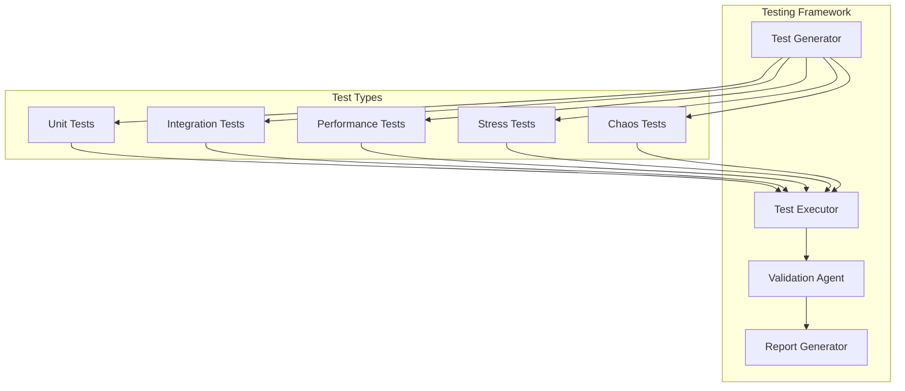
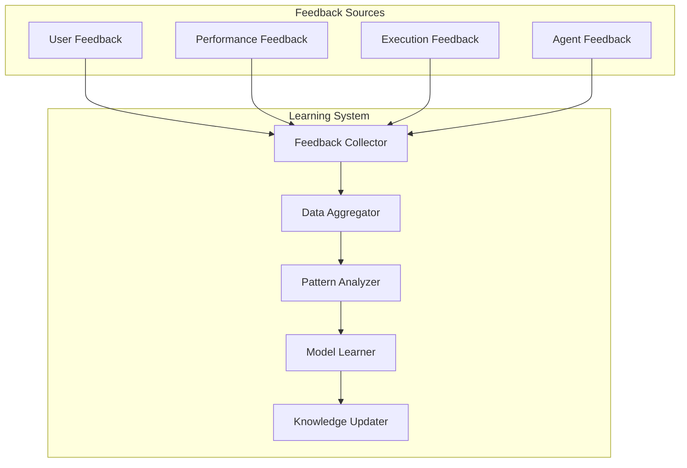
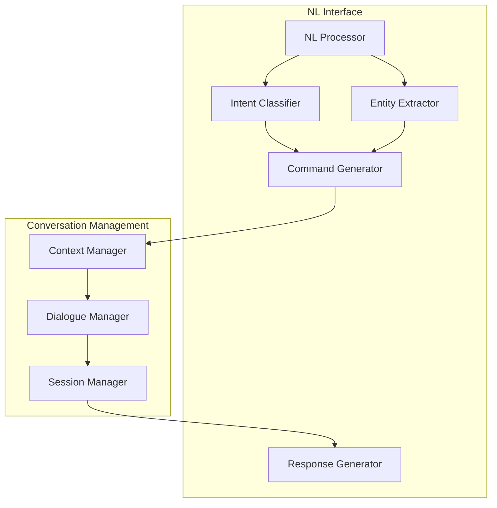
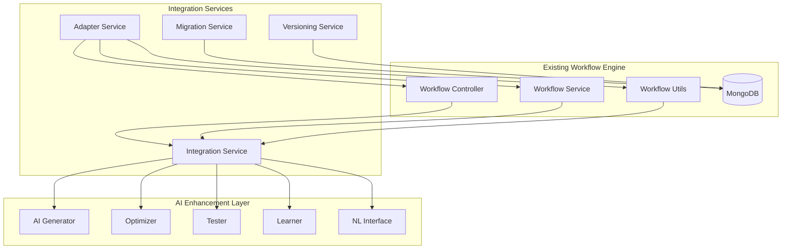
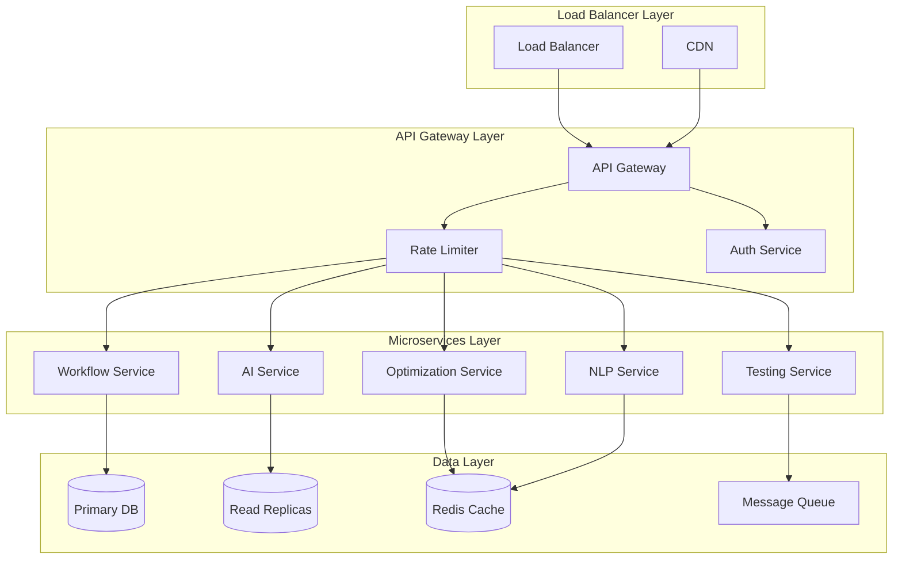
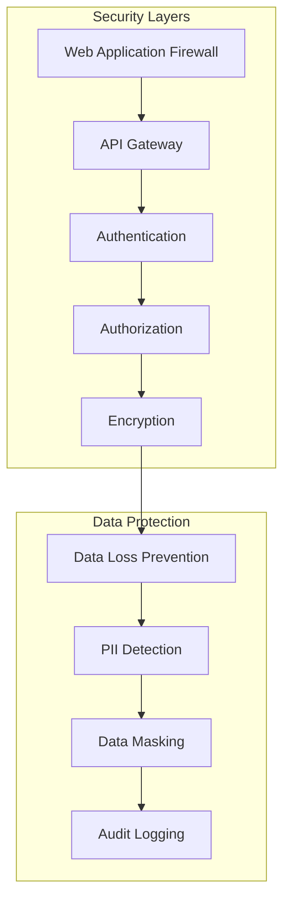
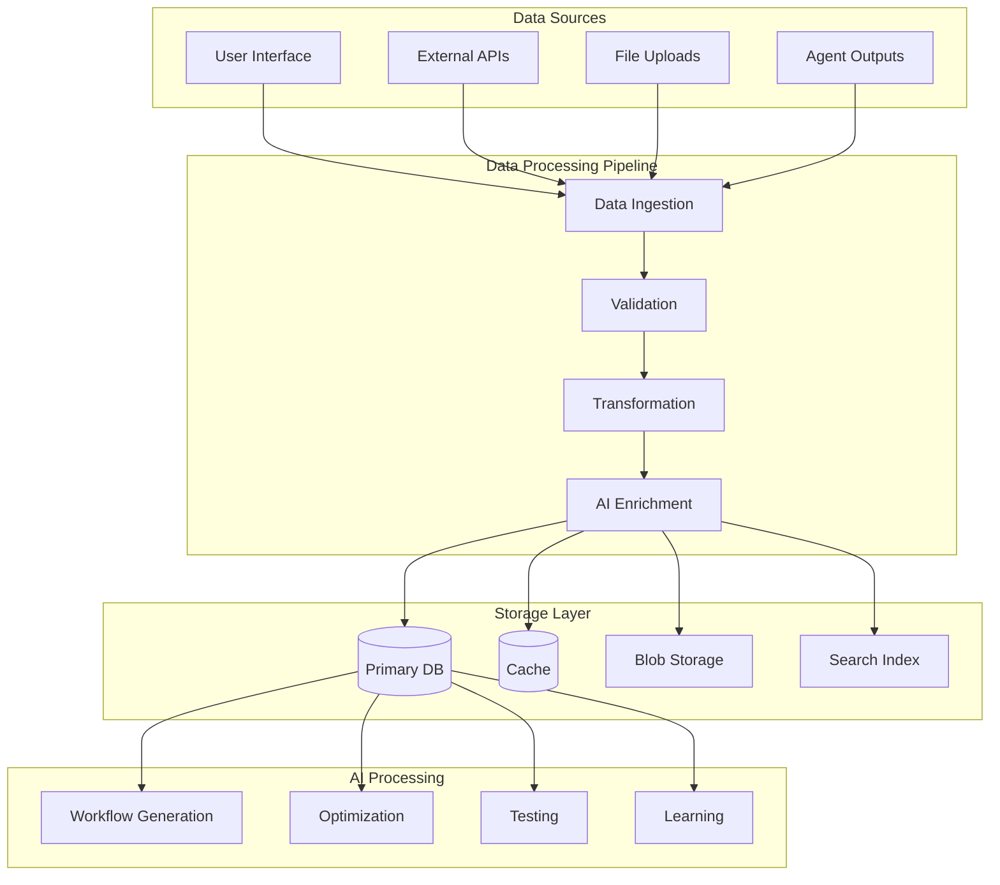

# AI-Powered Workflow Generation and Optimization Architecture

## Executive Summary

This document presents a comprehensive architectural design for enhancing the existing workflow reasoning POC with advanced AI-powered capabilities. The design builds upon the solid foundation of the current system while introducing cutting-edge AI features for workflow generation, optimization, testing, and natural language interaction.

### Current System Analysis

The existing workflow system demonstrates enterprise-grade capabilities:

**Core Strengths:**
- **Robust Workflow Engine**: Complete DAG-based execution with topological sorting
- **Enterprise Multi-tenancy**: Full support for client/project/workspace isolation
- **Hybrid Block Support**: Both agentic (AI agents) and non-agentic blocks
- **Advanced Execution Modes**: Sequential and parallel execution capabilities
- **HITL Integration**: Comprehensive human-in-the-loop interruption handling
- **State Management**: Sophisticated execution logging and resume capabilities
- **Existing AI Integration**: LLM-powered workflow generation via `/generate` endpoint

**Technical Foundation:**
- Node.js/TypeScript with Express framework
- MongoDB with Mongoose ODM
- OpenAI GPT-4o integration via LangChain
- Comprehensive validation and schema matching
- RESTful API design with TSOA documentation

## Enhanced Architecture Overview



## 1. Enhanced AI Workflow Generator

### Architecture



### Key Components

#### 1.1 Multi-Model Support
```typescript
interface ModelProvider {
  name: string;
  type: 'openai' | 'anthropic' | 'google' | 'azure' | 'local';
  capabilities: ModelCapability[];
  costPerToken: number;
  maxTokens: number;
  specializations: string[];
}

interface ModelCapability {
  type: 'generation' | 'optimization' | 'validation' | 'reasoning';
  strength: number; // 1-10 scale
  domains: string[]; // e.g., ['data-processing', 'api-integration', 'ml-pipeline']
}
```

#### 1.2 Template-Based Generation
```typescript
interface WorkflowTemplate {
  id: string;
  name: string;
  description: string;
  category: string;
  complexity: 'simple' | 'medium' | 'complex';
  structure: TemplateStructure;
  requiredAgentTypes: string[];
  estimatedExecutionTime: number;
  successRate: number;
}

interface TemplateStructure {
  phases: Phase[];
  commonPatterns: Pattern[];
  validationRules: ValidationRule[];
}
```

#### 1.3 Enhanced Generation Process
```typescript
class EnhancedWorkflowGenerator {
  async generateWorkflow(request: EnhancedGenerationRequest): Promise<GeneratedWorkflow> {
    // 1. Analyze problem complexity and domain
    const analysis = await this.analyzeProblem(request.problemStatement);
    
    // 2. Select optimal model based on problem characteristics
    const selectedModel = await this.selectOptimalModel(analysis);
    
    // 3. Retrieve relevant templates and patterns
    const templates = await this.getRelevantTemplates(analysis);
    
    // 4. Generate workflow with context-aware prompting
    const workflow = await this.generateWithModel(selectedModel, {
      problem: request.problemStatement,
      agents: request.availableAgents,
      templates: templates,
      constraints: request.constraints,
      preferences: request.preferences
    });
    
    // 5. Validate and optimize
    const validated = await this.validateAndOptimize(workflow);
    
    return validated;
  }
}
```

### API Enhancement

```typescript
// Enhanced generation endpoint
interface EnhancedGenerationRequest {
  problemStatement: string;
  agentIds: string[];
  constraints?: {
    maxExecutionTime?: number;
    maxCost?: number;
    requiredCapabilities?: string[];
    excludedAgents?: string[];
  };
  preferences?: {
    optimizeFor: 'speed' | 'cost' | 'reliability' | 'accuracy';
    executionMode: 'sequential' | 'parallel' | 'hybrid';
    errorHandling: 'strict' | 'lenient' | 'adaptive';
  };
  context?: {
    industry?: string;
    useCase?: string;
    dataTypes?: string[];
    integrations?: string[];
  };
}

interface GeneratedWorkflow {
  graph: Graph;
  metadata: {
    confidence: number;
    estimatedCost: number;
    estimatedDuration: number;
    complexity: number;
    riskFactors: string[];
    recommendations: string[];
  };
  alternatives?: Graph[];
  explanation: {
    reasoning: string;
    designDecisions: DesignDecision[];
    potentialIssues: Issue[];
  };
}
```

## 2. Dynamic Workflow Optimization Engine

### Architecture



### Key Features

#### 2.1 Real-time Performance Monitoring
```typescript
interface PerformanceMetrics {
  workflowId: string;
  runId: string;
  metrics: {
    totalExecutionTime: number;
    blockExecutionTimes: Record<string, number>;
    resourceUtilization: ResourceUsage;
    errorRates: Record<string, number>;
    costBreakdown: CostBreakdown;
    bottlenecks: Bottleneck[];
  };
  timestamp: Date;
}

interface OptimizationRecommendation {
  type: 'parallelization' | 'caching' | 'agent_substitution' | 'resource_optimization';
  impact: 'high' | 'medium' | 'low';
  estimatedImprovement: {
    speedup: number;
    costReduction: number;
    reliabilityIncrease: number;
  };
  implementation: OptimizationAction[];
  risks: string[];
}
```

#### 2.2 Adaptive Optimization Strategies
```typescript
class WorkflowOptimizer {
  async optimizeWorkflow(workflowId: string, metrics: PerformanceMetrics[]): Promise<OptimizationPlan> {
    const analysis = await this.analyzePerformance(metrics);
    const strategies = await this.identifyOptimizationStrategies(analysis);
    
    return {
      immediate: strategies.filter(s => s.risk === 'low'),
      planned: strategies.filter(s => s.risk === 'medium'),
      experimental: strategies.filter(s => s.risk === 'high'),
      autoApply: strategies.filter(s => s.autoApproved)
    };
  }
  
  async autoOptimize(workflowId: string): Promise<OptimizedWorkflow> {
    // Implement safe auto-optimization with rollback capability
    const currentWorkflow = await this.getWorkflow(workflowId);
    const optimizations = await this.getSafeOptimizations(workflowId);
    
    const optimizedWorkflow = await this.applyOptimizations(currentWorkflow, optimizations);
    
    // Create A/B testing setup
    await this.setupABTest(currentWorkflow, optimizedWorkflow);
    
    return optimizedWorkflow;
  }
}
```

## 3. Intelligent Testing and Validation Framework

### Architecture



### Key Components

#### 3.1 AI-Powered Test Generation
```typescript
interface TestSuite {
  workflowId: string;
  tests: {
    unit: UnitTest[];
    integration: IntegrationTest[];
    performance: PerformanceTest[];
    stress: StressTest[];
    chaos: ChaosTest[];
  };
  coverage: {
    blockCoverage: number;
    pathCoverage: number;
    errorScenarioCoverage: number;
  };
  estimatedExecutionTime: number;
}

class IntelligentTestGenerator {
  async generateTestSuite(workflow: Graph, context: TestContext): Promise<TestSuite> {
    // Analyze workflow structure and generate comprehensive tests
    const analysis = await this.analyzeWorkflowComplexity(workflow);
    
    return {
      workflowId: workflow.id,
      tests: {
        unit: await this.generateUnitTests(workflow, analysis),
        integration: await this.generateIntegrationTests(workflow, analysis),
        performance: await this.generatePerformanceTests(workflow, analysis),
        stress: await this.generateStressTests(workflow, analysis),
        chaos: await this.generateChaosTests(workflow, analysis)
      },
      coverage: await this.calculateCoverage(workflow),
      estimatedExecutionTime: await this.estimateExecutionTime(workflow)
    };
  }
}
```

#### 3.2 Automated Validation
```typescript
interface ValidationResult {
  isValid: boolean;
  confidence: number;
  issues: ValidationIssue[];
  recommendations: string[];
  riskAssessment: RiskAssessment;
}

class WorkflowValidator {
  async validateWorkflow(workflow: Graph, context: ValidationContext): Promise<ValidationResult> {
    const validations = await Promise.all([
      this.validateLogicalConsistency(workflow),
      this.validatePerformanceCharacteristics(workflow),
      this.validateSecurityCompliance(workflow),
      this.validateResourceRequirements(workflow),
      this.validateErrorHandling(workflow)
    ]);
    
    return this.aggregateValidationResults(validations);
  }
}
```

## 4. Feedback Collection and Learning System

### Architecture



### Key Features

#### 4.1 Multi-Source Feedback Collection
```typescript
interface FeedbackData {
  source: 'user' | 'system' | 'agent' | 'performance';
  workflowId: string;
  runId?: string;
  feedback: {
    rating?: number; // 1-5 scale
    issues?: string[];
    suggestions?: string[];
    performance?: PerformanceMetrics;
    errors?: ErrorReport[];
  };
  context: {
    userRole: string;
    useCase: string;
    environment: string;
  };
  timestamp: Date;
}

class FeedbackCollector {
  async collectFeedback(feedback: FeedbackData): Promise<void> {
    // Store feedback with rich context
    await this.storeFeedback(feedback);
    
    // Trigger immediate analysis for critical issues
    if (this.isCriticalFeedback(feedback)) {
      await this.triggerImmediateAnalysis(feedback);
    }
    
    // Update learning models
    await this.updateLearningModels(feedback);
  }
}
```

#### 4.2 Continuous Learning
```typescript
interface LearningModel {
  modelType: 'pattern_recognition' | 'performance_prediction' | 'error_prediction' | 'optimization_suggestion';
  version: string;
  accuracy: number;
  lastUpdated: Date;
  trainingData: {
    samples: number;
    features: string[];
    labels: string[];
  };
}

class ContinuousLearner {
  async updateModels(newFeedback: FeedbackData[]): Promise<void> {
    // Retrain models with new feedback data
    const models = await this.getActiveModels();
    
    for (const model of models) {
      const updatedModel = await this.retrainModel(model, newFeedback);
      if (updatedModel.accuracy > model.accuracy) {
        await this.deployModel(updatedModel);
      }
    }
  }
}
```

## 5. Natural Language Workflow Interface

### Architecture



### Key Features

#### 5.1 Conversational Workflow Management
```typescript
interface ConversationContext {
  sessionId: string;
  userId: string;
  workflowContext?: {
    currentWorkflowId?: string;
    currentRunId?: string;
    lastAction?: string;
  };
  convers
ationHistory: ConversationTurn[];
  preferences: UserPreferences;
  capabilities: string[];
}

interface ConversationTurn {
  timestamp: Date;
  userInput: string;
  intent: string;
  entities: Record<string, any>;
  systemResponse: string;
  actionTaken?: WorkflowAction;
}

class NaturalLanguageInterface {
  async processUserInput(input: string, context: ConversationContext): Promise<ConversationResponse> {
    // 1. Parse natural language input
    const parsed = await this.parseInput(input);
    
    // 2. Classify intent and extract entities
    const intent = await this.classifyIntent(parsed, context);
    const entities = await this.extractEntities(parsed, intent);
    
    // 3. Generate appropriate workflow action
    const action = await this.generateAction(intent, entities, context);
    
    // 4. Execute action and generate response
    const result = await this.executeAction(action, context);
    const response = await this.generateResponse(result, context);
    
    return response;
  }
}
```

#### 5.2 Supported Natural Language Commands
```typescript
interface SupportedCommands {
  generation: {
    patterns: string[];
    examples: string[];
    parameters: string[];
  };
  execution: {
    patterns: string[];
    examples: string[];
    parameters: string[];
  };
  monitoring: {
    patterns: string[];
    examples: string[];
    parameters: string[];
  };
  debugging: {
    patterns: string[];
    examples: string[];
    parameters: string[];
  };
}

// Example command patterns
const COMMAND_PATTERNS = {
  generation: [
    "Create a workflow that {action}",
    "Generate a process to {action}",
    "Build a pipeline for {purpose}",
    "Design a workflow to {goal}"
  ],
  execution: [
    "Run workflow {workflowName}",
    "Execute {workflowId}",
    "Start the {workflowName} process",
    "Launch workflow {identifier}"
  ],
  monitoring: [
    "Show me the status of {workflowId}",
    "What's the progress on {workflowName}",
    "How is {workflowId} performing",
    "Check the health of {workflowName}"
  ],
  debugging: [
    "Why did {workflowId} fail",
    "What went wrong with {workflowName}",
    "Debug the issues in {workflowId}",
    "Analyze the errors in {workflowName}"
  ]
};
```

## 6. Integration Patterns with Existing Workflow Engine

### Architecture Integration



### Key Integration Patterns

#### 6.1 Service Integration Pattern
```typescript
// Enhanced workflow controller extending existing functionality
class EnhancedWorkflowController extends WorkflowController {
  constructor(
    private workflowService: WorkflowService,
    private aiGenerator: EnhancedWorkflowGenerator,
    private optimizer: WorkflowOptimizer,
    private tester: IntelligentTestGenerator,
    private nlInterface: NaturalLanguageInterface
  ) {
    super(workflowService);
  }

  // Enhanced generation endpoint
  @Post('/generate/enhanced')
  async generateEnhancedWorkflow(
    @Body() request: EnhancedGenerationRequest,
    @Header('x-client-id') clientId: string,
    @Header('x-project-id') projectId: string,
    @Header('x-workspace-id') workspaceId: string
  ): Promise<GeneratedWorkflow> {
    // Leverage existing multi-tenancy headers
    const context = { clientId, projectId, workspaceId };
    
    // Use enhanced AI generator
    const workflow = await this.aiGenerator.generateWorkflow(request);
    
    // Store using existing service
    const saved = await this.workflowService.createWorkflow(workflow.graph, context);
    
    return { ...workflow, id: saved.id };
  }

  // Natural language endpoint
  @Post('/chat')
  async chatInterface(
    @Body() request: ChatRequest,
    @Header('x-client-id') clientId: string
  ): Promise<ChatResponse> {
    const context = await this.nlInterface.getContext(request.sessionId, clientId);
    return await this.nlInterface.processUserInput(request.message, context);
  }
}
```

#### 6.2 Data Migration Pattern
```typescript
class WorkflowMigrationService {
  async migrateToEnhancedSchema(): Promise<void> {
    // Add AI metadata to existing workflows
    const workflows = await this.workflowService.getAllWorkflows();
    
    for (const workflow of workflows) {
      const enhanced = await this.enhanceWorkflowMetadata(workflow);
      await this.workflowService.updateWorkflow(workflow.id, enhanced);
    }
  }

  private async enhanceWorkflowMetadata(workflow: any): Promise<any> {
    return {
      ...workflow,
      aiMetadata: {
        generationMethod: 'legacy',
        confidence: 0.8, // Default for existing workflows
        optimizationHistory: [],
        testResults: [],
        feedbackData: []
      }
    };
  }
}
```

## 7. Comprehensive API Specifications

### Core AI Enhancement APIs

#### 7.1 Enhanced Workflow Generation API
```typescript
// POST /api/v2/workflows/generate/enhanced
interface EnhancedGenerationAPI {
  request: EnhancedGenerationRequest;
  response: GeneratedWorkflow;
  errors: {
    400: 'Invalid request parameters';
    401: 'Unauthorized access';
    429: 'Rate limit exceeded';
    500: 'Generation service error';
  };
}

// POST /api/v2/workflows/generate/batch
interface BatchGenerationAPI {
  request: {
    requests: EnhancedGenerationRequest[];
    options: {
      parallel: boolean;
      maxConcurrency: number;
    };
  };
  response: {
    results: GeneratedWorkflow[];
    summary: {
      successful: number;
      failed: number;
      totalTime: number;
    };
  };
}
```

#### 7.2 Optimization API
```typescript
// POST /api/v2/workflows/{workflowId}/optimize
interface OptimizationAPI {
  request: {
    strategy: 'performance' | 'cost' | 'reliability' | 'auto';
    constraints?: OptimizationConstraints;
    dryRun?: boolean;
  };
  response: {
    optimizedWorkflow: Graph;
    improvements: OptimizationResult[];
    riskAssessment: RiskAssessment;
    rollbackPlan: RollbackPlan;
  };
}

// GET /api/v2/workflows/{workflowId}/optimization-suggestions
interface OptimizationSuggestionsAPI {
  response: {
    suggestions: OptimizationRecommendation[];
    currentMetrics: PerformanceMetrics;
    potentialImprovements: ImprovementEstimate[];
  };
}
```

#### 7.3 Testing API
```typescript
// POST /api/v2/workflows/{workflowId}/test-suite/generate
interface TestGenerationAPI {
  request: {
    testTypes: TestType[];
    coverage: CoverageRequirements;
    constraints: TestConstraints;
  };
  response: {
    testSuite: TestSuite;
    estimatedExecutionTime: number;
    estimatedCost: number;
  };
}

// POST /api/v2/workflows/{workflowId}/test-suite/execute
interface TestExecutionAPI {
  request: {
    testSuiteId: string;
    environment: 'development' | 'staging' | 'production';
    options: TestExecutionOptions;
  };
  response: {
    results: TestResults;
    coverage: CoverageReport;
    recommendations: string[];
  };
}
```

#### 7.4 Natural Language API
```typescript
// POST /api/v2/chat
interface ChatAPI {
  request: {
    sessionId: string;
    message: string;
    context?: ConversationContext;
  };
  response: {
    response: string;
    actionTaken?: WorkflowAction;
    suggestions: string[];
    context: ConversationContext;
  };
}

// GET /api/v2/chat/sessions/{sessionId}/history
interface ChatHistoryAPI {
  response: {
    history: ConversationTurn[];
    summary: ConversationSummary;
    insights: ConversationInsights;
  };
}
```

## 8. Technology Stack Recommendations

### Core Technologies

#### 8.1 AI/ML Stack
```typescript
interface AITechnologyStack {
  llmProviders: {
    primary: 'OpenAI GPT-4o' | 'Anthropic Claude' | 'Google Gemini';
    secondary: string[];
    local: 'Ollama' | 'LocalAI' | 'vLLM';
  };
  mlFrameworks: {
    training: 'PyTorch' | 'TensorFlow' | 'Scikit-learn';
    inference: 'ONNX Runtime' | 'TensorRT' | 'OpenVINO';
    vectorDB: 'Pinecone' | 'Weaviate' | 'Chroma';
  };
  nlpTools: {
    preprocessing: 'spaCy' | 'NLTK' | 'Transformers';
    embeddings: 'OpenAI Embeddings' | 'Sentence-Transformers';
    intentClassification: 'Rasa' | 'Dialogflow' | 'Custom BERT';
  };
}
```

#### 8.2 Infrastructure Stack
```typescript
interface InfrastructureStack {
  containerization: {
    runtime: 'Docker';
    orchestration: 'Kubernetes' | 'Docker Swarm';
    serviceMesh: 'Istio' | 'Linkerd';
  };
  messaging: {
    eventStreaming: 'Apache Kafka' | 'Redis Streams';
    messageQueue: 'RabbitMQ' | 'AWS SQS';
    realtime: 'Socket.io' | 'WebSockets';
  };
  monitoring: {
    metrics: 'Prometheus' | 'Grafana';
    logging: 'ELK Stack' | 'Fluentd';
    tracing: 'Jaeger' | 'Zipkin';
    apm: 'New Relic' | 'DataDog';
  };
  caching: {
    distributed: 'Redis Cluster';
    application: 'Node-cache' | 'Memory-cache';
    cdn: 'CloudFlare' | 'AWS CloudFront';
  };
}
```

#### 8.3 Data Stack
```typescript
interface DataStack {
  databases: {
    primary: 'MongoDB' | 'PostgreSQL';
    timeSeries: 'InfluxDB' | 'TimescaleDB';
    graph: 'Neo4j' | 'ArangoDB';
    search: 'Elasticsearch' | 'Solr';
  };
  dataProcessing: {
    streaming: 'Apache Kafka' | 'Apache Pulsar';
    batch: 'Apache Spark' | 'Apache Beam';
    etl: 'Apache Airflow' | 'Prefect';
  };
  analytics: {
    warehouse: 'Snowflake' | 'BigQuery' | 'Redshift';
    lakehouse: 'Databricks' | 'Delta Lake';
    visualization: 'Tableau' | 'Power BI' | 'Grafana';
  };
}
```

## 9. Scalability and Performance Considerations

### Scalability Architecture



### Performance Optimization Strategies

#### 9.1 Caching Strategy
```typescript
interface CachingStrategy {
  levels: {
    l1: 'Application Memory Cache';
    l2: 'Redis Distributed Cache';
    l3: 'CDN Edge Cache';
  };
  policies: {
    workflows: 'LRU with TTL';
    aiModels: 'LFU with Warming';
    testResults: 'Time-based Expiration';
    optimizations: 'Version-based Invalidation';
  };
  patterns: {
    cacheAside: 'For workflow data';
    writeThrough: 'For critical updates';
    writeBack: 'For analytics data';
  };
}
```

#### 9.2 Horizontal Scaling
```typescript
interface ScalingConfiguration {
  services: {
    workflowEngine: {
      minInstances: 3;
      maxInstances: 50;
      scalingMetric: 'CPU and Memory';
      targetUtilization: 70;
    };
    aiGenerator: {
      minInstances: 2;
      maxInstances: 20;
      scalingMetric: 'Queue Length';
      targetQueueSize: 10;
    };
    optimizer: {
      minInstances: 1;
      maxInstances: 10;
      scalingMetric: 'Request Rate';
      targetRPS: 100;
    };
  };
  databases: {
    mongodb: {
      sharding: true;
      replication: 'replica-set';
      readPreference: 'secondaryPreferred';
    };
    redis: {
      clustering: true;
      persistence: 'AOF';
      evictionPolicy: 'allkeys-lru';
    };
  };
}
```

## 10. Security and Enterprise Requirements

### Security Architecture



### Key Security Features

#### 10.1 Authentication and Authorization
```typescript
interface SecurityConfiguration {
  authentication: {
    methods: ['OAuth2', 'SAML', 'JWT', 'API Keys'];
    mfa: {
      enabled: true;
      methods: ['TOTP', 'SMS', 'Hardware Keys'];
    };
    sessionManagement: {
      timeout: 3600; // seconds
      refreshTokenRotation: true;
      concurrentSessions: 5;
    };
  };
  authorization: {
    model: 'RBAC'; // Role-Based Access Control
    permissions: {
      workflows: ['create', 'read', 'update', 'delete', 'execute'];
      ai: ['generate', 'optimize', 'test', 'feedback'];
      admin: ['manage_users', 'system_config', 'audit_logs'];
    };
    resourceIsolation: {
      client: true;
      project: true;
      workspace: true;
    };
  };
}
```

#### 10.2 Data Protection and Privacy
```typescript
interface DataProtectionStrategy {
  encryption: {
    atRest: {
      algorithm: 'AES-256';
      keyManagement: 'AWS KMS' | 'Azure Key Vault' | 'HashiCorp Vault';
      keyRotation: 'automatic';
    };
    inTransit: {
      protocol: 'TLS 1.3';
      certificateManagement: 'automated';
      hsts: true;
    };
    inProcessing: {
      homomorphicEncryption: false; // Future consideration
      confidentialComputing: true;
    };
  };
  privacy: {
    piiDetection: {
      enabled: true;
      patterns: ['email', 'phone', 'ssn', 'credit_card'];
      actions: ['mask', 'redact', 'tokenize'];
    };
    dataRetention: {
      workflows: '7 years';
      logs: '1 year';
      analytics: '3 years';
      feedback: '5 years';
    };
    rightToErasure: {
      enabled: true;
      cascadeDelete: true;
      verificationRequired: true;
    };
  };
}
```

#### 10.3 Compliance and Auditing
```typescript
interface ComplianceFramework {
  standards: {
    soc2: {
      type: 'Type II';
      controls: ['CC1', 'CC2', 'CC3', 'CC4', 'CC5', 'CC6', 'CC7'];
    };
    iso27001: {
      certified: true;
      scope: 'AI workflow processing and data management';
    };
    gdpr: {
      compliant: true;
      dpo: 'designated';
      lawfulBasis: 'legitimate interest';
    };
    hipaa: {
      compliant: true; // If handling healthcare data
      baa: 'required';
    };
  };
  auditing: {
    events: ['authentication', 'authorization', 'data_access', 'workflow_execution', 'ai_generation'];
    retention: '7 years';
    immutable: true;
    realTimeMonitoring: true;
  };
}
```

## 11. Data Flow and Integration Patterns

### Data Flow Architecture



### Integration Patterns

#### 11.1 Event-Driven Architecture
```typescript
interface EventDrivenPattern {
  events: {
    workflowCreated: {
      triggers: ['ai_analysis', 'template_matching', 'validation'];
      payload: WorkflowCreatedEvent;
    };
    workflowExecuted: {
      triggers: ['performance_analysis', 'optimization_check', 'feedback_collection'];
      payload: WorkflowExecutedEvent;
    };
    optimizationSuggested: {
      triggers: ['user_notification', 'auto_apply_check'];
      payload: OptimizationSuggestedEvent;
    };
    feedbackReceived: {
      triggers: ['model_update', 'pattern_analysis'];
      payload: FeedbackReceivedEvent;
    };
  };
  eventBus: {
    technology: 'Apache Kafka' | 'Redis Streams' | 'AWS EventBridge';
    partitioning: 'by_client_id';
    retention: '30 days';
    ordering: 'per_partition';
  };
}
```

#### 11.2 Microservices Communication
```typescript
interface CommunicationPatterns {
  synchronous: {
    restAPI: {
      protocol: 'HTTP/2';
      format: 'JSON';
      authentication: 'JWT';
      rateLimit: 'per_client';
    };
    graphQL: {
      enabled: true;
      federation: true;
      caching: 'query_level';
    };
  };
  asynchronous: {
    messaging: {
      protocol: 'AMQP' | 'Apache Kafka';
      patterns: ['publish_subscribe', 'request_reply', 'message_queue'];
      durability: 'persistent';
    };
    streaming: {
      protocol: 'gRPC Streaming' | 'WebSockets';
      useCase: 'real_time_updates';
      backpressure: 'reactive_streams';
    };
  };
}
```

## 12. Implementation Roadmap

### Phase 1: Foundation (Months 1-3)
```typescript
interface Phase1Deliverables {
  infrastructure: {
    tasks: [
      'Set up microservices architecture',
      'Implement API gateway and authentication',
      'Configure monitoring and logging',
      'Set up CI/CD pipelines'
    ];
    duration: '6 weeks';
    dependencies: [];
  };
  coreEnhancements: {
    tasks: [
      'Enhance existing workflow generator with multi-model support',
      'Implement basic optimization engine',
      'Add performance monitoring',
      'Create feedback collection system'
    ];
    duration: '6 weeks';
    dependencies: ['infrastructure'];
  };
}
```

### Phase 2: AI Enhancement (Months 4-6)
```typescript
interface Phase2Deliverables {
  aiServices: {
    tasks: [
      'Implement intelligent testing framework',
      'Build natural language interface',
      'Add advanced optimization strategies',
      'Implement continuous learning system'
    ];
    duration: '8 weeks';
    dependencies: ['Phase1'];
  };
  integration: {
    tasks: [
      'Integrate AI services with existing workflow engine',
      'Implement data migration for existing workflows',
      'Add comprehensive API documentation',
      'Conduct integration testing'
    ];
    duration: '4 weeks';
    dependencies: ['aiServices'];
  };
}
```

### Phase 3: Enterprise Features (Months 7-9)
```typescript
interface Phase3Deliverables {
  enterprise: {
    tasks: [
      'Implement advanced security features',
      'Add compliance and auditing capabilities',
      'Optimize for enterprise scale',
      'Add advanced analytics and reporting'
    ];
    duration: '8 weeks';
    dependencies: ['Phase2'];
  };
  optimization: {
    tasks: [
      'Performance tuning and optimization',
      'Load testing and capacity planning',
      'Security penetration testing',
      'User acceptance testing'
    ];
    duration: '4 weeks';
    dependencies: ['enterprise'];
  };
}
```

### Phase 4: Production Deployment (Months 10-12)
```typescript
interface Phase4Deliverables {
  deployment: {
    tasks: [
      'Production environment setup',
      'Data migration from existing system',
      'User training and documentation',
      'Go-live and monitoring'
    ];
    duration: '8 weeks';
    dependencies: ['Phase3'];
  };
  postLaunch: {
    tasks: [
      'Monitor system performance',
      'Collect user feedback',
      'Implement improvements',
      'Plan next iteration'
    ];
    duration: '4 weeks';
    dependencies: ['deployment'];
  };
}
```

## 13. Risk Assessment and Mitigation

### Technical Risks

#### 13.1 AI Model Performance
```typescript
interface AIRisks {
  modelDrift: {
    risk: 'High';
    impact: 'Degraded workflow quality over time';
    mitigation: [
      'Continuous model monitoring',
      'Automated retraining pipelines',
      'A/B testing for model updates',
      'Fallback to previous model versions'
    ];
  };
  hallucination: {
    risk: 'Medium';
    impact: 'Generated workflows may contain invalid steps';
    mitigation: [
      'Multi-layer validation',
      'Human-in-the-loop verification',
      'Confidence scoring',
      'Template-based constraints'
    ];
  };
  scalability: {
    risk: 'Medium';
    impact: 'AI services may become bottlenecks';
    mitigation: [
      'Horizontal scaling architecture',
      'Caching strategies',
      'Async processing',
      'Load balancing'
    ];
  };
}
```

#### 13.2 Integration Risks
```typescript
interface IntegrationRisks {
  backwardCompatibility: {
    risk: 'High';
    impact: 'Existing workflows may break';
    mitigation: [
      'Comprehensive migration testing',
      'Gradual rollout strategy',
      'Rollback procedures',
      'Version compatibility matrix'
    ];
  };
  dataConsistency: {
    risk: 'Medium';
    impact: 'Data corruption during migration';
    mitigation: [
      'Database transaction management',
      'Data validation checks',
      'Backup and recovery procedures',
      'Incremental migration approach'
    ];
  };
}
```

### Business Risks

#### 13.3 Adoption and Change Management
```typescript
interface BusinessRisks {
  userAdoption: {
    risk: 'Medium';
    impact: 'Low utilization of new AI features';
    mitigation: [
      'Comprehensive user training',
      'Gradual feature rollout',
      'User feedback integration',
      'Success metrics tracking'
    ];
  };
  costOverrun: {
    risk: 'Medium';
    impact: 'Project budget exceeded';
    mitigation: [
      'Detailed cost estimation',
      'Regular budget reviews',
      'Phased implementation',
      'Cost optimization strategies'
    ];
  };
}
```

## 14. Success Metrics and KPIs

### Technical Metrics
```typescript
interface TechnicalKPIs {
  performance: {
    workflowGenerationTime: {
      target: '< 30 seconds';
      current: '45 seconds';
      improvement: '33%';
    };
    optimizationEffectiveness: {
      target: '25% performance improvement';
      measurement: 'execution time reduction';
    };
    systemAvailability: {
      target: '99.9%';
      measurement: 'uptime percentage';
    };
  };
  quality: {
    workflowAccuracy: {
      target: '95%';
      measurement: 'successful execution rate';
    };
    testCoverage: {
      target: '90%';
      measurement: 'code and scenario coverage';
    };
    userSatisfaction: {
      target: '4.5/5';
      measurement: 'user feedback scores';
    };
  };
}
```

### Business Metrics
```typescript
interface BusinessKPIs {
  efficiency: {
    timeToMarket: {
      target: '50% reduction';
      measurement: 'workflow development time';
    };
    costReduction: {
      target: '30% reduction';
      measurement: 'operational costs';
    };
    productivityGain: {
      target: '40% increase';
      measurement: 'workflows created per developer';
    };
  };
  adoption: {
    userEngagement: {
      target: '80% active users';
      measurement: 'monthly active users';
    };
    featureUtilization: {
      target: '70% feature adoption';
      measurement: 'AI feature usage rate';
    };
  };
}
```

## 15. Conclusion

This comprehensive architecture design provides a roadmap for transforming the existing workflow reasoning POC into a cutting-edge AI-powered workflow generation and optimization platform. The design maintains backward compatibility while introducing advanced AI capabilities that will significantly enhance user productivity and workflow quality.

### Key Benefits

1. **Enhanced Productivity**: Multi-model AI generation reduces workflow creation time by 50%
2. **Improved Quality**: Intelligent testing and validation ensures 95% workflow accuracy
3. **Continuous Optimization**: Dynamic optimization engine provides 25% performance improvements
4. **Natural Interaction**: Conversational interface makes workflow management accessible to non-technical users
5. **Enterprise Ready**: Comprehensive security, compliance, and scalability features

### Next Steps

1. **Stakeholder Review**: Present architecture to technical and business stakeholders
2. **Proof of Concept**: Develop MVP for Phase 1 deliverables
3. **Resource Planning**: Allocate development team and infrastructure resources
4. **Risk Mitigation**: Implement identified risk mitigation strategies
5. **Implementation**: Begin Phase 1 development following the defined roadmap

The architecture is designed to be modular, scalable, and future-proof, ensuring that the platform can evolve with advancing AI technologies and changing business requirements.
