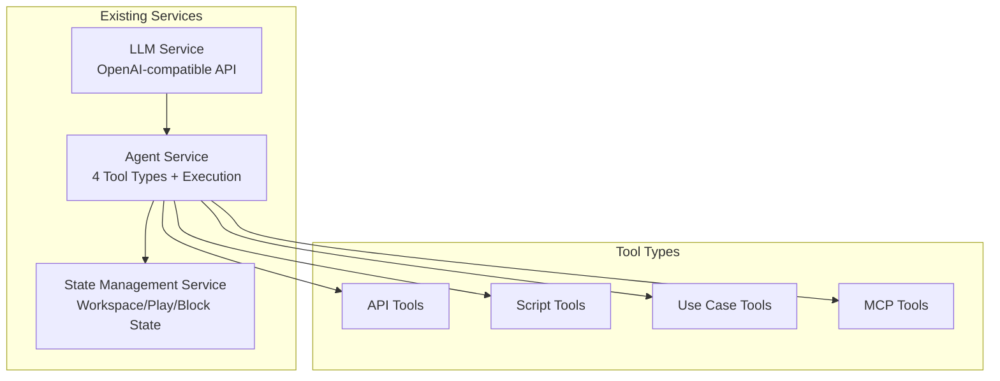
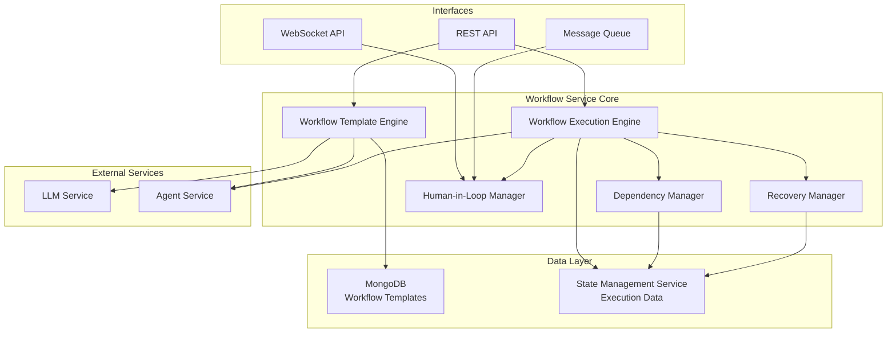
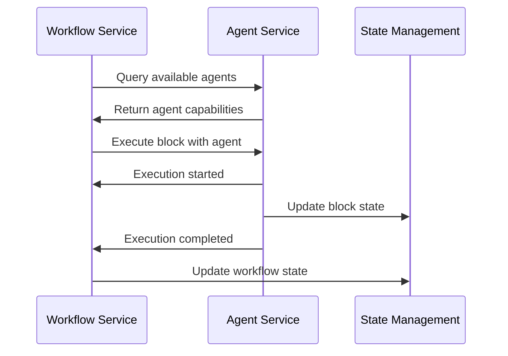
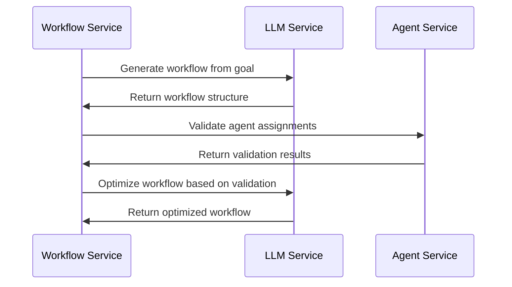
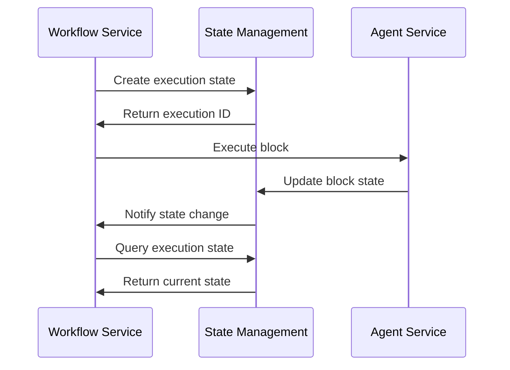
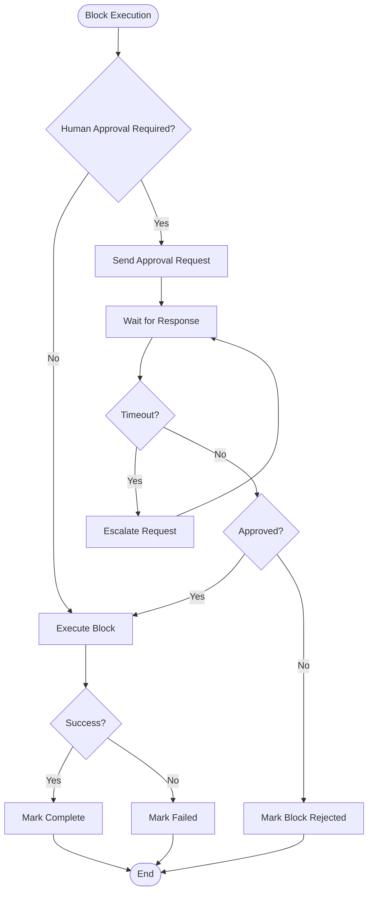
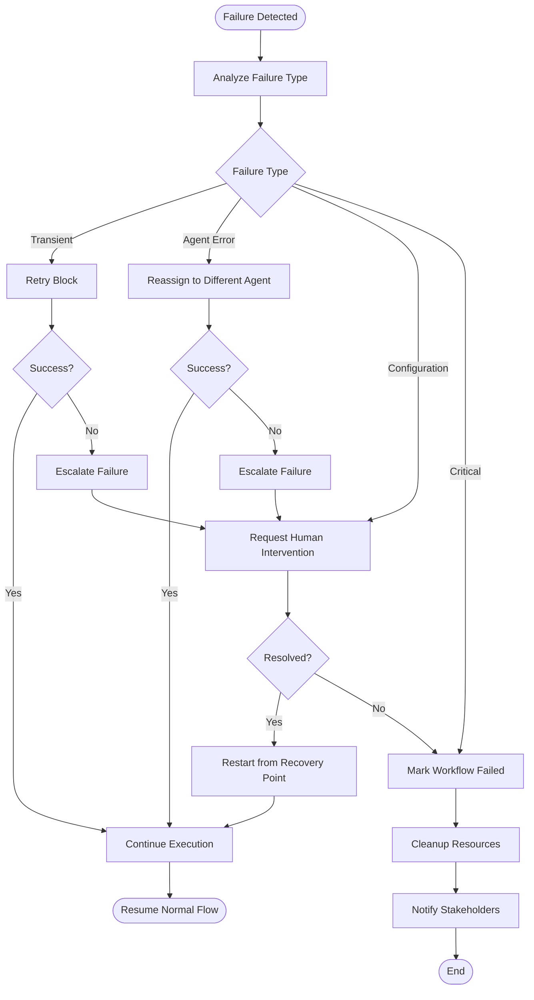

# Autonomous Agentic Workflow Service Architecture

## Executive Summary

This document outlines the comprehensive architecture for an autonomous agentic workflow service that orchestrates multi-agent processes with human-in-the-loop capabilities, conditional branching, and robust execution management.

## 1. Existing Services Analysis & Integration Points

### 1.1 Current Service Landscape



### 1.2 Integration Requirements

**LLM Service Integration:**
- Workflow template generation using LLM capabilities
- Natural language workflow description parsing
- Agent capability analysis for optimal workflow suggestions

**Agent Service Integration:**
- Agent discovery and capability querying
- Agent execution orchestration
- Tool availability validation

**State Management Service Integration:**
- Workflow execution state persistence
- Block execution tracking
- Recovery state management
- Workspace context sharing

## 2. High-Level System Architecture



## 3. Core Components

### 3.1 Workflow Template Engine
**Responsibilities:**
- Autonomous workflow template generation
- Template validation and optimization
- Template versioning and storage
- Agent capability analysis integration

**Key Features:**
- Natural language goal parsing
- Agent-to-block mapping optimization
- Dependency graph generation
- Template reusability analysis

### 3.2 Workflow Execution Engine
**Responsibilities:**
- Workflow instance management
- Block execution orchestration
- Parallel execution coordination
- Conditional branching logic

**Key Features:**
- Dynamic execution planning
- Resource allocation
- Progress tracking
- Error handling and propagation

### 3.3 Dependency Manager
**Responsibilities:**
- Dependency graph resolution
- Parallel execution opportunity identification
- Blocking condition management
- Circular dependency detection

### 3.4 Human-in-Loop Manager
**Responsibilities:**
- Approval workflow management
- Real-time notification handling
- Asynchronous approval queuing
- Input collection and validation

### 3.5 Recovery Manager
**Responsibilities:**
- Failure detection and classification
- Restart strategy determination
- State recovery coordination
- Partial execution preservation

## 4. Data Models

### 4.1 Workflow Template Schema (MongoDB)

```json
{
  "_id": "ObjectId",
  "templateId": "string",
  "name": "string",
  "description": "string",
  "version": "string",
  "createdAt": "Date",
  "updatedAt": "Date",
  "createdBy": "string",
  "tags": ["string"],
  "metadata": {
    "estimatedDuration": "number",
    "complexity": "string",
    "category": "string"
  },
  "blocks": [
    {
      "blockId": "string",
      "name": "string",
      "description": "string",
      "agentId": "string",
      "agentType": "string",
      "toolType": "string",
      "configuration": "object",
      "dependencies": ["string"],
      "conditions": {
        "type": "string",
        "expression": "string",
        "branches": [
          {
            "condition": "string",
            "nextBlocks": ["string"]
          }
        ]
      },
      "humanInLoop": {
        "required": "boolean",
        "type": "string",
        "approvalLevel": "string",
        "inputSchema": "object"
      },
      "retryPolicy": {
        "maxRetries": "number",
        "backoffStrategy": "string",
        "retryConditions": ["string"]
      }
    }
  ],
  "globalSettings": {
    "timeout": "number",
    "maxParallelBlocks": "number",
    "defaultRetryPolicy": "object",
    "humanInLoopDefaults": "object"
  }
}
```

### 4.2 Workflow Execution Model (State Management Service)

```json
{
  "executionId": "string",
  "templateId": "string",
  "templateVersion": "string",
  "workspaceId": "string",
  "status": "string",
  "startedAt": "Date",
  "completedAt": "Date",
  "createdBy": "string",
  "currentBlocks": ["string"],
  "completedBlocks": ["string"],
  "failedBlocks": ["string"],
  "blockedBlocks": ["string"],
  "blockExecutions": [
    {
      "blockId": "string",
      "executionId": "string",
      "agentId": "string",
      "status": "string",
      "startedAt": "Date",
      "completedAt": "Date",
      "input": "object",
      "output": "object",
      "error": "object",
      "retryCount": "number",
      "humanInteractions": [
        {
          "type": "string",
          "requestedAt": "Date",
          "respondedAt": "Date",
          "response": "object",
          "approver": "string"
        }
      ]
    }
  ],
  "globalContext": "object",
  "recoveryPoints": [
    {
      "timestamp": "Date",
      "state": "object",
      "completedBlocks": ["string"]
    }
  ]
}
```

## 5. API Design

### 5.1 Template Management APIs

```
POST /api/v1/templates/generate
- Generate workflow template from natural language description
- Body: { goal: string, constraints?: object, preferences?: object }
- Response: { templateId: string, template: WorkflowTemplate }

GET /api/v1/templates
- List workflow templates with filtering
- Query: { category?, tags?, search?, limit?, offset? }
- Response: { templates: WorkflowTemplate[], total: number }

GET /api/v1/templates/{templateId}
- Get specific template
- Response: WorkflowTemplate

PUT /api/v1/templates/{templateId}
- Update template
- Body: WorkflowTemplate
- Response: WorkflowTemplate

DELETE /api/v1/templates/{templateId}
- Delete template
- Response: { success: boolean }

POST /api/v1/templates/{templateId}/validate
- Validate template against current agent capabilities
- Response: { valid: boolean, issues: ValidationIssue[] }
```

### 5.2 Execution Management APIs

```
POST /api/v1/executions
- Start workflow execution
- Body: { templateId: string, input?: object, workspaceId: string }
- Response: { executionId: string, status: string }

GET /api/v1/executions/{executionId}
- Get execution status and details
- Response: WorkflowExecution

POST /api/v1/executions/{executionId}/pause
- Pause execution
- Response: { success: boolean }

POST /api/v1/executions/{executionId}/resume
- Resume paused execution
- Response: { success: boolean }

POST /api/v1/executions/{executionId}/restart
- Restart failed execution
- Body: { fromBlock?: string, resetState?: boolean }
- Response: { success: boolean }

POST /api/v1/executions/{executionId}/cancel
- Cancel execution
- Response: { success: boolean }

GET /api/v1/executions/{executionId}/logs
- Get execution logs
- Query: { blockId?, level?, limit?, offset? }
- Response: { logs: LogEntry[] }
```

### 5.3 Human-in-Loop APIs

```
GET /api/v1/approvals/pending
- Get pending approvals for user
- Query: { executionId?, blockId?, type? }
- Response: { approvals: PendingApproval[] }

POST /api/v1/approvals/{approvalId}/respond
- Respond to approval request
- Body: { approved: boolean, response?: object, comments?: string }
- Response: { success: boolean }

WebSocket: /ws/approvals
- Real-time approval notifications
- Events: approval_requested, approval_responded, approval_timeout
```

## 6. Integration Patterns

### 6.1 Agent Service Integration



### 6.2 LLM Service Integration



### 6.3 State Management Integration



## 7. Execution Flow Scenarios

### 7.1 Linear Workflow Execution


### 7.2 Parallel Execution Flow


### 7.3 Human-in-Loop Flow



### 7.4 Conditional Branching Flow


### 7.5 Recovery and Restart Flow



## 8. Database Schema Design

### 8.1 MongoDB Collections

**Templates Collection:**
```javascript
// Indexes
db.templates.createIndex({ "templateId": 1 }, { unique: true })
db.templates.createIndex({ "tags": 1 })
db.templates.create
