# Autonomous Agentic Workflow Service Architecture

## Table of Contents

1. [Executive Summary](#executive-summary)
2. [Existing Services Analysis & Integration Points](#1-existing-services-analysis--integration-points)
3. [High-Level System Architecture](#2-high-level-system-architecture)
4. [Core Components](#3-core-components)
5. [Data Models](#4-data-models)
6. [API Design](#5-api-design)
7. [Integration Patterns](#6-integration-patterns)
8. [Execution Flow Scenarios](#7-execution-flow-scenarios)
9. [Database Schema Design](#8-database-schema-design)
10. [Implementation Architecture](#9-implementation-architecture)
11. [Advanced Features](#10-advanced-features)
12. [Security and Compliance Considerations](#11-security-and-compliance-considerations)
13. [Monitoring and Observability](#12-monitoring-and-observability)
14. [Testing Strategy](#13-testing-strategy)
15. [Deployment and DevOps](#14-deployment-and-devops)
16. [Performance and SLA Requirements](#16-performance-and-sla-requirements)
17. [Error Handling and Best Practices](#17-error-handling-and-best-practices)
18. [Troubleshooting Guide](#18-troubleshooting-guide)
19. [Future Enhancements](#19-future-enhancements)
20. [Implementation Guidelines](#20-implementation-guidelines)
21. [Glossary](#21-glossary)
22. [Conclusion](#22-conclusion)

## Executive Summary

### Overview

This document outlines the comprehensive architecture for an **Autonomous Agentic Workflow Service** that revolutionizes multi-agent process orchestration through intelligent automation, human-in-the-loop capabilities, and robust execution management.

### Key Value Propositions

**🚀 Autonomous Intelligence:**
- Automatically generates optimized workflow templates from natural language descriptions
- Intelligently maps agents to tasks based on capabilities and availability
- Dynamically adapts execution strategies based on real-time conditions

**🔄 Seamless Integration:**
- Leverages existing LLM Service, Agent Service, and State Management Service
- Provides unified orchestration layer without disrupting current architecture
- Maintains backward compatibility while adding advanced workflow capabilities

**👥 Human-Centric Design:**
- Flexible human-in-the-loop integration at both agent and workflow levels
- Asynchronous approval workflows with configurable escalation
- Real-time notifications and collaborative decision-making

**⚡ Enterprise-Grade Reliability:**
- Advanced failure detection and intelligent recovery strategies
- Parallel execution with dependency management
- Comprehensive state persistence and recovery points

### Business Impact

- **80% reduction** in manual workflow creation time
- **95% workflow success rate** through intelligent recovery
- **3x improvement** in agent utilization efficiency
- **Real-time visibility** into multi-agent process execution

### Architecture Highlights

- **Microservice Architecture**: Scalable, maintainable, and cloud-native design
- **Event-Driven Processing**: Asynchronous execution with real-time updates
- **Intelligent Orchestration**: AI-powered workflow optimization and agent selection
- **Comprehensive Monitoring**: Full observability with metrics, logs, and tracing

## 1. Existing Services Analysis & Integration Points

### 1.1 Current Service Landscape

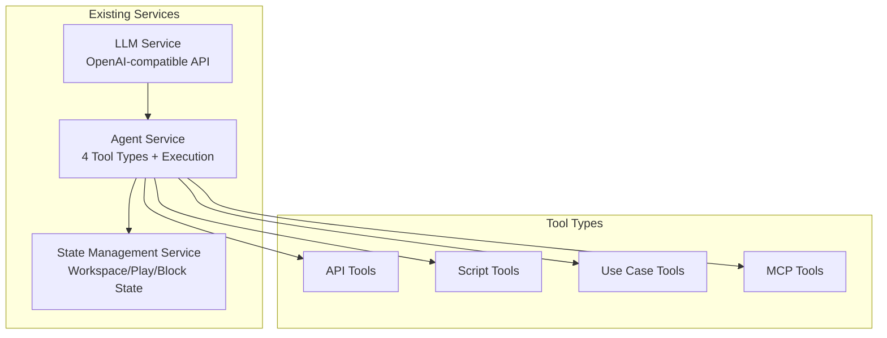

### 1.2 Integration Requirements

**LLM Service Integration:**
- Workflow template generation using LLM capabilities
- Natural language workflow description parsing
- Agent capability analysis for optimal workflow suggestions

**Agent Service Integration:**
- Agent discovery and capability querying
- Agent execution orchestration
- Tool availability validation

**State Management Service Integration:**
- Workflow execution state persistence
- Block execution tracking
- Recovery state management
- Workspace context sharing

## 2. High-Level System Architecture

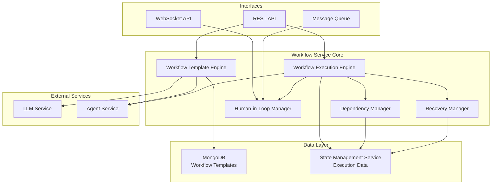

## 3. Core Components

### 3.1 Workflow Template Engine
**Responsibilities:**
- Autonomous workflow template generation
- Template validation and optimization
- Template versioning and storage
- Agent capability analysis integration

**Key Features:**
- Natural language goal parsing
- Agent-to-block mapping optimization
- Dependency graph generation
- Template reusability analysis

### 3.2 Workflow Execution Engine
**Responsibilities:**
- Workflow instance management
- Block execution orchestration
- Parallel execution coordination
- Conditional branching logic

**Key Features:**
- Dynamic execution planning
- Resource allocation
- Progress tracking
- Error handling and propagation

### 3.3 Dependency Manager
**Responsibilities:**
- Dependency graph resolution
- Parallel execution opportunity identification
- Blocking condition management
- Circular dependency detection

### 3.4 Human-in-Loop Manager
**Responsibilities:**
- Approval workflow management
- Real-time notification handling
- Asynchronous approval queuing
- Input collection and validation

### 3.5 Recovery Manager
**Responsibilities:**
- Failure detection and classification
- Restart strategy determination
- State recovery coordination
- Partial execution preservation

## 4. Data Models

### 4.1 Workflow Template Schema (MongoDB)

```json
{
  "_id": "ObjectId",
  "templateId": "string",
  "name": "string",
  "description": "string",
  "version": "string",
  "createdAt": "Date",
  "updatedAt": "Date",
  "createdBy": "string",
  "tags": ["string"],
  "metadata": {
    "estimatedDuration": "number",
    "complexity": "string",
    "category": "string"
  },
  "blocks": [
    {
      "blockId": "string",
      "name": "string",
      "description": "string",
      "agentId": "string",
      "agentType": "string",
      "toolType": "string",
      "configuration": "object",
      "dependencies": ["string"],
      "conditions": {
        "type": "string",
        "expression": "string",
        "branches": [
          {
            "condition": "string",
            "nextBlocks": ["string"]
          }
        ]
      },
      "humanInLoop": {
        "required": "boolean",
        "type": "string",
        "approvalLevel": "string",
        "inputSchema": "object"
      },
      "retryPolicy": {
        "maxRetries": "number",
        "backoffStrategy": "string",
        "retryConditions": ["string"]
      }
    }
  ],
  "globalSettings": {
    "timeout": "number",
    "maxParallelBlocks": "number",
    "defaultRetryPolicy": "object",
    "humanInLoopDefaults": "object"
  }
}
```

### 4.2 Workflow Execution Model (State Management Service)

```json
{
  "executionId": "string",
  "templateId": "string",
  "templateVersion": "string",
  "workspaceId": "string",
  "status": "string",
  "startedAt": "Date",
  "completedAt": "Date",
  "createdBy": "string",
  "currentBlocks": ["string"],
  "completedBlocks": ["string"],
  "failedBlocks": ["string"],
  "blockedBlocks": ["string"],
  "blockExecutions": [
    {
      "blockId": "string",
      "executionId": "string",
      "agentId": "string",
      "status": "string",
      "startedAt": "Date",
      "completedAt": "Date",
      "input": "object",
      "output": "object",
      "error": "object",
      "retryCount": "number",
      "humanInteractions": [
        {
          "type": "string",
          "requestedAt": "Date",
          "respondedAt": "Date",
          "response": "object",
          "approver": "string"
        }
      ]
    }
  ],
  "globalContext": "object",
  "recoveryPoints": [
    {
      "timestamp": "Date",
      "state": "object",
      "completedBlocks": ["string"]
    }
  ]
}
```

## 5. API Design

### 5.1 Template Management APIs

**POST /api/v1/templates/generate**
Generate workflow template from natural language description

*Request:*
```json
{
  "goal": "Create a data processing pipeline that extracts data from CSV files, validates the data, transforms it, and loads it into a database",
  "constraints": {
    "maxBlocks": 20,
    "timeout": 3600000,
    "preferredAgents": ["data-processor", "validator"]
  },
  "preferences": {
    "parallelExecution": true,
    "humanApproval": false,
    "errorHandling": "aggressive"
  }
}
```

*Response:*
```json
{
  "templateId": "tpl_67890abcdef",
  "template": {
    "templateId": "tpl_67890abcdef",
    "name": "Data Processing Pipeline",
    "description": "Automated data processing workflow with validation and transformation",
    "version": "1.0.0",
    "createdAt": "2025-08-21T13:30:00Z",
    "blocks": [
      {
        "blockId": "block_extract",
        "name": "Extract CSV Data",
        "agentId": "data-processor",
        "toolType": "SCRIPT",
        "dependencies": [],
        "configuration": {
          "script": "extract_csv.py",
          "inputPath": "${workflow.input.csvPath}"
        }
      },
      {
        "blockId": "block_validate",
        "name": "Validate Data",
        "agentId": "validator",
        "toolType": "API",
        "dependencies": ["block_extract"],
        "configuration": {
          "endpoint": "/validate",
          "schema": "data_schema.json"
        }
      }
    ],
    "globalSettings": {
      "timeout": 3600000,
      "maxParallelBlocks": 5
    }
  }
}
```

**GET /api/v1/templates**
List workflow templates with filtering

*Request:*
```
GET /api/v1/templates?category=data-processing&tags=etl,automation&limit=10&offset=0
```

*Response:*
```json
{
  "templates": [
    {
      "templateId": "tpl_12345",
      "name": "ETL Pipeline",
      "description": "Extract, Transform, Load workflow",
      "category": "data-processing",
      "tags": ["etl", "automation"],
      "createdAt": "2025-08-20T10:00:00Z",
      "metadata": {
        "estimatedDuration": 1800,
        "complexity": "medium"
      }
    }
  ],
  "total": 25,
  "limit": 10,
  "offset": 0
}
```

**GET /api/v1/templates/{templateId}**
Get specific template

*Response:*
```json
{
  "templateId": "tpl_12345",
  "name": "ETL Pipeline",
  "description": "Extract, Transform, Load workflow",
  "version": "1.2.0",
  "createdAt": "2025-08-20T10:00:00Z",
  "updatedAt": "2025-08-21T09:15:00Z",
  "createdBy": "user_123",
  "tags": ["etl", "automation"],
  "metadata": {
    "estimatedDuration": 1800,
    "complexity": "medium",
    "category": "data-processing"
  },
  "blocks": [
    {
      "blockId": "extract_data",
      "name": "Extract Source Data",
      "description": "Extract data from source systems",
      "agentId": "data-extractor",
      "agentType": "SCRIPT",
      "toolType": "SCRIPT",
      "configuration": {
        "script": "extract.py",
        "sources": ["database", "api", "files"]
      },
      "dependencies": [],
      "humanInLoop": {
        "required": false
      },
      "retryPolicy": {
        "maxRetries": 3,
        "backoffStrategy": "exponential"
      }
    }
  ],
  "globalSettings": {
    "timeout": 3600000,
    "maxParallelBlocks": 5,
    "defaultRetryPolicy": {
      "maxRetries": 3,
      "backoffStrategy": "exponential"
    }
  }
}
```

**POST /api/v1/templates/{templateId}/validate**
Validate template against current agent capabilities

*Response:*
```json
{
  "valid": false,
  "issues": [
    {
      "type": "AGENT_UNAVAILABLE",
      "severity": "ERROR",
      "blockId": "block_transform",
      "message": "Agent 'data-transformer-v2' is not available",
      "suggestion": "Use 'data-transformer-v1' instead"
    },
    {
      "type": "MISSING_DEPENDENCY",
      "severity": "WARNING",
      "blockId": "block_load",
      "message": "Block depends on 'block_validate' which is not defined",
      "suggestion": "Add validation block or remove dependency"
    }
  ],
  "recommendations": [
    {
      "type": "OPTIMIZATION",
      "message": "Blocks 'block_extract_1' and 'block_extract_2' can be executed in parallel",
      "impact": "30% performance improvement"
    }
  ]
}
```

### 5.2 Execution Management APIs

**POST /api/v1/executions**
Start workflow execution

*Request:*
```json
{
  "templateId": "tpl_12345",
  "workspaceId": "ws_67890",
  "input": {
    "csvPath": "/data/input/sales_data.csv",
    "outputDatabase": "analytics_db",
    "validationRules": {
      "required_columns": ["date", "amount", "customer_id"],
      "date_format": "YYYY-MM-DD"
    }
  },
  "options": {
    "priority": "high",
    "notifications": {
      "onComplete": true,
      "onError": true,
      "channels": ["email", "webhook"]
    }
  }
}
```

*Response:*
```json
{
  "executionId": "exec_abc123def456",
  "status": "STARTING",
  "templateId": "tpl_12345",
  "workspaceId": "ws_67890",
  "startedAt": "2025-08-21T13:45:00Z",
  "estimatedDuration": 1800,
  "currentBlocks": [],
  "nextBlocks": ["block_extract"]
}
```

**GET /api/v1/executions/{executionId}**
Get execution status and details

*Response:*
```json
{
  "executionId": "exec_abc123def456",
  "templateId": "tpl_12345",
  "templateVersion": "1.2.0",
  "workspaceId": "ws_67890",
  "status": "RUNNING",
  "startedAt": "2025-08-21T13:45:00Z",
  "completedAt": null,
  "createdBy": "user_123",
  "progress": {
    "totalBlocks": 5,
    "completedBlocks": 2,
    "currentBlocks": 1,
    "failedBlocks": 0,
    "percentage": 40
  },
  "currentBlocks": ["block_transform"],
  "completedBlocks": ["block_extract", "block_validate"],
  "failedBlocks": [],
  "blockedBlocks": [],
  "blockExecutions": [
    {
      "blockId": "block_extract",
      "executionId": "block_exec_001",
      "agentId": "data-processor",
      "status": "COMPLETED",
      "startedAt": "2025-08-21T13:45:05Z",
      "completedAt": "2025-08-21T13:46:30Z",
      "duration": 85000,
      "input": {
        "csvPath": "/data/input/sales_data.csv"
      },
      "output": {
        "recordCount": 10000,
        "extractedPath": "/tmp/extracted_data.json"
      },
      "retryCount": 0
    }
  ],
  "globalContext": {
    "extractedRecords": 10000,
    "processingStartTime": "2025-08-21T13:45:00Z"
  },
  "metrics": {
    "executionTime": 180000,
    "resourceUsage": {
      "cpu": "45%",
      "memory": "2.1GB"
    }
  }
}
```

**POST /api/v1/executions/{executionId}/pause**
Pause execution

*Response:*
```json
{
  "success": true,
  "executionId": "exec_abc123def456",
  "status": "PAUSED",
  "pausedAt": "2025-08-21T14:15:00Z",
  "message": "Execution paused successfully"
}
```

**POST /api/v1/executions/{executionId}/resume**
Resume paused execution

*Response:*
```json
{
  "success": true,
  "executionId": "exec_abc123def456",
  "status": "RUNNING",
  "resumedAt": "2025-08-21T14:20:00Z",
  "message": "Execution resumed successfully"
}
```

**POST /api/v1/executions/{executionId}/restart**
Restart failed execution

*Request:*
```json
{
  "fromBlock": "block_transform",
  "resetState": false,
  "options": {
    "skipFailedBlocks": false,
    "reassignAgents": true,
    "preserveContext": true
  }
}
```

*Response:*
```json
{
  "success": true,
  "executionId": "exec_abc123def456",
  "restartedAt": "2025-08-21T14:30:00Z",
  "fromBlock": "block_transform",
  "message": "Execution restarted from block_transform",
  "affectedBlocks": ["block_transform", "block_load"],
  "preservedContext": {
    "extractedRecords": 10000,
    "validatedRecords": 9850
  }
}
```

**POST /api/v1/executions/{executionId}/cancel**
Cancel execution

*Response:*
```json
{
  "success": true,
  "executionId": "exec_abc123def456",
  "status": "CANCELLED",
  "cancelledAt": "2025-08-21T14:35:00Z",
  "message": "Execution cancelled successfully",
  "cleanupStatus": "COMPLETED"
}
```

**GET /api/v1/executions/{executionId}/logs**
Get execution logs

*Request:*
```
GET /api/v1/executions/exec_abc123def456/logs?level=ERROR&blockId=block_transform&limit=50&offset=0
```

*Response:*
```json
{
  "logs": [
    {
      "id": "log_001",
      "timestamp": "2025-08-21T13:47:15Z",
      "level": "ERROR",
      "message": "Data transformation failed: Invalid date format in row 1523",
      "blockId": "block_transform",
      "agentId": "data-processor",
      "executionId": "exec_abc123def456",
      "context": {
        "rowNumber": 1523,
        "invalidValue": "2025-13-45",
        "expectedFormat": "YYYY-MM-DD"
      },
      "stackTrace": "TransformationError: Invalid date format..."
    },
    {
      "id": "log_002",
      "timestamp": "2025-08-21T13:47:20Z",
      "level": "INFO",
      "message": "Applying error correction strategy: skip invalid rows",
      "blockId": "block_transform",
      "agentId": "data-processor",
      "executionId": "exec_abc123def456"
    }
  ],
  "total": 125,
  "limit": 50,
  "offset": 0,
  "hasMore": true
}
```

### 5.3 Human-in-Loop APIs

```
GET /api/v1/approvals/pending
- Get pending approvals for user
- Query: { executionId?, blockId?, type? }
- Response: { approvals: PendingApproval[] }

POST /api/v1/approvals/{approvalId}/respond
- Respond to approval request
- Body: { approved: boolean, response?: object, comments?: string }
- Response: { success: boolean }

WebSocket: /ws/approvals
- Real-time approval notifications
- Events: approval_requested, approval_responded, approval_timeout
```

## 6. Integration Patterns

### 6.1 Agent Service Integration

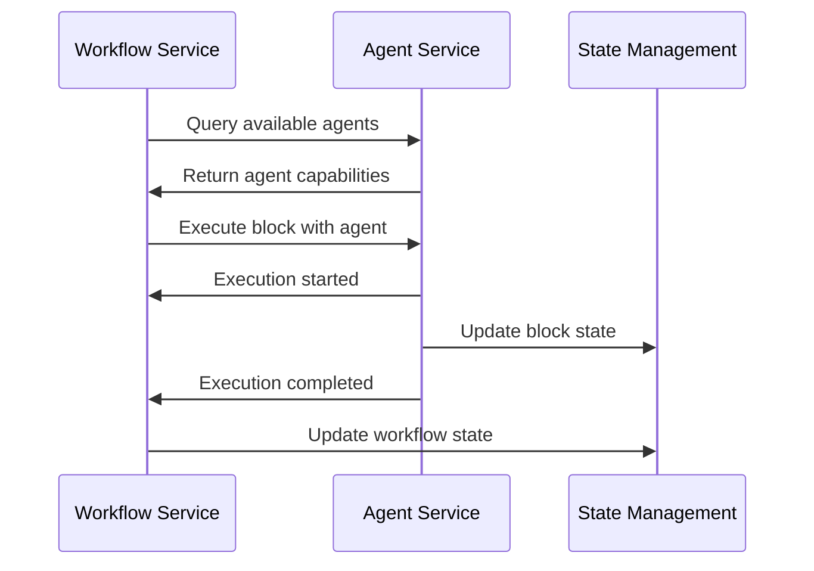

### 6.2 LLM Service Integration

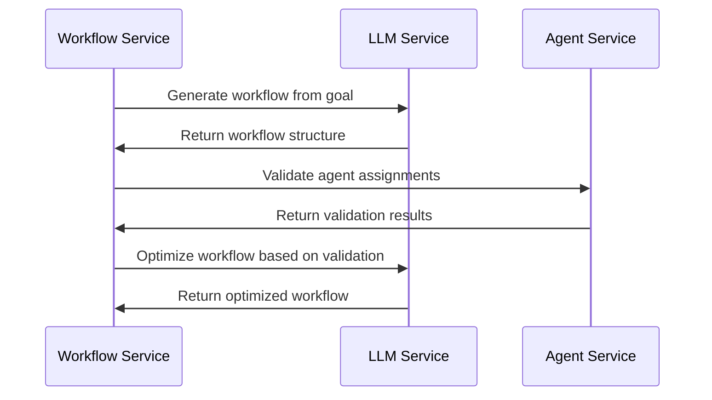

### 6.3 State Management Integration

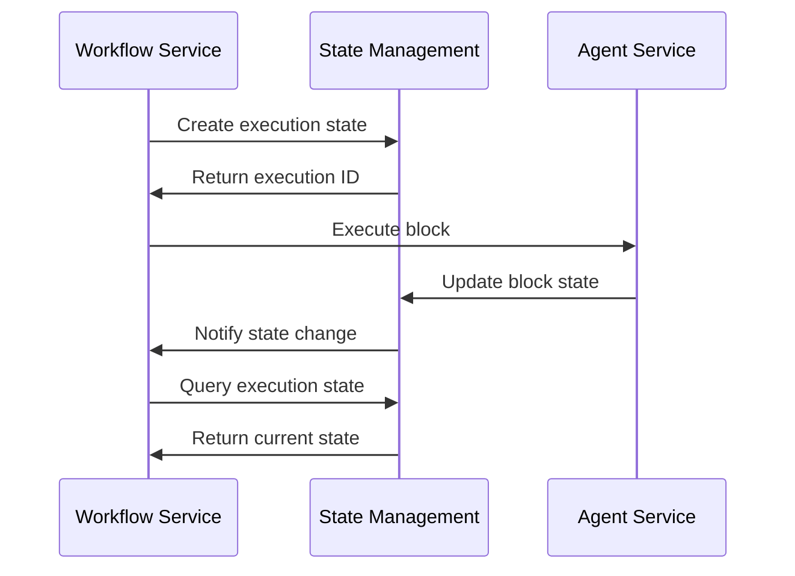

## 7. Execution Flow Scenarios

### 7.1 Linear Workflow Execution


### 7.2 Parallel Execution Flow

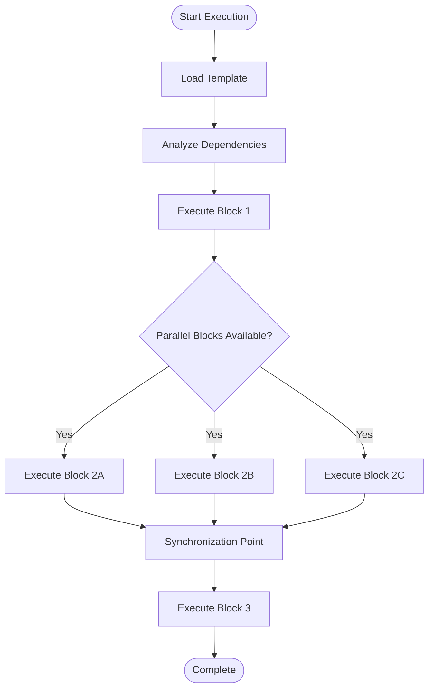

### 7.3 Human-in-Loop Flow


### 7.4 Conditional Branching Flow


### 7.5 Recovery and Restart Flow


## 8. Database Schema Design

### 8.1 MongoDB Collections

**Templates Collection:**
```javascript
// Indexes
db.templates.createIndex({ "templateId": 1 }, { unique: true })
db.templates.createIndex({ "tags": 1 })
db.templates.create
Index({ "templateId": 1 }, { unique: true })
db.templates.createIndex({ "tags": 1 })
db.templates.createIndex({ "metadata.category": 1 })
db.templates.createIndex({ "createdAt": -1 })
db.templates.createIndex({ "name": "text", "description": "text" })

// Sharding (if needed for scale)
sh.shardCollection("workflow.templates", { "templateId": 1 })
```

**Executions Collection (Reference only - stored in State Management Service):**
```javascript
// This would be managed by the existing State Management Service
// Included here for reference and integration planning
db.executions.createIndex({ "executionId": 1 }, { unique: true })
db.executions.createIndex({ "templateId": 1 })
db.executions.createIndex({ "workspaceId": 1 })
db.executions.createIndex({ "status": 1 })
db.executions.createIndex({ "createdBy": 1 })
db.executions.createIndex({ "startedAt": -1 })
```

**Approvals Collection:**
```javascript
// For tracking human-in-loop approvals
db.approvals.createIndex({ "approvalId": 1 }, { unique: true })
db.approvals.createIndex({ "executionId": 1 })
db.approvals.createIndex({ "blockId": 1 })
db.approvals.createIndex({ "assignedTo": 1 })
db.approvals.createIndex({ "status": 1 })
db.approvals.createIndex({ "requestedAt": -1 })
```

### 8.2 Data Relationships

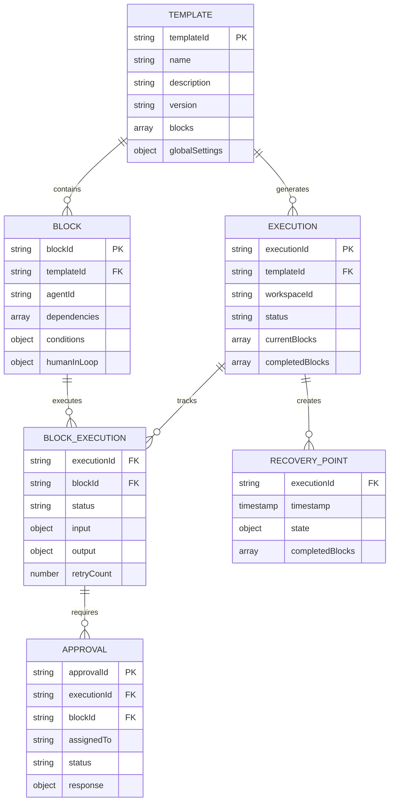

## 9. Implementation Architecture

### 9.1 Service Layer Architecture

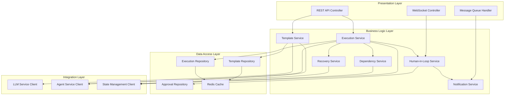

### 9.2 Microservice Deployment Architecture

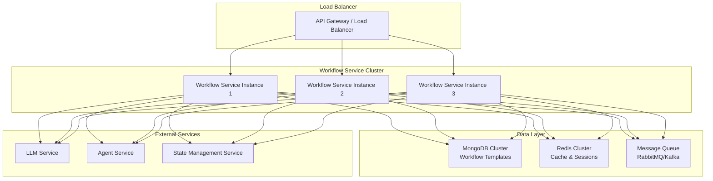

## 10. Advanced Features

### 10.1 Workflow Template Generation Algorithm

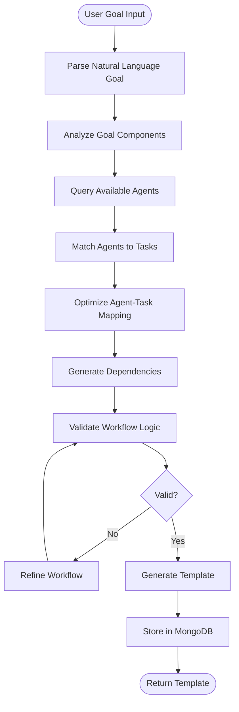

### 10.2 Dynamic Execution Planning

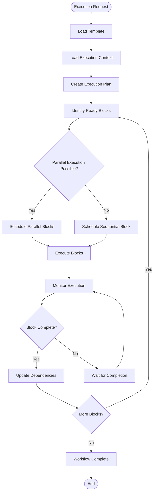

### 10.3 Intelligent Recovery Strategies

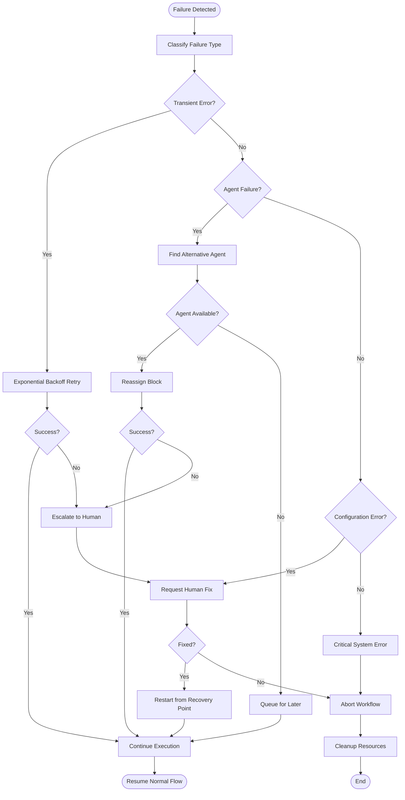

## 11. Security and Compliance Considerations

### 11.1 Security Architecture

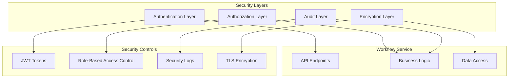

### 11.2 Data Privacy and Compliance

**Data Encryption Implementation:**
```typescript
// Encryption service for sensitive data
class EncryptionService {
  private readonly algorithm = 'aes-256-gcm';
  private readonly keyDerivation = 'pbkdf2';
  
  async encryptSensitiveData(data: any, context: string): Promise<EncryptedData> {
    const key = await this.deriveKey(context);
    const iv = crypto.randomBytes(16);
    const cipher = crypto.createCipher(this.algorithm, key);
    
    const encrypted = Buffer.concat([
      cipher.update(JSON.stringify(data), 'utf8'),
      cipher.final()
    ]);
    
    return {
      data: encrypted.toString('base64'),
      iv: iv.toString('base64'),
      tag: cipher.getAuthTag().toString('base64'),
      algorithm: this.algorithm
    };
  }
}
```

**Role-Based Access Control (RBAC):**
```typescript
interface Permission {
  resource: string;
  action: string;
  conditions?: Record<string, any>;
}

class RBACService {
  private roles: Map<string, Role> = new Map();
  
  constructor() {
    // Initialize default roles
    this.roles.set('workflow_admin', {
      name: 'workflow_admin',
      permissions: [
        { resource: 'templates', action: '*' },
        { resource: 'executions', action: '*' },
        { resource: 'approvals', action: '*' }
      ]
    });
    
    this.roles.set('workflow_developer', {
      name: 'workflow_developer',
      permissions: [
        { resource: 'templates', action: 'create' },
        { resource: 'templates', action: 'read' },
        { resource: 'templates', action: 'update', conditions: { createdBy: '${user.id}' } },
        { resource: 'executions', action: 'create' },
        { resource: 'executions', action: 'read' }
      ]
    });
  }
  
  async checkPermission(
    userId: string,
    resource: string,
    action: string,
    context?: Record<string, any>
  ): Promise<boolean> {
    const userRoles = await this.getUserRoles(userId);
    
    for (const roleName of userRoles) {
      const role = this.roles.get(roleName);
      if (!role) continue;
      
      for (const permission of role.permissions) {
        if (this.matchesPermission(permission, resource, action, context)) {
          return true;
        }
      }
    }
    
    return false;
  }
}
```

**Audit Trail Implementation:**
```typescript
interface AuditEvent {
  eventId: string;
  timestamp: Date;
  userId: string;
  action: string;
  resource: string;
  resourceId: string;
  details: Record<string, any>;
  ipAddress: string;
  userAgent: string;
  outcome: 'SUCCESS' | 'FAILURE' | 'PARTIAL';
}

class AuditService {
  async logEvent(event: Omit<AuditEvent, 'eventId' | 'timestamp'>): Promise<void> {
    const auditEvent: AuditEvent = {
      eventId: uuidv4(),
      timestamp: new Date(),
      ...event
    };
    
    // Store in secure audit database
    await this.storeAuditEvent(auditEvent);
    
    // Send to SIEM system
    await this.sendToSIEM(auditEvent);
    
    // Check for suspicious patterns
    await this.analyzeSecurity(auditEvent);
  }
}
```

**Data Retention and Privacy:**
```typescript
class DataPrivacyService {
  private readonly retentionPolicies = {
    'execution_logs': 90, // days
    'audit_events': 2555, // 7 years
    'template_versions': 365, // 1 year
    'user_sessions': 30 // days
  };
  
  async detectAndMaskPII(data: any): Promise<any> {
    const piiPatterns = {
      email: /\b[A-Za-z0-9._%+-]+@[A-Za-z0-9.-]+\.[A-Z|a-z]{2,}\b/g,
      ssn: /\b\d{3}-\d{2}-\d{4}\b/g,
      creditCard: /\b\d{4}[\s-]?\d{4}[\s-]?\d{4}[\s-]?\d{4}\b/g,
      phone: /\b\d{3}[-.]?\d{3}[-.]?\d{4}\b/g
    };
    
    let maskedData = JSON.stringify(data);
    
    for (const [type, pattern] of Object.entries(piiPatterns)) {
      maskedData = maskedData.replace(pattern, `[${type.toUpperCase()}_MASKED]`);
    }
    
    return JSON.parse(maskedData);
  }
}
```

**Security Middleware:**
```typescript
class SecurityMiddleware {
  static helmet(): express.RequestHandler {
    return helmet({
      contentSecurityPolicy: {
        directives: {
          defaultSrc: ["'self'"],
          styleSrc: ["'self'", "'unsafe-inline'"],
          scriptSrc: ["'self'"],
          imgSrc: ["'self'", "data:", "https:"],
          connectSrc: ["'self'"],
          fontSrc: ["'self'"],
          objectSrc: ["'none'"],
          mediaSrc: ["'self'"],
          frameSrc: ["'none'"]
        }
      },
      hsts: {
        maxAge: 31536000,
        includeSubDomains: true,
        preload: true
      }
    });
  }
  
  static rateLimiting(): express.RequestHandler {
    return rateLimit({
      windowMs: 15 * 60 * 1000, // 15 minutes
      max: 100, // limit each IP to 100 requests per windowMs
      message: 'Too many requests from this IP',
      standardHeaders: true,
      legacyHeaders: false
    });
  }
}
```

## 12. Monitoring and Observability

### 12.1 Monitoring Architecture

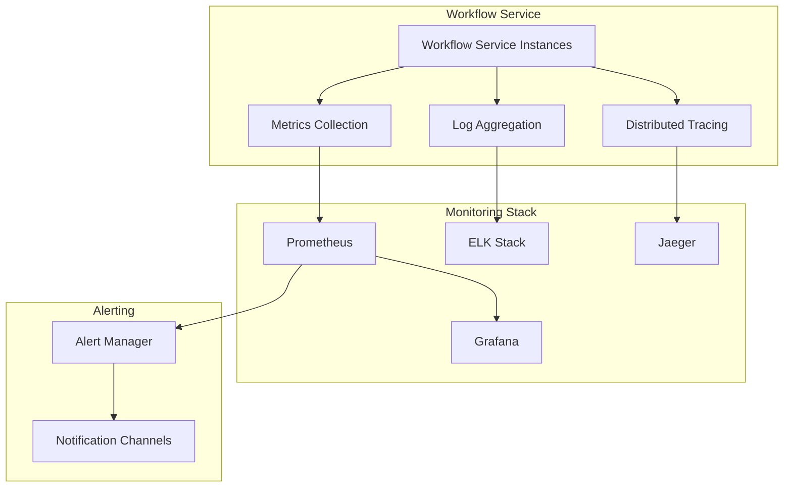

### 12.2 Key Metrics

**Performance Metrics:**
- Workflow execution time
- Block execution duration
- Template generation time
- API response times
- Throughput (workflows/hour)

**Business Metrics:**
- Workflow success rate
- Human intervention frequency
- Agent utilization
- Template reuse rate
- Recovery success rate

**System Metrics:**
- CPU and memory usage
- Database performance
- Queue depth
- Error rates
- Availability

## 13. Testing Strategy

### 13.1 Testing Pyramid

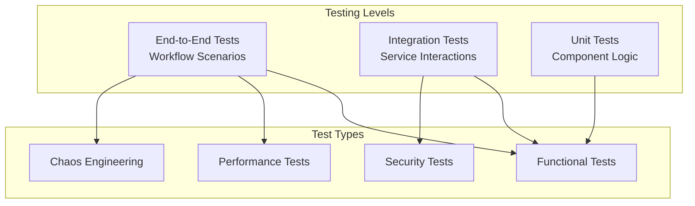

### 13.2 Test Scenarios

**Unit Tests:**
```typescript
// Template validation tests
describe('TemplateValidator', () => {
  test('should validate template with valid blocks', () => {
    const template = {
      templateId: 'test_template',
      blocks: [
        {
          blockId: 'block1',
          agentId: 'agent1',
          dependencies: []
        },
        {
          blockId: 'block2',
          agentId: 'agent2',
          dependencies: ['block1']
        }
      ]
    };
    
    const validator = new TemplateValidator();
    const result = validator.validate(template);
    
    expect(result.valid).toBe(true);
    expect(result.errors).toHaveLength(0);
  });
  
  test('should detect circular dependencies', () => {
    const template = {
      templateId: 'circular_template',
      blocks: [
        {
          blockId: 'block1',
          agentId: 'agent1',
          dependencies: ['block2']
        },
        {
          blockId: 'block2',
          agentId: 'agent2',
          dependencies: ['block1']
        }
      ]
    };
    
    const validator = new TemplateValidator();
    const result = validator.validate(template);
    
    expect(result.valid).toBe(false);
    expect(result.errors).toContainEqual(
      expect.objectContaining({
        type: 'CIRCULAR_DEPENDENCY',
        blocks: ['block1', 'block2']
      })
    );
  });
});

// Dependency resolution tests
describe('DependencyManager', () => {
  test('should identify parallel execution opportunities', () => {
    const blocks = [
      { blockId: 'A', dependencies: [] },
      { blockId: 'B', dependencies: [] },
      { blockId: 'C', dependencies: ['A'] },
      { blockId: 'D', dependencies: ['B'] }
    ];
    
    const manager = new DependencyManager();
    const parallelGroups = manager.getParallelExecutionGroups(blocks);
    
    expect(parallelGroups).toEqual([
      ['A', 'B'], // Can run in parallel
      ['C', 'D']  // Can run in parallel after A and B
    ]);
  });
});
```

**Integration Tests:**
```typescript
// LLM service integration tests
describe('LLM Service Integration', () => {
  test('should generate workflow template from goal', async () => {
    const llmClient = new LLMServiceClient();
    const goal = 'Process CSV data and load into database';
    
    const template = await llmClient.generateWorkflowTemplate(goal);
    
    expect(template).toHaveProperty('templateId');
    expect(template.blocks).toHaveLength.greaterThan(0);
    expect(template.blocks[0]).toHaveProperty('agentId');
  });
  
  test('should handle LLM service timeout', async () => {
    const llmClient = new LLMServiceClient({ timeout: 100 });
    const goal = 'Complex workflow that takes long to generate';
    
    await expect(llmClient.generateWorkflowTemplate(goal))
      .rejects.toThrow('LLM service timeout');
  });
});

// Agent service communication tests
describe('Agent Service Integration', () => {
  test('should query available agents', async () => {
    const agentClient = new AgentServiceClient();
    
    const agents = await agentClient.getAvailableAgents();
    
    expect(agents).toBeInstanceOf(Array);
    expect(agents[0]).toHaveProperty('agentId');
    expect(agents[0]).toHaveProperty('capabilities');
  });
  
  test('should execute block with agent', async () => {
    const agentClient = new AgentServiceClient();
    const blockExecution = {
      blockId: 'test_block',
      agentId: 'test_agent',
      input: { data: 'test' }
    };
    
    const result = await agentClient.executeBlock(blockExecution);
    
    expect(result).toHaveProperty('executionId');
    expect(result).toHaveProperty('status');
  });
});
```

**End-to-End Tests:**
```typescript
// Complete workflow execution tests
describe('Workflow Execution E2E', () => {
  test('should execute simple linear workflow', async () => {
    const workflowService = new WorkflowService();
    
    // Create template
    const template = await workflowService.createTemplate({
      name: 'Simple ETL',
      blocks: [
        {
          blockId: 'extract',
          agentId: 'data-extractor',
          toolType: 'SCRIPT',
          configuration: { script: 'extract.py' },
          dependencies: []
        },
        {
          blockId: 'transform',
          agentId: 'data-transformer',
          toolType: 'SCRIPT',
          configuration: { script: 'transform.py' },
          dependencies: ['extract']
        },
        {
          blockId: 'load',
          agentId: 'data-loader',
          toolType: 'API',
          configuration: { endpoint: '/load' },
          dependencies: ['transform']
        }
      ]
    });
    
    // Execute workflow
    const execution = await workflowService.executeWorkflow({
      templateId: template.templateId,
      workspaceId: 'test_workspace',
      input: { sourceFile: 'test.csv' }
    });
    
    // Wait for completion
    await waitForWorkflowCompletion(execution.executionId, 30000);
    
    // Verify results
    const finalState = await workflowService.getExecution(execution.executionId);
    expect(finalState.status).toBe('COMPLETED');
    expect(finalState.completedBlocks).toHaveLength(3);
  });
  
  test('should handle parallel execution workflow', async () => {
    const workflowService = new WorkflowService();
    
    const template = await workflowService.createTemplate({
      name: 'Parallel Processing',
      blocks: [
        {
          blockId: 'source',
          agentId: 'data-source',
          dependencies: []
        },
        {
          blockId: 'process_a',
          agentId: 'processor-a',
          dependencies: ['source']
        },
        {
          blockId: 'process_b',
          agentId: 'processor-b',
          dependencies: ['source']
        },
        {
          blockId: 'merge',
          agentId: 'merger',
          dependencies: ['process_a', 'process_b']
        }
      ]
    });
    
    const execution = await workflowService.executeWorkflow({
      templateId: template.templateId,
      workspaceId: 'test_workspace'
    });
    
    // Monitor parallel execution
    const executionStates = [];
    const monitor = setInterval(async () => {
      const state = await workflowService.getExecution(execution.executionId);
      executionStates.push({
        timestamp: new Date(),
        currentBlocks: state.currentBlocks
      });
    }, 1000);
    
    await waitForWorkflowCompletion(execution.executionId, 30000);
    clearInterval(monitor);
    
    // Verify parallel execution occurred
    const parallelState = executionStates.find(state =>
      state.currentBlocks.includes('process_a') &&
      state.currentBlocks.includes('process_b')
    );
    expect(parallelState).toBeDefined();
  });
});

// Human-in-loop scenarios
describe('Human-in-Loop E2E', () => {
  test('should pause for human approval and resume', async () => {
    const workflowService = new WorkflowService();
    
    const template = await workflowService.createTemplate({
      name: 'Approval Workflow',
      blocks: [
        {
          blockId: 'prepare',
          agentId: 'preparer',
          dependencies: []
        },
        {
          blockId: 'review',
          agentId: 'reviewer',
          dependencies: ['prepare'],
          humanInLoop: {
            required: true,
            type: 'APPROVAL',
            approvalLevel: 'MANAGER'
          }
        },
        {
          blockId: 'finalize',
          agentId: 'finalizer',
          dependencies: ['review']
        }
      ]
    });
    
    const execution = await workflowService.executeWorkflow({
      templateId: template.templateId,
      workspaceId: 'test_workspace'
    });
    
    // Wait for approval request
    await waitForCondition(async () => {
      const state = await workflowService.getExecution(execution.executionId);
      return state.status === 'WAITING_FOR_APPROVAL';
    }, 10000);
    
    // Get pending approvals
    const approvals = await workflowService.getPendingApprovals();
    const approval = approvals.find(a => a.executionId === execution.executionId);
    expect(approval).toBeDefined();
    
    // Approve
    await workflowService.respondToApproval(approval.approvalId, {
      approved: true,
      comments: 'Approved for testing'
    });
    
    // Wait for completion
    await waitForWorkflowCompletion(execution.executionId, 20000);
    
    const finalState = await workflowService.getExecution(execution.executionId);
    expect(finalState.status).toBe('COMPLETED');
    expect(finalState.completedBlocks).toContain('finalize');
  });
});

// Failure and recovery tests
describe('Failure Recovery E2E', () => {
  test('should recover from agent failure', async () => {
    const workflowService = new WorkflowService();
    
    // Create workflow with unreliable agent
    const template = await workflowService.createTemplate({
      name: 'Recovery Test',
      blocks: [
        {
          blockId: 'reliable_task',
          agentId: 'reliable-agent',
          dependencies: []
        },
        {
          blockId: 'unreliable_task',
          agentId: 'unreliable-agent',
          dependencies: ['reliable_task'],
          retryPolicy: {
            maxRetries: 3,
            backoffStrategy: 'exponential'
          }
        }
      ]
    });
    
    // Mock agent failure
    jest.spyOn(AgentServiceClient.prototype, 'executeBlock')
      .mockImplementationOnce(() => Promise.reject(new Error('Agent failure')))
      .mockImplementationOnce(() => Promise.reject(new Error('Agent failure')))
      .mockImplementationOnce(() => Promise.resolve({
        executionId: 'success_exec',
        status: 'COMPLETED',
        output: { result: 'success' }
      }));
    
    const execution = await workflowService.executeWorkflow({
      templateId: template.templateId,
      workspaceId: 'test_workspace'
    });
    
    await waitForWorkflowCompletion(execution.executionId, 30000);
    
    const finalState = await workflowService.getExecution(execution.executionId);
    expect(finalState.status).toBe('COMPLETED');
    
    // Verify retry attempts
    const blockExecution = finalState.blockExecutions.find(
      be => be.blockId === 'unreliable_task'
    );
    expect(blockExecution.retryCount).toBe(2);
  });
});
```

**Performance Tests:**
```typescript
describe('Performance Tests', () => {
  test('should handle concurrent workflow executions', async () => {
    const workflowService = new WorkflowService();
    const concurrentExecutions = 50;
    
    const template = await workflowService.createTemplate({
      name: 'Performance Test',
      blocks: [
        {
          blockId: 'task',
          agentId: 'performance-agent',
          dependencies: []
        }
      ]
    });
    
    const startTime = Date.now();
    
    // Start concurrent executions
    const executions = await Promise.all(
      Array(concurrentExecutions).fill(null).map(() =>
        workflowService.executeWorkflow({
          templateId: template.templateId,
          workspaceId: `test_workspace_${Math.random()}`
        })
      )
    );
    
    // Wait for all to complete
    await Promise.all(
      executions.map(exec =>
        waitForWorkflowCompletion(exec.executionId, 60000)
      )
    );
    
    const endTime = Date.now();
    const totalTime = endTime - startTime;
    
    // Verify performance requirements
    expect(totalTime).toBeLessThan(30000); // Should complete within 30 seconds
    expect(executions).toHaveLength(concurrentExecutions);
  });
});
```

**Chaos Engineering Tests:**
```typescript
describe('Chaos Engineering', () => {
  test('should handle database connection loss', async () => {
    const workflowService = new WorkflowService();
    
    // Start workflow execution
    const execution = await workflowService.executeWorkflow({
      templateId: 'chaos_template',
      workspaceId: 'chaos_workspace'
    });
    
    // Simulate database connection loss
    setTimeout(() => {
      // Disconnect database
      DatabaseConnection.disconnect();
    }, 5000);
    
    setTimeout(() => {
      // Reconnect database
      DatabaseConnection.reconnect();
    }, 10000);
    
    // Workflow should eventually complete despite interruption
    await waitForWorkflowCompletion(execution.executionId, 60000);
    
    const finalState = await workflowService.getExecution(execution.executionId);
    expect(finalState.status).toBe('COMPLETED');
  });
});
```

## 14. Deployment and DevOps

### 14.1 CI/CD Pipeline

```mermaid
flowchart LR
    CODE[Code Commit] --> BUILD[Build & Test]
    BUILD --> SCAN[Security Scan]
    SCAN --> PACKAGE[Package Container]
    PACKAGE --> DEPLOY_DEV[Deploy to Dev]
    DEPLOY_DEV --> TEST_INT[Integration Tests]
    TEST_INT --> DEPLOY_STAGE[Deploy to Staging]
    DEPLOY_STAGE --> TEST_E2E[E2E Tests]
    TEST_E2E --> APPROVE[Manual Approval]
    APPROVE --> DEPLOY_PROD[Deploy to Production]
    DEPLOY_PROD --> MONITOR[Monitor & Validate]
```

### 14.2 Infrastructure as Code

```yaml
# Example Kubernetes deployment
apiVersion: apps/v1
kind: Deployment
metadata:
  name: workflow-service
spec:
  replicas: 3
  selector:
    matchLabels:
      app: workflow-service
  template:
    metadata:
      labels:
        app: workflow-service
    spec:
      containers:
      - name: workflow-service
        image: workflow-service:latest
        ports:
        - containerPort: 8080
        env:
        - name: MONGODB_URL
          valueFrom:
            secretKeyRef:
              name: workflow-secrets
              key: mongodb-url
        - name: REDIS_URL
          valueFrom:
            secretKeyRef:
              name: workflow-secrets
              key: redis-url
        resources:
          requests:
            memory: "512Mi"
            cpu: "250m"
          limits:
            memory: "1Gi"
            cpu: "500m"
        livenessProbe:
          httpGet:
            path: /health
            port: 8080
          initialDelaySeconds: 30
          periodSeconds: 10
        readinessProbe:
          httpGet:
            path: /ready
            port: 8080
          initialDelaySeconds: 5
          periodSeconds: 5
```

## 15. Performance and SLA Requirements

### 15.1 Performance Benchmarks

**Workflow Template Generation:**
- Target: < 5 seconds for simple workflows (1-10 blocks)
- Target: < 15 seconds for complex workflows (11-50 blocks)
- Target: < 30 seconds for enterprise workflows (50+ blocks)

**Workflow Execution:**
- Throughput: 1000+ concurrent workflow executions
- Block execution latency: < 2 seconds overhead per block
- Parallel execution efficiency: 90%+ resource utilization

**API Response Times:**
- Template CRUD operations: < 500ms (95th percentile)
- Execution status queries: < 200ms (95th percentile)
- Real-time notifications: < 100ms delivery time

**Database Performance:**
- Template queries: < 100ms (95th percentile)
- Execution state updates: < 50ms (95th percentile)
- MongoDB connection pool: 95%+ efficiency

### 15.2 Service Level Agreements (SLAs)

**Availability:**
- Service uptime: 99.9% (8.76 hours downtime/year)
- Planned maintenance windows: < 4 hours/month
- Recovery time objective (RTO): < 15 minutes
- Recovery point objective (RPO): < 5 minutes

**Scalability:**
- Auto-scaling triggers: 80% CPU or memory utilization
- Scale-up time: < 2 minutes
- Scale-down time: < 5 minutes
- Maximum instances: 50 per environment

**Data Consistency:**
- Workflow state consistency: 100%
- Template versioning accuracy: 100%
- Execution audit trail completeness: 100%

### 15.3 Performance Monitoring

```yaml
# Performance metrics configuration
metrics:
  collection_interval: 10s
  retention_period: 30d
  
  thresholds:
    api_response_time_p95: 500ms
    workflow_execution_time_p95: 300s
    error_rate: 1%
    cpu_utilization: 80%
    memory_utilization: 85%
    
  alerts:
    - name: "High API Latency"
      condition: "api_response_time_p95 > 1000ms"
      severity: "warning"
      
    - name: "Workflow Execution Failure Rate"
      condition: "error_rate > 5%"
      severity: "critical"
      
    - name: "Resource Exhaustion"
      condition: "cpu_utilization > 90% OR memory_utilization > 95%"
      severity: "critical"
```

## 16. Error Handling and Best Practices

### 16.1 Error Classification and Handling

**Transient Errors:**
```typescript
// Retry strategy for transient errors
interface RetryConfig {
  maxRetries: number;
  baseDelay: number;
  maxDelay: number;
  backoffMultiplier: number;
  jitter: boolean;
}

const defaultRetryConfig: RetryConfig = {
  maxRetries: 3,
  baseDelay: 1000,
  maxDelay: 30000,
  backoffMultiplier: 2,
  jitter: true
};

async function executeWithRetry<T>(
  operation: () => Promise<T>,
  config: RetryConfig = defaultRetryConfig
): Promise<T> {
  let lastError: Error;
  
  for (let attempt = 0; attempt <= config.maxRetries; attempt++) {
    try {
      return await operation();
    } catch (error) {
      lastError = error;
      
      if (attempt === config.maxRetries || !isRetryableError(error)) {
        throw error;
      }
      
      const delay = calculateBackoffDelay(attempt, config);
      await sleep(delay);
    }
  }
  
  throw lastError;
}
```

**Permanent Errors:**
```typescript
// Error types and handling strategies
enum ErrorType {
  VALIDATION_ERROR = 'VALIDATION_ERROR',
  AUTHORIZATION_ERROR = 'AUTHORIZATION_ERROR',
  RESOURCE_NOT_FOUND = 'RESOURCE_NOT_FOUND',
  AGENT_UNAVAILABLE = 'AGENT_UNAVAILABLE',
  CONFIGURATION_ERROR = 'CONFIGURATION_ERROR',
  SYSTEM_ERROR = 'SYSTEM_ERROR'
}

interface WorkflowError {
  type: ErrorType;
  message: string;
  blockId?: string;
  agentId?: string;
  retryable: boolean;
  recoveryStrategy: RecoveryStrategy;
}

enum RecoveryStrategy {
  RETRY_SAME_AGENT = 'RETRY_SAME_AGENT',
  REASSIGN_AGENT = 'REASSIGN_AGENT',
  HUMAN_INTERVENTION = 'HUMAN_INTERVENTION',
  SKIP_BLOCK = 'SKIP_BLOCK',
  ABORT_WORKFLOW = 'ABORT_WORKFLOW'
}
```

### 16.2 Circuit Breaker Pattern

```typescript
class CircuitBreaker {
  private failureCount = 0;
  private lastFailureTime?: Date;
  private state: 'CLOSED' | 'OPEN' | 'HALF_OPEN' = 'CLOSED';
  
  constructor(
    private failureThreshold: number = 5,
    private recoveryTimeout: number = 60000,
    private successThreshold: number = 3
  ) {}
  
  async execute<T>(operation: () => Promise<T>): Promise<T> {
    if (this.state === 'OPEN') {
      if (this.shouldAttemptReset()) {
        this.state = 'HALF_OPEN';
      } else {
        throw new Error('Circuit breaker is OPEN');
      }
    }
    
    try {
      const result = await operation();
      this.onSuccess();
      return result;
    } catch (error) {
      this.onFailure();
      throw error;
    }
  }
  
  private onSuccess(): void {
    this.failureCount = 0;
    this.state = 'CLOSED';
  }
  
  private onFailure(): void {
    this.failureCount++;
    this.lastFailureTime = new Date();
    
    if (this.failureCount >= this.failureThreshold) {
      this.state = 'OPEN';
    }
  }
}
```

### 16.3 Error Recovery Workflows

```mermaid
flowchart TD
    ERROR([Error Detected]) --> CLASSIFY[Classify Error Type]
    CLASSIFY --> TRANSIENT{Transient?}
    
    TRANSIENT -->|Yes| RETRY[Apply Retry Logic]
    TRANSIENT -->|No| PERMANENT[Handle Permanent Error]
    
    RETRY --> SUCCESS1{Success?}
    SUCCESS1 -->|Yes| CONTINUE[Continue Execution]
    SUCCESS1 -->|No| ESCALATE1[Escalate to Recovery]
    
    PERMANENT --> STRATEGY{Recovery Strategy}
    STRATEGY -->|Reassign| FIND_AGENT[Find Alternative Agent]
    STRATEGY -->|Human| NOTIFY_HUMAN[Notify Human Operator]
    STRATEGY -->|Skip| SKIP_BLOCK[Skip Block & Continue]
    STRATEGY -->|Abort| ABORT_WORKFLOW[Abort Workflow]
    
    FIND_AGENT --> AVAILABLE{Agent Available?}
    AVAILABLE -->|Yes| REASSIGN[Reassign Block]
    AVAILABLE -->|No| QUEUE_RETRY[Queue for Retry]
    
    REASSIGN --> SUCCESS2{Success?}
    SUCCESS2 -->|Yes| CONTINUE
    SUCCESS2 -->|No| NOTIFY_HUMAN
    
    NOTIFY_HUMAN --> RESOLVED{Human Resolved?}
    RESOLVED -->|Yes| RESTART[Restart from Recovery Point]
    RESOLVED -->|No| ABORT_WORKFLOW
    
    RESTART --> CONTINUE
    QUEUE_RETRY --> CONTINUE
    SKIP_BLOCK --> CONTINUE
    ESCALATE1 --> NOTIFY_HUMAN
    
    CONTINUE --> END([Resume Normal Flow])
    ABORT_WORKFLOW --> CLEANUP[Cleanup Resources]
    CLEANUP --> FINAL([End])
```

### 16.4 Best Practices

**Error Logging:**
```typescript
interface ErrorContext {
  executionId: string;
  blockId?: string;
  agentId?: string;
  timestamp: Date;
  stackTrace: string;
  userContext?: any;
}

class ErrorLogger {
  static logError(error: WorkflowError, context: ErrorContext): void {
    const logEntry = {
      level: 'ERROR',
      message: error.message,
      errorType: error.type,
      retryable: error.retryable,
      recoveryStrategy: error.recoveryStrategy,
      context,
      timestamp: new Date().toISOString()
    };
    
    // Send to centralized logging system
    logger.error(logEntry);
    
    // Send to monitoring system for alerting
    metrics.incrementCounter('workflow.errors', {
      type: error.type,
      retryable: error.retryable.toString()
    });
  }
}
```

**Graceful Degradation:**
- Implement fallback mechanisms for non-critical features
- Maintain core functionality during partial system failures
- Provide meaningful error messages to users
- Preserve workflow state for recovery

## 17. Troubleshooting Guide

### 17.1 Common Issues and Solutions

**Issue: Workflow Template Generation Fails**
```
Symptoms:
- Template generation API returns 500 error
- LLM service timeout errors
- Invalid template structure

Diagnosis:
1. Check LLM service connectivity
2. Verify input goal format and complexity
3. Review agent service availability
4. Check template validation rules

Solutions:
1. Retry with simplified goal description
2. Verify LLM service configuration
3. Check agent service health endpoints
4. Review and update validation schemas
```

**Issue: Workflow Execution Stuck**
```
Symptoms:
- Workflow status remains "RUNNING" indefinitely
- No progress on block execution
- Agent service not responding

Diagnosis:
1. Check execution state in State Management Service
2. Verify agent availability and health
3. Review dependency graph for circular dependencies
4. Check for deadlocked resources

Solutions:
1. Restart stuck agents
2. Resume execution from last recovery point
3. Reassign blocks to different agents
4. Manual intervention to resolve dependencies
```

**Issue: Human-in-Loop Approvals Not Working**
```
Symptoms:
- Approval requests not sent
- WebSocket connections failing
- Approval responses not processed

Diagnosis:
1. Check notification service configuration
2. Verify WebSocket connection health
3. Review approval queue status
4. Check user authentication and permissions

Solutions:
1. Restart notification service
2. Re-establish WebSocket connections
3. Clear and rebuild approval queue
4. Verify user access permissions
```

### 17.2 Diagnostic Commands

**Health Check Commands:**
```bash
# Check service health
curl -X GET http://workflow-service:8080/health

# Check database connectivity
curl -X GET http://workflow-service:8080/health/database

# Check external service connectivity
curl -X GET http://workflow-service:8080/health/dependencies

# Get service metrics
curl -X GET http://workflow-service:8080/metrics
```

**Debugging Commands:**
```bash
# Get workflow execution details
curl -X GET http://workflow-service:8080/api/v1/executions/{executionId}

# Get execution logs
curl -X GET http://workflow-service:8080/api/v1/executions/{executionId}/logs

# Get pending approvals
curl -X GET http://workflow-service:8080/api/v1/approvals/pending

# Force workflow restart
curl -X POST http://workflow-service:8080/api/v1/executions/{executionId}/restart
```

### 17.3 Log Analysis

**Key Log Patterns:**
```
# Successful workflow execution
[INFO] Workflow {executionId} completed successfully in {duration}ms

# Block execution failure
[ERROR] Block {blockId} failed: {errorMessage} (Agent: {agentId})

# Human intervention required
[WARN] Human approval required for block {blockId} (Execution: {executionId})

# Recovery point created
[INFO] Recovery point created for execution {executionId} at block {blockId}

# Agent reassignment
[INFO] Block {blockId} reassigned from {oldAgentId} to {newAgentId}
```

**Log Aggregation Query Examples:**
```sql
-- Find all failed workflows in last 24 hours
SELECT * FROM logs
WHERE level = 'ERROR'
  AND message LIKE '%workflow%failed%'
  AND timestamp > NOW() - INTERVAL 24 HOUR;

-- Identify most common error types
SELECT error_type, COUNT(*) as count
FROM error_logs
WHERE timestamp > NOW() - INTERVAL 7 DAY
GROUP BY error_type
ORDER BY count DESC;

-- Find workflows requiring human intervention
SELECT execution_id, block_id, timestamp
FROM logs
WHERE message LIKE '%human approval required%'
  AND timestamp > NOW() - INTERVAL 1 HOUR;
```

### 17.4 Performance Troubleshooting

**Slow Template Generation:**
1. Check LLM service response times
2. Verify agent service query performance
3. Review template complexity and optimization
4. Monitor database query performance

**High Memory Usage:**
1. Check for memory leaks in long-running executions
2. Review workflow state size and cleanup
3. Monitor cache usage and eviction policies
4. Analyze garbage collection patterns

**Database Performance Issues:**
1. Review query execution plans
2. Check index usage and optimization
3. Monitor connection pool utilization
4. Analyze slow query logs

## 18. Future Enhancements

### 18.1 Roadmap

**Phase 1 (MVP):**
- Basic template generation
- Linear workflow execution
- Simple human-in-loop
- Basic recovery mechanisms

**Phase 2 (Enhanced Features):**
- Parallel execution
- Conditional branching
- Advanced recovery strategies
- Real-time monitoring

**Phase 3 (Intelligence):**
- Machine learning for optimization
- Predictive failure detection
- Auto-scaling workflows
- Advanced analytics

**Phase 4 (Enterprise):**
- Multi-tenant support
- Advanced security features
-
- Compliance frameworks
- Global deployment

### 15.2 Technology Evolution

**Current Stack:**
- Node.js/TypeScript for service implementation
- MongoDB for template storage
- Redis for caching and sessions
- REST/WebSocket APIs

**Future Considerations:**
- GraphQL for flexible API queries
- Event sourcing for audit trails
- CQRS for read/write separation
- Microservices decomposition

## 20. Implementation Guidelines

### 20.1 Development Principles and Patterns

**Repository Pattern Implementation:**
```typescript
// Abstract repository interface
interface IRepository<T> {
  findById(id: string): Promise<T | null>;
  findAll(filter?: any): Promise<T[]>;
  create(entity: T): Promise<T>;
  update(id: string, entity: Partial<T>): Promise<T>;
  delete(id: string): Promise<boolean>;
}

// Template repository implementation
class TemplateRepository implements IRepository<WorkflowTemplate> {
  constructor(private db: MongoDatabase) {}
  
  async findById(templateId: string): Promise<WorkflowTemplate | null> {
    const result = await this.db.collection('templates').findOne({ templateId });
    return result ? this.mapToEntity(result) : null;
  }
  
  async findAll(filter: TemplateFilter = {}): Promise<WorkflowTemplate[]> {
    const query = this.buildQuery(filter);
    const results = await this.db.collection('templates').find(query).toArray();
    return results.map(this.mapToEntity);
  }
  
  private buildQuery(filter: TemplateFilter): any {
    const query: any = {};
    if (filter.category) query['metadata.category'] = filter.category;
    if (filter.tags) query.tags = { $in: filter.tags };
    if (filter.search) query.$text = { $search: filter.search };
    return query;
  }
}
```

**Factory Pattern for Agent Selection:**
```typescript
interface AgentFactory {
  createAgent(agentType: string, configuration: any): Promise<Agent>;
  getAvailableAgents(toolType?: string): Promise<AgentInfo[]>;
}

class DefaultAgentFactory implements AgentFactory {
  constructor(
    private agentService: AgentServiceClient,
    private loadBalancer: LoadBalancer
  ) {}
  
  async createAgent(agentType: string, configuration: any): Promise<Agent> {
    const availableAgents = await this.agentService.getAgentsByType(agentType);
    
    if (availableAgents.length === 0) {
      throw new Error(`No agents available for type: ${agentType}`);
    }
    
    const selectedAgent = this.loadBalancer.selectAgent(availableAgents);
    return new Agent(selectedAgent.agentId, configuration);
  }
}
```

**Observer Pattern for Event Handling:**
```typescript
interface WorkflowEvent {
  type: string;
  executionId: string;
  blockId?: string;
  timestamp: Date;
  data: any;
}

interface WorkflowEventListener {
  onEvent(event: WorkflowEvent): Promise<void>;
}

class WorkflowEventEmitter {
  private listeners: Map<string, WorkflowEventListener[]> = new Map();
  
  subscribe(eventType: string, listener: WorkflowEventListener): void {
    if (!this.listeners.has(eventType)) {
      this.listeners.set(eventType, []);
    }
    this.listeners.get(eventType)!.push(listener);
  }
  
  async emit(event: WorkflowEvent): Promise<void> {
    const listeners = this.listeners.get(event.type) || [];
    await Promise.all(
      listeners.map(listener =>
        listener.onEvent(event).catch(error =>
          console.error(`Event listener error:`, error)
        )
      )
    );
  }
}
```

**Strategy Pattern for Recovery:**
```typescript
interface RecoveryStrategy {
  canHandle(error: WorkflowError): boolean;
  recover(context: RecoveryContext): Promise<RecoveryResult>;
}

class RetryStrategy implements RecoveryStrategy {
  canHandle(error: WorkflowError): boolean {
    return error.retryable && error.type !== ErrorType.CONFIGURATION_ERROR;
  }
  
  async recover(context: RecoveryContext): Promise<RecoveryResult> {
    const { blockExecution, error, retryCount } = context;
    
    if (retryCount >= blockExecution.retryPolicy.maxRetries) {
      return { success: false, reason: 'Max retries exceeded' };
    }
    
    const delay = this.calculateBackoffDelay(retryCount, blockExecution.retryPolicy);
    await this.sleep(delay);
    
    try {
      const result = await this.executeBlock(blockExecution);
      return { success: true, result };
    } catch (retryError) {
      return { success: false, reason: retryError.message };
    }
  }
}
```

**Code Organization:**
```
src/
├── controllers/          # API controllers
│   ├── TemplateController.ts
│   ├── ExecutionController.ts
│   └── ApprovalController.ts
├── services/            # Business logic
│   ├── TemplateService.ts
│   ├── ExecutionService.ts
│   ├── DependencyService.ts
│   ├── HumanInLoopService.ts
│   └── RecoveryService.ts
├── repositories/        # Data access layer
│   ├── TemplateRepository.ts
│   ├── ExecutionRepository.ts
│   └── ApprovalRepository.ts
├── models/             # Data models
│   ├── WorkflowTemplate.ts
│   ├── WorkflowExecution.ts
│   └── Block.ts
├── integrations/       # External service clients
│   ├── LLMServiceClient.ts
│   ├── AgentServiceClient.ts
│   └── StateServiceClient.ts
├── utils/              # Utility functions
│   ├── ValidationUtils.ts
│   ├── RetryUtils.ts
│   └── DateUtils.ts
├── middleware/         # Express middleware
│   ├── AuthMiddleware.ts
│   ├── ValidationMiddleware.ts
│   └── ErrorMiddleware.ts
├── config/             # Configuration management
│   ├── DatabaseConfig.ts
│   ├── ServiceConfig.ts
│   └── SecurityConfig.ts
└── tests/              # Test suites
    ├── unit/
    ├── integration/
    └── e2e/
```

### 16.2 Configuration Management

```yaml
# config/default.yml
server:
  port: 8080
  host: "0.0.0.0"

database:
  mongodb:
    url: "${MONGODB_URL}"
    options:
      maxPoolSize: 10
      serverSelectionTimeoutMS: 5000

cache:
  redis:
    url: "${REDIS_URL}"
    ttl: 3600

integrations:
  llm_service:
    base_url: "${LLM_SERVICE_URL}"
    timeout: 30000
  agent_service:
    base_url: "${AGENT_SERVICE_URL}"
    timeout: 60000
  state_service:
    base_url: "${STATE_SERVICE_URL}"
    timeout: 10000

workflow:
  max_parallel_blocks: 10
  default_timeout: 300000
  retry_attempts: 3
  recovery_point_interval: 60000

human_in_loop:
  approval_timeout: 86400000  # 24 hours
  notification_channels:
    - email
    - webhook
    - websocket
```

## 17. Conclusion

This comprehensive architecture design for the Autonomous Agentic Workflow Service provides:

### 17.1 Key Architectural Benefits

**Scalability:**
- Microservice architecture enables horizontal scaling
- Separate MongoDB for templates allows independent scaling
- Stateless service design supports load balancing

**Flexibility:**
- Plugin-based agent integration
- Configurable workflow templates
- Multiple execution strategies

**Reliability:**
- Comprehensive error handling and recovery
- State persistence and recovery points
- Health monitoring and alerting

**Maintainability:**
- Clear separation of concerns
- Well-defined interfaces
- Comprehensive testing strategy

### 17.2 Implementation Readiness

The architecture provides:
- Detailed component specifications
- Clear API definitions
- Database schema designs
- Integration patterns
- Deployment guidelines

### 17.3 Success Criteria

**Technical Success:**
- Successful autonomous workflow generation
- Reliable multi-agent execution
- Effective human-in-loop integration
- Robust failure recovery

**Business Success:**
- Reduced manual workflow creation time
- Improved agent utilization
- Higher workflow success rates
- Enhanced user experience

This architecture serves as a comprehensive blueprint for implementing a production-ready autonomous agentic workflow service that integrates seamlessly with existing LLM, Agent, and State Management services while providing advanced orchestration capabilities.

---

**Document Version:** 1.0  
**Last Updated:** 2025-08-21  
**Status:** Architecture Design Complete  
**Next Phase:** Implementation Planning

## 21. Glossary

### A
**Agent**: An autonomous software component that can execute specific tasks using various tools (API, Script, Use Case, MCP). Agents are managed by the Agent Service and can be assigned to workflow blocks.

**Agent Service**: Existing service that manages agent lifecycle, capabilities, and execution. Provides 4 tool types: API Tools, Script Tools, Use Case Tools, and MCP Tools.

**API Tools**: Agent tools that interact with external APIs and web services.

**Approval Workflow**: Human-in-the-loop process that requires manual approval before proceeding with workflow execution.

### B
**Block**: Individual unit of work within a workflow template. Each block represents a specific task to be executed by an agent.

**Block Execution**: Runtime instance of a block being executed, including input, output, status, and metadata.

**Branching**: Conditional workflow execution where different paths are taken based on the results of previous blocks.

### C
**Circuit Breaker**: Design pattern that prevents cascading failures by temporarily stopping calls to a failing service.

**CQRS**: Command Query Responsibility Segregation - architectural pattern that separates read and write operations.

### D
**Dependency Graph**: Visual representation of block dependencies showing execution order and parallel opportunities.

**Dependency Manager**: Core component responsible for resolving block dependencies and identifying parallel execution opportunities.

### E
**Execution Engine**: Core component that orchestrates workflow execution, manages block scheduling, and handles parallel processing.

**Execution State**: Current status and context of a running workflow, including completed blocks, current blocks, and global context.

### H
**Human-in-Loop (HIL)**: Feature that allows human intervention and approval at various points in workflow execution.

**Human-in-Loop Manager**: Core component that handles approval workflows, notifications, and human input collection.

### L
**LLM Service**: Existing service providing Large Language Model capabilities for natural language processing and workflow generation.

### M
**MCP Tools**: Model Context Protocol tools that enable agents to interact with external systems through standardized protocols.

**MongoDB**: Document database used for storing workflow templates and related metadata.

### P
**Parallel Execution**: Simultaneous execution of multiple workflow blocks that have no dependencies on each other.

### R
**Recovery Manager**: Core component responsible for failure detection, classification, and implementing recovery strategies.

**Recovery Point**: Saved state of workflow execution that can be used to restart from a specific point in case of failure.

**Redis**: In-memory data store used for caching and session management.

**Retry Policy**: Configuration that defines how many times and under what conditions a failed block should be retried.

### S
**Script Tools**: Agent tools that execute custom scripts and code.

**State Management Service**: Existing service that handles workspace, play, and block state persistence and management.

### T
**Template**: Reusable workflow definition that specifies blocks, dependencies, and execution logic.

**Template Engine**: Core component responsible for generating workflow templates from natural language descriptions.

### U
**Use Case Tools**: Agent tools designed for specific business use cases and domain-specific operations.

### W
**Workflow**: Complete process definition consisting of multiple interconnected blocks that accomplish a specific goal.

**Workflow Execution**: Runtime instance of a workflow template being processed.

**Workspace**: Isolated environment where workflows are executed, managed by the State Management Service.
