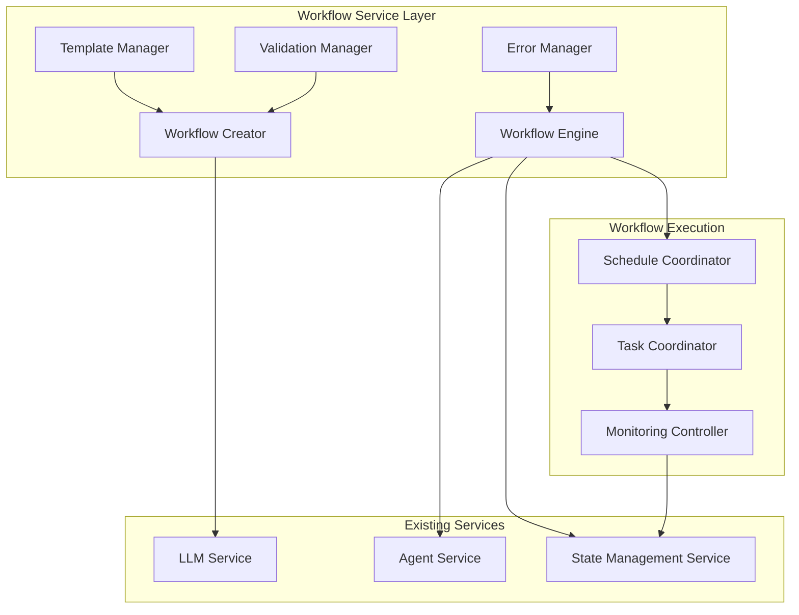
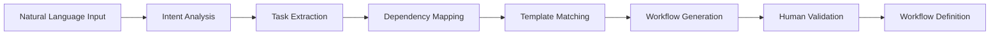

# Workflow Creation and Execution Mechanisms

## Executive Summary

This document defines detailed workflow creation and execution mechanisms for the autonomous agentic workflow application. Building on the existing architecture of LLM Service, Agent Service, and State Management Service, these mechanisms provide moderate autonomy with human oversight, supporting simple to medium complexity workflows through generic reusable templates.

## Table of Contents

1. [Architecture Overview](#architecture-overview)
2. [Workflow Creation Mechanisms](#workflow-creation-mechanisms)
3. [Workflow Execution Mechanisms](#workflow-execution-mechanisms)
4. [Data Structures and Schemas](#data-structures-and-schemas)
5. [Natural Language Processing](#natural-language-processing)
6. [Template System](#template-system)
7. [Execution Engine](#execution-engine)
8. [State Management Integration](#state-management-integration)
9. [Agent Coordination](#agent-coordination)
10. [Error Handling and Recovery](#error-handling-and-recovery)
11. [API Specifications](#api-specifications)
12. [Integration Patterns](#integration-patterns)

## Architecture Overview

### System Components



### Design Principles

1. **Moderate Autonomy**: Autonomous execution with human oversight for critical decisions
2. **Lightweight Integration**: Leverage existing service patterns without major modifications
3. **Generic Templates**: Reusable workflow patterns applicable across domains
4. **Agent Pool Management**: Work with pre-existing agent pools rather than dynamic creation
5. **Incremental Complexity**: Support simple workflows with ability to scale to medium complexity

## Workflow Creation Mechanisms

### 1. Natural Language to Workflow Translation

#### Translation Pipeline



#### Core Components

**Intent Analyzer**
```typescript
interface IntentAnalysis {
  primaryGoal: string;
  taskTypes: TaskType[];
  complexity: ComplexityLevel;
  requiredCapabilities: string[];
  estimatedDuration: number;
  criticalDecisionPoints: DecisionPoint[];
}

enum ComplexityLevel {
  SIMPLE = 'SIMPLE',           // Linear sequence, 2-5 tasks
  MEDIUM = 'MEDIUM',           // Some branching, 5-15 tasks
  COMPLEX = 'COMPLEX'          // Multiple branches, 15+ tasks (requires approval)
}

class IntentAnalyzer {
  async analyzeIntent(description: string): Promise<IntentAnalysis> {
    const llmResponse = await this.llmService.processText({
      prompt: this.buildIntentAnalysisPrompt(description),
      model: 'gpt-4',
      temperature: 0.3
    });
    
    return this.parseIntentResponse(llmResponse);
  }
  
  private buildIntentAnalysisPrompt(description: string): string {
    return `
      Analyze the following workflow description and extract:
      1. Primary goal and objectives
      2. Individual tasks and their types
      3. Complexity level (SIMPLE/MEDIUM/COMPLEX)
      4. Required agent capabilities
      5. Estimated duration
      6. Critical decision points requiring human oversight
      
      Description: ${description}
      
      Respond in JSON format with the IntentAnalysis structure.
    `;
  }
}
```

**Task Extractor**
```typescript
interface ExtractedTask {
  id: string;
  name: string;
  description: string;
  type: TaskType;
  requiredCapabilities: string[];
  inputs: TaskInput[];
  outputs: TaskOutput[];
  estimatedDuration: number;
  criticalityLevel: CriticalityLevel;
}

enum TaskType {
  DATA_PROCESSING = 'DATA_PROCESSING',
  COMMUNICATION = 'COMMUNICATION',
  ANALYSIS = 'ANALYSIS',
  VALIDATION = 'VALIDATION',
  DECISION = 'DECISION',
  INTEGRATION = 'INTEGRATION'
}

enum CriticalityLevel {
  LOW = 'LOW',           // Automated execution
  MEDIUM = 'MEDIUM',     // Automated with monitoring
  HIGH = 'HIGH',         // Requires human approval
  CRITICAL = 'CRITICAL'  // Requires human oversight
}

class TaskExtractor {
  async extractTasks(intentAnalysis: IntentAnalysis): Promise<ExtractedTask[]> {
    const tasks: ExtractedTask[] = [];
    
    for (const taskType of intentAnalysis.taskTypes) {
      const extractedTask = await this.extractTaskDetails(taskType, intentAnalysis);
      tasks.push(extractedTask);
    }
    
    return this.refineTasks(tasks);
  }
  
  private async extractTaskDetails(
    taskType: TaskType, 
    context: IntentAnalysis
  ): Promise<ExtractedTask> {
    const llmResponse = await this.llmService.processText({
      prompt: this.buildTaskExtractionPrompt(taskType, context),
      model: 'gpt-4',
      temperature: 0.2
    });
    
    return this.parseTaskResponse(llmResponse);
  }
}
```

### 2. Workflow Definition Schema

```typescript
interface WorkflowDefinition {
  id: string;
  name: string;
  description: string;
  version: string;
  createdAt: Date;
  createdBy: string;
  
  // Workflow structure
  tasks: WorkflowTask[];
  dependencies: TaskDependency[];
  
  // Execution configuration
  executionMode: ExecutionMode;
  approvalPoints: ApprovalPoint[];
  timeoutSettings: TimeoutSettings;
  
  // Agent requirements
  requiredAgentTypes: AgentTypeRequirement[];
  agentPoolPreferences: AgentPoolPreference[];
  
  // State management
  workspaceTemplate: WorkspaceTemplate;
  stateSchema: WorkflowStateSchema;
  
  // Monitoring and control
  monitoringConfig: MonitoringConfiguration;
  errorHandlingConfig: ErrorHandlingConfiguration;
}

interface WorkflowTask {
  id: string;
  name: string;
  description: string;
  type: TaskType;
  
  // Agent assignment
  preferredAgentType: string;
  agentSelectionCriteria: AgentSelectionCriteria;
  
  // Task configuration
  inputs: TaskInputDefinition[];
  outputs: TaskOutputDefinition[];
  parameters: TaskParameter[];
  
  // Execution settings
  timeout: number;
  retryPolicy: RetryPolicy;
  criticalityLevel: CriticalityLevel;
  
  // Human oversight
  requiresApproval: boolean;
  approvalCriteria?: ApprovalCriteria;
  
  // State interaction
  stateReads: StateReadOperation[];
  stateWrites: StateWriteOperation[];
}

interface TaskDependency {
  taskId: string;
  dependsOn: string[];
  dependencyType: DependencyType;
  condition?: DependencyCondition;
}

enum DependencyType {
  SEQUENTIAL = 'SEQUENTIAL',     // Must complete before
  PARALLEL = 'PARALLEL',         // Can run concurrently
  CONDITIONAL = 'CONDITIONAL',   // Depends on condition
  OPTIONAL = 'OPTIONAL'          // Can proceed without
}

enum ExecutionMode {
  SUPERVISED = 'SUPERVISED',     // Human oversight required
  MONITORED = 'MONITORED',       // Automated with alerts
  AUTONOMOUS = 'AUTONOMOUS'      // Fully automated
}
```

### 3. Workflow Validation System

```typescript
interface ValidationResult {
  isValid: boolean;
  errors: ValidationError[];
  warnings: ValidationWarning[];
  suggestions: ValidationSuggestion[];
  estimatedComplexity: ComplexityLevel;
  requiredApprovals: ApprovalRequirement[];
}

class WorkflowValidator {
  async validateWorkflow(workflow: WorkflowDefinition): Promise<ValidationResult> {
    const result: ValidationResult = {
      isValid: true,
      errors: [],
      warnings: [],
      suggestions: [],
      estimatedComplexity: ComplexityLevel.SIMPLE,
      requiredApprovals: []
    };
    
    // Structural validation
    await this.validateStructure(workflow, result);
    
    // Agent availability validation
    await this.validateAgentAvailability(workflow, result);
    
    // Dependency validation
    await this.validateDependencies(workflow, result);
    
    // Complexity assessment
    result.estimatedComplexity = this.assessComplexity(workflow);
    
    // Approval requirements
    result.requiredApprovals = this.identifyApprovalRequirements(workflow);
    
    return result;
  }
  
  private async validateStructure(
    workflow: WorkflowDefinition, 
    result: ValidationResult
  ): Promise<void> {
    // Check for circular dependencies
    if (this.hasCircularDependencies(workflow.dependencies)) {
      result.errors.push({
        type: 'CIRCULAR_DEPENDENCY',
        message: 'Workflow contains circular dependencies',
        affectedTasks: this.findCircularDependencies(workflow.dependencies)
      });
      result.isValid = false;
    }
    
    // Validate task inputs/outputs
    for (const task of workflow.tasks) {
      const inputValidation = await this.validateTaskInputs(task);
      if (!inputValidation.isValid) {
        result.errors.push(...inputValidation.errors);
        result.isValid = false;
      }
    }
  }
  
  private async validateAgentAvailability(
    workflow: WorkflowDefinition,
    result: ValidationResult
  ): Promise<void> {
    for (const requirement of workflow.requiredAgentTypes) {
      const availability = await this.agentService.checkAgentAvailability({
        agentType: requirement.agentType,
        capabilities: requirement.requiredCapabilities,
        count: requirement.minCount
      });
      
      if (!availability.available) {
        result.warnings.push({
          type: 'AGENT_UNAVAILABLE',
          message: `Required agent type ${requirement.agentType} not available`,
          suggestion: 'Consider using alternative agent types or scheduling for later'
        });
      }
    }
  }
}
```

## Workflow Execution Mechanisms

### 1. Execution Engine Architecture

```typescript
class WorkflowExecutionEngine {
  private scheduleCoordinator: ScheduleCoordinator;
  private taskCoordinator: TaskCoordinator;
  private monitoringController: MonitoringController;
  private errorManager: ErrorManager;
  
  async executeWorkflow(
    workflowDefinition: WorkflowDefinition,
    inputs: WorkflowInputs,
    executionOptions: ExecutionOptions
  ): Promise<WorkflowExecution> {
    
    // Initialize execution context
    const execution = await this.initializeExecution(
      workflowDefinition, 
      inputs, 
      executionOptions
    );
    
    // Start execution monitoring
    await this.monitoringController.startMonitoring(execution);
    
    // Begin workflow execution
    await this.scheduleCoordinator.scheduleWorkflow(execution);
    
    return execution;
  }
  
  private async initializeExecution(
    workflowDefinition: WorkflowDefinition,
    inputs: WorkflowInputs,
    options: ExecutionOptions
  ): Promise<WorkflowExecution> {
    
    // Create workspace using existing State Management Service
    const workspace = await this.stateService.createWorkspace({
      name: `workflow-${workflowDefinition.name}-${Date.now()}`,
      metadata: {
        workflowId: workflowDefinition.id,
        executionMode: workflowDefinition.executionMode,
        createdBy: options.userId
      }
    });
    
    // Create play for execution tracking
    const play = await this.stateService.createPlay({
      workspaceId: workspace.id,
      metadata: {
        workflowDefinitionId: workflowDefinition.id,
        executionType: 'WORKFLOW_EXECUTION'
      }
    });
    
    // Initialize workflow state
    const workflowState = await this.initializeWorkflowState(
      workspace.id,
      workflowDefinition,
      inputs
    );
    
    return {
      id: generateId(),
      workflowDefinitionId: workflowDefinition.id,
      workspaceId: workspace.id,
      playId: play.id,
      status: ExecutionStatus.INITIALIZING,
      startedAt: new Date(),
      inputs,
      state: workflowState,
      tasks: this.initializeTaskExecutions(workflowDefinition.tasks),
      approvalQueue: [],
      metrics: this.initializeMetrics()
    };
  }
}
```

### 2. Task Scheduling and Coordination

```typescript
interface TaskExecution {
  id: string;
  taskId: string;
  workflowExecutionId: string;
  agentId?: string;
  
  status: TaskExecutionStatus;
  startedAt?: Date;
  completedAt?: Date;
  
  inputs: any;
  outputs?: any;
  error?: ExecutionError;
  
  retryCount: number;
  approvalStatus?: ApprovalStatus;
}

enum TaskExecutionStatus {
  PENDING = 'PENDING',
  WAITING_APPROVAL = 'WAITING_APPROVAL',
  APPROVED = 'APPROVED',
  SCHEDULED = 'SCHEDULED',
  ASSIGNED = 'ASSIGNED',
  RUNNING = 'RUNNING',
  COMPLETED = 'COMPLETED',
  FAILED = 'FAILED',
  CANCELLED = 'CANCELLED'
}

class ScheduleCoordinator {
  async scheduleWorkflow(execution: WorkflowExecution): Promise<void> {
    // Identify ready tasks
    const readyTasks = this.identifyReadyTasks(execution);
    
    for (const task of readyTasks) {
      await this.scheduleTask(execution, task);
    }
    
    // Set up dependency monitoring
    await this.setupDependencyMonitoring(execution);
  }
  
  private async scheduleTask(
    execution: WorkflowExecution,
    taskExecution: TaskExecution
  ): Promise<void> {
    
    const taskDef = this.getTaskDefinition(execution, taskExecution.taskId);
    
    // Check if approval is required
    if (taskDef.requiresApproval) {
      await this.requestApproval(execution, taskExecution);
      return;
    }
    
    // Find suitable agent
    const agent = await this.findSuitableAgent(taskDef);
    
    if (agent) {
      await this.assignTaskToAgent(execution, taskExecution, agent);
    } else {
      await this.queueTaskForAgent(execution, taskExecution);
    }
  }
  
  private async findSuitableAgent(taskDef: WorkflowTask): Promise<Agent | null> {
    // Query existing agent pools
    const availableAgents = await this.agent