# Workflow Integration Patterns

## Overview

This document defines the integration patterns between the Workflow Service and existing services (LLM Service, Agent Service, State Management Service), ensuring seamless interoperability while maintaining moderate autonomy and human oversight.

## Service Integration Architecture

### Integration Topology

```mermaid
graph TB
    subgraph "Workflow Service"
        WC[Workflow Creator]
        WE[Workflow Engine]
        TM[Template Manager]
        VM[Validation Manager]
        EM[Error Manager]
        MC[Monitoring Controller]
    end
    
    subgraph "LLM Service Integration"
        LS[LLM Service]
        NLP[NLP Processor]
        CG[Content Generator]
        DM[Decision Maker]
    end
    
    subgraph "Agent Service Integration"
        AS[Agent Service]
        AP[Agent Pool]
        TH[Task Handler]
        TC[Tool Controller]
    end
    
    subgraph "State Management Integration"
        SMS[State Management Service]
        WM[Workspace Manager]
        PM[Play Manager]
        RM[Record Manager]
    end
    
    WC --> NLP
    WC --> CG
    WE --> DM
    
    WE --> AP
    WE --> TH
    MC --> TC
    
    WE --> WM
    WE --> PM
    TM --> RM
    
    EM --> LS
    EM --> AS
    EM --> SMS
```



## LLM Service Integration

### Natural Language Processing Integration

```typescript
class LLMServiceIntegration {
  private llmService: LLMService;
  
  constructor(llmService: LLMService) {
    this.llmService = llmService;
  }
  
  async processWorkflowDescription(description: string): Promise<ProcessedWorkflow> {
    // Step 1: Intent Analysis
    const intentAnalysis = await this.analyzeIntent(description);
    
    // Step 2: Task Extraction
    const extractedTasks = await this.extractTasks(description, intentAnalysis);
    
    // Step 3: Dependency Analysis
    const dependencies = await this.analyzeDependencies(extractedTasks);
    
    // Step 4: Complexity Assessment
    const complexity = await this.assessComplexity(extractedTasks, dependencies);
    
    return {
      intentAnalysis,
      extractedTasks,
      dependencies,
      complexity,
      confidence: this.calculateConfidence(intentAnalysis, extractedTasks)
    };
  }
  
  private async analyzeIntent(description: string): Promise<IntentAnalysis> {
    const prompt = this.buildIntentAnalysisPrompt(description);
    
    const response = await this.llmService.generateContent({
      prompt,
      model: 'gpt-4',
      temperature: 0.3,
      maxTokens: 1000,
      responseFormat: 'json'
    });
    
    return this.parseIntentResponse(response.content);
  }
  
  private buildIntentAnalysisPrompt(description: string): string {
    return `
      Analyze the following workflow description and extract structured information:
      
      Description: "${description}"
      
      Please provide a JSON response with the following structure:
      {
        "primaryGoal": "Main objective of the workflow",
        "taskTypes": ["TASK_TYPE_1", "TASK_TYPE_2"],
        "complexity": "SIMPLE|MEDIUM|COMPLEX",
        "requiredCapabilities": ["capability1", "capability2"],
        "estimatedDuration": "duration in minutes",
        "criticalDecisionPoints": [
          {
            "description": "Decision point description",
            "requiresHumanOversight": true|false,
            "criticalityLevel": "LOW|MEDIUM|HIGH|CRITICAL"
          }
        ],
        "businessDomain": "Domain category",
        "stakeholders": ["stakeholder1", "stakeholder2"]
      }
      
      Task types should be from: DATA_PROCESSING, COMMUNICATION, ANALYSIS, VALIDATION, DECISION, INTEGRATION
      Focus on identifying points that require human oversight for moderate autonomy.
    `;
  }
  
  async generateTaskInstructions(
    task: WorkflowTask,
    context: TaskContext
  ): Promise<string> {
    
    const prompt = `
      Generate detailed instructions for an agent to complete this task:
      
      Task: ${task.name}
      Description: ${task.description}
      Type: ${task.type}
      Criticality: ${task.criticalityLevel}
      
      Context:
      - Workflow Goal: ${context.workflowGoal}
      - Previous Task Outputs: ${JSON.stringify(context.previousOutputs)}
      - Available Tools: ${context.availableTools.join(', ')}
      - Time Constraints: ${context.timeConstraints}
      
      Provide clear, actionable instructions that include:
      1. Specific steps to complete the task
      2. Expected inputs and outputs
      3. Quality criteria and validation steps
      4. Error handling guidance
      5. When to escalate to human oversight
      
      Instructions should be suitable for an AI agent with ${task.agentType} capabilities.
    `;
    
    const response = await this.llmService.generateContent({
      prompt,
      model: 'gpt-4',
      temperature: 0.2,
      maxTokens: 2000
    });
    
    return response.content;
  }
  
  async optimizeWorkflow(
    workflow: WorkflowDefinition,
    executionHistory?: ExecutionHistory[]
  ): Promise<OptimizationSuggestions> {
    
    const optimizationPrompt = this.buildOptimizationPrompt(workflow, executionHistory);
    
    const response = await this.llmService.generateContent({
      prompt: optimizationPrompt,
      model: 'gpt-4',
      temperature: 0.4,
      responseFormat: 'json'
    });
    
    return this.parseOptimizationResponse(response.content);
  }
}
```

### Content Generation Integration

```typescript
class ContentGenerationIntegration {
  async generateWorkflowDocumentation(
    workflow: WorkflowDefinition
  ): Promise<WorkflowDocumentation> {
    
    const sections = await Promise.all([
      this.generateOverview(workflow),
      this.generateTaskDescriptions(workflow),
      this.generateFlowDiagram(workflow),
      this.generateTroubleshootingGuide(workflow)
    ]);
    
    return {
      overview: sections[0],
      taskDescriptions: sections[1],
      flowDiagram: sections[2],
      troubleshootingGuide: sections[3],
      generatedAt: new Date()
    };
  }
  
  async generateApprovalSummary(
    taskExecution: TaskExecution,
    context: ApprovalContext
  ): Promise<ApprovalSummary> {
    
    const prompt = `
      Generate a concise approval summary for the following task:
      
      Task: ${taskExecution.taskId}
      Status: ${taskExecution.status}
      Agent: ${taskExecution.agentId}
      Inputs: ${JSON.stringify(taskExecution.inputs)}
      Proposed Outputs: ${JSON.stringify(taskExecution.outputs)}
      
      Context:
      - Workflow: ${context.workflowName}
      - Business Impact: ${context.businessImpact}
      - Risk Level: ${context.riskLevel}
      - Stakeholders: ${context.stakeholders.join(', ')}
      
      Provide:
      1. Executive summary (2-3 sentences)
      2. Key decision points requiring approval
      3. Potential risks and mitigations
      4. Recommended action with rationale
      
      Keep it concise and focused on decision-making needs.
    `;
    
    const response = await this.llmService.generateContent({
      prompt,
      model: 'gpt-4',
      temperature: 0.3,
      maxTokens: 800
    });
    
    return this.parseApprovalSummary(response.content);
  }
}
```

## Agent Service Integration

### Agent Pool Management Integration

```typescript
class AgentServiceIntegration {
  private agentService: AgentService;
  private poolManager: AgentPoolManager;
  
  async findSuitableAgent(
    taskDefinition: WorkflowTask,
    workspaceId: string
  ): Promise<AgentAssignment | null> {
    
    // Query available agents from Agent Service
    const availableAgents = await this.agentService.getAvailableAgents({
      agentType: taskDefinition.agentType,
      capabilities: taskDefinition.agentSelectionCriteria.requiredCapabilities,
      workspaceCompatible: true
    });
    
    if (availableAgents.length === 0) {
      // Check if we can request a new agent
      return await this.requestNewAgent(taskDefinition, workspaceId);
    }
    
    // Select best agent based on criteria
    const selectedAgent = this.selectOptimalAgent(
      availableAgents, 
      taskDefinition.agentSelectionCriteria
    );
    
    // Reserve agent for the task
    await this.reserveAgent(selectedAgent.id, workspaceId);
    
    return {
      agentId: selectedAgent.id,
      agentType: selectedAgent.type,
      capabilities: selectedAgent.capabilities,
      estimatedAvailability: selectedAgent.estimatedAvailability,
      performanceScore: this.calculatePerformanceScore(selectedAgent)
    };
  }
  
  private async requestNewAgent(
    taskDefinition: WorkflowTask,
    workspaceId: string
  ): Promise<AgentAssignment | null> {
    
    // Check if we can create new agents (based on pool limits)
    const poolStatus = await this.poolManager.getPoolStatus(taskDefinition.agentType);
    
    if (poolStatus.canCreateNew) {
      const newAgent = await this.agentService.createAgent({
        type: taskDefinition.agentType,
        capabilities: taskDefinition.agentSelectionCriteria.requiredCapabilities,
        workspaceId,
        configuration: {
          maxConcurrentTasks: 1,
          timeout: taskDefinition.timeout,
          tools: await this.resolveRequiredTools(taskDefinition)
        }
      });
      
      return {
        agentId: newAgent.id,
        agentType: newAgent.type,
        capabilities: newAgent.capabilities,
        estimatedAvailability: 0, // Immediately available
        performanceScore: 0.5 // Default score for new agent
      };
    }
    
    return null; // No agents available and can't create new ones
  }
  
  async assignTaskToAgent(
    agentId: string,
    taskExecution: TaskExecution,
    taskContext: TaskContext
  ): Promise<TaskAssignmentResult> {
    
    try {
      // Configure agent for the specific task
      await this.configureAgentForTask(agentId, taskExecution, taskContext);
      
      // Assign the task through Agent Service
      const assignment = await this.agentService.assignTask(agentId, {
        taskId: taskExecution.id,
        workspaceId: taskContext.workspaceId,
        playId: taskContext.playId,
        instructions: taskContext.instructions,
        inputs: taskContext.inputs,
        timeout: taskContext.timeout,
        tools: taskContext.requiredTools
      });
      
      return {
        success: true,
        assignmentId: assignment.id,
        estimatedCompletion: assignment.estimatedCompletion,
        agentStatus: assignment.agentStatus
      };
      
    } catch (error) {
      return {
        success: false,
        error: error.message,
        retryable: this.isRetryableError(error)
      };
    }
  }
  
  private async configureAgentForTask(
    agentId: string,
    taskExecution: TaskExecution,
    taskContext: TaskContext
  ): Promise<void> {
    
    // Configure agent with task-specific settings
    await this.agentService.updateAgentConfiguration(agentId, {
      currentTask: taskExecution.id,
      workspaceAccess: {
        workspaceId: taskContext.workspaceId,
        playId: taskContext.playId,
        permissions: this.generateStatePermissions(taskExecution)
      },
      monitoringSettings: {
        progressReporting: true,
        errorReporting: true,
        performanceTracking: true
      },
      escalationRules: this.generateEscalationRules(taskExecution)
    });
  }
  
  async monitorAgentProgress(
    agentId: string,
    taskExecutionId: string
  ): Promise<AgentProgressReport> {
    
    const agentStatus = await this.agentService.getAgentStatus(agentId);
    const taskProgress = await this.agentService.getTaskProgress(agentId, taskExecutionId);
    
    return {
      agentId,
      taskExecutionId,
      status: agentStatus.status,
      progress: taskProgress.progress,
      currentStep: taskProgress.currentStep,
      estimatedTimeRemaining: taskProgress.estimatedTimeRemaining,
      issues: taskProgress.issues,
      lastUpdate: taskProgress.lastUpdate
    };
  }
}
```

### Tool Integration Management

```typescript
class ToolIntegrationManager {
  async resolveRequiredTools(taskDefinition: WorkflowTask): Promise<ToolConfiguration[]> {
    const toolConfigs: ToolConfiguration[] = [];
    
    // Resolve tools based on task type and requirements
    switch (taskDefinition.type) {
      case TaskType.DATA_PROCESSING:
        toolConfigs.push(...await this.getDataProcessingTools(taskDefinition));
        break;
        
      case TaskType.COMMUNICATION:
        toolConfigs.push(...await this.getCommunicationTools(taskDefinition));
        break;
        
      case TaskType.INTEGRATION:
        toolConfigs.push(...await this.getIntegrationTools(taskDefinition));
        break;
        
      case TaskType.ANALYSIS:
        toolConfigs.push(...await this.getAnalysisTools(taskDefinition));
        break;
    }
    
    // Add common tools
    toolConfigs.push(...await this.getCommonTools());
    
    return toolConfigs;
  }
  
  private async getDataProcessingTools(
    taskDefinition: WorkflowTask
  ): Promise<ToolConfiguration[]> {
    
    return [
      {
        name: 'file_processor',
        type: 'MCP_TOOL',
        configuration: {
          supportedFormats: ['csv', 'json', 'xml', 'xlsx'],
          maxFileSize: '100MB',
          processingTimeout: taskDefinition.timeout * 0.8
        }
      },
      {
        name: 'data_validator',
        type: 'SCRIPT_TOOL',
        configuration: {
          validationRules: taskDefinition.parameters.validationRules,
          strictMode: taskDefinition.criticalityLevel === CriticalityLevel.HIGH
        }
      }
    ];
  }
  
  private async getCommunicationTools(
    taskDefinition: WorkflowTask
  ): Promise<ToolConfiguration[]> {
    
    return [
      {
        name: 'email_sender',
        type: 'API_TOOL',
        configuration: {
          provider: 'smtp',
          templates: taskDefinition.parameters.emailTemplates,
          trackingEnabled: true
        }
      },
      {
        name: 'notification_sender',
        type: 'API_TOOL',
        configuration: {
          channels: ['slack', 'teams', 'webhook'],
          priority: taskDefinition.criticalityLevel
        }
      }
    ];
  